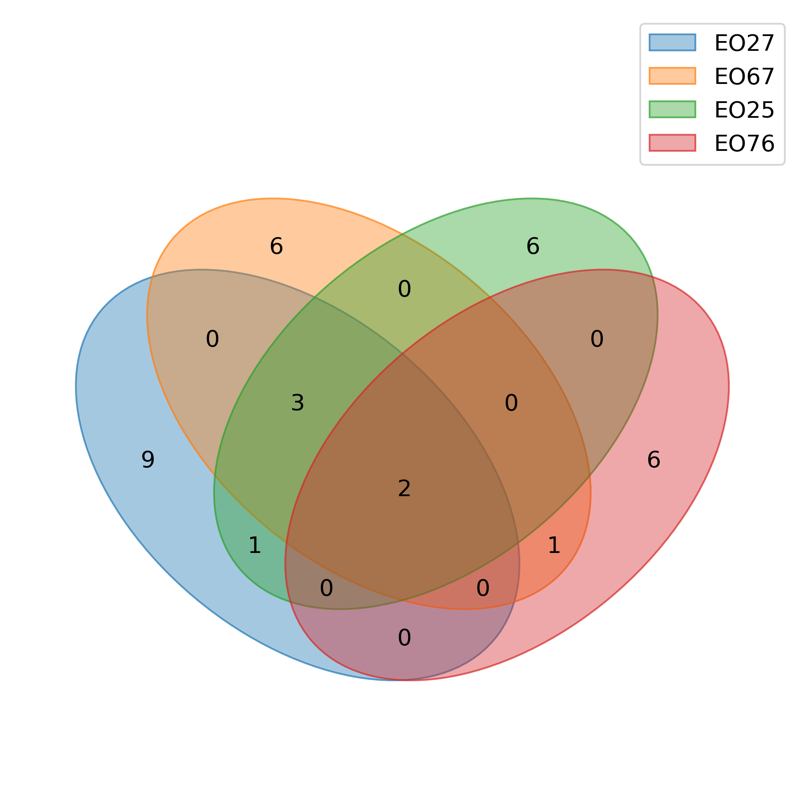

# SRK-Based Assessment of Self-Incompatibility in *LEPA*

### Background

Self-incompatibility (SI) in *LEPA* is controlled by the S-locus, where the extracellular S-domain of the S-receptor kinase (SRK) protein acts as the female determinant of pollen rejection. Each individual carries up to four allele copies (tetraploid), and compatible mating requires that pollen and pistil carry different SRK alleles. Loss of allele diversity through genetic drift therefore directly constrains reproductive success: individuals sharing the same allele are SI-incompatible and cannot produce seed together.

---

### 1. Allele Definition

We targeted the S-domain of the SRK protein — the functional "lock" in the lock-and-key recognition mechanism — to define alleles. We first identified all unique functional protein sequences within this domain across the dataset and visualised amino acid variation across positions (Figure 1: [SRK_AA_frequency_heatmap.pdf](figures/SRK_AA_frequency_heatmap.pdf)). We then applied a distance-based sensitivity analysis to cluster protein sequences into allele bins, selecting the clustering threshold that maximised biological resolution while minimising artefactual splitting (Figure 2: [SRK_protein_distance_analysis.pdf](figures/SRK_protein_distance_analysis.pdf)). Each resulting cluster represents an allele hypothesis.

---

### 2. Allelic Richness in *LEPA*

**Observed richness:** Across 152 individuals sampled from Element Occurrences (EOs) spanning the species range, we identified **43 distinct SRK alleles** (Figure 3: [SRK_allele_accumulation_curves.pdf](figures/SRK_allele_accumulation_curves.pdf)).

**Predicted species richness:** The allele accumulation curve has not yet reached an asymptote, indicating that further sampling would discover additional alleles. Fitting a Michaelis-Menten model to the accumulation curve predicts a species-level total of **59 alleles** (Figure 3). This value represents the estimated complete SI repertoire of *LEPA* and serves as the species optimum — the allele richness expected in the absence of genetic drift.

---

### 3. Implications for Seed Production

The species optimum of 59 alleles is the critical baseline for seed production planning. Under negative frequency-dependent selection (NFDS), the SI system is self-stabilising when all alleles are present and approximately equally frequent: rare alleles are automatically favoured because they are compatible with more partners. This means:

- A population holding all 59 alleles at equal frequency maximises the proportion of compatible mating pairs and reproductive success.
- Any reduction in allele number directly reduces the fraction of compatible pairings and seed set.
- Cross-design for seed production must account for both the number of alleles present and their copy-count dosage (tetraploid genotype classes: AAAA, AAAB, AABB, AABC, ABCD).

---

### 4. Reproductive Status of Element Occurrences

**Allele richness deficit (Figure 3: [SRK_allele_accumulation_curves.pdf](figures/SRK_allele_accumulation_curves.pdf)):**

All four Element Occurrences (EOs) with sufficient sample sizes (≥25 individuals) fall far short of the species optimum of 59 alleles:

| Element Occurrence | N individuals | Observed alleles | Predicted alleles (MM) | % of species optimum |
|--------------------|--------------|-----------------|----------------------|---------------------|
| EO25 | 32 | 12 | 17 | 29% |
| EO27 | 30 | 15 | 25 | 42% |
| EO67 | 32 | 12 | 16 | 27% |
| EO76 | 25 |  9 | 12 | 20% |

EO27 retains the most allele diversity, yet even its asymptotic estimate of 25 alleles represents less than half the species optimum. Alleles are also largely non-overlapping across Element Occurrences (Figure 4: [Venn_diagram_Alleles_EOs.png](figures/Venn_diagram_Alleles_EOs.png)), meaning that no single Element Occurrence captures the full SI diversity of the species.

**Allele frequency imbalance (Figure 5: [SRK_chisq_species_population_frequency_plots.pdf](figures/SRK_chisq_species_population_frequency_plots.pdf)):**

Under NFDS, alleles are expected to be maintained at approximately equal frequencies. Chi-square tests reject this null at every level:

| Level | N alleles | χ² | *p*-value |
|-------|----------|----|----------|
| Species | 43 | 1066.9 | < 10⁻¹⁹⁵ |
| EO25 | 12 | 70.4 | < 10⁻¹⁰ |
| EO27 | 15 | 65.1 | < 10⁻⁸ |
| EO67 | 12 | 84.2 | < 10⁻¹² |
| EO76 |  9 | 47.1 | < 10⁻⁷ |

A small number of alleles dominate in each Element Occurrence (e.g., Allele_044 accounts for 23 copies in EO25; Allele_047 accounts for 24 copies in EO67), while many alleles are rare or absent entirely.

**Zygosity and self-compatibility risk:**

Genotype reconstruction reveals that 86 of 152 individuals (57%) carry only a single allele bin (AAAA genotype — four identical allele copies), making them functionally equivalent to homozygotes with respect to SI. These individuals are candidates for self-compatibility and cannot contribute compatible pollen to any partner carrying the same allele.

---

### 5. Conclusion

Genetic drift, promoted by habitat fragmentation, is eroding allele diversity and frequency balance in *LEPA* Element Occurrences. Each Element Occurrence retains only 20–42% of the estimated species-level SI repertoire, alleles are skewed toward high-frequency dominance rather than the equal distribution expected under NFDS, and the majority of sampled individuals carry genotypes consistent with reduced SI function. Collectively, these findings indicate that reproductive success is currently constrained by SI allele depletion, and that seed production efforts must prioritise crosses that maximise allele complementarity across Element Occurrences to restore a functional SI system.
