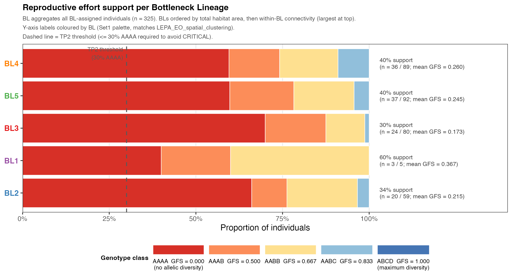

# SRK-Based Assessment of Self-Incompatibility in *Lepidium papilliferum* (LEPA)

## Executive Summary

**The conservation challenge.** *Lepidium papilliferum* (slickspot peppergrass; hereafter LEPA) is a self-incompatible (SI) tetraploid plant restricted to fragmented populations occupying slick spots in southwestern Idaho (USA) (Buerki et al., 2026). This report uses an SRK haplotype dataset of **335 individuals across 19 Element Occurrences** to ask: *what is the impact of habitat fragmentation and genetic drift on the species' SI system, and how can we design a genetically informed breeding programme to recover reproductive fitness?* The analysis is structured around seven sequential biological questions; each headline below summarises the answer to one of them.

**Habitat fragmentation has produced five independent bottleneck lineages.** Spatial-connectivity analysis (sibling repository [LEPA_EO_spatial_clustering](https://github.com/svenbuerki/LEPA_EO_spatial_clustering)) identifies **five independent bottleneck lineages (BL1–BL5)** across the species range with **no between-EO pollinator connections anywhere in the dataset**, establishing the demographic strata used throughout the report.

**LEPA's SI system remains functional species-wide, with one ecologically stressed exception.** Several severely bottlenecked SI plant species have been documented escaping SI through the evolution of self-compatibility (SC) — a short-term adaptive response that restores immediate reproductive output but typically incurs inbreeding depression, ultimately deepening rather than resolving the conservation concern. The current LEPA dataset shows **no evidence of species-wide SI escape**: only 7 of 401 ingroup individuals (1.7 %) carry the molecular signature of complete SI loss (every recovered SRK haplotype carries a premature stop codon). The signal is **sharply geographically concentrated — 5 of these 7 candidates are in EO76 (BL3)**, the slick spot population already independently flagged as the most ecologically degraded in the species (highest AAAA fraction, 0 AABC seed parents, and substantial invasive-species encroachment on the native slick spot habitat). This concentration suggests that the SI-escape signal reflects **localised ecological stress at the most degraded site rather than a species-wide SC transition** — a positive conservation finding: with managed crossing intervention, the SI system can still be supported across the rest of the species range, avoiding the inbreeding-depression trajectory that follows SC evolution in bottlenecked SI plants.

**Species S-allele richness is severely depleted, with one diversity reservoir.** 49 distinct S-alleles observed; Michaelis-Menten estimate = 59 (consensus across MM and Chao1 = 60). Per-BL richness varies dramatically: **BL4 retains 27 alleles (55 % — the diversity reservoir)** while BL1 and BL2 retain only 4 and 8 alleles respectively. **26 of 49 alleles (53 %) are private to a single BL** — direct empirical evidence of multiple independent founder events, not a single shared bottleneck.

**Drift has eroded population-level S-allele diversity to a critical level (Tipping Point 1).** All five BLs and all 6 plotted EOs are flagged **CRITICAL** (richness < 50 % of optimum AND frequency evenness Ne/N < 0.80). No lineage retains a balanced allele pool — restoration requires inter-BL allele transfers; within-lineage breeding alone cannot rebuild the SI system.

**Drift has degraded individual-level reproductive fitness to a critical level (Tipping Point 2).** All five BLs CRITICAL on TP2 (mean Genotypic Fitness Score < 0.667 AND > 30 % AAAA homozygotes). Allele_050 and Allele_051 (both members of Synonymy group 1) are pan-BL fixed in AAAA individuals — **convergent drift onto the same SI specificity despite independent bottlenecks**. **15 AABC individuals** species-wide carry the heterozygous-gamete potential needed for high-yield managed crossing — they are the immediate seed-parent priority.

**The mechanism is a self-reinforcing Compatibility Collapse Cascade driven by drift on a shared ancestral pool.** A **five-stage Compatibility Collapse Cascade (C3)** explains how habitat fragmentation produces 60 % reproductive dead-ends within a structurally intact SI system. Cross-Brassicaceae per-BL entropy decomposition reveals that the residue identities at LEPA hypervariable (HV) columns are **73 % LEPA-specific** (different from Brassica AND Arabidopsis dominant residues), confirming the convergent allele depletion is **drift on a shared LEPA ancestral pool**, not pan-Brassicaceae selection convergence.

**A 104-cross phased experimental plan converts sequence-based predictions into a validated functional S-allele table.** The plan (1 368 attempts) is structured around five nested hypotheses (H0 SI validation; H1a/H1b compatibility baselines; H2 synonymy bin boundaries; H3 hidden bins via heterozygous donors with paired controls). Outcomes feed into a **validated functional S-allele table** that informs operational seed-orchard design.

---

## Background

Self-incompatibility (SI) in *L. papilliferum* is controlled by the S-locus, where the extracellular S-domain of the S-receptor kinase (SRK) protein acts as the female determinant of pollen rejection. Each individual carries up to four allele copies (tetraploid), and compatible mating requires that pollen and pistil carry different SRK alleles. Throughout this report, each functionally distinct SRK protein variant is referred to as an **S-allele**, and the tetraploid combination of S-alleles an individual carries is its **genotype** (e.g., `AAAA`, `AABB`, `AABC`). Under balancing selection — specifically, negative frequency-dependent selection (NFDS) — all S-alleles are maintained at approximately equal frequencies, maximising the proportion of compatible mating pairs. In small or isolated populations, however, genetic drift counteracts balancing selection, reducing allele richness, skewing allele frequencies, and degrading individual genotype quality, with direct consequences for reproductive success.

A [**Data Quality Evaluation**](#data-quality-evaluation) — including the library-effect ruling, sample outcome categorisation, and lab-deliverable tables — is presented *first*, before any biological interpretation, because the trustworthiness of the dataset gates every downstream inference. The analysis then addresses seven sequential biological questions:

1. [**Q1 — How has habitat fragmentation produced demographic bottlenecks that shape the SRK self-incompatibility system in *L. papilliferum*?**](#q1-habitat-fragmentation-and-the-bottleneck-framework)
2. [**Q2 — Is the LEPA self-incompatibility system functional, or has the species transitioned to self-compatibility?**](#q2-is-the-lepa-si-system-functional)
3. [**Q3 — What is the S-allele richness of *L. papilliferum*, and how is it distributed across bottleneck lineages?**](#q3-species-s-allele-richness-and-bl-distribution)
4. [**Q4 — How has genetic drift eroded S-allele diversity within populations and lineages? (Tipping Point 1)**](#q4-genetic-drift-on-populations-s-allele-diversity-tp1)
5. [**Q5 — How has genetic drift degraded the reproductive fitness of individuals within populations and lineages? (Tipping Point 2)**](#q5-genetic-drift-on-individual-reproductive-fitness-tp2)
6. [**Q6 — What mechanism explains the convergent S-allele depletion observed across all five bottleneck lineages of *L. papilliferum*?**](#q6-mechanism-convergent-s-allele-depletion)
7. [**Q7 — How can S-allele specificity hypotheses be tested with controlled crosses to support a genetically informed breeding programme?**](#q7-cross-based-hypothesis-testing-for-informed-breeding)

The bioinformatic pipeline producing the underlying data is documented in [Bioinformatics_pipeline.md](Bioinformatics_pipeline.md). A complete methodological reference, including reproducible commands and parameter tables, is in [index.Rmd](https://svenbuerki.github.io/SRK_bioinformatics/).

---

## Data Quality Evaluation {#data-quality-evaluation}

Before turning to the biological questions, this section presents the **Step 12c data-quality evaluation** that gates every downstream inference. Data quality can make or break the interpretations that follow — a dataset confounded by technical artefacts cannot support biological claims, regardless of how strong the apparent signal appears. The questions below (Q1–Q7) draw on the 401 ingroup samples that survive this evaluation; understanding *which* samples those are and *why* the rest were excluded is therefore foundational.

### Three sequential questions answered by the evaluation

1. **Is there a library effect impacting interpretation?** Tests for systematic technical bias across the ten Nanopore sequencing libraries.
2. **Which samples failed and need to be re-amplified or re-extracted?** Lab-actionable list of samples that need follow-up before further inference.
3. **Which samples have non-functional SRK proteins and may have escaped self-incompatibility?** Biologically informative candidates whose sequencing succeeded but produced no functional SRK protein.

### Library effect ruled out as confound

Three formal tests confirm that no systematic library bias contaminates the biological inferences:

- **Global Library × `SI_functional_status` (χ²):** χ² = 17.3, df = 18, **p = 0.50 (not significant).** The proportions of Functional / Partial_translation_failure / Complete_loss are statistically indistinguishable across libraries.
- **Within-EO Library 009 / Library 010 vs other libraries (Fisher's exact, n = 18 tests):** 0 significant differences for AAAA proportion, 0 significant differences for Complete_loss proportion. Samples from the same EO behave equivalently regardless of which library they came from.
- **Global Library × `Dominant_failure_mode` (χ²):** χ² = 51.9, df = 18, **p ≈ 4 × 10⁻⁵ (significant) — but in the favourable direction.** Library 010 (the only library processed through the full Step 4b + 7b filters) is enriched in `premature_stop` failures and depleted in `mixed`/`ambiguous_aa` failures, meaning its remaining failure signal is the biologically interpretable loss-of-function signature rather than data-quality noise. This favourable bias *strengthens* rather than undermines the SI-escape findings in Q5.

### Outcome categories for 401 ingroup samples

Every ingroup sample is assigned to one of five mutually exclusive outcome categories:

| Outcome category | n | % | Status |
|---|---:|---:|---|
| **Functional** | 181 | 45.1 % | included in dataset; SI system intact at the molecular level |
| **Partial_translation_failure** | 154 | 38.4 % | included in dataset. **NEUTRAL label — does NOT imply biological SI loss.** Most likely a technical artefact from chimeric Canu *de novo* assembly (spliced junctions introduce premature stops that inflate the failure denominator). Step 9's abundance filter (`min_count = 5`) excludes chimeric proteins from the numerator but not from `Total_sequences`. **The current dataset provides no tangible evidence supporting biological SI loss in this category** — no inference about SI status is made from this label alone. |
| **SI_escape_candidate** | 7 | 1.7 % | excluded from genotype data; all SRK sequences carry premature stop codons. Strong molecular candidate for ongoing self-compatibility evolution via loss-of-function mutations. **Detailed in Q5.** |
| **Re_PCR** | 44 | 11.0 % | excluded; existing DNA stock is fine, PCR product is the problem (no Canu assembly, fragmented amplicon, paralog amplification, N-rich short product, low yield, dirty product). Lab action: re-amplify SRK from existing DNA stock. |
| **Re_DNA_extraction** | 15 | 3.7 % | excluded; DNA stock itself contaminated (>4 distinct functional proteins per supposed tetraploid → mixed sample or barcode bleed-through). Lab action: re-isolate single-plant tissue and re-extract DNA before any further PCR. |

(Outgroup samples — *L. montanum*, 8 individuals — are intentional exclusions and not shown.)

### Per-Bottleneck-Lineage and per-Element-Occurrence distributions

### Lab deliverables

The Step 12c evaluation produces three CSV tables that conservation colleagues can download directly:

- **[`Tables/SRK_samples_redo.csv`](Tables/SRK_samples_redo.csv)** — 59 samples for lab follow-up with a `Lab_action` column distinguishing **Re-PCR** (44 samples; existing DNA OK, re-amplify) from **Re-DNA-extraction** (15 samples; DNA contaminated, re-isolate tissue). Each row carries a stage-specific `Recommended_action` instruction.
- **[`Tables/SRK_SI_escape_candidates.csv`](Tables/SRK_SI_escape_candidates.csv)** — 7 candidates for controlled-selfing phenotyping; recommended protocol in the `Recommended_action` column.
- **[`Tables/SRK_data_quality_categories.tsv`](Tables/SRK_data_quality_categories.tsv)** — master per-sample categorisation (all 409 metadata samples) with full diagnostic columns.

### Take-home for the rest of the report

Across the dataset's six biological questions, the data-quality footing is solid: no library effect confounds the analyses, only ~5 % of samples are flagged for re-PCR/re-extraction, and the 7 SI-escape candidates (Q5) are robust to library identity. The 38 % Partial_translation_failure category is uncertain and not interpreted biologically. The 49 observed S-alleles in 335 ingroup individuals (Q3) and all subsequent population-genetic analyses (Q4–Q7) are based on samples that pass this quality gate.

---

## Q1 — Habitat fragmentation and the bottleneck framework {#q1-habitat-fragmentation-and-the-bottleneck-framework}

### Why this question matters

Genetic drift acts within demographically isolated populations. Before evaluating how drift has impacted S-allele diversity (Q4) and individual reproductive fitness (Q5), we must establish how the species is spatially structured into demographically distinct units. This question defines the inferential strata used throughout the rest of the report.

### Method

The spatial-connectivity analysis was performed in the sibling GitHub repository [**LEPA_EO_spatial_clustering**](https://github.com/svenbuerki/LEPA_EO_spatial_clustering). It (1) constructed convex-hull polygons from 758 georeferenced collection events across 39 locations in 19 EOs (UTM Zone 11N); (2) partitioned the locations into geographic groups using the maximum pollinator dispersal distance for *L. papilliferum* (~500 m) as the connectivity threshold; (3) clustered the 32 resulting group centroids by Ward's D2 hierarchical clustering of geographic distances; and (4) selected k = 5 by silhouette optimisation (silhouette score = 0.73), yielding **five independent bottleneck lineages (BL1–BL5)** ([Figure 3](#figure-3)). A complementary drift index (DI) was derived from the union area of connected-group hull polygons (DI = 0: largest group, weakest drift; DI = 1: smallest, expected-strongest drift) as a relative spatial proxy for *Ne* and is visualised lineage-by-lineage in [Figure 4](#figure-4).

The BL × group × EO cross-reference is published as `tables/EO_group_BL_summary.csv` in the spatial-clustering repository and propagated to this dataset as the input to Step 13 of the SRK pipeline (`SRK_BL_integration.py`), which writes per-individual BL assignments consumed by every downstream analysis.

![Figure 3: Ward's D2 hierarchical clustering of the 32 geographic groups (across 19 EOs of *L. papilliferum*) partitions the species into five independent bottleneck lineages (BL1–BL5; silhouette-optimal k = 5; silhouette score = 0.73). Lower strip: per-group drift index (red = strong drift / DI > 0.75; blue = weak drift / DI < 0.5). Bottom strip: census size N per group. Set1 palette matches the BL colour scheme used throughout this report. Source: `EO_clustering_dendrogram.png` from the [LEPA_EO_spatial_clustering](https://github.com/svenbuerki/LEPA_EO_spatial_clustering) repository.](figures/EO_clustering_dendrogram.png)

![Figure 4: Predicted genetic drift intensity across the five independent bottleneck lineages of *L. papilliferum*. One panel per BL (BL1–BL5, in lineage order); each panel shows the geographic groups within that lineage as polygons coloured by drift index (red = strong drift / small habitat footprint; blue = weak drift / large footprint), sized by census population size, with within-BL pollinator connections shown as solid lines (≤ 500 m) and between-group separations as dashed lines (> 500 m). The lineage-level panels show how isolation and drift intensity are distributed within each BL — for example, BL4 contains the only large-area / low-DI group in the species (EO27 group 11 at 19.6 ha, DI = 0.000), while BL1 is dominated by extreme-DI singletons. Source: `EO_BL_drift_panel.png` from the [LEPA_EO_spatial_clustering](https://github.com/svenbuerki/LEPA_EO_spatial_clustering) repository.](figures/EO_BL_drift_panel.png)

### Bottleneck-lineage membership and SRK sample sizes

(325 of 335 BL-assigned ingroup individuals; 10 germplasm sub-codes remain Unassigned and contribute only to species-level baselines.)

| BL  | N geographic groups | N locations | N EOs | N individuals (SRK) | N alleles observed | % of 49-allele species pool retained |
|-----|--------------------:|------------:|------:|--------------------:|-------------------:|-------------------------------------:|
| BL1 | 10                  | 12          | 4     | 5                   | 4                  | 8 %                                  |
| BL2 | 2                   | 2           | 2     | 59                  | 8                  | 16 %                                 |
| BL3 | 4                   | 4           | 4     | 80                  | 17                 | 35 %                                 |
| BL4 | 7                   | 8           | 4     | 89                  | **27**             | **55 %**                             |
| BL5 | 9                   | 13          | 5     | 92                  | 23                 | 47 %                                 |

### Key findings

- **Connectivity:** of 741 pairwise location comparisons, only 7 pairs (0.9 %) are connected within the 500 m pollinator dispersal threshold — and **all 7 are within the same EO**. There are *no between-EO pollinator connections anywhere in the dataset* under current conditions: every EO is a closed demographic unit at the pollination scale.
- **Habitat footprint:** ≈ 84 % of the 32 geographic groups occupy < 1 ha (DI > 0.95), placing the vast majority of locations in the extreme-drift regime. Only EO27 group 11 (19.6 ha, DI = 0.000), EO32 (14.6 ha), and EO18 (8.1 ha as a fully-connected 5-location chain) escape extreme spatial drift.
- **Five lineages, independent histories:** the BL framework provides three analytical advantages — it rescues 21 small localities (n = 1–3 each) that cannot support EO-level statistics on their own; it allows direct empirical testing of the independent-bottleneck hypothesis (confirmed in Q4 by allele-sharing analyses); and it preserves the full 335-individual species pool for any species-level baseline by stratifying only at the population/lineage level.

The locked Set1 colour palette (BL1 red `#E41A1C`, BL2 blue `#377EB8`, BL3 green `#4DAF4A`, BL4 purple `#984EA3`, BL5 orange `#FF7F00`) is used consistently across this report and the sibling spatial-clustering repository so that the dendrogram, drift panels, and every BL-stratified figure cross-reference visually.

---

## Q2 — Is the LEPA SI system functional? {#q2-is-the-lepa-si-system-functional}

### Why this question matters

Before quantifying allele richness (Q3) or modelling drift (Q4–Q5), we must first establish whether the species' self-incompatibility system is still **operational at the molecular level**. This is not a trivial question for a severely bottlenecked plant: several SI species under demographic stress have been documented evolving self-compatibility (SC) as a short-term adaptive response — restoring immediate seed set but trading away the inbreeding-avoidance benefit of SI. If LEPA had transitioned to species-wide SC, the entire conservation strategy would shift: the priority would become **detecting and mitigating inbreeding depression** in the descendant generations, and the informed-breeding programme would need a fundamentally different design (avoiding self-fertilisation lineages rather than maximising compatible cross diversity). Conversely, if SI remains functional, the strategy outlined in Q4–Q7 — managed inter-BL crosses to restore allele diversity — applies. This question therefore *gates* the rest of the report.

### Method

The Step 12c data-quality evaluation (presented before Q1) categorises every metadata sample by its molecular SI functional status using two columns derived from the per-individual translation audit (`audit_sample_exclusions.py`):

- `SI_functional_status`: **Functional** (≥50 % of recovered SRK haplotypes translate into a valid functional protein), **Partial_translation_failure** (some functional, some not — a label that is technical-artefact-likely and from which no biological inference is drawn; see Data Quality Evaluation), or **Complete_loss** (zero functional proteins recovered despite successful sequencing).
- `Dominant_failure_mode` for the Complete_loss tier: **premature_stop** (real loss-of-function mutations in SRK — strong molecular candidate for SI escape) versus **ambiguous_aa** / **mixed** (data-quality artefact rather than biological signal).

The combination `Complete_loss + premature_stop` is the strongest defensible molecular signature of ongoing self-compatibility evolution: it requires *every* observed SRK haplotype in an individual to carry a premature stop, a pattern hard to explain by chimeric assembly noise alone (unlike the Partial_translation_failure tier).

### Key findings — SI is functional in LEPA, with a sharply localised exception

Of **378 ingroup individuals** that reached Step 9 translation, the per-BL and per-EO outcome-category distributions ([Figure 1](#figure-1) and [Figure 2](#figure-2)) show that the molecular SI machinery is **broadly intact across the species**:

- **199 individuals (53 %) are Functional** — SI system intact at the molecular level.
- **154 individuals (38 %) are Partial_translation_failure** — most likely a technical artefact from chimeric Canu assembly, *not* biological SI loss; **no biological inference is made from this label**. See Data Quality Evaluation for the full caveat.
- **7 individuals (1.7 %) are SI_escape candidates** — the only category that supports a defensible biological interpretation of SI loss. These individuals carry premature stops in every recovered SRK haplotype.

**The geographic distribution of the 7 SI-escape candidates is the headline finding.** Five of the 7 cluster in **EO76 (BL3)** ([Figure 2](#figure-2)), the slick spot population already independently flagged in the spatial analysis as the most ecologically degraded — highest invasive-species encroachment, smallest residual native habitat, and (as we will see in Q5) the highest AAAA fraction with zero AABC seed parents. The remaining 2 candidates are isolated cases (1 in EO70/BL2, 1 in a germplasm sub-code with no BL placement).

This pattern strongly implies **localised SI breakdown at the most ecologically stressed site**, not a species-wide SC transition. **The species-level SI system can therefore still be supported by managed crossing intervention** (Q7), avoiding the inbreeding-depression trajectory documented in other bottlenecked SI plants that have transitioned to SC.

### Conservation implications

| If LEPA had transitioned to SC | Current evidence: SI remains functional |
|---|---|
| Inbreeding depression detection would become the central metric | Allele richness restoration (Q4) and reproductive fitness (Q5) remain the central metrics |
| Breeding design would minimise self-fertilisation lineages | Breeding design maximises compatible cross diversity |
| Within-EO recovery via census growth would risk progeny fitness loss | Within-EO census growth is unproblematic if accompanied by inter-BL allele transfers |
| Long-term evolutionary trajectory: rapid genetic erosion via selfing | Long-term evolutionary trajectory: balancing-selection-mediated diversity recovery is achievable |

The 7 SI-escape candidates are flagged for follow-up phenotyping in [`Tables/SRK_SI_escape_candidates.csv`](Tables/SRK_SI_escape_candidates.csv) (controlled selfing tests). If those tests confirm self-compatibility — and especially if the EO76 cluster proves to be a population-wide SC transition rather than 5 independent rare events — the recommendations below would need revisiting for that population specifically. For now, **the conservation strategy proceeds on the basis that SI is functional species-wide**, and Q3–Q7 develop the implications of that finding.

---

## Q3 — Species S-allele richness and BL distribution {#q3-species-s-allele-richness-and-bl-distribution}

### Why this question matters

The species-level S-allele pool approximates the balancing-selection richness equilibrium and serves as the reference baseline against which all population-level deficits in Q4 and Q5 are measured. Per-BL stratification of the same data tests the independent-bottleneck hypothesis directly: if all five lineages had derived from a single shared ancestral bottleneck, each would have lost approximately the same alleles. If drift acted independently in each BL, each lineage's surviving allele set should be largely private.

### Method

S-alleles were defined by distance-based clustering of validated SRK protein sequences on the S-domain ectodomain (Step 10 of the bioinformatic pipeline). The number of alleles to call (`N_ALLELES`) was determined by Kneedle elbow-detection on the sensitivity curve — the relationship between the p-distance cutoff and the resulting allele count (`find_allele_plateau.py`). For the current 376-protein dataset, the elbow falls at **N = 58 alleles** at an implied p-distance threshold of ≈ 0.0055 (0.55 %), corresponding to the natural plateau where the curve transitions from steep merging of distinct alleles to shallow lumping of sequencing noise ([Figure 5](#figure-5)). Each cluster represents an *S-allele bin* — a **sequence-based hypothesis** that proteins within the bin share SI-recognition specificity; the hypothesis is experimentally tested by the cross plan in Q7.

To validate that this clustering reflects biologically meaningful amino-acid variation rather than arbitrary sequence drift, the alignment was scanned for variable AA positions (`SRK_AA_mutation_heatmap.py`). The resulting AA-frequency heatmap ([Figure 6](#figure-6)) shows **193 variable positions** across the 856-column protein alignment, with strong physicochemical structure — the alleles partition the variable positions into discrete residue patterns, confirming that the 58 sequence-defined bins correspond to distinct AA configurations in the recognition surface and not to noise.

Allele accumulation curves were then fit at species level (all 335 ingroup individuals) and at BL level (325 BL-assigned individuals) using rarefaction with Michaelis-Menten (MM), Chao1, and iNEXT asymptote estimators (Step 15). After Step 11's ingroup filter, the 58 sequence-defined bins reduce to **49 alleles observed in the genotyped dataset** (the 9 dropped bins are present only in reference sequences or in samples excluded by Phase-2 QC; see [Step 12c](#sampleaudit)).

![Figure 5: SRK S-allele clustering calibration and pairwise distance structure (`define_SRK_alleles_from_distance.py`). Sensitivity curve (number of alleles called as a function of p-distance threshold) plus pairwise p-distance heatmap of the 376 functional proteins on the S-domain (cols 31–430), with rows/columns ordered by allele cluster. The Kneedle elbow at threshold ≈ 0.0055 fixes N = 58 alleles; the block-diagonal structure of the heatmap confirms tight within-cluster distances and a clear between-cluster gap. One allele (Allele_055, Class II) is separated from all others by a much larger distance, visible as a distinct outlying row/column.](figures/SRK_protein_distance_analysis.png)

![Figure 6: Amino-acid frequency heatmap at the 193 variable positions in the SRK protein alignment (`SRK_AA_mutation_heatmap.py`). Each row is one of the 20 amino acids; each column is one variable alignment position (entropy > 0, gap fraction < 20 %). Cell colour intensity encodes the frequency of that AA at that position across the 376 functional proteins. Variable positions are **structured** — at most positions only 2–4 amino acids dominate, and the residue identities cluster physicochemically. This pattern supports the interpretation that the 58 sequence-defined bins correspond to distinct functional specificities rather than arbitrary sequence variants.](figures/SRK_AA_frequency_heatmap.png)

![Figure 9: S-allele accumulation curves per Element Occurrence (focus EOs with N ≥ 5). EO curves are coloured by their parent BL using the locked Set1 palette so each EO can be visually placed within its lineage of origin. End-of-curve labels show `EOXX (observed/MM)` for each EO. Within each BL, EOs that climb above the parent-BL aggregate curve are accumulating diversity faster than the lineage average; EOs that flatten early indicate locally severe drift. Provides the within-BL counterpart to Figure 8 — useful for choosing which EO in each BL is the best maternal source for inter-BL transfers in Q7.](figures/SRK_allele_accumulation_combined.png)

### Key findings

Across **335 individuals** sampled from 26 population localities, **49 distinct S-allele bins** were identified ([Figure 7](#figure-7)). Three asymptote estimators agree on the upper end:

| Estimator | Predicted species richness |
|-----------|---------------------------|
| Michaelis-Menten (MM) | **59 alleles** |
| Chao1 | 61 alleles |
| Consensus (mean of MM + Chao1) | 60 alleles |

The MM estimate of 59 alleles (consensus 60) is adopted as the species optimum — the allele richness expected under balancing selection at evolutionary equilibrium, used as the reference baseline for Q4 and Q5. An additional ~93 individuals would need to be sampled to discover the next new allele. The species SI repertoire remains substantially under-characterised.

**BL stratification reveals the diversity reservoir.** When the same individuals are partitioned into the five independent bottleneck lineages (Q1), S-allele richness varies dramatically across lineages despite comparable sampling effort ([Figure 8](#figure-8); see Q1 table for sample sizes):

- **BL4 acts as the diversity reservoir of the species** — its 89 individuals retain 27 of the 49 observed alleles (55 %), and its lineage-level MM asymptote (37) approaches the species pool (59). Further sampling within BL4 would still discover many additional alleles.
- The four other BLs have each collapsed to a fraction of their lineage-level potential: BL1 retains 4 alleles (8 %) and BL2 retains 8 (16 %); BL3 and BL5 retain 17 and 23 alleles respectively (35–47 %).
- The > 5-fold gradient of richness loss across BLs (BL1: 4 alleles → BL4: 27) can only arise if **the bottlenecks operating in each lineage have proceeded independently**: a single shared species-level bottleneck would predict comparable richness loss across BLs.

This independent-bottleneck signature is reinforced by the allele-sharing analyses in Q4.

### Linking Q3 → Q7: from sequence-based bins to validated functional specificities

The 58 alleles called here (49 observed in the ingroup dataset) are **sequence-based hypotheses about functional SI specificity**, not validated functional alleles. Two proteins clustered into the same allele bin (Figs 3–4) are *predicted* to share recognition specificity because they share residue identity at every variable position — but until they are tested against each other in a controlled cross, that prediction remains a hypothesis. Conversely, two proteins in different bins are *predicted* to be functionally distinct, but the threshold (p-distance > 0.0055) is itself an empirical compromise, not a biological certainty.

[Q7 — Cross-based hypothesis testing for informed breeding](#q7-cross-based-hypothesis-testing-for-informed-breeding) builds the experimental framework that converts these sequence-based predictions into validated functional alleles. Specifically, Step 22b ([Figure 22](#figure-22)) re-computes pairwise distances on the **66 canonical hypervariable (HV) columns** (a subset of the 193 variable positions in Fig 4 that determine SI specificity per the C3 mechanism in Q6) and identifies **synonymy groups** — clusters of alleles that are HV-identical and therefore strong candidates for being functionally equivalent. The synonymy-test network ([Figure 23](#figure-23)) then identifies the pairwise distances most worth interrogating experimentally. The Step 22e cross plan (104 crosses, 1 368 attempts; [Figure 24](#figure-24)) tests these in a phased H0 → H3 protocol; outcomes update the 58 sequence-based bins into a **validated functional S-allele table** that supersedes the sequence-only definitions used in Q3–Q6.

---

## Q4 — Genetic drift on populations' S-allele diversity (TP1) {#q4-genetic-drift-on-populations-s-allele-diversity-tp1}

### Why this question matters

Tipping Point 1 (TP1) assesses the **health of the self-incompatibility system** at the population/lineage level — the degree to which the S-allele pool is capable of sustaining compatible mating. It is breached when allele loss is so severe that inter-population allele transfers are required to restore SI function.

### Method

Two complementary axes structure the assessment:

- **How many different alleles has a population retained?** (`prop_optimum` = N_alleles / 59 — the proportion of the species-level SI repertoire still present). A population holding all alleles can offer every individual a large pool of compatible partners; as alleles are lost, compatible pairings become progressively rarer.
- **How evenly are the remaining alleles distributed across individuals?** (`Ne / N_alleles` — the ratio of effective to observed allele number, where Ne = 1/Σpᵢ². A ratio of 1.0 means perfect evenness — the balancing-selection ideal in which every allele contributes equally to compatible crosses; drift and dominance push it downward.)

A population breaching both axes simultaneously (`prop_optimum < 0.50` AND `Ne/N < 0.80`) is flagged **CRITICAL**; one criterion is **AT RISK**; neither is **OK**. Both EO-level and BL-level results are computed in parallel.

A complementary χ² goodness-of-fit test against the equal-frequency NFDS expectation is computed at three levels (species, EO, BL).

### Key findings

**The raw drift signal — alleles lost per Bottleneck Lineage ([Figure 10](#figure-10)) and per Element Occurrence ([Figure 11](#figure-11)).** Before synthesising both axes into the TP1 diagnostic, it is worth visualising the raw drift signal directly. For each BL and each EO, we partition the deficit relative to the 59-allele species optimum (MM) into two components: alleles predicted to exist in the group but not yet detected (light blue; group-MM minus observed), and alleles **lost to genetic drift** (red; species-MM minus group-MM). The red component dominates catastrophically at both stratification levels.

![Figure 10: S-allele erosion by genetic drift per Bottleneck Lineage. For each BL, the bar height represents the species optimum (59 alleles); segments decompose this into observed alleles (dark blue), predicted-undetected alleles (light blue, group-MM minus observed), and alleles lost to genetic drift (red, species-MM minus group-MM). The BL color strip below the bars matches the lineage palette used elsewhere in the report. BL4 (purple) retains the most alleles (27, 55 % of species pool) but still shows substantial drift loss; BL1 and BL2 have retained only 4 and 8 alleles respectively.](figures/SRK_allele_accumulation_BL_drift_erosion.png)

**Per-BL drift loss** ranges from ~45 % (BL4, the diversity reservoir) to ≥ 84 % (BL1, BL2). Even BL4's lineage-level MM asymptote (37) falls well short of the species pool (59), and BL1/BL2 have collapsed to a small fraction of their lineage-level potential. The > 5-fold gradient of richness loss across BLs (BL1: 4 alleles → BL4: 27) is the **independent-bottleneck signature** documented in Q3: a single shared species-level bottleneck would predict comparable richness loss across BLs.

**Per-EO drift loss** ranges from ~37 % (EO27, the least eroded) to ~88 % (EO70, the most eroded). Even in EO27 — the most allele-rich EO — many of the 59 species-level S-allele bins have been permanently lost from the local gene pool. **These deficits are not sampling artefacts**: the predicted-undetected component is small per EO, confirming that further sampling within these EOs cannot close the gap.

**Synthesis: the TP1 tipping point ([Figure 12](#figure-12)).** Combining the richness deficit with the frequency-evenness axis produces the TP1 diagnostic: a single scatter that classifies every EO and every BL as CRITICAL / AT RISK / OK based on whether each axis is breached.

![Figure 12: TP1 tipping point — health of the SI system. Six EOs (circles) and 5 BL aggregates (triangles) plotted on the same scatter, both coloured by parent BL using the locked Set1 palette. All five BLs and all six plotted EOs fall in the CRITICAL zone (lower-left, both prop_optimum < 0.50 AND evenness < 0.80). Notably, BL4 — the species' diversity reservoir at 46 % of optimum — is CRITICAL through the evenness axis (0.31), demonstrating that drift is operating along two independent dimensions even where allele richness is best preserved.](figures/SRK_TP1_tipping_point.png)

**All five BLs and all 6 plotted EOs are CRITICAL on TP1** ([Figure 12](#figure-12)). Under the BL re-frame, TP1 reveals that **fragmentation has imposed a uniform CRITICAL status across all five bottleneck lineages**: BL1 and BL2 are CRITICAL through richness loss (≥ 84 % of the species pool absent); BL3, BL4 and BL5 are CRITICAL through frequency skew (Ne/N ≤ 0.45). The two axes capture different signatures of drift, but every BL fails on at least one — and most fail on both.

**This is the single most consequential finding of the population-genetic analysis: contemporary recovery requires inter-BL allele transfers because no lineage retains a balanced allele pool that within-lineage crossing alone could draw upon.**

**Allele-sharing patterns directly confirm the independent-bottleneck hypothesis.** If all five lineages had derived from a single shared species-level bottleneck, we would expect overlapping losses — every BL missing roughly the same alleles. Instead, the BL UpSet ([Figure 13](#figure-13)) and the EO UpSet ([Figure 14](#figure-14)) reveal the opposite pattern:

| Bottleneck lineage | N alleles observed | Private alleles | % private |
|---|---:|---:|---:|
| BL1 |  4 |  0 |  0 % |
| BL2 |  8 |  2 | 25 % |
| BL3 | 17 |  8 | 47 % |
| BL4 | 27 | **10** | **37 %** |
| BL5 | 23 |  6 | 26 % |

**26 of 49 alleles (53 %) are present in only one BL** ([Figure 13](#figure-13)). The two alleles shared across all five BLs (Allele_050, Allele_051 — both members of Synonymy group 1) likely represent the original species-wide pool that survived in every lineage by virtue of high ancestral frequency. The remaining 47 alleles either sit in private compartments per BL or are shared among at most two or three lineages.

At the **EO level** ([Figure 14](#figure-14)) the partitioning is even more severe: only 2 alleles are shared across all 6 focus EOs (again Allele_050 and Allele_051), while EO27 and EO76 each hold 6 EO-private alleles (focus-EO private, i.e. absent from the other 5 focus EOs). This nested partitioning — already private at the BL level, even more private at the EO level — is the empirical pattern predicted by independent demographic histories operating at both spatial scales.

**Frequency-distribution test of NFDS.** A χ² goodness-of-fit test of allele copy-count frequencies against the equal-frequency NFDS expectation confirms that drift has skewed allele frequencies away from the NFDS equilibrium at every analysis level: at the species level (χ² = 2943.39, df = 48, p ≈ 0); in every BL with statistical power (BL2: χ² = 185, p < 1 × 10⁻³⁶; BL3: χ² = 206; BL4: χ² = 406 — the largest test statistic of any group despite holding the most alleles; BL5: χ² = 253); and in every medium and large EO (all N ≥ 36 reject at p < 1 × 10⁻⁷). Notably **BL4's diversity is undermined by within-lineage frequency skew**, demonstrating that S-allele erosion can proceed via two complementary axes (loss of richness and frequency distortion of remaining alleles) and that even the diversity reservoir is not exempt from active drift.

---

## Q5 — Genetic drift on individual reproductive fitness (TP2) {#q5-genetic-drift-on-individual-reproductive-fitness-tp2}

### Why this question matters

Even where some allele diversity persists (Q4), drift causes allele copy-count imbalances at the *individual* level that directly reduce reproductive output. In a tetraploid, the proportion of compatible diploid gametes an individual produces — the **Genotypic Fitness Score (GFS)** — depends not only on which alleles are present but on their dosage balance across the four allele copies. Tipping Point 2 (TP2) marks the threshold at which this individual-level degradation is so advanced that within-population crosses alone cannot restore reproductive fitness.

### Method — Genotypic Fitness Score (GFS) and TP2

A tetraploid produces diploid gametes by sampling 2 of its 4 allele copies, yielding C(4,2) = 6 equally probable combinations. GFS is the proportion of those combinations that carry two distinct alleles:

$$\text{GFS}_i = 1 - \frac{\sum_k n_k\,(n_k - 1)}{12}$$

where $n_k$ is the copy number of allele $k$ and the denominator normalises to the tetraploid gamete space:

| Genotype | GFS | Heterozygous gametes |
|----------|-----|----------------------|
| ABCD | 1.000 | 6 / 6 |
| AABC | 0.833 | 5 / 6 |
| AABB | 0.667 | 4 / 6 |
| AAAB | 0.500 | 3 / 6 |
| AAAA | 0.000 | 0 / 6 |

TP2 is breached when (i) `mean GFS < 0.667` (the average individual has less reproductive capacity than an AABB genotype) AND (ii) `proportion AAAA > 0.30` (more than 30 % of individuals are reproductive dead-ends, producing only homotypic gametes). A group breaching both is flagged **CRITICAL**; one criterion is **AT RISK**; neither is **OK**.

### Key findings

**The raw reproductive-effort signal — what fraction of individuals can support compatible crosses, per BL ([Figure 15](#figure-15)) and per EO ([Figure 16](#figure-16)).** Before synthesising both axes into the TP2 diagnostic, it is worth visualising the underlying signal directly. For each BL and each EO, the proportional bar shows the GFS-tier composition of individuals: the red AAAA segment (GFS = 0) marks reproductive dead-ends; the orange/yellow/blue segments (AAAB through ABCD) mark individuals capable of contributing allelic diversity to compatible crosses.

**Fewer than half of individuals in any BL or EO carry more than one distinct SRK allele.** At the BL level ([Figure 15](#figure-15)), the proportion of "supporting" individuals (GFS > 0) ranges from 34 % in BL3 to 60 % in BL1 (small-N caveat). At the EO level ([Figure 16](#figure-16)), it ranges from 20 % in EO18 (n = 5) to 47 % in EO67 and EO25, with mean GFS values uniformly well below the AABB benchmark. The remainder are reproductive dead-ends (AAAA, GFS = 0).

**Synthesis: the TP2 tipping point ([Figure 17](#figure-17)).** Combining mean GFS with the proportion of AAAA individuals produces the TP2 diagnostic — a single scatter that classifies every EO and every BL as CRITICAL / AT RISK / OK based on whether each axis is breached.

**All five BLs are CRITICAL on TP2** ([Figure 17](#figure-17)). The lineage-level pattern is robust: even when 325 BL-assigned individuals are pooled into independent bottleneck lineages, every lineage exceeds 30 % AAAA and falls well below the AABB-benchmark mean GFS of 0.667.

| BL | N | mean GFS | % AAAA | TP2 status |
|----|:---:|:---:|:---:|:---:|
| BL3 | 80 | 0.173 | 70 % | **CRITICAL** |
| BL2 | 59 | 0.215 | 66 % | **CRITICAL** |
| BL5 | 92 | 0.245 | 60 % | **CRITICAL** |
| BL4 | 89 | 0.260 | 60 % | **CRITICAL** |
| BL1 |  5 | 0.367 | 40 % | **CRITICAL** |

EO-level results show all 6 plotted EOs CRITICAL on TP2. **EO67 is the least degraded** EO with the highest proportion of AABC individuals (8 %).

**The AAAA majority is dominated by just two alleles species-wide — a pan-BL convergent fixation.** Allele_050 and Allele_051 (both members of Synonymy group 1) are present as AAAA homozygotes in **every BL** (pan-BL, 5/5) ([Figure 18](#figure-18)). This convergent fixation across five independently-bottlenecked lineages is the single most important biological result of the TP2 analysis — every lineage has independently fixed the same dominant allele family. If the synonymy hypothesis is confirmed by crossing (Q7), then the entire AAAA fraction species-wide represents a small number of effectively-identical functional locks, dramatically reducing the practical breeding pool.

**Top seed-parent priorities (15 AABC individuals, GFS = 0.833):**

| BL | EO | Individual | Genotype | GFS |
|----|----|-----------|----------|-----|
| BL2 | EO70 | Library008_barcode01 | AABC | 0.833 |
| BL2 | EO70 | Library008_barcode12 | AABC | 0.833 |
| BL3 | EO118 | Library002_barcode43 | AABC | 0.833 |
| BL4 | EO27 | Library006_barcode37 | AABC | 0.833 |
| BL4 | EO27 | Library006_barcode41 | AABC | 0.833 |
| BL4 | EO27 | Library009_barcode82 | AABC | 0.833 |
| BL4 | EO27 | Library010_barcode75 | AABC | 0.833 |
| BL4 | EO67 | Library001_barcode02 | AABC | 0.833 |
| BL4 | EO67 | Library006_barcode59 | AABC | 0.833 |
| BL4 | EO67 | Library007_barcode82 | AABC | 0.833 |
| BL4 | EO67 | Library007_barcode83 | AABC | 0.833 |
| BL5 | EO18 | Library002_barcode51 | AABC | 0.833 |
| BL5 | EO18 | Library010_barcode28 | AABC | 0.833 |
| BL5 | EO18 | Library010_barcode38 | AABC | 0.833 |
| BL5 | EO25 | Library009_barcode62 | AABC | 0.833 |

Full ranked lists per EO are in `SRK_individual_GFS.tsv`; EO-level summaries and TP2 flags in `SRK_EO_GFS_summary.tsv`.

### Candidate SI-escape individuals — molecular signal of ongoing self-compatibility evolution

The C3 cascade described in Q6 explains how AAAA homozygosity accumulates while the SI gene remains *structurally* intact. A second, more direct molecular signature of ongoing self-compatibility evolution comes from the per-sample translation audit (`audit_sample_exclusions.py`). For every individual that reached Step 9 (translation), the audit records `SI_functional_status` — Functional / Partial_translation_failure / Complete_loss — based on the fraction of the individual's recovered SRK sequences that translate into a valid functional protein.

| `SI_functional_status` | n | % of 378 | Interpretation |
|---|---:|---:|---|
| Functional (translation rate ≥ 0.5) | 199 | 53 % | SI system intact at the molecular level |
| Partial_translation_failure (0 < rate < 0.5) | 165 | 44 % | **Uncertain — most likely a technical artefact, not biological SI loss.** Canu *de novo* assembly produces chimeric haplotypes whose spliced junctions introduce premature stops, which inflate the failure denominator without reflecting real biology. Step 9's abundance filter (`min_count = 5`) excludes chimeric proteins from the numerator but not from the denominator, so the rate is mechanically depressed even when the underlying SRK locus is fully functional. **The current dataset provides no tangible evidence that any individual in this category has biologically lost SI** — we make no inference about SI status for these samples. |
| **Complete_loss** (translation rate = 0) | **14** total — **13 ingroup + 1 outgroup** (*L. montanum*) | **4 %** | sequencing succeeded but every SRK sequence failed validation |

The 1 outgroup Complete_loss (Library002_barcode25, *L. montanum*) reflects expected sequence divergence between species and is excluded from biological interpretation. The 13 ingroup Complete_loss individuals split into **7 candidate SI-escape samples** (premature_stop dominated; see below) and **6 samples** routed to the Re-PCR queue (data-quality failure modes — ambiguous_aa or mixed; not biologically informative).

Among the 14 Complete_loss individuals, the **dominant translation failure mode** discriminates biological from technical signal:

- **7 samples — `premature_stop` dominated:** every SRK sequence in these individuals carries an internal stop codon. The individual carries no functional SRK and cannot perform SI rejection. These are the **strongest candidates for ongoing self-compatibility evolution via loss-of-function mutations**.
- 3 samples — `ambiguous_aa` dominated: failures driven by X residues from N-rich Canu contigs (all 3 from Library 009, which was not processed through Step 7b N-content filtering). Quality artefact, **not** a biological SI escape signal.
- 4 samples — mixed failure modes: interpret cautiously.

| Sample | EO | BL | N raw SRK sequences | Dominant failure |
|---|---|---|---:|---|
| Library002_barcode33 | EO 97-6 (germplasm) | – | 4 | premature_stop |
| Library005_barcode06 | **EO76** | **BL3** | 28 | premature_stop |
| Library009_barcode57 | **EO76** | **BL3** | 12 | premature_stop |
| Library009_barcode73 | **EO76** | **BL3** | 4 | premature_stop |
| Library010_barcode53 | **EO76** | **BL3** | 52 | premature_stop |
| Library010_barcode55 | **EO76** | **BL3** | 48 | premature_stop |
| Library010_barcode72 | EO70 | BL2 | 28 | premature_stop |

**Five of the seven candidates cluster in EO76 (BL3).** This molecular signal independently corroborates the EO-level demographic picture: EO76 holds **0 AABC seed parents** (table above), the lowest reproductive-effort support in the dataset ([Figure 16](#figure-16)), and now five individuals where every recovered SRK allele carries a premature stop. The directionality is consistent — EO76 is the population in which the SI system is failing most visibly at every level we can measure.

**Two complementary mechanisms of SI breakdown.** The C3 cascade (Q6) drives AAAA accumulation while SRK remains structurally intact; the candidate SI-escape individuals here represent a second mechanism — direct loss of function at the SRK locus. Whether the LoF signal is driven by convergent independent mutations across the four tetraploid allele copies, or by tetrasomic inheritance of a single ancestral LoF allele through repeated selfing, both interpretations imply ongoing self-compatibility evolution.

**Recommended follow-up.** Phenotype the seven candidates via controlled selfing tests (no-pollen-deposition vs self-pollen vs cross-pollen seed-set comparison). A positive selfing-success outcome would confirm self-compatibility and validate the molecular signal at the phenotype level. The five EO76 candidates are the highest priority — if EO76 is genuinely undergoing population-wide SI escape, the implications for the recovery programme are substantial (the population can no longer be relied on as a long-term genetic reservoir under random mating; managed crossing becomes the only viable path).

The full per-sample audit is in `SRK_sample_exclusion_audit.tsv` (script: `audit_sample_exclusions.py`). Two lab-actionable tables are produced by the Step 12c data-quality evaluation (`evaluate_data_quality.py`) and are available in the [`Tables/`](Tables) folder for download:

- [`Tables/SRK_samples_redo.csv`](Tables/SRK_samples_redo.csv) — **59 samples** flagged for lab follow-up, with a `Lab_action` column distinguishing two operational tasks: **Re-PCR** (44 samples; existing DNA stock is fine, re-amplify) and **Re-DNA-extraction** (15 samples; DNA stock contaminated, re-isolate single-plant tissue → fresh extraction → PCR). Each row carries a stage-specific `Recommended_action` instruction for the wet-lab team.
- [`Tables/SRK_SI_escape_candidates.csv`](Tables/SRK_SI_escape_candidates.csv) — **7 candidates** for controlled-selfing phenotyping, with the recommended protocol in the `Recommended_action` column.

**Library-effect ruling:** the EO76 SI-escape cluster spans three independent libraries (005, 009, 010), so a single-library technical bias cannot explain the pattern. Formal library-effect testing returns no significant within-EO bias and a favourable global failure-mode pattern that strengthens rather than undermines the SI-escape conclusion. The full statistical results are in the [Data Quality Evaluation](#data-quality-evaluation) section above.

**TP1 and TP2 interact.** Even if allele richness were restored through inter-BL transfers (Q4 intervention), the benefit would be limited if incoming alleles were absorbed into AAAA or AAAB individuals. Effective restoration therefore requires simultaneously targeting allele richness (inter-BL transfers of rare alleles) AND genotype quality (crosses designed to produce AABB, AABC, and ABCD offspring).

---

## Q6 — Mechanism: convergent S-allele depletion {#q6-mechanism-convergent-s-allele-depletion}

### Why this question matters

Q1–Q5 document the *outcomes* of habitat fragmentation and drift on LEPA's SI system. The central question this section addresses is *how* — what mechanism explains both (i) the severe allele depletion observed in every lineage AND (ii) the convergent fixation of the same Synonymy group 1 alleles across five independently-bottlenecked lineages?

Two complementary lines of evidence are presented: a **mechanistic hypothesis** (the Compatibility Collapse Cascade, C3) explaining the demographic-genetic causal chain, and a **direct empirical test** (cross-Brassicaceae per-BL entropy decomposition) distinguishing drift on a shared LEPA ancestral pool from pan-Brassicaceae selection convergence.

### The Compatibility Collapse Cascade (C3) hypothesis

A critical baseline observation frames the entire mechanism: across all five EOs, functional SRK sequences were successfully recovered from all but five individuals in the dataset (< 4 % showing molecular SI failure). This rules out widespread loss-of-function mutation as the primary driver of the 60 % AAAA prevalence and confirms that the SI machinery itself remains structurally intact.

If the SI system is functional, how does a species accumulate 60 % reproductive dead-ends? The pattern is most consistent with a five-stage cascade of interacting demographic and genetic processes — each initiated by the stage above it and each amplifying the next ([Figure 19](#figure-19)):

- **Stage 1 — Ancestral bottleneck: loss of S-allele richness.** Severe demographic bottlenecks associated with historical habitat loss reduce S-allele richness faster than expected under neutral models, because S-alleles are individually rare even in healthy populations under balancing selection and are easily lost when founder group size is small. The spatial-connectivity analysis (Q1) establishes the landscape context: 26 of 39 sampled locations (67 %) have no neighbour within the 500 m pollinator dispersal distance, and ≈ 84 % of geographic groups occupy < 1 ha. Each EO is an independent evolutionary unit in which S-allele erosion has proceeded in isolation. Five independent bottleneck lineages match the predicted independent founding events (Wright 1939; Schierup et al. 1997).

- **Stage 2 — Balancing selection breaks down.** Under normal conditions, balancing selection protects rare S-alleles by giving individuals carrying them a reproductive advantage. This protection erodes sharply once the dominant S-allele exceeds ≈ 30–40 % frequency (Schierup et al. 1997). In LEPA, AAAA individuals represent 60 % of all genotypes — well past any threshold at which balancing selection could act as a stabilising force.

- **Stage 3 — Mate limitation and reproductive skew.** As AAAA frequency rises, individuals carrying rare S-alleles find progressively fewer compatible mates — not because the SI system has failed, but because it is working precisely as designed in a diversity-impoverished landscape (Byers & Meagher 1992). Lineages carrying rare S-alleles increasingly fail to set seed, removing those allele lineages from the next generation (the Allee effect documented in *Ranunculus reptans* and *Raphanus sativus*; Willi et al. 2005; Elam et al. 2007).

- **Stage 4 — Genetic drift overwhelms balancing selection at observed population sizes.** At census sizes of N = 36–62 individuals per population, drift is strong enough to overcome the balancing selection that would otherwise maintain S-allele diversity. Once a rare S-allele is lost, it cannot be recovered without gene flow (Willi et al. 2005; Aguilar et al. 2006).

- **Stage 5 — Polyploid-specific SI breakdown — the pathway to AAAA.** In diploid SI plants, becoming homozygous at the S-locus is very difficult because SI prevents same-S-allele crosses. Tetraploidy alters this through the *competitive interaction model*. An AABB individual produces diploid pollen by sampling two of its four allele copies, generating three pollen types: AA (1/6), **AB (4/6 — most common)**, and BB (1/6). AB pollen carries both A-SCR and B-SCR proteins simultaneously; on an AABB pistil expressing both SRK-A and SRK-B receptors, the competing signals interfere with each other, producing a recognition response too weak to trigger rejection. Self-fertilisation succeeds, producing predominantly AAAB offspring. AAAB then produces AA pollen in 3/6 combinations (vs 1/6 from AABB), increasing the probability of SI-bypassing selfing in the next generation. Over successive generations this runaway process drifts the genotype distribution toward full homozygosity (AAAA). Mable (2004) and Mable et al. (2004) documented this competitive interaction mechanism in polyploid *Arabidopsis lyrata*.

**The self-reinforcing loop: Stage 5 → Stage 2.** The five stages are not strictly linear — Stage 5's output (AAAA accumulation) re-enters at Stage 2, further skewing S-allele frequencies and further eroding balancing selection. This feedback explains why the cascade is increasingly irreversible over time and why intervention must target the genetic system — not merely population size — to break the loop.

### Step 1 — Identify the HV regions via cross-Brassicaceae comparison

Testing the C3 hypothesis at residue resolution requires first identifying *which positions in the S-domain alignment actually discriminate alleles for SI specificity*. Distances on these hypervariable (HV) positions are biologically meaningful for recognition specificity, unlike full-domain distances which are dominated by conserved structural residues. We detect HV positions by an identical sliding-window Shannon-entropy scan applied separately to LEPA (58 alleles after QC filtering — see Methods), Brassica (22 alleles), and Arabidopsis (10 alleles) SRK alignments. The LEPA HV set comprises **66 columns across the S-domain** ([Figure 20](#figure-20)). 10 000-permutation testing of pairwise HV-region overlap returns: LEPA ↔ Brassica obs = 10 cols (null mean 7.4, p = 0.18, not significant); LEPA ↔ Arabidopsis 15 cols (p = 0.16, not significant); Brassica ↔ Arabidopsis 43 cols (p < 0.0001, highly significant).

**The loss of significance for LEPA's cross-genus HV overlap is itself informative.** Earlier analyses of this dataset (when paralog-contaminated sequences were still included) returned highly significant LEPA ↔ Brassica overlap (p ≈ 0.0005). After two new quality-control filters — the **reference-similarity (BLAST coverage) filter** that removes SRK paralogs carrying a localised ~500 bp insertion and the **N-content filter** that removes contigs with N-rich termini from Canu *de novo* assembly of short Nanopore reads — the LEPA SRK protein set drops from 63 to 58 representatives and the cross-genus HV signal is no longer detectable. Brassica and Arabidopsis HV overlap remains highly significant (p < 0.0001), so the test still has power on the genus-spanning conservation signal. The honest interpretation is that **drift on a shared LEPA ancestral pool has eroded LEPA's HV signal beyond the point where it remains distinguishable from random against an unbiased baseline** — a prediction that the per-BL decomposition below tests directly at the residue level.

As **independent structural validation**, 11 of the 12 mappable SCR9-contact residues from the *B. rapa* eSRK9–SCR9 crystal structure (Ma et al. 2016, PDB 5GYY) fall within or adjacent to LEPA HV regions when mapped to LEPA alignment coordinates — direct evidence that the entropy scan is detecting the SI-specificity surface itself even after the cross-genus permutation signal has faded.

![Figure 20: S-domain variability landscape across Brassicaceae. Top panel: smoothed per-column Shannon entropy for LEPA (blue, n = 58 alleles after Step 4b paralog and Step 7b N-content filtering), Brassica (red, n = 22), and Arabidopsis (green, n = 10), each with its own mean + 1 SD threshold (dotted lines). Tracks below mark each species' HV regions detected by identical sliding-window criterion. Bottom track: 11 SCR9-contact residues from the Ma et al. 2016 *B. rapa* eSRK9–SCR9 crystal structure (PDB 5GYY) mapped to LEPA alignment columns. Permutation test: LEPA ↔ Brassica HV overlap = 10 columns (null 7.4, p = 0.18); Brassica ↔ Arabidopsis remains highly significant (p < 0.0001).](figures/SRK_variability_landscape.png)

### Step 2 — Per-BL entropy decomposition: drift on a shared LEPA ancestral pool, NOT pan-Brassicaceae selection

The C3 hypothesis predicts that LEPA's convergent allele depletion reflects independent drift in each BL acting on a shared ancestral pool — not selection convergence across genera. Having identified the 66 LEPA HV columns above, we can now test this prediction directly by comparing LEPA's dominant residues at those columns to the corresponding residues in *Brassica* and *Arabidopsis* SRK alleles. If the convergence were driven by pan-Brassicaceae selection on a conserved SI-recognition surface, LEPA's dominant residues would match those of Brassica AND Arabidopsis at most HV columns. If it reflects drift on a shared LEPA ancestral pool, LEPA's dominant residues should be largely LEPA-specific.

The test is decisive ([Figure 21](#figure-21)). For every LEPA HV column, we asked: (i) within LEPA, do the 5 BLs share the same dominant residue among AAAA individuals? and (ii) does that LEPA-consensus residue match the dominant residue at the same alignment column in Brassica and Arabidopsis?

**The answer: 100 % within-LEPA concordance + 73 % LEPA-specific residues.** All 5 BLs share the same dominant residue at 66/66 HV columns (per-BL Shannon entropy near zero, 0.000–0.042 bits) — every BL has fixed the same dominant allele family (Synonymy group 1: 15 HV-identical alleles including Allele_050 and Allele_051). But that LEPA-consensus residue matches the Brassica dominant residue at only **15/66 columns (23 %)**, the Arabidopsis dominant at 14/66 (21 %), and **both Brassica AND Arabidopsis at only 11/66 (17 %)**. The remaining **48/66 columns (73 %) are LEPA-specific** — the LEPA-consensus residue differs from the dominant residue in both reference genera.

![Figure 21: Per-BL Shannon entropy decomposition with cross-genera dominant-residue comparison at LEPA HV columns. Top: heatmap of Shannon entropy at each HV column for each of the five BLs (Set1 palette); per-BL mean entropy 0.000–0.042 bits indicates each BL has fixed a single dominant residue at almost every HV column. Bottom: dominant-residue heatmap with all five BLs plus Brassica and Arabidopsis reference rows. The five LEPA BL rows are visually identical (100 % within-LEPA concordance) — every BL has fixed the same dominant residue. Brassica and Arabidopsis rows show different colour patterns at most positions: 73 % (48/66) of LEPA HV columns are LEPA-specific at the dominant-residue level — confirming drift on a shared LEPA ancestral pool, NOT pan-Brassicaceae selection convergence.](figures/SRK_perBL_entropy_figure.png)

**Interpretation.** If selection across genera were the primary driver, LEPA, Brassica, and Arabidopsis would share dominant residues at most HV columns (functionally fixed across 25+ My of Brassicaceae evolution). We observe the opposite — the dominant residue within LEPA is independent of the dominant residue in either reference genus at 73 % of HV columns. The within-LEPA 100 % concordance reflects the simpler probabilistic outcome that drift fixes the most-common ancestral allele in every bottlenecked lineage — and Synonymy group 1 (15 HV-identical alleles including Allele_050 and Allele_051, with 134 of the BL-assigned AAAA individuals) was already at high enough ancestral frequency that drift fixed it independently in every BL.

The 17 % of HV columns where LEPA = Brassica = Arabidopsis dominant residue mark the **truly deeply conserved SI-recognition positions under genus-spanning selection**. The remaining 83 % are positions where each genus's S-allele pool has been shaped by its own demographic history. For LEPA, that history is **drift-driven fixation of a small ancestral allele family across all five independent bottleneck lineages** — the molecular signature of the C3 cascade Stage 1, observed at residue resolution.

This finding closes the loop with the BL stratification: the pan-BL fixation of Synonymy group 1 documented by the per-BL accumulation curves (Q3), the allele-sharing UpSet ([Figure 13](#figure-13)), and the TP2 reproductive-effort analyses ([Figure 15](#figure-15)) is precisely the same signal recovered here at the residue level. **Drift acting independently in each BL on a shared ancestral allele pool produces the appearance of cross-BL convergence at the residue level (every BL fixes the most-common ancestral allele) without invoking pan-Brassicaceae selection.**

### Conservation implication

The mechanism dictates the intervention strategy. Increasing census population size within an EO alone is insufficient to reverse the AAAA trajectory — if the prevailing AAAA frequency exceeds the reproductive dead-end threshold, within-population growth simply produces more AAAA offspring (Stage 3–4 dynamic). **Allele introduction via inter-BL crosses is the primary lever.** Introducing B, C, and D S-alleles from the 15 AABC individuals (Q5) into crosses with AAAA individuals simultaneously restores SI compatibility AND re-engages balancing selection — the mechanism that, once functional, will favour the spread of introduced S-alleles through subsequent generations (reversing Stage 2). The 15 AABC seed parents are therefore the only endogenous genetic resource capable of reversing the C3 cascade.

---

## Q7 — Cross-based hypothesis testing for informed breeding {#q7-cross-based-hypothesis-testing-for-informed-breeding}

### Why this question matters

The bioinformatics in Q1–Q6 produces *predictions* about which sequence-defined allele bins represent which functional SI specificities, and identifies the diversity reservoir (BL4) and the priority seed parents (15 AABC individuals). To move from prediction to breeding-programme practice, those predictions must be **validated by controlled crosses**. This question lays out the experimental framework, the underlying decision logic, and the resulting cross plan. The cross design depends entirely on the **66 LEPA HV columns** identified in Q6 ([Figure 20](#figure-20)) — these are the alignment positions that discriminate alleles for SI specificity, and all subsequent distance and synonymy calculations are computed on them rather than on the full S-domain.

### Synonymy network — collapsing 58 sequence bins toward functional specificities

Pairwise distances recomputed on the 66 canonical HV positions reveal a strongly bimodal structure within the main LEPA cluster, plus one allele (Allele_055) separated from the rest by a much larger distance. UPGMA clustering automatically detects this gap, splitting the 58 allele bins into **Class I (57 alleles)** and **Class II (1 allele: Allele_055)** — corresponding to the documented Brassicaceae phylogenetic split.

Within Class I, the HV-identical allele pairs form **eight tight synonymy groups** ranging from 2 to 15 alleles per group ([Figure 22](#figure-22)), accounting for 38 of the 57 Class I alleles. The remaining 19 Class I alleles and the single Class II allele are isolated. **If HV identity reliably predicts shared recognition specificity, the 58 sequence bins collapse to 27 functional specificities** (8 synonymy groups + 19 isolated alleles). The largest synonymy group (Synonymy group 1) comprises **15 alleles observed in 134 AAAA individuals** — including Allele_050 and Allele_051, the two pan-BL fixed alleles documented in Q5 — making it the most prevalent specificity in the dataset and the highest priority for synonymy confirmation by crossing.

The synonymy groups themselves represent confident HV-identical clusters, but **the cross plan needs to test the boundaries between them**. The synonymy-test network ([Figure 23](#figure-23)) condenses each synonymy group + each isolated allele into a single node, then draws an edge whenever two nodes are separated by a small but non-zero HV distance (0 < d < 0.04) — these are the "Synonymy_test" pairs that the H2 hypothesis interrogates by controlled crossing. Densely-connected nodes are the highest-priority H2 targets because each edge represents a candidate functional bin boundary; sparsely-connected or isolated nodes have unambiguous specificities that anchor the H1a within-class compatible baseline.

![Figure 23: Synonymy-test bridge network — small-HV-distance edges between synonymy groups and isolated alleles. Each node represents a synonymy group (coloured) or an isolated allele (grey); edges connect node pairs at HV distance 0 < d < 0.04 (the Synonymy_test category). The structure of this network directly guides the H2 cross design (Step 22e): every edge is a candidate functional bin boundary that an H2 cross will resolve as merged (0 seeds → same specificity) or kept separate (yield ≥ H1a baseline → distinct specificities). Synonymy group 1 (highest AAAA count, 134 individuals) sits in the densest sub-network — testing its boundaries to neighbouring groups is the highest-leverage operational priority.](figures/SRK_synonymy_network_tests.png)

### The cross plan — five nested hypotheses with explicit genotype constraints

The cross plan is generated by `srk_cross_plan.py` (Step 22e of the bioinformatic pipeline). It combines two independent axes of evidence to assign each candidate cross to a hypothesis level:

- **Axis 1 — Sequence-based cross category** (from the Step 22b cross-design table): Incompatible (HV = 0, same Class) / Synonymy_test (0 < HV < 0.04, same Class) / Compatible_within (HV ≥ 0.04, same Class) / Compatible_cross (different Class).
- **Axis 2 — Genotype-based feasibility** (from the Step 12 zygosity TSV): which parents are AAAA (clean specificity) and which are heterozygous (require polyploid pollen-segregation accounting + paired controls).

Every cross row in the output TSVs is fully traceable from these two axes back to the underlying upstream files; the complete provenance and assumption checklist is in [`Bioinformatics_pipeline.md`](Bioinformatics_pipeline.md) (Step 22e) and [`index.Rmd`](https://svenbuerki.github.io/SRK_bioinformatics/) (`#crossplan`).

The five hypotheses, with their genotype requirements:

| Level | Question | Maternal | Paternal | Allele constraint |
|---|---|---|---|---|
| **H0** | Does SI rejection actually work? | AAAA | AAAA | both alleles in **same** synonymy group |
| **H1a** | Within-Class compatible baseline | AAAA | AAAA | different synonymy groups, no Synonymy_test edge (HV ≥ 0.04) |
| **H1b** | Between-Class compatible baseline | AAAA Class I | Heterozygous (AAAB / AABB) carrier of Allele_055 (Class II) | mother allele ≠ father's other Class I alleles |
| **H2** | Synonymy bin boundaries | AAAA | AAAA | different synonymy groups, with Synonymy_test edge (0 < HV < 0.04) |
| **H3** | Hidden bins (no AAAA representative) | AAAA carrier of allele M known Compatible_within with father's main allele | Heterozygous carrier of the **hidden** allele | M ≠ father's main allele AND M ≠ hidden allele; **requires paired AAAA × AAAA control** |

![Figure 24: Step 22e hypothesis-testing cross plan summary. Left: cross counts per hypothesis level (104 unique crosses, 1 368 cross attempts at the recommended replicate counts). Right: decision tree per phase outcome, showing how each hypothesis's result updates the validated functional S-allele table. The plan is constrained by the genotype distribution in the current 335-individual dataset — H1b is limited to 1 cross because Allele_055 has only one heterozygous carrier; H3 covers 20 of 29 hidden bins because the remaining 9 lack AAAA mothers with a Compatible_within partner allele.](figures/SRK_cross_plan_summary.png)

### Cross plan results

The phased structure and cross counts are summarised in [Figure 24](#figure-24).

| Hypothesis | Question | Crosses | Replicates each | Total attempts |
|---|---|---:|---:|---:|
| H0 | Does SI rejection work? | 21 | 9 | 189 |
| H1a | Within-Class compatible baseline | 10 | 9 | 90 |
| H1b | Between-Class compatible baseline | **1** | 9 | **9** |
| H2 | Synonymy bin boundaries | 35 | 15 | 525 |
| H3 | Hidden bins (heterozygous donor + paired control) | 37 (= 20 main + 17 paired) | 15 | 555 |
| **Total** | | **104** | — | **1 368** |

**Sample-size constraints.** H1b is sample-limited to 1 cross because Allele_055 has a single carrier in the dataset (Library008_barcode08, AABB Allele_051+Allele_055; AABB pollen segregates 17 % AA + 67 % AB + 17 % BB → 84 % carries the Class II specificity directly). H3 covers 20 of 29 hidden bins; the remaining 9 lack AAAA mothers carrying a Compatible_within partner allele. Adding additional Allele_055 carriers and additional AAAA mothers would directly relax both constraints. The carrier-detection logic reads `Allele_composition` strings authoritatively, so the cross plan automatically expands as new individuals are added — re-run Steps 22a → 22b → 22e after new genotyping data lands.

### Decision tree → validated functional S-allele table

- **H0 pass** (≥ 80 % of Incompatible crosses produce 0 seeds) → SI is functional → proceed. **H0 fail** → SI broken at the Stage 5 polyploid breakdown level → revise the framework.
- **H1a + H1b** outcomes calibrate the seed-yield scale.
- **H2 outcomes** decide which synonymy groups should be **merged** (0 seeds → same SI specificity) or **kept separate** (yield ≥ H1a baseline → distinct specificities). Most extreme case: every Synonymy_test cross is incompatible → 58 bins collapse to **27 functional specificities** (8 synonymy groups + 19 isolated alleles).
- **H3 outcomes** classify each of the 20 testable hidden alleles as compatible / incompatible with at least one major Class I specificity, by comparing total seed yield to the paired-control AA-only baseline.

The combined H2 + H3 outcomes produce a **validated functional S-allele table** that supersedes the sequence-only allele bin definitions and serves as the input to operational seed-orchard design.

---

## Conservation Recommendations

The six questions converge on three immediate priorities for the *Lepidium papilliferum* recovery programme:

1. **Cross all 15 AABC individuals this season** (Q5). They are the only endogenous source of GFS = 0.833 gametes and the only individuals that can simultaneously contribute B, C, and D S-alleles to AAAA recipients — directly reversing the C3 Stage 5 trajectory (Q6). EO67 (4 AABC), EO27 (4 AABC), and EO18 (3 AABC, including 2 newly identified in Library 010) are the priority maternal sites; EO76 (0 AABC) is the most degraded and the most in need of allele importation.
2. **Prioritise inter-BL allele transfers, especially BL4 → other BLs** (Q4). BL4 is the species' diversity reservoir (27 of 49 alleles, 10 of which are BL4-private). With no between-EO pollinator connections anywhere in the dataset (Q1), inter-BL crosses are the *only* mechanism for redistributing private alleles. Within-BL or within-EO crossing alone re-segregates the same drift-purged pool and cannot restore the SI system (Q4 TP1 finding).
3. **Schedule the Step 22e cross plan with Synonymy group 1 as the first H2 priority** (Q7). Synonymy group 1 contains 15 HV-identical alleles spanning 134 AAAA individuals (~65 % of all AAAA species-wide). An incompatible Synonymy_test cross would consolidate the largest single block of allele bins into one functional specificity, dramatically clarifying the breeding-pool design. Conversely, a compatible Synonymy_test cross would reveal that even within Synonymy group 1 there is genuine functional diversity worth preserving.

The full execution plan is in `SRK_cross_plan_H0_SI_validation.tsv` through `SRK_cross_plan_H3_hidden_bin_tests.tsv` (Step 22e outputs). Outcomes feed back into Step 23 of the bioinformatic pipeline (`SRK_cross_result_analysis_HV.pdf`), which formally tests whether the bioinformatic compatibility predictions match the observed seed yields and produces the **validated functional S-allele table** that anchors operational seed-orchard design.

---

## References

Aguilar, R., Ashworth, L., Galetto, L., & Aizen, M. A. (2006). Plant reproductive susceptibility to habitat fragmentation: Review and synthesis through a meta-analysis. *Ecology Letters*, 9(8), 968–980. https://doi.org/10.1111/j.1461-0248.2006.00927.x

Brennan, A. C., Harris, S. A., Tabah, D. A., & Hiscock, S. J. (2002). The population genetics of sporophytic self-incompatibility in *Senecio squalidus* L. (Asteraceae) I: S allele diversity in a natural population. *Heredity*, 89(6), 430–438. https://doi.org/10.1038/sj.hdy.6800154

Buerki, S., Geisler, M., Martinez, P., Beck, J., & Robertson, I. (2026). Genomics and phylogenetics inform a species recovery plan for a threatened allopolyploid plant. *Botanical Journal of the Linnean Society*, boaf116. https://doi.org/10.1093/botlinnean/boaf116

Busch, J. W., & Schoen, D. J. (2008). The evolution of self-incompatibility when it is costly. *Trends in Plant Science*, 13(3), 128–135. https://doi.org/10.1016/j.tplants.2008.01.001

Byers, D. L., & Meagher, T. R. (1992). Mate availability in small populations of plant species with homomorphic sporophytic self-incompatibility. *Heredity*, 68(4), 353–359. https://doi.org/10.1038/hdy.1992.49

Castric, V., & Vekemans, X. (2004). Plant self-incompatibility in natural populations: A critical assessment of recent theoretical and empirical advances. *Molecular Ecology*, 13(10), 2873–2889. https://doi.org/10.1111/j.1365-294X.2004.02296.x

Comai, L. (2005). The advantages and disadvantages of being polyploid. *Nature Reviews Genetics*, 6(11), 836–846. https://doi.org/10.1038/nrg1711

Elam, D. R., Ridley, C. E., Goodell, K., & Ellstrand, N. C. (2007). Population size and relatedness affect fitness of a self-incompatible invasive plant. *Proceedings of the National Academy of Sciences*, 104(2), 549–552. https://doi.org/10.1073/pnas.0607259104

Ma, R., Han, Z., Hu, Z., Lin, G., Gong, X., Zhang, H., Nasrallah, J. B., & Chai, J. (2016). Structural basis for specific self-incompatibility response in *Brassica*. *Cell Research*, 26(12), 1320–1329. https://doi.org/10.1038/cr.2016.129

Mable, B. K. (2004). Polyploidy and self-compatibility: Is there an association? *New Phytologist*, 162(3), 803–811. https://doi.org/10.1111/j.1469-8137.2004.01055.x

Mable, B. K., Beland, J., & Di Berardo, C. (2004). Inheritance and dominance of self-incompatibility alleles in polyploid *Arabidopsis lyrata*. *Heredity*, 93(5), 476–486. https://doi.org/10.1038/sj.hdy.6800526

Schierup, M. H., Vekemans, X., & Christiansen, F. B. (1997). Evolutionary dynamics of sporophytic self-incompatibility alleles in plants. *Genetics*, 147(2), 835–846. https://doi.org/10.1093/genetics/147.2.835

Vekemans, X., & Slatkin, M. (1994). Gene and allelic genealogies at a gametophytic self-incompatibility locus. *Genetics*, 137(4), 1157–1165. https://doi.org/10.1093/genetics/137.4.1157

Willi, Y., Van Buskirk, J., & Fischer, M. (2005). A threefold genetic Allee effect: Population size affects cross-compatibility, inbreeding depression and drift load in the self-incompatible *Ranunculus reptans*. *Genetics*, 169(4), 2255–2265. https://doi.org/10.1534/genetics.104.034553

Wright, S. (1939). The distribution of self-sterility alleles in populations. *Genetics*, 24(4), 538–552.
