# SRK-Based Assessment of Self-Incompatibility in *LEPA*

### Background

Self-incompatibility (SI) in *LEPA* is controlled by the S-locus, where the extracellular S-domain of the S-receptor kinase (SRK) protein acts as the female determinant of pollen rejection. Each individual carries up to four allele copies (tetraploid), and compatible mating requires that pollen and pistil carry different SRK alleles. Throughout this report, each functionally distinct SRK protein variant is referred to as an **S-allele**, and the tetraploid combination of S-alleles an individual carries is its **genotype** (e.g., AAAA, AABB, AABC). Under balancing selection — specifically, negative frequency-dependent selection (NFDS) — all S-alleles are maintained at approximately equal frequencies, maximising the proportion of compatible mating pairs. In small or isolated populations, however, genetic drift counteracts balancing selection — reducing allele richness, skewing allele frequencies, and degrading individual genotype quality — with direct consequences for reproductive success.

The analyses presented here address a single overarching conservation question: **what is the impact of genetic drift on reproductive success?** Three sequential questions structure the assessment:

1. **What is the S-allele richness of the species?** The species-level allele pool approximates the balancing selection richness equilibrium and serves as the reference baseline against which population-level deficits are measured ([Section 2](#2-allelic-richness-in-lepa)).
2. **How did genetic drift impact populations' S-allele diversity?** [Tipping Point 1 (TP1)](#4a-tipping-point-1-tp1--health-of-the-si-system) identifies Element Occurrences (EOs) where allele loss and frequency skew are so severe that inter-population allele transfers are required to restore the SI system.
3. **How did genetic drift impact the reproductive fitness of individuals within populations?** [Tipping Point 2 (TP2)](#4b-individual-genotypic-fitness-score-gfs-and-tipping-point-2-tp2--reproductive-fitness) identifies EOs where allele copy-count imbalances at the individual level have degraded reproductive output to the point that within-population crosses alone cannot restore fitness.
4. **Did the allele losses in each Element Occurrence arise from a single shared ancestral bottleneck, or from multiple independent bottlenecks in isolated populations?** [Spatial connectivity analysis (Section 4c)](#4c-spatial-connectivity-of-element-occurrences-isolating-the-ancestral-bottleneck) shows that Element Occurrences share no pollinator connections and each retains a largely private S-allele set, pointing to multiple independent bottleneck lineages rather than a single common founding event.
5. **How does habitat fragmentation mechanistically translate into S-allele erosion and the accumulation of reproductive dead-ends?** The [Compatibility Collapse Cascade (C3; Section 5)](#5-the-compatibility-collapse-cascade-c3-a-mechanistic-framework-linking-habitat-fragmentation-to-reproductive-failure) integrates the findings above into a five-stage self-reinforcing mechanism explaining how spatial isolation drives reproductive failure even within populations where the SI system remains structurally intact.

---

### 1. Allele Definition

We targeted the S-domain of the SRK protein — the functional "lock" in the lock-and-key recognition mechanism — to define alleles. We first identified all unique functional protein sequences within this domain across the dataset and visualised amino acid variation across positions ([Figure 1](#figure-1)). We then applied a distance-based sensitivity analysis to cluster protein sequences into allele bins, selecting the clustering threshold that maximised biological resolution while minimising artefactual splitting ([Figure 2](#figure-2)). The sensitivity curve for the current dataset (Libraries 001–009; 308 individuals; 302 functional proteins) showed a plateau between 50 and 100 alleles centred at **63**, corresponding to an implied p-distance threshold of ~0.005 (0.5%); this value was adopted as `N_ALLELES`. Each resulting cluster represents an S-allele bin — an allele hypothesis that groups functionally equivalent proteins under a single identity.

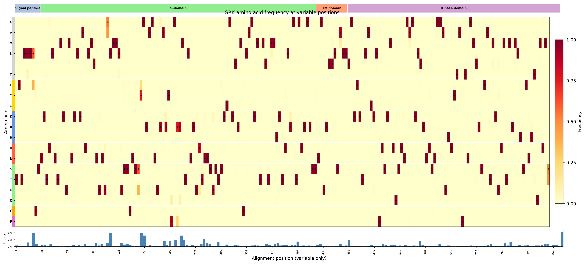

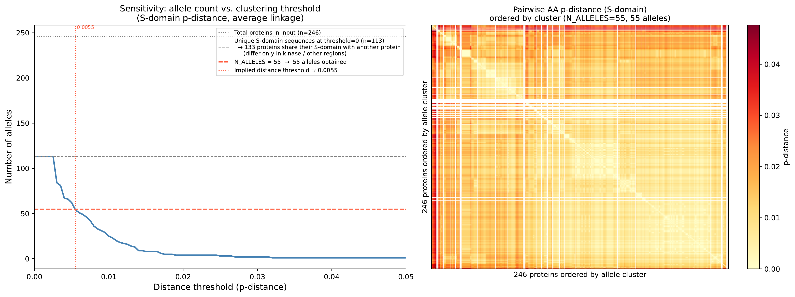

---

### 2. Allelic Richness in *LEPA*

**Observed richness:** Across **272 individuals** sampled from **26 population localities** spanning the species range, we identified **54 distinct S-allele bins** ([Figure 3](#figure-3)). The sample comprises five main EOs with sufficient individuals for population-level analysis (EO25, EO27, EO67, EO70, EO76; n = 53, 42, 36, 48, 62 respectively; total n = 241), plus 21 additional small localities (n = 1–3 each; total n = 31) contributing to species-level allele discovery.

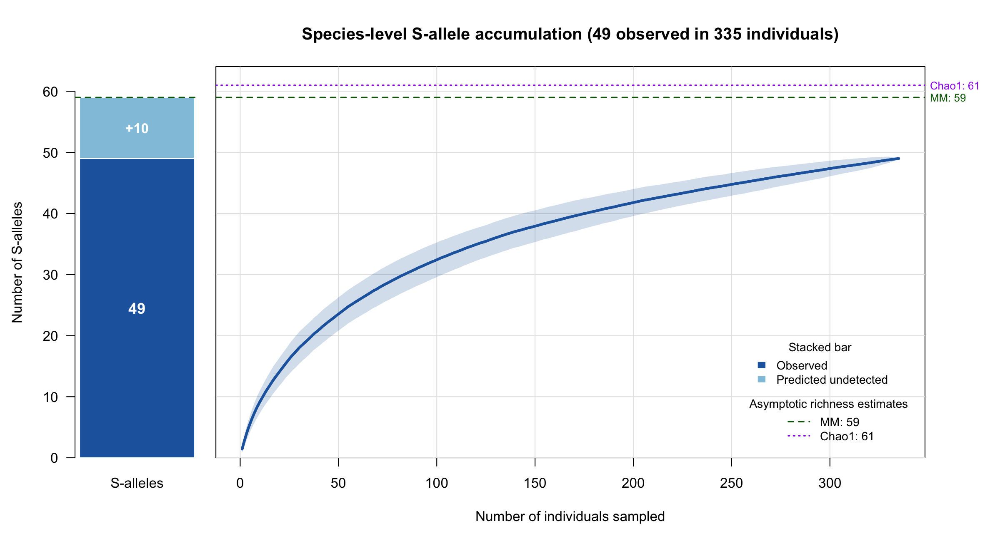

**Predicted species richness:** The allele accumulation curve has not yet reached an asymptote, indicating that further sampling would discover additional alleles. Three complementary estimators were applied to the accumulation curve:

| Estimator | Predicted species richness |
|-----------|--------------------------|
| Michaelis-Menten (MM) | 69 alleles |
| Chao1 | 73 alleles |
| Consensus (MM + Chao1 mean) | 71 alleles |

The **MM estimate of 69 alleles** is adopted as the species optimum — the allele richness expected under balancing selection at evolutionary equilibrium, used here as the reference baseline against which population deficits are measured. An additional **49 individuals** would need to be sampled to discover the next new allele, and reaching 80% of the MM estimate would require sampling approximately **55 more individuals**, underscoring that the species SI repertoire remains substantially under-characterised.

---

### 3. Implications for Seed Production

The species optimum of 69 alleles is the critical baseline for seed production planning. Under balancing selection, the SI system is self-stabilising when all alleles are present and approximately equally frequent: rare alleles are automatically favoured because they are compatible with more partners. This means:

- A population holding all 69 alleles at equal frequency maximises the proportion of compatible mating pairs and reproductive success.
- Any reduction in allele number directly reduces the fraction of compatible pairings and seed set.
- Cross-design for seed production must account for both the number of alleles present and their copy-count dosage (tetraploid genotype classes: AAAA, AAAB, AABB, AABC, ABCD).

---

### 4. Reproductive Status of Element Occurrences

**Allele richness deficit ([Figure 4](#figure-4)):**

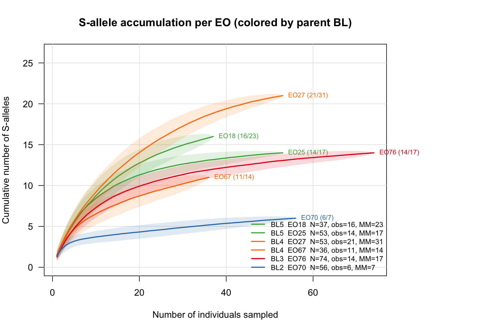

All five Element Occurrences (EOs) with sufficient sample sizes (≥25 individuals) fall far short of the species optimum of 69 alleles:

| Element Occurrence | N individuals | Observed alleles | % of species optimum (MM) | Predicted (MM) | Predicted (Chao1) |
|--------------------|:---:|:---:|:---:|:---:|:---:|
| EO25 | 53 | 14 | 20% | 17 | 15 |
| EO27 | 42 | 22 | 32% | 38 | 26 |
| EO67 | 36 | 13 | 19% | 17 | 21 |
| EO70 | 48 |  6 |  9% |  7 |  8 |
| EO76 | 62 | 13 | 19% | 15 | 19 |

EO27 retains the most allele diversity, yet even its observed count of 22 alleles represents only 32% of the species optimum. EO70, despite being the most heavily sampled EO (48 individuals), harbours only 6 allele bins — the lowest richness of all five EOs and just 9% of the species optimum, suggesting severe historical bottlenecking or founder effects at this occurrence.

**S-allele erosion by genetic drift ([Figure 4b](#figure-4b)):**

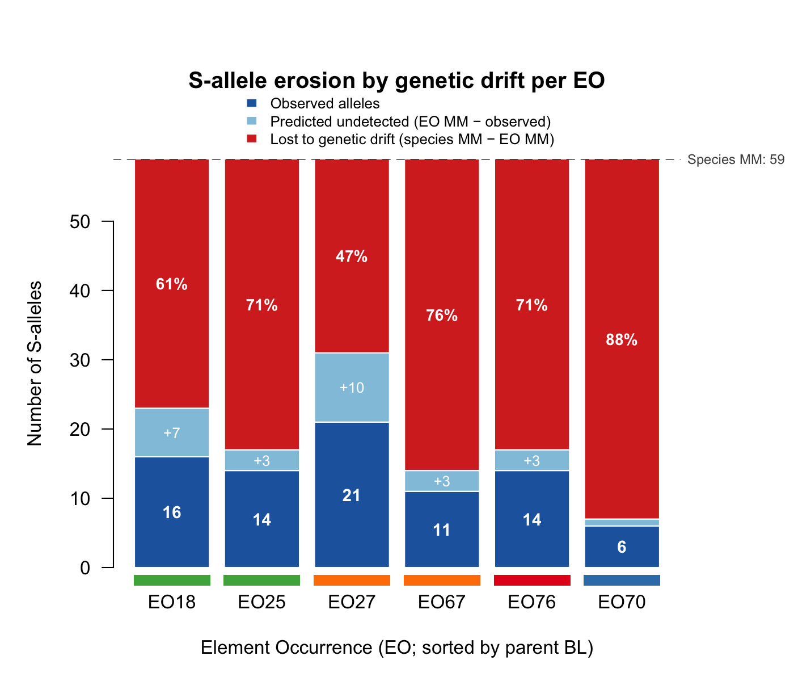

The allele richness deficits documented above are not sampling artefacts — they reflect irreversible genetic erosion. [Figure 4b](#figure-4b) decomposes each EO's deficit relative to the 69-allele species optimum into two components: alleles predicted to exist in the EO but not yet detected (light blue; EO MM estimate minus observed count), and alleles lost to genetic drift (red; species MM minus EO MM estimate). The red segment — alleles that are almost certainly absent from each EO — dominates catastrophically across all five EOs:

| Element Occurrence | Observed | Predicted undetected | Lost to genetic drift | % lost |
|--------------------|:---:|:---:|:---:|:---:|
| EO70 |  6 | ~1 | ~62 | **90%** |
| EO76 | 13 | ~2 | ~54 | **78%** |
| EO25 | 14 | ~3 | ~52 | **75%** |
| EO67 | 13 | ~4 | ~52 | **75%** |
| EO27 | 22 | ~16 | ~31 | **45%** |

Even in EO27 — the least affected occurrence — an estimated 31 of the 69 species-level S-allele bins (45%) have been permanently lost from the local gene pool. In EO70, the most severely eroded occurrence, approximately 62 of 69 alleles (90%) are gone. The predicted-undetected component is uniformly small (1–16 alleles), confirming that further sampling within these EOs will not close the deficit: the missing alleles are not hidden by insufficient effort — they no longer exist in these populations. Genetic drift has dismantled the SI system at its source, and inter-EO allele transfers are the only viable pathway to restoration.

**Allele set composition and sharing ([Figures 5](#figure-5)–[6](#figure-6)):**

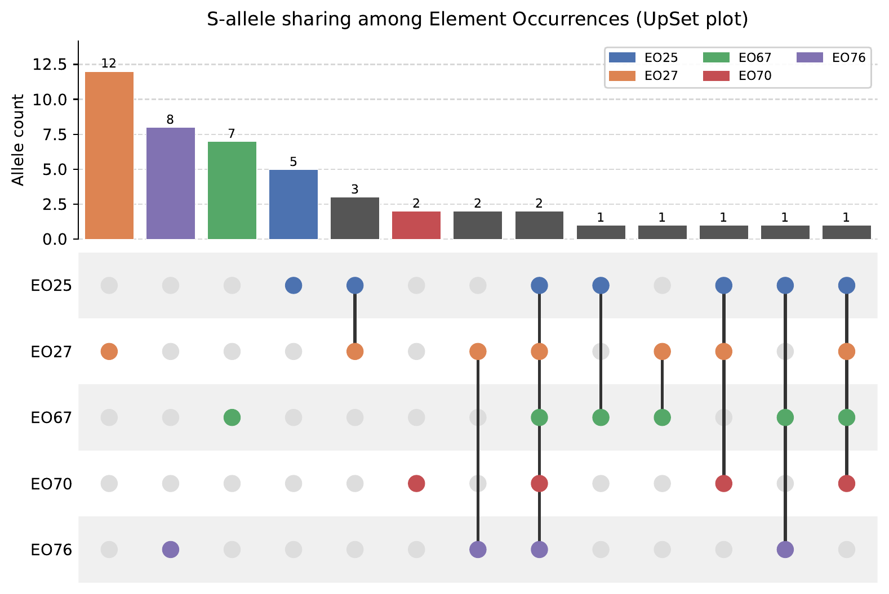

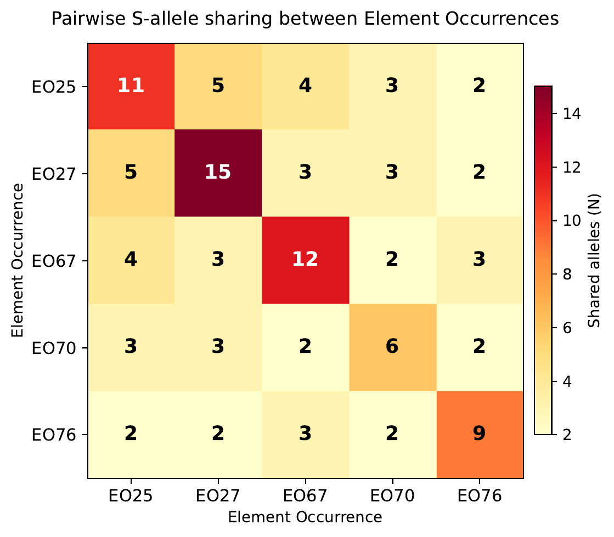

S-allele sets are largely private to each Element Occurrence. Only **2 alleles — Allele_050 and Allele_057 — are shared across all five EOs**, and these are precisely the alleles with the highest copy counts species-wide, consistent with the severe frequency skew documented below. The remaining alleles are partitioned among EO subsets or are exclusive to a single EO:

| Element Occurrence | Private alleles (exclusive to this EO) |
|--------------------|:---:|
| EO27 | 12 |
| EO76 |  8 |
| EO67 |  7 |
| EO25 |  5 |
| EO70 |  2 |

EO27 holds the largest private allele set (12 alleles), reinforcing its status as the most allele-rich and irreplaceable contributor to the species SI repertoire. EO70, despite being the most depauperate EO, still retains 2 alleles found nowhere else. In pairwise comparisons, EO25 and EO27 share the most alleles (3), while EO70 shares only 2 alleles with any other EO (the two universally shared alleles) — underscoring its compositional isolation and the importance of inter-EO crosses for redistributing allele diversity to this occurrence.

**Allele frequency imbalance ([Figure 7](#figure-7)):**

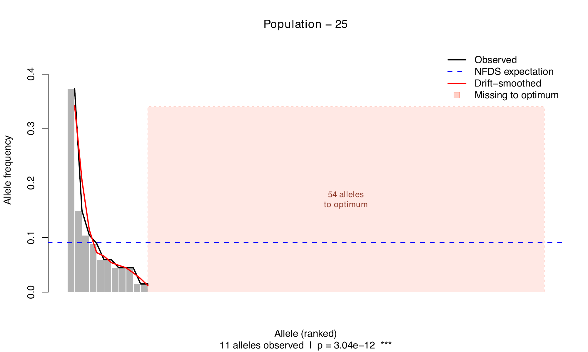

Under balancing selection, alleles are expected to be maintained at approximately equal frequencies. Chi-square goodness-of-fit tests against the uniform expectation reject this null at every level:

| Level | N individuals | N alleles | χ² | *p*-value |
|-------|:---:|:---:|:---:|:---:|
| Species | 272 | 54 | 2438.8 | ≈ 0 |
| EO25 | 53 | 14 | 60.7 | 4.0 × 10⁻⁸ |
| EO27 | 42 | 22 | 112.0 | 2.1 × 10⁻¹⁴ |
| EO67 | 36 | 13 | 68.3 | 6.6 × 10⁻¹⁰ |
| EO70 | 48 |  6 | 113.6 | 6.9 × 10⁻²³ |
| EO76 | 62 | 13 | 151.3 | 3.0 × 10⁻²⁶ |

A small number of alleles dominate in each Element Occurrence. Allele_050 and Allele_057 are the most prevalent across the species, shared across all five EOs and present at high copy counts. EO70 is particularly extreme — one dominant allele alone accounts for a disproportionate share of all allele copies in that occurrence, while many alleles are absent entirely.

**Zygosity ([Figure 8](#figure-8)):**

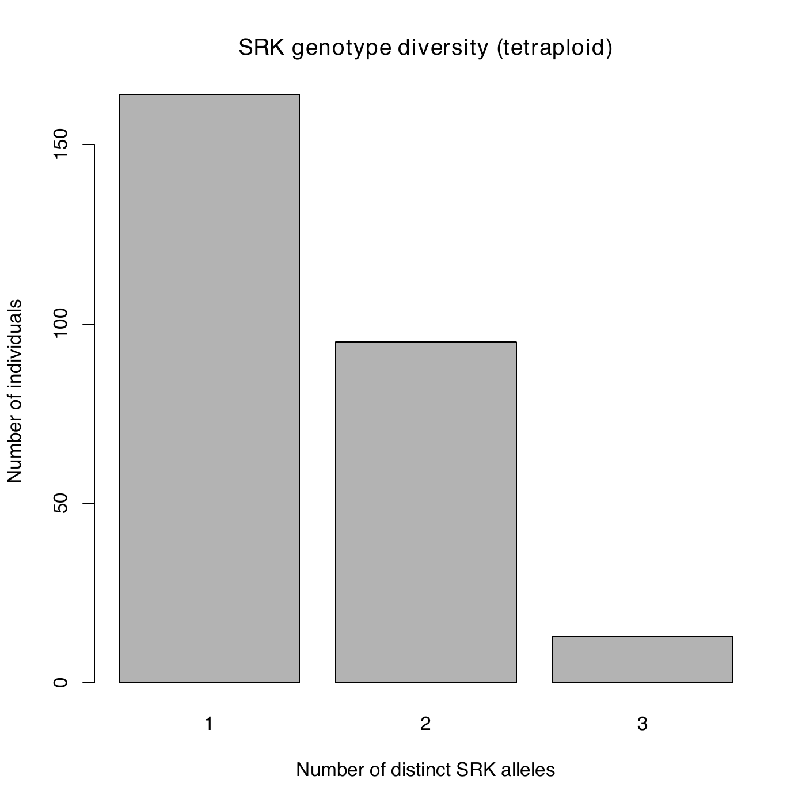

Genotype reconstruction from the tetraploid allele copy-count matrix reveals the following dosage classes across all 272 individuals:

| Genotype class | Description | N individuals | % |
|----------------|-------------|:---:|:---:|
| AAAA | Homozygous — one allele, four copies | 164 | 60% |
| AAAB | Two alleles, 3:1 dosage | 44 | 16% |
| AABB | Two alleles, two copies each | 51 | 19% |
| AABC | Three alleles, one doubled | 13 |  5% |

A majority of individuals (60%, 164/272) carry only a single allele bin (AAAA genotype), making them functionally equivalent to homozygotes with respect to SI. These individuals are candidates for self-compatibility and cannot contribute compatible pollen to any partner carrying the same allele. The proportion is consistent across EOs: EO25 (53%), EO27 (64%), EO67 (53%), EO70 (60%), EO76 (69%).

**The AAAA majority is not allele-diverse: two dominant alleles drive most homozygosity.** The 60% AAAA prevalence does not reflect a uniform distribution of homozygosity across the S-allele repertoire. Cross-referencing zygosity with the allele frequency data reveals a strongly asymmetric structure. Allele_050 and Allele_057 — the two alleles shared across all five EOs and by far the most abundant species-wide — account for the great majority of AAAA individuals. In a tetraploid, the probability of inheriting four copies of any given allele scales steeply with frequency (proportional to p⁴ under drift); alleles that have drifted to high frequency therefore generate AAAA homozygotes at a disproportionate rate. Most AAAA individuals are consequently genetically redundant copies of the same one or two dominant alleles.

The remaining S-allele bins — representing the majority of functional allele diversity documented in Section 2 — are present predominantly or exclusively in heterozygous individuals (AABB, AABC). Among the 55 allele bins characterised in Section 7, 33 (60%) have no AAAA representative in the current dataset: those alleles exist entirely within the heterozygous minority. In other words, the ~40% of individuals that are heterozygous carry the vast majority of the species' S-allele diversity, while the ~60% AAAA majority is dominated by just two alleles and is genetically redundant at the S-locus. This asymmetry has a direct conservation implication: the AAAA individuals, though numerically dominant, contribute little to allele diversity; the AABB and AABC individuals are the sole carriers of rare alleles. Loss of even a few of these heterozygous individuals could eliminate allele bins with no representation anywhere else in the dataset.

---

### 4a. Tipping Point 1 (TP1) — Health of the SI System

TP1 assesses the **health of the self-incompatibility system** — the degree to which the S-allele pool within a population is capable of sustaining compatible mating. It is breached when allele loss is so severe that inter-population allele transfers are required to restore SI function. Two complementary questions structure the assessment ([Figure 9](#figure-9)):

- **How many different alleles has a population retained?** (x-axis: `prop_optimum` = N_alleles / 69 — the proportion of the species-level SI repertoire still present in the EO. A population holding all alleles can offer every individual a large pool of compatible partners; as alleles are lost, compatible pairings become progressively rarer.)
- **How evenly are the remaining alleles distributed across individuals?** (y-axis: `Ne / N_alleles` — the ratio of effective to observed allele number. The effective allele number Ne = 1/Σpᵢ² answers *how many equally frequent alleles would produce the same level of diversity as observed*. A ratio of 1.0 means perfect evenness — the balancing selection ideal in which every allele contributes equally to compatible crosses; drift and dominance push it downward as a few alleles monopolise copy numbers and rare alleles are marginalised.)

A population with all alleles present and evenly distributed maximises compatible mating pairs and SI system health. TP1 identifies where both dimensions have degraded beyond the point at which within-population crossing alone can restore SI function. A population is flagged **CRITICAL** when both criteria are breached (< 50% of species optimum and Ne/N < 0.80), **AT RISK** when only one is breached, and **OK** when neither is.

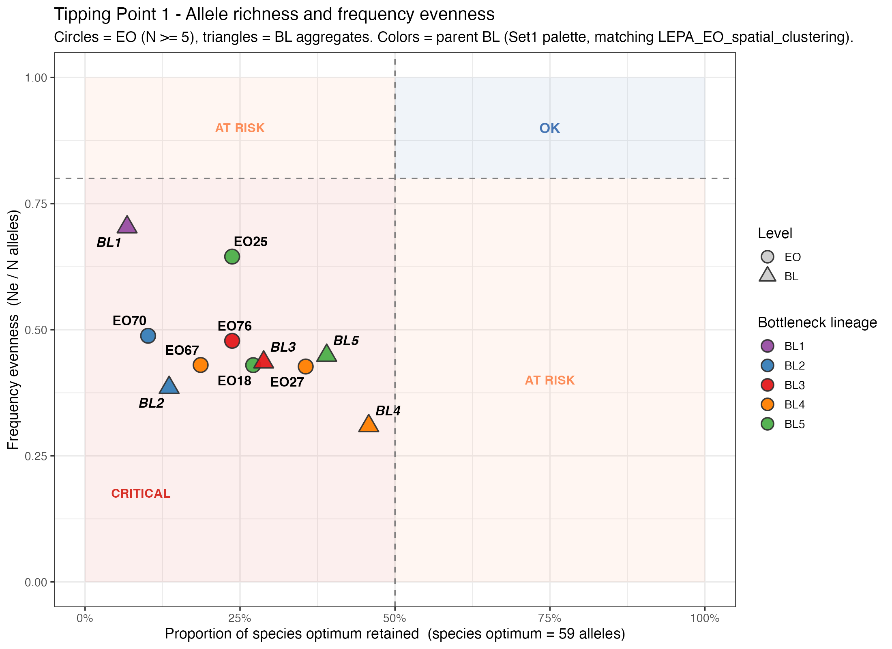

| EO | N alleles | % of species optimum | Evenness (Ne/N) | TP1 status |
|----|:---:|:---:|:---:|:---:|
| EO70 |  6 |  9% | 0.47 | **CRITICAL** |
| EO67 | 13 | 19% | 0.53 | **CRITICAL** |
| EO76 | 13 | 19% | 0.45 | **CRITICAL** |
| EO25 | 14 | 20% | 0.66 | **CRITICAL** |
| EO27 | 22 | 32% | 0.42 | **CRITICAL** |

All five EOs are CRITICAL on both axes. No EO retains more than 32% of the species allele pool, and all have evenness values between 0.42 and 0.66 — meaning that even the alleles present are distributed so unevenly that fewer than half are effectively contributing to SI function. EO27 has the lowest evenness (0.42), indicating the most extreme dominance by a few alleles; EO25 has the highest (0.66), though this is still far from the balancing selection ideal of 1.0. EO27 is least depauperate on richness (32%), while EO70 is the most allele-impoverished (9%).

**Interpreting the two axes: bottleneck versus ongoing drift**

The richness and evenness axes of the TP1 plot capture different aspects of demographic history and together allow a partial — though not definitive — reading of the processes that generated the observed deficits. Low allele richness (prop_optimum) is the primary signature of a founder event or population bottleneck: the rapid, simultaneous loss of alleles when population size was severely reduced. Low frequency evenness (Ne/N) is more characteristic of ongoing genetic drift in small populations — the progressive accumulation of one or a few dominant alleles at the expense of rare survivors. An EO that experienced only a historical bottleneck with no subsequent drift would be expected to show low richness but moderate evenness (founders sampled stochastically, but the alleles they carried may be at similar frequencies). An EO experiencing only ongoing drift without a prior bottleneck would retain more alleles but show declining evenness as dominant frequencies grow.

LEPA EOs are severely deficient on **both** axes simultaneously, which is most consistent with a historical bottleneck that reduced richness sharply, followed by prolonged ongoing drift that further eroded evenness among the surviving alleles. This two-phase interpretation is reinforced by the allele composition analysis ([Figures 5](#figure-5)–[6](#figure-6)): if all EOs had been founded from the same bottlenecked ancestral pool, they would be missing the *same* alleles. The observation that each EO holds a largely private allele set — with only two alleles shared across all five EOs — points instead to **independent drift in isolated populations**, each losing different alleles stochastically, superimposed on a possible earlier species-level richness reduction. Formally resolving the relative contribution of each process requires genome-wide neutral marker data and demographic modelling (see Section 5).

---

### 4b. Individual Genotypic Fitness Score (GFS) and Tipping Point 2 (TP2) — Reproductive Fitness

The zygosity classification above groups individuals by the *number* of unique alleles, but for seed production the *dosage balance* of those alleles also matters. In self-incompatible plants, an individual's value as a breeding partner depends not only on which key/lock types it carries, but also on the number of distinct alleles present across its genome copies. Individuals with more key/lock types can participate in more compatible crosses, making them especially valuable in a managed breeding program. A tetraploid produces diploid gametes by randomly sampling 2 of its 4 allele copies — yielding C(4,2) = 6 equally probable gamete combinations. An individual with genotype AABB (two alleles, balanced 2+2) produces heterozygous gametes in 4 of 6 combinations (GFS = 0.667), whereas an AAAB individual (two alleles, unbalanced 3+1) produces heterozygous gametes in only 3 of 6 (GFS = 0.500). This distinction — invisible to zygosity analysis alone — is captured by the **Genotypic Fitness Score (GFS)**:

$$\text{GFS}_i = 1 - \frac{\sum_k n_k\,(n_k - 1)}{12}$$

where $n_k$ is the copy number of allele $k$ and the denominator normalises to the tetraploid gamete space.

| Genotype | GFS | Heterozygous gametes |
|----------|-----|----------------------|
| ABCD | 1.000 | 6 / 6 |
| AABC | 0.833 | 5 / 6 |
| AABB | 0.667 | 4 / 6 |
| AAAB | 0.500 | 3 / 6 |
| AAAA | 0.000 | 0 / 6 |

**Tipping Point 2 (TP2) — Reproductive Fitness** assesses the degree to which the individuals within a population can actually participate in compatible crosses and contribute allelic diversity to the next generation. It is breached when individual-level fitness has degraded to the point that managed crossing within an EO cannot restore reproductive output without external allele introductions. Two complementary questions structure the assessment:

- **What fraction of individuals are reproductive dead-ends?** (x-axis: `prop_AAAA` > 30% — the proportion of individuals producing only homotypic gametes. An AAAA individual cannot contribute to any compatible cross regardless of its mate, making it a complete loss to the breeding pool.)
- **How much reproductive capacity does the average individual still have?** (y-axis: `mean GFS` < 0.667 — the EO average falls below the AABB benchmark of producing heterozygous gametes in 4 of 6 combinations. When the mean GFS is low, even the individuals that are not dead-ends contribute relatively little diversity per cross.)

A population breaching both simultaneously is flagged **CRITICAL**; one criterion is **AT RISK**; neither is **OK**.

**EO-level GFS results ([Figures 10](#figure-10)–[12](#figure-12)):**

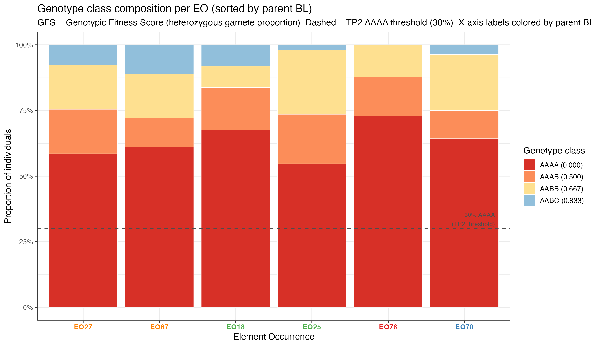

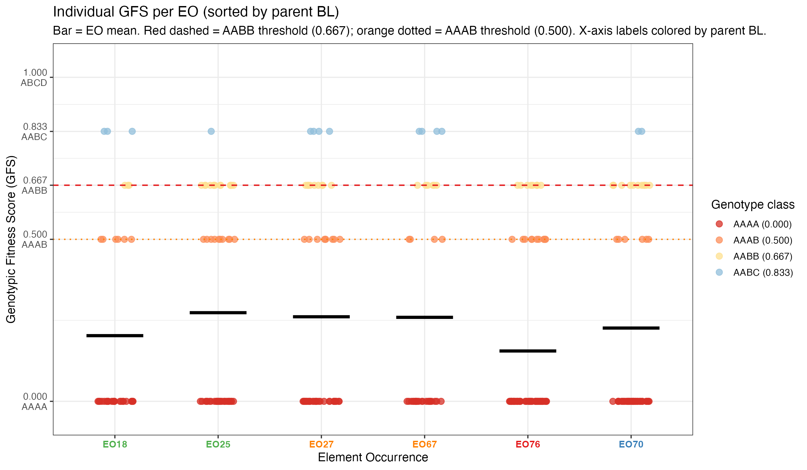

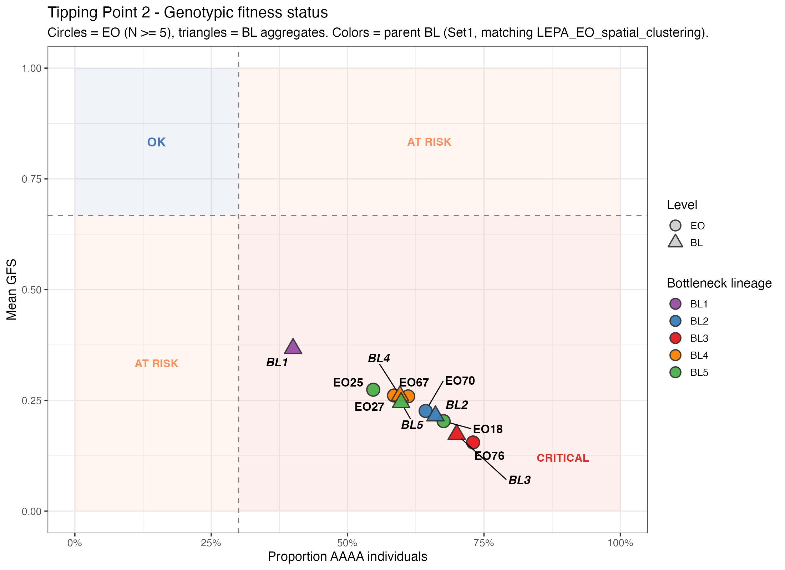

| EO | N | mean GFS | % AAAA | % AAAB | % AABB | % AABC | TP2 status |
|----|:---:|:---:|:---:|:---:|:---:|:---:|:---:|
| EO76 | 62 | 0.177 | 69% | 16% | 15% |  0% | **CRITICAL** |
| EO27 | 42 | 0.222 | 64% | 17% | 12% |  7% | **CRITICAL** |
| EO70 | 48 | 0.250 | 60% | 13% | 23% |  4% | **CRITICAL** |
| EO25 | 53 | 0.283 | 53% | 21% | 25% |  2% | **CRITICAL** |
| EO67 | 36 | 0.319 | 53% | 11% | 22% | 14% | **CRITICAL** |

All five EOs are CRITICAL. No EO approaches a mean GFS consistent with a functioning SI system. **EO67 is the least degraded**, with the highest mean GFS (0.319) and the highest proportion of AABC individuals (14%). A total of **13 AABC individuals** are present across the species — distributed across EO67 (~5), EO27 (3), EO70 (2), and EO25 (1), with none in EO76 — producing 5/6 heterozygous gametes and making them the highest-priority seed parents in the species.

**Proportion of individuals supporting reproductive effort ([Figure 13](#figure-13)):**

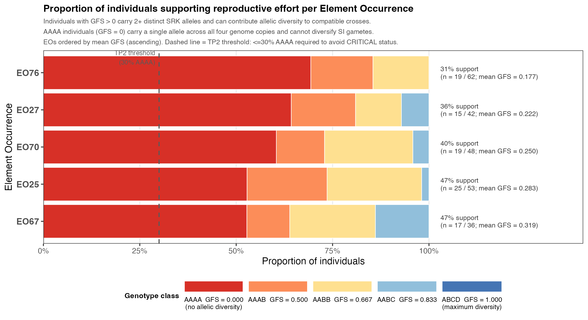

Fewer than half of individuals in any EO carry more than one distinct SRK allele and can therefore contribute allelic diversity to compatible crosses. The proportion of "supporting" individuals (GFS > 0) ranges from 31% in EO76 to 47% in EO67, with mean GFS values uniformly well below the AABB benchmark (0.667). All five EOs breach the TP2 AAAA threshold: the red (AAAA) segment extends well past the 30% dashed line in every case, reaching 53–69% of each population. EO76 is the most degraded (only 31% supporting; mean GFS = 0.177); EO67 is least degraded (47% supporting; mean GFS = 0.319) and has the highest proportion of AABC individuals.

**Seed production priority within each EO** (top-ranked individuals by GFS):

| EO | Individual | Genotype | GFS |
|----|-----------|----------|-----|
| EO67 | Library001_barcode02 | AABC | 0.833 |
| EO67 | Library006_barcode59 | AABC | 0.833 |
| EO67 | Library007_barcode82 | AABC | 0.833 |
| EO70 | Library008_barcode01 | AABC | 0.833 |
| EO70 | Library008_barcode12 | AABC | 0.833 |
| EO27 | Library006_barcode37 | AABC | 0.833 |
| EO27 | Library006_barcode41 | AABC | 0.833 |
| EO27 | Library009_barcode82 | AABC | 0.833 |
| EO25 | Library009_barcode62 | AABC | 0.833 |
| EO76 | Library001_barcode09 | AABB | 0.667 |
| EO76 | Library001_barcode17 | AABB | 0.667 |
| EO76 | Library003_barcode66 | AABB | 0.667 |

Full ranked lists per EO are available in `SRK_individual_GFS.tsv`; EO-level summaries and TP2 flags in `SRK_EO_GFS_summary.tsv`.

---

### 4c. Spatial Connectivity of Element Occurrences: Isolating the Ancestral Bottleneck

The genetic erosion documented in Sections 4a and 4b requires a spatial context: the TP1 and TP2 deficits are outcomes, but determining whether they reflect a shared species-level bottleneck or independent drift in isolated populations depends on knowing whether gene flow between Element Occurrences is even possible. We addressed this by analysing the spatial footprints and connectivity of all sampled locations relative to the maximum pollinator dispersal distance for *L. papilliferum* (~500 m; consistent with published estimates for small-bodied bee and fly pollinators in fragmented landscapes). Convex hull polygons were constructed from 758 georeferenced collection events across 39 locations in 19 EOs (UTM Zone 11N), and pairwise hull-to-hull distances were computed to assess which locations share a pollinator pool. A drift index (DI) was derived from the union area of connected-group hull polygons (DI = 0: largest group; DI = 1: smallest, expected-strongest drift) as a relative spatial proxy for Ne. The full analytical documentation is in `Data/EO_spatial_clustering_documentation.md`; the analysis script is `Scripts/EO_spatial_clustering.R`.

**Independent bottleneck lineages.** Ward's D2 hierarchical clustering of the 31 group centroids, with silhouette-optimised k = 5 (silhouette score = 0.74), identifies **five independent bottleneck lineages (BL1–BL5)** across the species range ([Figure 4c](#figure-4c)). Each lineage represents a set of geographic groups plausibly sharing a common ancestral colonisation event. Sampling for S-allele diversity must include populations from all five lineages to capture the full landscape-level allele pool; sampling within a single lineage will systematically miss alleles unique to other lineages. The full cross-reference of BL, group, EO, and population IDs is in `tables/EO_group_BL_summary.csv`; the table below summarises all 31 groups sorted by lineage.

| BL | Group | EO | Population IDs | N locs | Area (ha) | Drift index |
|----|-------|----|----------------|:------:|----------:|:-----------:|
| BL1 | 7 | EO29 | 8 | 1 | 0.04 | 0.998 |
| BL1 | 20 | EO08 | 27 | 1 | 1.27 | 0.935 |
| BL1 | 21 | EO08 | 28 | 1 | 3.44 | 0.825 |
| BL1 | 22 | EO08 | 29 | 1 | 0.61 | 0.969 |
| BL1 | 23 | EO26 | 30 | 1 | 0.48 | 0.976 |
| BL1 | 24 | EO26 | 31, 32 | 2 | 0.66 | 0.967 |
| BL1 | 25 | EO26 | 33, 34 | 2 | 0.44 | 0.977 |
| BL1 | 26 | EO26 | 35 | 1 | 0.13 | 0.993 |
| BL1 | 27 | EO26 | 36 | 1 | 0.06 | 0.997 |
| BL1 | 29 | EO61 | 38 | 1 | 0.89 | 0.955 |
| BL2 | 4 | EO68 | 5 | 1 | 0.00 | 1.000 |
| BL2 | 19 | EO70 | 26 | 1 | 0.01 | 0.999 |
| BL3 | 1 | EO38 | 1 | 1 | 1.23 | 0.938 |
| BL3 | 2 | EO76; EO118 | 2, 4 | 2 | 11.56 | 0.411 |
| BL3 | 3 | EO52 | 3 | 1 | 0.26 | 0.987 |
| BL4 | 8 | EO27 | 9 | 1 | 0.09 | 0.995 |
| BL4 | 9 | EO27 | 10 | 1 | 0.24 | 0.988 |
| BL4 | 10 | EO27 | 11, 12 | 2 | 19.63 | 0.000 |
| BL4 | 11 | EO30 | 13 | 1 | 0.53 | 0.973 |
| BL4 | 28 | EO27 | 37 | 1 | 5.57 | 0.716 |
| BL4 | 30 | EO67 | 39 | 1 | 0.00 | 1.000 |
| BL4 | 31 | EO72 | 40 | 1 | 0.00 | 1.000 |
| BL5 | 5 | EO32 | 6 | 1 | 14.62 | 0.255 |
| BL5 | 6 | EO48 | 7 | 1 | 0.00 | 1.000 |
| BL5 | 12 | EO18 | 15, 16, 17, 18, 19 | 5 | 8.08 | 0.588 |
| BL5 | 13 | EO25 | 20 | 1 | 0.81 | 0.959 |
| BL5 | 14 | EO25 | 21 | 1 | 0.05 | 0.997 |
| BL5 | 15 | EO24 | 22 | 1 | 0.00 | 1.000 |
| BL5 | 16 | EO24 | 23 | 1 | 0.00 | 1.000 |
| BL5 | 17 | EO24 | 24 | 1 | 0.00 | 1.000 |
| BL5 | 18 | EO24 | 25 | 1 | 0.00 | 1.000 |

**Overall connectivity.** Of 741 pairwise location comparisons, only **8 pairs** (1.1%) are connected within the 500 m pollinator dispersal threshold — and **7 of those 8 are within the same EO**. The sole between-EO connection is the hull overlap (0 m) between EO76 and EO118, which occupy the same or adjacent slickspot habitat and should be treated as a single demographic unit. All remaining EOs are completely isolated from each other under current conditions: there are no between-EO pollinator connections at the 500 m threshold beyond the EO76/EO118 co-occurrence.

**Geographic groups.** The 500 m threshold partitions all 39 locations into **31 geographic groups** (connected components). Twenty-six of 39 locations (67%) are completely isolated — no neighbour within the pollinator dispersal limit. Only five groups contain more than one location:

| Group | Locations | EO(s) | N locations | Notes |
|-------|-----------|-------|-------------|-------|
| 2 | 2, 4 | EO76, EO118 | 2 | Hull overlap (0 m); only between-EO connection |
| 10 | 11, 12 | EO27 | 2 | 285.6 m apart |
| 12 | 15–19 | EO18 | 5 | Fully connected chain; pairwise distances 358–493 m |
| 24 | 31, 32 | EO26 | 2 | 369.3 m apart |
| 25 | 33, 34 | EO26 | 2 | 364.1 m apart |

EO18 (group 12) is the largest connected cluster — all five of its locations form a single connected component with a combined area of 8.1 ha (DI = 0.588). It is the strongest candidate for a population that retains meaningful internal gene flow. The closest unconnected group pair (EO26 groups 24 and 25) is 586.3 m — just outside the threshold — and several near-miss pairs in the 586–1,766 m range represent locations that could potentially be reconnected through targeted habitat management.

**Drift index.** Group union areas span four orders of magnitude. Eighty-four percent of groups (26/31) occupy less than 1 ha (DI > 0.95), placing the vast majority of locations in the extreme-drift regime. Eight groups have zero measured area (DI = 1.000): all four EO24 locations (locs 22–25), EO68, EO48, EO67, and EO72 — all their collection events share the same recorded coordinate, reflecting the smallest spatial footprints (or GPS rounding) in the dataset. The three lowest-drift groups are EO27 group 10 (19.6 ha, DI = 0.000), EO32 (14.6 ha, DI = 0.255), and the EO76/EO118 group (11.6 ha, DI = 0.411). The spatial distribution of groups and their drift indices is shown in [Figure 4d](#figure-4d).

**Interpretation.** The dominant pattern is extreme spatial isolation combined with very small habitat footprints. Each of the 31 geographic groups represents an independent demographic unit in which S-allele erosion has proceeded without the buffering effect of gene flow. This directly supports the Stage 1 interpretation of the C3 cascade (Section 5): EO-level allele sets are largely private not by coincidence but because EOs have been genetically isolated for long enough that independent drift has drawn them apart. The five-lineage spatial structure, combined with largely non-overlapping EO allele sets (only 2 alleles shared across all five major EOs), is the expected outcome if each lineage was founded from a separate ancestral colonisation event and has subsequently evolved in isolation. Gene flow cannot explain the observed inter-EO allele partitioning — it is the near-complete absence of gene flow that explains it.

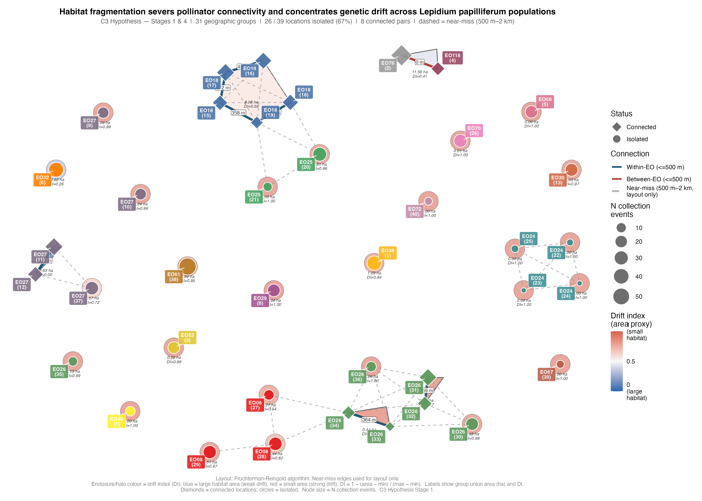

---

### 5. The Compatibility Collapse Cascade (C3): A Mechanistic Framework Linking Habitat Fragmentation to Reproductive Failure

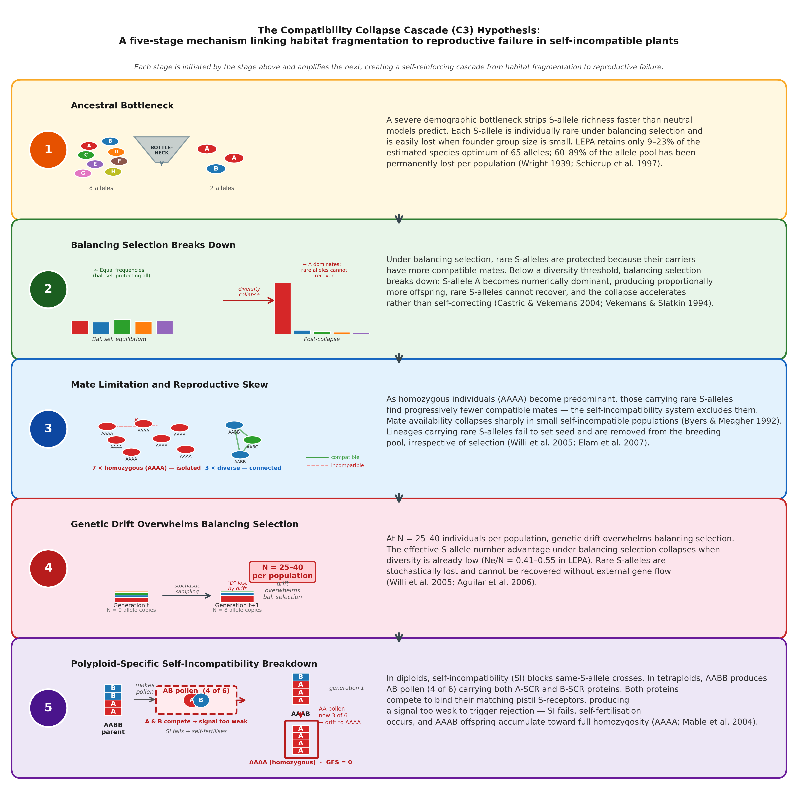

The analyses in Sections 3–4 document the *outcomes* of two converging processes — the erosion of S-allele diversity (TP1) and the degradation of individual reproductive fitness (TP2). The central question this section addresses is: *how* does habitat fragmentation translate into these outcomes? The **Compatibility Collapse Cascade (C3)** hypothesis proposes that fragmentation initiates a five-stage, self-reinforcing sequence of demographic and genetic processes that collectively degrade the SI system and accumulate reproductive dead-ends, even within populations where the SI gene itself remains functional. Each stage is initiated by the one above and amplifies the next — making the cascade increasingly irreversible once set in motion. Crucially, the C3 hypothesis also defines the intervention logic for informed breeding: each stage identifies a specific failure point that targeted genetic rescue can address.

A critical baseline observation frames the entire section. Across all five EOs, functional SRK sequences were successfully recovered from all but five individuals in the dataset; in those five, sequence-level evidence suggests non-functional SRK alleles — the molecular signature of a self-compatibility mutation. The near-absence of molecular SI failure (<4% of individuals) is scientifically important for two reasons. First, it confirms that the sporophytic self-incompatibility system remains structurally intact across the species — the gene itself has not degenerated. Second, and more consequentially, it rules out widespread loss-of-function mutation as the primary driver of the 60% AAAA prevalence. If molecular breakdown of the SRK receptor were responsible for the genotypic pattern, we would expect a far higher proportion of individuals to carry non-functional alleles broadly distributed across EOs — not the near-uniform AAAA accumulation observed in populations that still express a working SI system. The five individuals with non-functional SRK sequences are instead consistent with rare, independent mutational events and may correspond to the five AABC individuals discussed in Stage 5 below, whose unusual allele combinations could reflect SI-bypassing self-fertilisation enabled by SRK dysfunction.

This baseline leads directly to a more challenging question: if the SI machinery is functional, how does a species accumulate 60% reproductive dead-ends? The answer cannot be a simple one. The pattern is most consistent with a cascade of interacting demographic and genetic processes — each initiated by the stage above it and each amplifying the next — that collectively drive accumulation of homozygous (AAAA) individuals even within a nominally functioning SI system. The five stages of this cascade are described below and illustrated in [Figure 14](#figure-14) above.

**Stage 1 — Ancestral bottleneck: loss of S-allele richness**

The most parsimonious starting point is a severe demographic bottleneck associated with historical habitat loss and fragmentation. Bottlenecks reduce S-allele richness faster than expected under neutral models, because S-alleles are individually rare even in healthy populations under balancing selection and are easily lost when founder group size is small. The spatial connectivity analysis in Section 4c establishes the landscape context for this bottleneck: 26 of 39 sampled locations (67%) have no neighbour within the 500 m maximum pollinator dispersal distance, and 84% of geographic groups occupy less than 1 ha of habitat. No between-EO pollinator connections exist beyond the EO76/EO118 co-occurrence — meaning that each EO is an independent evolutionary unit in which S-allele erosion has proceeded in isolation. This isolation is reflected directly in the allele composition data: EO allele sets are largely non-overlapping (only 2 alleles shared across all five major EOs), and the five independent bottleneck lineages identified by hierarchical clustering of group centroids provide the expected number of independent founding events consistent with the spatial and genetic partitioning observed. The observed richness of 9–32% of the species optimum per population, combined with the irreversible loss of 45–90% of the species allele pool per occurrence (Section 4a), is consistent with pronounced and prolonged founder effects in each lineage evolving independently of the others (Wright 1939; Schierup et al. 1997).

**Bottleneck versus ongoing drift: what the pipeline can and cannot resolve**

The term "genetic drift" is used throughout this report in its broadest sense — encompassing both a discrete historical bottleneck (a sudden, severe reduction in population size) and the continuous stochastic erosion of allele frequencies that occurs in any finite population. These are conceptually distinct processes with different primary effects: a bottleneck principally reduces allele **richness** by eliminating rare alleles simultaneously at a single historical moment; ongoing drift in small populations subsequently erodes allele **frequency evenness**, causing surviving alleles to diverge progressively from the equal-frequency balancing selection ideal.

The current pipeline measures the net outcome of both processes combined — the allele richness deficit relative to the MM species optimum — but cannot partition how much was lost in a historical bottleneck versus how much is being actively eroded today. This limitation is inherent to the SRK locus itself: it is under balancing selection, which invalidates standard bottleneck-detection tools (e.g., BOTTLENECK software; Cornuet & Luikart 1996; Garza & Williamson 2001) that assume neutral allele dynamics. Resolving the relative contribution of each process would require genome-wide neutral marker data (e.g., SNPs from RADseq or whole-genome sequencing) analysed with demographic modelling approaches such as SMC++ or PSMC.

Nonetheless, the two TP1 axes — allele richness and frequency evenness — carry a weak but informative signal (see Section 4a). A bottleneck founder effect tends to reduce richness while leaving surviving alleles at roughly similar frequencies among founders; subsequent ongoing drift in small populations then additionally distorts those frequencies, further eroding evenness. LEPA shows both severely low richness (9–32% of species optimum) and very low evenness (Ne/N = 0.42–0.66), most consistent with a historical bottleneck followed by prolonged ongoing drift. The allele composition analysis ([Figures 5](#figure-5)–[6](#figure-6)) adds a second line of evidence: if losses were caused by a single shared ancestral bottleneck, EOs would be missing the *same* alleles. Instead, each EO holds a largely private allele set with minimal inter-EO sharing, consistent with independent drift in isolated EOs rather than one common founding event — though a prior reduction of the species-level pool cannot be excluded.

For conservation purposes, the distinction matters less than the intervention it implies: the alleles are absent regardless of when they were lost, and the urgency of inter-EO allele transfers is identical under either interpretation.

**Stage 2 — Balancing selection breaks down**

Under normal conditions, balancing selection protects rare S-alleles by giving individuals carrying them a reproductive advantage — they are compatible with more partners. However, this protective mechanism breaks down once diversity collapses below a functional threshold. When S-allele A becomes numerically dominant, the rare-allele advantage diminishes because too few rare S-alleles remain to recover. A-carrying individuals produce more offspring simply by numerical dominance, and their offspring are disproportionately likely to inherit one or more A copies. The result is a self-reinforcing collapse: drift reduces diversity, balancing selection weakens, dominance of S-allele A increases, diversity collapses further (Castric & Vekemans 2004).

No universally agreed-upon threshold has been established for self-incompatible systems, but simulation work specific to sporophytic self-incompatibility indicates that the protective effect of balancing selection begins to erode sharply once the dominant S-allele exceeds approximately 30–40% frequency in a population (Schierup et al. 1997). Below this point, the reproductive output gained through sheer numerical dominance outpaces the compatibility advantage conferred by rarity, and the system enters a state where drift and balancing selection reinforce each other in the same direction rather than opposing each other. In LEPA, S-allele A is present in virtually every individual and homozygous (AAAA) individuals represent 60% of all genotypes — well past any threshold at which balancing selection could act as a stabilising force. The 9–32% allele richness retained per population places all five occurrences firmly in the regime where balancing selection breaks down (Schierup et al. 1997; Castric & Vekemans 2004).

**Stage 3 — Mate limitation and reproductive skew**

In self-incompatible systems, a cross is compatible only when the pistil does not recognise any S-allele expressed in the pollen donor. As homozygous (AAAA) frequency rises, individuals carrying rare S-alleles find progressively fewer compatible mates — not because the self-incompatibility system has failed, but because it is working precisely as designed in a diversity-impoverished landscape. Byers & Meagher (1992) demonstrated analytically that in small self-incompatible populations, mate availability collapses sharply as S-allele diversity decreases. In practice, lineages carrying rare S-alleles increasingly fail to set seed, removing those allele lineages from the next generation irrespective of selective pressure. Empirical confirmation of this Allee effect in SI species has been documented in *Ranunculus reptans* and invasive *Raphanus sativus* populations (Willi et al. 2005; Elam et al. 2007).

**Stage 4 — Genetic drift overwhelms balancing selection at observed population sizes**

At census sizes of N = 36–62 individuals per population, genetic drift is strong enough to overcome the balancing selection that would otherwise maintain S-allele diversity. The effective S-allele number (Ne) at the S-locus is theoretically elevated above neutral Ne under balancing selection; however, this advantage collapses when diversity is already low. At the evenness values observed in LEPA (Ne/N = 0.42–0.66), a substantial fraction of individuals already carry duplicate allele copies, meaning effective recombination among distinct S-alleles is further constrained. Once a rare S-allele is lost by drift, it cannot be recovered without gene flow (Willi et al. 2005; Aguilar et al. 2006).

**Stage 5 — Polyploid-specific self-incompatibility breakdown: the pathway to full homozygosity (AAAA)**

To understand this stage it helps to know the two molecular components involved. **SRK** (S-Receptor Kinase) is a protein on the surface of pistil cells that acts as the *receptor*: it detects pollen identity. **SCR** (S-locus Cysteine-Rich protein; also called SP11) is a small protein coating the surface of pollen grains that acts as the *ligand*: it identifies the pollen. When an SCR protein binds its matching SRK receptor on the pistil, the pistil recognises the pollen as self and rejects it; no binding means the pollen is accepted.

In diploid self-incompatible plants, becoming homozygous at the S-locus is very difficult because self-incompatibility prevents the same-S-allele crosses required to produce homozygous offspring. Tetraploidy fundamentally alters this constraint through the *competitive interaction model*. An AABB individual produces diploid pollen by randomly sampling two of its four allele copies. This generates three pollen types in predictable ratios: AA pollen (1 in 6), **AB pollen (4 in 6 — the most common type)**, and BB pollen (1 in 6). AB pollen, carrying both A-SCR and B-SCR proteins simultaneously, is the key to SI breakdown. When AB pollen lands on an AABB pistil — which expresses both SRK-A and SRK-B receptors — both SCR proteins attempt to bind their respective receptors at the same time. The competing signals interfere with each other, producing a recognition response too weak to trigger rejection. The pistil cannot tell the pollen is self, so it lets it through: self-fertilisation succeeds.

Self-fertilisation of an AABB plant via AB pollen produces predominantly **AAAB offspring** (e.g., AA egg × AB pollen, or AB egg × AA pollen). An AAAB individual now produces AA pollen in 3 of 6 combinations (versus 1 in 6 from AABB), which further increases the probability of SI-bypassing selfing events in the next generation. Over successive generations this runaway process drifts the genotype distribution toward full homozygosity (AAAA). Mable (2004) and Mable et al. (2004) documented this competitive interaction mechanism in polyploid *Arabidopsis lyrata*, showing that neopolyploids frequently become partially self-compatible through dosage-mediated SCR competition. Busch & Schoen (2008) and Comai (2005) review the broader consequences of polyploidy for SI function.

Two important qualifications frame the fitness consequences of this process. First, AAAA individuals are not themselves capable of self-fertilisation: their pollen carries only A-SCR and is rejected by their own SRK-A pistil receptor through normal SI function. The inbreeding occurs *en route* to AAAA — during the AABB → AAAB → AAAA transition — not once homozygosity is reached. Second, tetraploidy inherently buffers inbreeding depression relative to diploids, because deleterious recessive alleles require four copies to be fully expressed; the fitness cost of each selfing generation is therefore lower than in a diploid outcrosser. Nonetheless, repeated episodes of self-fertilisation during the transition progressively reduce genome-wide heterozygosity across all loci, not just the S-locus. This has two consequences beyond reproductive failure: it diminishes the standing genetic variation available for natural selection to act on, and it reduces the adaptive capacity of both the affected populations and — as AAAA prevalence rises — the species as a whole.

**The 13 AABC individuals: three competing explanations**

The presence of 13 AABC individuals — distributed across EO67, EO27, EO70, and EO25 (none in EO76) — is particularly informative. Three non-mutually exclusive explanations are consistent with the data:

- *Relict diversity.* These individuals are vestiges of a pre-bottleneck state, arising from crosses between individuals that still carried B, C, or D S-alleles before those S-alleles were lost from the broader population. Their AABC configuration requires two rare S-alleles from different parents — a cross that becomes increasingly improbable as the rare S-allele pool diminishes.

- *Inter-EO gene flow.* The presence of AABC genotypes across multiple EOs may reflect historical gene flow between these EOs, with the rarer S-alleles (B, C) derived from alternate source populations. Such inter-occurrence crosses would be fully compatible under self-incompatibility and would produce higher-fitness offspring, consistent with the AABC observation.

- *Mutational SI breakdown.* Rare loss-of-function mutations in SCR/SRK components can restore self-compatibility in otherwise SI species (Busch & Schoen 2008; Brennan et al. 2002). If a small number of LEPA individuals carry such mutations, they could participate in crosses normally rejected by the SI system, generating unusual allele combinations. However, AABC is more consistent with a compatible outcross than with selfing, making this the least parsimonious explanation.

**The self-reinforcing loop: Stage 5 feeds back into Stage 2**

The five stages of the C3 cascade are not strictly linear — the output of Stage 5 re-enters the cascade at Stage 2, creating a self-reinforcing genetic loop that operates independently of any further landscape-level disturbance. Stage 5 produces a progressive accumulation of AAAA individuals: each generation of SI breakdown via AB pollen increases the proportion of homozygous genotypes in the population. This AAAA accumulation directly worsens the conditions described in Stage 2 — it further skews S-allele frequencies toward dominance by allele A, reducing the effective number of alleles contributing to compatible matings and thereby further eroding the frequency-dependent selection that would otherwise protect rare alleles. In other words, once the cascade has been initiated by fragmentation (Stage 1), the genetic system becomes self-propelling: AAAA individuals produced in Stage 5 are themselves the substrate for the next cycle of Stage 2 collapse. This feedback explains why the cascade is increasingly irreversible over time and why intervention must target the genetic system — not merely population size — to break the loop.

The feedback loop is represented in [Figure 14](#figure-14) as a dashed arrow from Stage 5 to Stage 2. It is distinct from the direct downward cascade arrows (which represent sequential causation) and is shown as a feedback arc to reflect its role as an amplifying, rather than initiating, mechanism.

**Conservation implication**

The C3 hypothesis has a direct practical corollary: it provides the scientific foundation for informed breeding. Each stage of the cascade identifies a specific failure point that a targeted intervention can address. Increasing census population size within an EO alone is insufficient to reverse the AAAA trajectory — if the prevailing AAAA frequency exceeds the reproductive dead-end threshold, within-population growth simply produces more AAAA offspring (Stage 3–4 dynamic). Allele introduction via inter-EO crosses is the primary lever. Introducing B, C, and D S-alleles from the 13 AABC individuals into crosses with AAAA individuals simultaneously restores SI compatibility and re-engages balancing selection — the self-reinforcing mechanism that, once functional, will favour the spread of introduced S-alleles through subsequent generations (reversing Stage 2). The 13 AABC seed parents identified in Section 4b are therefore not merely high-priority for seed production in the current season; they represent the only endogenous genetic resource capable of reversing the C3 cascade, and their deployment constitutes the first step of an evidence-based informed breeding strategy.

---

### References

Aguilar, R., Ashworth, L., Galetto, L., & Aizen, M. A. (2006). Plant reproductive susceptibility to habitat fragmentation: Review and synthesis through a meta-analysis. *Ecology Letters*, 9(8), 968–980. https://doi.org/10.1111/j.1461-0248.2006.00927.x

Brennan, A. C., Harris, S. A., Tabah, D. A., & Hiscock, S. J. (2002). The population genetics of sporophytic self-incompatibility in *Senecio squalidus* L. (Asteraceae) I: S allele diversity in a natural population. *Heredity*, 89(6), 430–438. https://doi.org/10.1038/sj.hdy.6800154

Busch, J. W., & Schoen, D. J. (2008). The evolution of self-incompatibility when it is costly. *Trends in Plant Science*, 13(3), 128–135. https://doi.org/10.1016/j.tplants.2008.01.001

Byers, D. L., & Meagher, T. R. (1992). Mate availability in small populations of plant species with homomorphic sporophytic self-incompatibility. *Heredity*, 68(4), 353–359. https://doi.org/10.1038/hdy.1992.49

Castric, V., & Vekemans, X. (2004). Plant self-incompatibility in natural populations: A critical assessment of recent theoretical and empirical advances. *Molecular Ecology*, 13(10), 2873–2889. https://doi.org/10.1111/j.1365-294X.2004.02296.x

Comai, L. (2005). The advantages and disadvantages of being polyploid. *Nature Reviews Genetics*, 6(11), 836–846. https://doi.org/10.1038/nrg1711

Elam, D. R., Ridley, C. E., Goodell, K., & Ellstrand, N. C. (2007). Population size and relatedness affect fitness of a self-incompatible invasive plant. *Proceedings of the National Academy of Sciences*, 104(2), 549–552. https://doi.org/10.1073/pnas.0607259104

Mable, B. K. (2004). Polyploidy and self-compatibility: Is there an association? *New Phytologist*, 162(3), 803–811. https://doi.org/10.1111/j.1469-8137.2004.01055.x

Mable, B. K., Beland, J., & Di Berardo, C. (2004). Inheritance and dominance of self-incompatibility alleles in polyploid *Arabidopsis lyrata*. *Heredity*, 93(5), 476–486. https://doi.org/10.1038/sj.hdy.6800526

Schierup, M. H., Vekemans, X., & Christiansen, F. B. (1997). Evolutionary dynamics of sporophytic self-incompatibility alleles in plants. *Genetics*, 147(2), 835–846. https://doi.org/10.1093/genetics/147.2.835

Vekemans, X., & Slatkin, M. (1994). Gene and allelic genealogies at a gametophytic self-incompatibility locus. *Genetics*, 137(4), 1157–1165. https://doi.org/10.1093/genetics/137.4.1157

Willi, Y., Van Buskirk, J., & Fischer, M. (2005). A threefold genetic Allee effect: Population size affects cross-compatibility, inbreeding depression and drift load in the self-incompatible *Ranunculus reptans*. *Genetics*, 169(4), 2255–2265. https://doi.org/10.1534/genetics.104.034553

Wright, S. (1939). The distribution of self-sterility alleles in populations. *Genetics*, 24(4), 538–552.

---

### 6. Crossing Strategy Simulations

> **Note:** The simulations in this section are based on Libraries 001–008 (189 individuals, 47 alleles) and have not yet been re-run with the full dataset (Libraries 001–009, 272 individuals, 54 alleles). Results will be updated following re-analysis.

To evaluate how different managed crossing strategies could restore allele frequency balance and prevent further allele loss, we simulated five years of crossing under four strategies across all five major EOs and for the combined species-wide metapopulation. All simulations used S-allele tetraploid genotypes with self-incompatibility constraints enforced, and were replicated across 10 stochastic trials.

**Strategies compared:**

1. **Random mating** — uniform random pairing among all SI-compatible pairs (baseline)
2. **Optimised** — crosses weighted by L-BFGS-B gradient descent to minimise χ² distance from equal allele frequencies, recomputed each generation
3. **Optimised + preservation** — adds rare-allele protection via elitism, mandatory rare-allele crosses, and an optimiser penalty
4. **Optimised + preservation + demography** — as above, with logistic population growth toward a carrying capacity *K* and Poisson demographic stochasticity

**Within-EO results (allele frequency variance reduction vs random mating):**

| EO | N | Allele bins | Initial χ² | Year 1 Pres. | Year 1 Demo. | Year 5 Pres. | Year 5 Demo. | Allele loss (rand. yr5) | Allele loss (pres. yr5) |
|----|:---:|:---:|:---:|:---:|:---:|:---:|:---:|:---:|:---:|
| EO25 | 32 | 11 | 1.53 | 88% | 91% | 77% | 91% | 0.8 | 0.0 |
| EO27 | 29 | 15 | 1.36 | 79% | 80% | 81% | 95% | 3.3 | 0.0 |
| EO67 | 32 | 12 | 1.31 | 77% | 80% | 89% | 93% | 1.9 | 0.0 |
| EO70 | 40 |  6 | 1.08 | 83% | 86% | 91% | 95% | 0.5 | 0.0 |
| EO76 | 25 |  9 | 0.58 | 68% | 74% | 84% | 90% | 1.1 | 0.0 |

Variance reduction percentages are relative to random mating at the same year. All optimised strategies achieved zero allele loss across all EOs and all years, whereas random mating caused progressive allele extinction in every EO except EO70 (which already has too few alleles to lose further). EO27 is the most at risk under random mating, losing on average 3.3 allele bins within five years.

**Species-wide (cross-population) results:**

Treating all 189 individuals as a single metapopulation, with 30,141 compatible crosses available (84.8% of all directed pairs), the optimised strategies achieved rapid convergence:

| Year | Random mating (var.) | Opt. + preserved (var.) | Variance reduction | Allele loss (random) | Allele loss (preserved) |
|:----:|:---:|:---:|:---:|:---:|:---:|
| 0 | 0.00242 | 0.00242 | — | 0.0 | 0.0 |
| 1 | 0.00182 | 0.00010 | 95% | 3.5 | 0.0 |
| 2 | 0.00130 | 0.00005 | 97% | 5.9 | 0.0 |
| 3 | 0.00088 | 0.00003 | 96% | 7.4 | 0.0 |

Random mating causes a mean loss of 7.4 allele bins by year 3 at the species level, whereas managed crosses with preservation eliminate allele loss entirely while driving allele frequency variance down by 95–97%. Cross-population crosses (inter-EO transfers) are critical: they are the primary mechanism for redistributing alleles that are private to single EOs and absent from the broader gene pool.

---

### 7. Testing S-allele Hypotheses: Crossing Design

The allele bins defined in Section 1 are sequence-based hypotheses — each bin groups proteins that are sufficiently similar in the S-domain ectodomain to be considered functionally equivalent, but this equivalence has not been confirmed experimentally. Section 7 describes the design of controlled crossing experiments that will test whether the bin boundaries correctly predict recognition specificity.

**Experimental logic.** AAAA individuals — 164 of 272 sampled plants (60%) — are the ideal cross parents because all four gene copies carry a single SRK allele, making pollen identity unambiguous. A cross between two AAAA plants is a direct test of whether their two alleles share recognition specificity: if they do, the pistil rejects the pollen and no seeds are produced; if they differ, the cross is compatible and seeds are set.

**Hypervariable position identification.** Rather than computing distances over the full 400-position S-domain — which is dominated by conserved structural positions — the analysis first identifies the positions where alleles actually diverge. A moving-window variability scan computes the mean pairwise distance at each alignment column, smoothed over a 20 aa window. Positions above mean + 1 SD of the smoothed profile are classified as hypervariable (HV). This yields 75 HV positions concentrated in seven regions of the S-domain (alignment positions 149–151, 187–199, 236–253, 271, 276–290, 360–363, and 365–385), consistent with the known HV1 and HV2 loops responsible for SCR ligand recognition. The variability landscape is shown in Figure 15a.

**Phylogenetic class detection.** Pairwise distances recomputed on the 75 HV positions reveal a strongly bimodal structure: 139 allele pairs are HV-identical (distance = 0), while all remaining within-class pairs fall below 0.085, and one allele (Allele_061) is separated by a distance of 0.924 from all others. UPGMA clustering automatically detects this gap as the natural cut point, splitting the 63 allele bins into two groups corresponding to the known Class I (62 alleles) and Class II (1 allele) phylogenetic lineages. This class split is visible as a distinct off-diagonal block in the allele similarity heatmap (Figure 15b).

**Cross categories.** Within the majority class, four cross categories are assigned by HV distance:

| Category | HV distance | Definition | Expected outcome |
|----------|-------------|------------|-----------------|
| W | d = 0 | HV-identical alleles | No seeds — incompatibility predicted by sequence identity |
| N | 0 < d < 0.04 | Small HV differences, same class | Unknown — synonymy test: does this substitution change specificity? |
| P_within | d ≥ 0.04, same class | Substantial within-class HV divergence | Seeds expected — within-class positive control |
| P_cross | different class | Between phylogenetic classes (Class I × Class II) | Seeds expected — guaranteed compatible |

The N category is the core of the hypothesis test. An incompatible N cross means the two allele bins share SI specificity and should be merged (synonymous alleles). A compatible N cross confirms that the small HV difference is functionally real and the bin boundary is correct. The cross design logic is summarised in Figure 15c.

**Allele similarity heatmap and clustering.** The 63×63 HV similarity matrix, ordered by UPGMA and with colour scaled to the within-class range, is shown in Figure 15b. The large Class I block (upper left) shows the W/N/P_within gradient from bright green (HV-identical) through yellow-orange (small HV differences) to red (most divergent within-class pairs). The single Class II allele (lower right) appears as a saturated dark block, confirming it is maximally distinct from Class I.

**Crossing power.** Of the 63 allele bins, 20 have two or more AAAA individuals (full three-tier design), 14 have a single AAAA individual (cross partner only), and 29 have no AAAA representatives (require AAAB or AABB parents). The 13,366 pairwise AAAA combinations decompose into 5,766 W pairs (HV-identical, expected incompatible), 6,273 N pairs (synonymy tests), 1,327 P_within pairs (within-class positive controls), and 0 P_cross pairs in the current AAAA-only dataset (Class II has no AAAA individuals — between-class crosses require AAAB parents). A complete ranked crossing plan is available in `SRK_AAAA_cross_design_HV.tsv` and a full list of synonymy candidate pairs with testability flags is in `SRK_synonymy_candidates.tsv` (1,891 within-class pairs; 561 testable with currently available AAAA individuals).

**Scope and next steps.** The AAAA-only crossing design covers the full Class I allele set but cannot provide P_cross positive controls without AAAB individuals carrying Allele_061. Extending the design to AAAB parents would additionally allow testing of the 29 bins currently lacking AAAA representatives, and would provide the between-class compatibility controls needed to anchor the upper end of the seed yield scale.

---

### 8. Conclusion

Habitat fragmentation has isolated *LEPA* Element Occurrences into independent demographic and genetic units, initiating a cascade of S-allele erosion now documented at three levels: spatial isolation, population-level allele diversity, and individual reproductive fitness.

**Spatial isolation (Section 4c).** Spatial connectivity analysis of 39 locations across 19 EOs confirms that the observed genetic partitioning reflects a landscape in which natural gene flow between EOs is effectively absent. Twenty-six of 39 locations (67%) have no neighbour within the 500 m pollinator dispersal limit; 84% of geographic groups occupy less than 1 ha; and only a single between-EO connection exists (EO76/EO118 hull overlap). Five independent bottleneck lineages are identified by hierarchical clustering of group centroids (silhouette score = 0.74), consistent with independent founding events across the species range. Each EO has evolved its S-allele pool in isolation, making inter-EO allele transfers the only mechanism available to redistribute diversity lost independently in each lineage.

**Tipping Point 1 — Health of the SI System ([Figures 4b](#figure-4b), [9](#figure-9)).** With 272 individuals sampled across 26 population localities (five major EOs plus 21 additional small sites), only 54 of an estimated 69 species-level S-allele bins (MM estimate) have been observed. Each EO retains a small, largely private subset of the species SI repertoire (9–32% of the species optimum), allele frequencies are highly skewed from the equal distribution expected under balancing selection (χ² *p* < 10⁻⁷ at every level), and frequency evenness (Ne/N) ranges from only 0.42 to 0.66 — meaning fewer than half of even the observed alleles are effectively contributing to SI function. Allele sets are almost entirely non-overlapping across EOs — only 2 alleles are shared across all five. All five EOs are flagged **CRITICAL** for TP1. EO70 is the most allele-depauperate (6 bins, 9% of optimum; evenness = 0.47); EO27 retains the most (22 bins, 32% of optimum) and the largest set of private alleles (n = 12). Critically, the allele erosion analysis ([Figure 4b](#figure-4b)) confirms that these deficits are not sampling artefacts: between 45% (EO27) and 90% (EO70) of the species-level S-allele pool has been irreversibly lost from each EO through genetic drift. The predicted-undetected component is small (1–16 alleles per EO), meaning further sampling cannot close the gap — the missing alleles are genuinely absent from these populations.

**Tipping Point 2 — Reproductive Fitness ([Figures 12](#figure-12)–[13](#figure-13)).** Beyond allele counts, the *distribution of alleles across individuals* has degraded severely. The Genotypic Fitness Score (GFS) — the proportion of heterozygous gametes a tetraploid individual produces — reveals that all five EOs are CRITICAL: mean GFS ranges from 0.18 to 0.32 (well below the AABB benchmark of 0.667), and 53–69% of individuals per EO are AAAA (producing zero heterozygous gametes). Fewer than half of individuals in any EO carry more than one distinct SRK allele and can therefore support reproductive effort through compatible crosses ([Figure 13](#figure-13)): the proportion of supporting individuals (GFS > 0) ranges from only 31% in EO76 to 47% in EO67. No ABCD individual exists in the dataset. Only 13 individuals across the entire species carry an AABC genotype (GFS = 0.833) — distributed across EO67, EO27, EO70, and EO25 (none in EO76) — making them the highest-priority seed parents for near-term managed crossing.

Critically, these two tipping points interact: even if allele richness were restored through inter-EO transfers (TP1 intervention), the benefit would be limited if the incoming alleles are absorbed into AAAA or AAAB individuals. Effective restoration therefore requires simultaneously targeting allele richness (inter-EO transfers of rare alleles) and genotype quality (crosses designed to produce AABB, AABC, and ultimately ABCD offspring).

Crossing simulations demonstrate that managed, optimisation-guided crosses can reduce allele frequency variance by 77–95% within a single generation compared to random mating, with zero allele loss under preservation strategies. Seed production efforts should prioritise: (1) AABC and AABB individuals as seed parents, ranked by GFS within each EO; (2) inter-EO crosses targeting rare-allele carriers to address the richness deficit; and (3) crossing designs that pair AAAB individuals carrying complementary allele pairs, which can directly produce higher-GFS offspring in the next generation.
