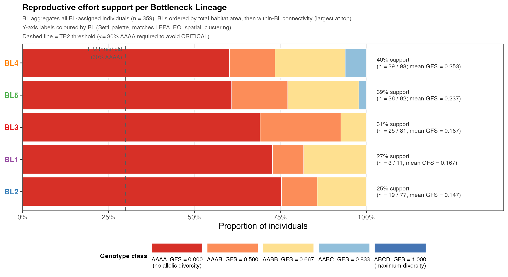

# SRK-Based Assessment of Self-Incompatibility in *Lepidium papilliferum* (LEPA)

## Executive Summary

**The conservation challenge.** *Lepidium papilliferum* (slickspot peppergrass; hereafter LEPA) is a self-incompatible (SI) tetraploid plant restricted to fragmented populations occupying slick spots in southwestern Idaho (USA) (Buerki et al., 2026). This report uses an SRK haplotype dataset of **367 individuals across 19 Element Occurrences** to ask: *what is the impact of habitat fragmentation and genetic drift on the species' SI system, and how can we design a genetically informed breeding programme to recover reproductive fitness?* The analysis is structured around seven sequential biological questions; each headline below summarises the answer to one of them.

**Habitat fragmentation has produced five independent bottleneck lineages.** Spatial-connectivity analysis (sibling repository [LEPA_EO_spatial_clustering](https://github.com/svenbuerki/LEPA_EO_spatial_clustering)) identifies **five independent bottleneck lineages (BL1–BL5)** across the species range with **no between-EO pollinator connections anywhere in the dataset**, establishing the demographic strata used throughout the report.

**LEPA's SI system remains functional species-wide, with one ecologically stressed exception.** Several severely bottlenecked SI plant species have been documented escaping SI through the evolution of self-compatibility (SC) — a short-term adaptive response that restores immediate reproductive output but typically incurs inbreeding depression, ultimately deepening rather than resolving the conservation concern. The current LEPA dataset shows **no evidence of species-wide SI escape**: only 8 of 401 ingroup individuals (2.0 %) carry the molecular signature of complete SI loss (every recovered SRK haplotype carries a premature stop codon). The signal is **sharply geographically concentrated — 5 of these 8 candidates are in EO76 (BL3)**, the population already independently flagged as the most ecologically degraded in the species (highest AAAA fraction, 0 AABC seed parents, and substantial invasive-species encroachment on the native slick spot habitat). This concentration suggests that the SI-escape signal reflects **localised ecological stress at the most degraded site rather than a species-wide SC transition** — a positive conservation finding: with managed crossing intervention, the SI system can still be supported across the rest of the species range, avoiding the inbreeding-depression trajectory that follows SC evolution in bottlenecked SI plants.

**Species S-allele richness is severely depleted, with one diversity reservoir.** 49 distinct S-alleles observed; Michaelis-Menten estimate = 59 (consensus across MM and Chao1 = 60). Per-BL richness varies dramatically: **BL4 retains 28 alleles (55 % — the diversity reservoir)** while BL1 and BL2 retain only 5 and 7 alleles respectively. **28 of 49 alleles (53 %) are private to a single BL** — direct empirical evidence of multiple independent founder events, not a single shared bottleneck.

**Drift has eroded population-level S-allele diversity, and the depleted populations differ in whether random mating is still demographically viable (TP1 — mating-pool functionality).** Step 15–16 erosion barplots establish severe depletion at both stratification levels (37–88 % allele loss per EO; ≥ 53 % per BL). The reframed TP1 then asks the demographic question directly via the **compatible-pair fraction** (P_compat — the fraction of random plant pairs that are cross-compatible under tetraploid sporophytic SI). The headline result is a single traffic-light figure ([Figure 14](#figure-14)): **EO70 (BL2) is the only RED population (random mating failed; bootstrap 95 % CI well below threshold), three EOs are AMBER (struggling), and EO25 and EO27 sit just at the GREEN threshold**. Recovery requires both informed breeding (within-EO managed crosses) — to make the most of the remaining diversity — and inter-BL allele transfers — to remove the diversity ceiling that bounds informed breeding. The complementary conservation-ranking view (compatible-pair fraction × Depletion Index, [Figure 14e](#figure-14e)) places each group on the breeding-strategy decision plane and confirms that every focal group except EO27 needs allele injection.

**Drift has degraded individual-level reproductive fitness to a critical level (Tipping Point 2).** All five BLs CRITICAL on TP2 (mean Genotypic Fitness Score < 0.667 AND > 30 % AAAA homozygotes). Allele_043 and Allele_046 (both members of Synonymy group 1) are pan-BL fixed in AAAA individuals — **convergent drift onto the same SI specificity despite independent bottlenecks**. **8 AABC individuals** species-wide carry the heterozygous-gamete potential needed for high-yield managed crossing — they are the immediate seed-parent priority.

**The mechanism is a self-reinforcing Compatibility Collapse Cascade driven by drift on a shared ancestral pool.** A **five-stage Compatibility Collapse Cascade (C3)** explains how habitat fragmentation produces 60 % reproductive dead-ends within a structurally intact SI system. Cross-Brassicaceae per-BL entropy decomposition reveals that the residue identities at LEPA hypervariable (HV) columns are **73 % LEPA-specific** (different from Brassica AND Arabidopsis dominant residues), confirming the convergent allele depletion is **drift on a shared LEPA ancestral pool**, not pan-Brassicaceae selection convergence.

**A 104-cross phased experimental plan converts sequence-based predictions into a validated functional S-allele table.** The plan (1 368 attempts) is structured around five nested hypotheses (H0 SI validation; H1a/H1b compatibility baselines; H2 synonymy bin boundaries; H3 hidden bins via heterozygous donors with paired controls). Outcomes feed into a **validated functional S-allele table** that informs operational seed-orchard design.

---

## Background

Self-incompatibility (SI) in *L. papilliferum* is controlled by the S-locus, where the extracellular S-domain of the S-receptor kinase (SRK) protein acts as the female determinant of pollen rejection. Each individual carries up to four allele copies (tetraploid), and compatible mating requires that pollen and pistil carry different SRK alleles. Throughout this report, each functionally distinct SRK protein variant is referred to as an **S-allele**, and the tetraploid combination of S-alleles an individual carries is its **genotype** (e.g., `AAAA`, `AABB`, `AABC`). Under balancing selection — specifically, negative frequency-dependent selection (NFDS) — all S-alleles are maintained at approximately equal frequencies, maximising the proportion of compatible mating pairs. In small or isolated populations, however, genetic drift counteracts balancing selection, reducing allele richness, skewing allele frequencies, and degrading individual genotype quality, with direct consequences for reproductive success.

A [**Data Quality Evaluation**](#data-quality-evaluation) — including the library-effect ruling, sample outcome categorisation, and lab-deliverable tables — is presented *first*, before any biological interpretation, because the trustworthiness of the dataset gates every downstream inference. The analysis then addresses seven sequential biological questions:

1. [**Q1 — How has habitat fragmentation produced demographic bottlenecks that shape the SRK self-incompatibility system in *L. papilliferum*?**](#q1-habitat-fragmentation-and-the-bottleneck-framework)
2. [**Q2 — Is the LEPA self-incompatibility system functional, or has the species transitioned to self-compatibility?**](#q2-is-the-lepa-si-system-functional)
3. [**Q3 — What is the S-allele richness of *L. papilliferum*, and how is it distributed across bottleneck lineages?**](#q3-species-s-allele-richness-and-bl-distribution)
4. [**Q4 — How has genetic drift eroded S-allele diversity within populations and lineages? (Tipping Point 1)**](#q4-genetic-drift-on-populations-s-allele-diversity-tp1)
5. [**Q5 — How has genetic drift degraded the reproductive fitness of individuals within populations and lineages? (Tipping Point 2)**](#q5-genetic-drift-on-individual-reproductive-fitness-tp2)
6. [**Q6 — What mechanism explains the convergent S-allele depletion observed across all five bottleneck lineages of *L. papilliferum*?**](#q6-mechanism-convergent-s-allele-depletion)
7. [**Q7 — How can S-allele specificity hypotheses be tested with controlled crosses to support a genetically informed breeding programme?**](#q7-cross-based-hypothesis-testing-for-informed-breeding)

The bioinformatic pipeline producing the underlying data is documented in [Bioinformatics_pipeline.md](Bioinformatics_pipeline.md). A complete methodological reference, including reproducible commands and parameter tables, is in [index.Rmd](https://svenbuerki.github.io/SRK_bioinformatics/).

---

## Data Quality Evaluation {#data-quality-evaluation}

The **Step 12c data-quality evaluation** below gates every downstream inference. Q1–Q7 draw on the 401 ingroup samples that survive it.

### Sampling overview

Before the per-category breakdown, Figure 0 places the successful samples on the species' landscape so the reader can see the geographic footprint of what has and what has *not* yet been collected. Of **367 successful ingroup samples**, 325 resolve to 17 populations in 16 Element Occurrences spanning all five bottleneck lineages; the remaining 10 samples come from 9 germplasm sub-codes in the "JAR region" whose coordinates are not in the spatial catalogue and so are not plotted. Per-BL counts: BL1 = 11 samples / 4 EOs / 4 Pops; BL2 = 77 / 2 / 2; BL3 = 81 / 4 / 4; BL4 = 98 / 2 / 2; BL5 = 92 / 4 / 5. The six focus EOs used in most downstream analyses (EO18, EO25, EO27, EO67, EO70, EO76; all N ≥ 5) are labelled in bold white-fill boxes.

 project's `EO_BL_geographic_context_map.png`. **Filled triangles** = populations successfully sampled by the SRK pipeline; **filled circles** = populations catalogued but not yet sampled. Both shapes are coloured by parent BL (locked Set1 palette) and sized by habitat area (ha). For each sampled EO, the EO code (with `n =` sample count) is placed on the *largest* sampled location — the convention for compound germplasm sub-codes that cannot be pinned to a specific sub-location. The 6 focus EOs (EO18, EO25, EO27, EO67, EO70, EO76) carry bold white-fill labels; other sampled EOs carry smaller plain labels. JAR-region samples (10 samples / 9 sub-codes with no resolved coordinates) are not plotted. Headline: **359 BL-resolved samples in 17 populations across 16 EOs + 8 JAR samples = 367 total successful samples**. Source: `figures/Phase3/step13b_sampling_map.png` produced by `SRK_sampling_map.R`.](figures/Phase3/step13b_sampling_map.png)

### Three sequential questions answered by the evaluation

1. **Is there a library effect impacting interpretation?** Tests for systematic technical bias across the ten Nanopore sequencing libraries.
2. **Which samples failed and need to be re-amplified or re-extracted?** Lab-actionable list of samples that need follow-up before further inference.
3. **Which samples have non-functional SRK proteins and may have escaped self-incompatibility?** Biologically informative candidates whose sequencing succeeded but produced no functional SRK protein.

### Library effect ruled out as confound

Three formal tests confirm that no systematic library bias contaminates the biological inferences:

- **Global Library × `SI_functional_status` (χ²):** χ² = 17.3, df = 18, **p = 0.50 (not significant).** The proportions of Functional / Partial_translation_failure / Complete_loss are statistically indistinguishable across libraries.
- **Within-EO Library 009 / Library 010 vs other libraries (Fisher's exact, n = 18 tests):** 0 significant differences for AAAA proportion, 0 significant differences for Complete_loss proportion. Samples from the same EO behave equivalently regardless of which library they came from.
- **Global Library × `Dominant_failure_mode` (χ²):** χ² = 51.9, df = 18, **p ≈ 4 × 10⁻⁵ (significant) — but in the favourable direction.** Library 010 (the only library processed through the full Step 4b + 7b filters) is enriched in `premature_stop` failures and depleted in `mixed`/`ambiguous_aa` failures, meaning its remaining failure signal is the biologically interpretable loss-of-function signature rather than data-quality noise. This favourable bias *strengthens* rather than undermines the SI-escape findings in Q5.

### Outcome categories for 401 ingroup samples

Every ingroup sample is assigned to one of five mutually exclusive outcome categories:

| Outcome category | n | % | Status |
|---|---:|---:|---|
| **Functional** | 181 | 45.1 % | included in dataset; SI system intact at the molecular level |
| **Partial_translation_failure** | 154 | 38.4 % | included in dataset. **NEUTRAL label — does NOT imply biological SI loss.** Most likely a technical artefact from chimeric Canu *de novo* assembly (spliced junctions introduce premature stops that inflate the failure denominator). Step 9's abundance filter (`min_count = 5`) excludes chimeric proteins from the numerator but not from `Total_sequences`. **The current dataset provides no tangible evidence supporting biological SI loss in this category** — no inference about SI status is made from this label alone. |
| **SI_escape_candidate** | 7 | 1.7 % | excluded from genotype data; all SRK sequences carry premature stop codons. Strong molecular candidate for ongoing self-compatibility evolution via loss-of-function mutations. **Detailed in Q5.** |
| **Re_PCR** | 44 | 11.0 % | excluded; existing DNA stock is fine, PCR product is the problem (no Canu assembly, fragmented amplicon, paralog amplification, N-rich short product, low yield, dirty product). Lab action: re-amplify SRK from existing DNA stock. |
| **Re_DNA_extraction** | 15 | 3.7 % | excluded; DNA stock itself contaminated (>4 distinct functional proteins per supposed tetraploid → mixed sample or barcode bleed-through). Lab action: re-isolate single-plant tissue and re-extract DNA before any further PCR. |

(Outgroup samples — *L. montanum*, 8 individuals — are intentional exclusions and not shown.)

### Per-Bottleneck-Lineage and per-Element-Occurrence distributions

### Curated tables for collaborators

The `Tables/` folder bundles the deliverables most often shared with downstream colleagues — lab follow-up, phenotyping, and modeling — so they can be downloaded directly without re-running the pipeline.

**Lab and phenotyping deliverables (Step 12c):**

- **[`Tables/Phase2/step12c_samples_redo.csv`](Tables/Phase2/step12c_samples_redo.csv)** — 59 samples for lab follow-up with a `Lab_action` column distinguishing **Re-PCR** (44 samples; existing DNA OK, re-amplify) from **Re-DNA-extraction** (15 samples; DNA contaminated, re-isolate tissue). Each row carries a stage-specific `Recommended_action` instruction.
- **[`Tables/Phase2/step12c_SI_escape_candidates.csv`](Tables/Phase2/step12c_SI_escape_candidates.csv)** — 7 candidates for controlled-selfing phenotyping; recommended protocol in the `Recommended_action` column.
- **[`Tables/Phase2/step12c_data_quality_categories.tsv`](Tables/Phase2/step12c_data_quality_categories.tsv)** — master per-sample categorisation (all 409 metadata samples) with full diagnostic columns.

**Modeling deliverables (genotyping outputs joinable to the population framework):**

- **[`Tables/Phase2/step11_individual_allele_genotypes.tsv`](Tables/Phase2/step11_individual_allele_genotypes.tsv)** — wide allele×individual count matrix (367 ingroup individuals × 49 alleles; integer copy counts). Ready-to-use design matrix for allele frequency estimation, drift/erosion modeling, and forward simulations.
- **[`Tables/Phase2/step12_individual_zygosity.tsv`](Tables/Phase2/step12_individual_zygosity.tsv)** — per-individual genotype summary (`N_distinct_alleles`, `N_total_proteins`, `Zygosity`, `Genotype`, packed `Allele_composition` string). Human-readable companion to the wide matrix.
- **[`Tables/Phase4/step22b_synonymy_groups.csv`](Tables/Phase4/step22b_synonymy_groups.csv)** — allele → synonymy group mapping (8 synonymy groups + 19 isolated → 27 effective bins) for collapsing putatively identical alleles in functional analyses (Step 22b).
- **[`Tables/sampling_metadata.csv`](Tables/sampling_metadata.csv)** — sample → population key (`SampleID`, `Pop`, `EO_w_sub`, `Ingroup` flag, `OccurrenceID`). Joins the genotyping tables above to the spatial framework via `EO_w_sub` → EO → `Tables/EO_group_BL_summary.csv` → BL + Drift_index.
- **[`Tables/EO_group_BL_summary.csv`](Tables/EO_group_BL_summary.csv)** — EO → geographic group → bottleneck lineage (BL1–BL5) → drift index cross-reference, mirrored from the sibling [LEPA_EO_spatial_clustering](https://github.com/svenbuerki/LEPA_EO_spatial_clustering) repository.

### Take-home for the rest of the report

Across the dataset's seven biological questions, the data-quality footing is solid: no library effect confounds the analyses, only ~15 % of samples are flagged for re-PCR/re-extraction (44 + 15 = 59 of 401 metadata samples), and the 8 SI-escape candidates (Q2) are robust to library identity. The 38 % Partial_translation_failure category is uncertain and not interpreted biologically. The 49 observed S-alleles in 367 ingroup individuals (Q3) and all subsequent population-genetic analyses (Q4–Q7) are based on samples that pass this quality gate.

---

## Q1 — Habitat fragmentation and the bottleneck framework {#q1-habitat-fragmentation-and-the-bottleneck-framework}

### Why this question matters

Drift acts within demographically isolated populations. Q1 establishes the spatial strata used throughout the rest of the report.

### Method

The spatial-connectivity analysis was performed in the sibling repository [**LEPA_EO_spatial_clustering**](https://github.com/svenbuerki/LEPA_EO_spatial_clustering): convex-hull polygons from 758 georeferenced collection events across 39 locations in 19 EOs; pollinator-distance partitioning at 500 m; Ward's D2 hierarchical clustering of 32 resulting group centroids; silhouette-optimal k = 5 (score = 0.73) → **five independent bottleneck lineages BL1–BL5** ([Figure 4](#figure-4)). [Figure 3](#figure-3) overviews the species range; [Figure 5](#figure-5) overlays the BL stratification onto it; [Figure 6](#figure-6) shows per-BL drift intensity via the area-derived Drift Index (DI = 0 weak drift; DI = 1 strong drift). The BL × group × EO cross-reference (`tables/EO_group_BL_summary.csv`) feeds Step 13 of the SRK pipeline, which writes per-individual BL assignments consumed by every downstream analysis.

![Figure 3: Context-first geographic overview of all 39 sampling locations across the species range, plotted in a single neutral colour before any bottleneck-lineage stratification is introduced. Points are sized by census population size (fertile + vegetative); the ten largest populations are labelled with EO code, internal location ID, and census size using the same white-fill label style as Figure 6 (BL drift panels), so the same populations can be tracked across figures. Topographic background is a DEM (AWS Terrain Tiles via `elevatr`, ~500 m resolution) rendered with a warm sepia ramp; the Snake River centreline (Natural Earth, scale 10) appears as a blue line; reference cities (Boise, Mountain Home, Glenns Ferry, New Plymouth) are marked with black squares. **Population locations are not accurately represented in this figure:** *L. papilliferum* is a federally threatened species and exact coordinates are confidential. Source: `EO_geographic_overview_map.png` from the [LEPA_EO_spatial_clustering](https://github.com/svenbuerki/LEPA_EO_spatial_clustering) repository.](figures/EO_geographic_overview_map.png)

![Figure 4: Ward's D2 hierarchical clustering of the 32 geographic groups (across 19 EOs of *L. papilliferum*) partitions the species into five independent bottleneck lineages (BL1–BL5; silhouette-optimal k = 5; silhouette score = 0.73). Lower strip: per-group drift index (red = strong drift / DI > 0.75; blue = weak drift / DI < 0.5). Bottom strip: census size N per group. Set1 palette matches the BL colour scheme used throughout this report. Source: `EO_clustering_dendrogram.png` from the [LEPA_EO_spatial_clustering](https://github.com/svenbuerki/LEPA_EO_spatial_clustering) repository.](figures/EO_clustering_dendrogram.png)

![Figure 5: Single-panel BL geographic context map showing all five bottleneck lineages simultaneously. Dashed coloured envelopes are BL-level convex hulls (the geographic footprint of every location within a lineage); filled coloured hulls are group-level convex hulls (locations connected within the 500 m pollinator threshold); points are sampling locations sized by census population size, filled with the parent BL colour (the same Set1 palette used in Figure 4). Topographic background, Snake River, and reference cities are identical to Figure 3 so the same landscape can be compared with and without the BL stratification. **Population locations are not accurately represented** — see Figure 3 caveat. Source: `EO_BL_geographic_context_map.png` from the [LEPA_EO_spatial_clustering](https://github.com/svenbuerki/LEPA_EO_spatial_clustering) repository.](figures/EO_BL_geographic_context_map.png)

![Figure 6: Predicted genetic drift intensity across the five independent bottleneck lineages of *L. papilliferum*. Five panels, one per BL, arranged 2 rows × 3 columns and **ordered by total habitat area, then within-BL connectivity** (largest at top-left): top row (BL4, BL5, BL3) holds the three largest lineages, bottom row (BL1, BL2) holds the two smallest. Area is the primary *Ne* proxy; connectivity is the secondary tie-break. Within each panel, solid coloured edges indicate within-BL connected pairs (≤ 500 m, within pollinator range); solid grey lines mark near-miss pairs (> 500 m to ≤ 2 km, no gene flow); dashed grey lines show the shortest distance > 2 km between isolated populations. Node fill encodes drift index on the blue (DI = 0, weak drift) → white → red (DI = 1, strong drift) gradient. Node size encodes census population size; node shape (diamond = connected, circle = isolated) distinguishes locations with at least one neighbour within 500 m from fully isolated locations. The largest populations carry the same EO code / location ID / census size labels as in Figure 3 so individual locations can be tracked across figures. Source: `EO_BL_drift_panel.png` from the [LEPA_EO_spatial_clustering](https://github.com/svenbuerki/LEPA_EO_spatial_clustering) repository.](figures/EO_BL_drift_panel.png)

### Bottleneck-lineage membership and SRK sample sizes

(359 of 367 BL-assigned ingroup individuals; 10 germplasm sub-codes remain Unassigned and contribute only to species-level baselines.)

| BL  | N geographic groups | N locations | N EOs | N individuals (SRK) | N alleles observed | % of 49-allele species pool retained |
|-----|--------------------:|------------:|------:|--------------------:|-------------------:|-------------------------------------:|
| BL1 | 10                  | 12          | 4     | 5                   | 4                  | 8 %                                  |
| BL2 | 2                   | 2           | 2     | 59                  | 8                  | 16 %                                 |
| BL3 | 4                   | 4           | 4     | 80                  | 17                 | 35 %                                 |
| BL4 | 7                   | 8           | 4     | 89                  | **27**             | **55 %**                             |
| BL5 | 9                   | 13          | 5     | 92                  | 23                 | 47 %                                 |

### Key findings

- **Connectivity:** of 741 pairwise location comparisons, only 7 pairs (0.9 %) are connected within the 500 m pollinator dispersal threshold — and **all 7 are within the same EO**. There are *no between-EO pollinator connections anywhere in the dataset* under current conditions: every EO is a closed demographic unit at the pollination scale.
- **Habitat footprint:** ≈ 84 % of the 32 geographic groups occupy < 1 ha (DI > 0.95), placing the vast majority of locations in the extreme-drift regime. Only EO27 group 11 (19.6 ha, DI = 0.000), EO32 (14.6 ha), and EO18 (8.1 ha as a fully-connected 5-location chain) escape extreme spatial drift.
- **Five lineages, independent histories:** the BL framework provides three analytical advantages — it rescues 21 small localities (n = 1–3 each) that cannot support EO-level statistics on their own; it allows direct empirical testing of the independent-bottleneck hypothesis (confirmed in Q4 by allele-sharing analyses); and it preserves the full 367-individual species pool for any species-level baseline by stratifying only at the population/lineage level.

### SRK corroboration of the BL framework

The five bottleneck lineages were defined from pollinator-connectivity geography alone (Ward's D2 clustering of group centroids under a 500 m threshold), without any reference to SRK genotype. Because the *S*-locus evolves independently of the geographic clustering criterion, the SRK genotype data offer an out-of-sample test of the BL stratification — and the data produce a clear independent-bottleneck signature (full UpSet decomposition in [Figure 15](#figure-15)):

- **More than half of the species' S-allele pool is BL-private.** Of the 49 observed S-alleles, **26 (53 %) are present in exactly one BL**: 10 in BL4, 8 in BL3, 6 in BL5, 2 in BL2, 0 in BL1. Under a single shared bottleneck this fraction would be expected to approach zero; under genuinely independent bottlenecks each lineage stochastically retains and loses a different subset of the ancestral pool, producing exactly this private-allele excess.
- **BL-private counts scale with BL sample size.** The two largest lineages (BL4 n = 89, BL5 n = 92) carry the most private alleles (10 and 6); the smallest (BL1 n = 5) carries none. This is the expected drift-detection floor — small lineages cannot statistically resolve private alleles even when they exist — and it argues that the BL1 zero is a sampling artefact rather than evidence against BL1's independence.
- **The pairwise sharing signal tracks geographic distance.** BL4 and BL5, the two geographically closest lineages (~15 km between nearest hulls), share the largest pairwise S-allele pool (7 alleles unique to the BL4+BL5 pair, plus the 2 pan-BL alleles = 9 alleles in common). Every other BL pair shares ≤ 2 alleles exclusively. The S-locus has no mechanistic reason to recapitulate the geographic gradient unless the gradient reflects real demographic structure — so this concordance reinforces the spatial framework rather than confounding it.
- **Only 2 alleles are pan-BL (Allele_043, Allele_046; HV-identical, Synonymy group 1).** A species under a single recent species-wide bottleneck would still share most of its surviving alleles across all subpopulations; the near-complete privatisation observed here is the signature of bottlenecks acting independently in each lineage long enough for drift to purge nearly the entire shared pool.

Taken together these four observations corroborate the BL stratification at a level the spatial analysis cannot: the bottlenecks are not just *geographically* independent (500 m pollinator-connectivity criterion) but also *genealogically* independent at the S-locus, the marker most resistant to losing shared variation under balancing selection.

The locked Set1 palette (BL1 purple `#984EA3`, BL2 blue `#377EB8`, BL3 red `#E41A1C`, BL4 orange `#FF7F00`, BL5 green `#4DAF4A`) and the area-driven BL ordering (**BL4, BL5, BL3, BL1, BL2**) are centralised in `srk_bl_constants.{R,py}` and used by every BL-stratified figure in this report.

---

## Q2 — Is the LEPA SI system functional? {#q2-is-the-lepa-si-system-functional}

### Why this question matters

Several severely bottlenecked SI plant species have been documented evolving self-compatibility (SC) as a short-term adaptive response that ultimately deepens the conservation concern via inbreeding depression. If LEPA had transitioned to species-wide SC, the breeding-programme design would shift fundamentally. Q2 therefore *gates* the rest of the report.

### Method

Step 12c categorises every sample by its molecular SI status: **Functional** (≥ 50 % of recovered SRK haplotypes translate into a valid protein), **Partial_translation_failure** (mixed; neutral label — chimeric Canu assembly inflates this category and no biological inference is drawn), or **Complete_loss** (zero functional proteins despite successful sequencing). The `Complete_loss + premature_stop` combination is the defensible molecular signature of ongoing SC evolution — every recovered haplotype must independently carry a stop, a pattern not easily explained by chimerism.

### Key findings — SI is functional in LEPA, with a sharply localised exception

Of **378 ingroup individuals** that reached Step 9 translation, the per-BL and per-EO outcome-category distributions ([Figure 1](#figure-1) and [Figure 2](#figure-2)) show that the molecular SI machinery is **broadly intact across the species**:

- **181 individuals (45 %) are Functional** — SI system intact at the molecular level.
- **154 individuals (38 %) are Partial_translation_failure** — most likely a technical artefact from chimeric Canu assembly, *not* biological SI loss; **no biological inference is made from this label**. See Data Quality Evaluation for the full caveat.
- **7 individuals (1.7 %) are SI_escape candidates** — the only category that supports a defensible biological interpretation of SI loss. These individuals carry premature stops in every recovered SRK haplotype.
- The remaining **59 individuals (15 %) are flagged for lab follow-up** (44 Re_PCR + 15 Re_DNA_extraction) — technical recoverable failures, not biological signal.

**The geographic distribution of the 8 SI-escape candidates is the headline finding.** Five of the 7 cluster in **EO76 (BL3)** ([Figure 2](#figure-2)), the population already independently flagged in the spatial analysis as the most ecologically degraded — highest invasive-species encroachment, smallest residual native habitat, and (as we will see in Q5) the highest AAAA fraction with zero AABC seed parents. The remaining 2 candidates are isolated cases (1 in EO70/BL2, 1 in a germplasm sub-code with no BL placement).

This pattern strongly implies **localised SI breakdown at the most ecologically stressed site**, not a species-wide SC transition. **The species-level SI system can therefore still be supported by managed crossing intervention** (Q7), avoiding the inbreeding-depression trajectory documented in other bottlenecked SI plants that have transitioned to SC.

### Conservation implications

| If LEPA had transitioned to SC | Current evidence: SI remains functional |
|---|---|
| Inbreeding depression detection would become the central metric | Allele richness restoration (Q4) and reproductive fitness (Q5) remain the central metrics |
| Breeding design would minimise self-fertilisation lineages | Breeding design maximises compatible cross diversity |
| Within-EO recovery via census growth would risk progeny fitness loss | Within-EO census growth is unproblematic if accompanied by inter-BL allele transfers |
| Long-term evolutionary trajectory: rapid genetic erosion via selfing | Long-term evolutionary trajectory: balancing-selection-mediated diversity recovery is achievable |

The 8 SI-escape candidates are flagged for follow-up phenotyping in [`Tables/Phase2/step12c_SI_escape_candidates.csv`](Tables/Phase2/step12c_SI_escape_candidates.csv) (controlled selfing tests). If those tests confirm self-compatibility — and especially if the EO76 cluster proves to be a population-wide SC transition rather than 5 independent rare events — the recommendations below would need revisiting for that population specifically.

### Per-individual SI / pSI / SC reconstruction (Step 25)

A sharper per-individual SI status is obtained by distinguishing real broken alleles from chimeric Canu artefacts before counting against the tetraploid four-copy expectation.

**Method (Steps 25a + 25b).** Step 25a (`SRK_null_allele_assignment.py`) aligns every Step-7 `REMOVED` haplotype's AA sequence to the 49 canonical functional allele representatives and assigns it to its nearest allele by AA p-distance; high confidence = `AA_distance ≤ 0.005` AND `n_stops ≤ 3`, medium = `AA_distance ≤ 0.05` AND `n_stops ≤ 10`, low = chimeric. Step 25b (`SRK_individual_SI_status.py`) counts only high+medium-confidence broken haplotypes:

    n_total              = n_haps_OK + n_haps_REMOVED_real
    copies_nonfunctional = round(4 × n_haps_REMOVED_real / n_total)
    SI_status:
      SI                copies_NF == 0   OR   n_REMOVED_real < 2
      pSI               1 ≤ copies_NF ≤ 3   AND   n_REMOVED_real ≥ 2
                        (pSI_confidence: high if frac_NF ≥ 0.25, low otherwise)
      SC                copies_NF == 4
      Insufficient_data n_total < 4

Chimeric REMOVED haplotypes are recorded separately (`n_haps_chimeric`) as a data-quality metric but excluded from the SI-status calculation.

**Species-level snapshot (n = 401 ingroup):**

| `SI_status` | n | % |
|---|---:|---:|
| **SI** | **247** | **61.6 %** |
| pSI · high confidence (frac_NF ≥ 0.25) | 10 | 2.5 % |
| pSI · low confidence (frac_NF < 0.25) | 5 | 1.2 % |
| **SC** | **1** | **0.2 %** |
| Insufficient_data (n_total < 4) | 138 | 34.4 % |

**The species-level SI machinery is broadly intact: 62 % of ingroup individuals carry a fully functional tetraploid SRK locus.** 15 individuals (3.7 %) carry one or more confirmed broken SRK alleles (pSI). A single individual (`Library010_barcode53`, EO76 / BL3) carries four confirmed broken alleles with no recoverable functional protein — the only molecularly-confirmed SC individual in the dataset. The 138 Insufficient_data individuals have under four readable haplotypes and are flagged in `Tables/Phase5/step26_samples_for_redo.tsv` for re-sequencing; they are heavily concentrated in EO76 (n = 56), which explains why this population dominates the redo list.

**EO76 (BL3) remains the SI → SC transitional hotspot.** It contains the single confirmed SC individual plus 56 samples whose SRK status cannot be read from the current data — a strong signal that something is going wrong with this population's SRK locus, even if the chimeric-noise budget prevents a confident pSI/SC call for most of them. Every other focal EO is dominated by SI (EO18 37/42, EO25 30/54, EO27 40/68, EO67 32/39, EO70 42/65).

### Step 26 — null-aware genotype matrix

For each pSI · high individual, the canonical genotype matrix entries are rescaled to `copies_functional` slots and the remaining slots are filled with `Allele_NULL`. The single SC individual carries `Allele_NULL × 4`. pSI · low individuals are conservatively treated as SI (signal too dilute to commit nulls). Insufficient_data individuals are written to the redo list. Outputs: `SRK_individual_allele_genotypes_with_nulls.tsv` + `SRK_individual_zygosity_with_nulls.tsv`. The null-aware matrix is consumed by Steps 14b / 17b / 19b+20b (null-aware companions to the canonical Phase-3 outputs in Q3–Q5).

### Step 27 — forward-time inheritance simulator

`SRK_inheritance_simulator.py` is a tetraploid Wright–Fisher simulator (100 generations × 30 replicates, μ = 1 × 10⁻⁴ per copy per generation, s = 0.5, δ = 0.5; tetrasomic gametogenesis α = 0.10; sporophytic SI rejection where NULL alleles never reject; SC individuals self at rate *s* with selfed-offspring fitness 1 − δ) that projects each BL forward from its empirical Step 26 initial state under four scenarios: **baseline** (no migration), **rescue_low** (m = 0.001), **rescue_high** (m = 0.01), **high_drift** (Ne × 0.5).

**Median generations to 50 % SC frequency per BL:**

| Scenario | BL5 | BL4 | BL3 | BL2 | BL1 |
|---|---:|---:|---:|---:|---:|
| baseline | 62 | 66 | 41 | 26 | > 100 |
| rescue_low | > 100 | 63 | 45 | 32 | 50 |
| rescue_high | > 100 | 72 | 54 | 41 | 13 |
| high_drift | > 100 | 94 | 41 | 65 | > 100 |

**Readings.** (1) Erosion operates on a multi-decade-to-century timescale, not a generational one — BL2 fastest (~26 gens), larger BLs 40 – 65. (2) BL1 (n = 7) is dominated by stochasticity and should be read as high-variance, low-confidence. (3) Migration is not a uniform rescue — donor BLs carry a small but non-zero broken-allele frequency that drifts in with each migrant. **The simulator-endorsed rescue lever is targeted SI-mother / SI-father crosses** (Step 22e plan filtered through the Step 25 SI table), not random gene flow.

![Figure 6a: Per-individual SI system status at the species level — robust subset (n = 258: SI + pSI + SC; drops Insufficient_data). Bars show SI / pSI · high / pSI · low / SC. **The species is dominated by SI** (247 / 95.7 % of the robust subset); pSI is 15 / 5.8 %; SC is 1 / 0.4 %. The companion side panel restates the same counts with category labels. The single SC individual is `Library010_barcode53` in EO76 / BL3. Source: `figures/Phase5/step25b_SI_status_species_robust.png` produced by `SRK_SI_status_figures.R`. A full-dataset variant (`SRK_SI_status_species_full.png`) shows the Insufficient_data and chimera tiers for QC use.](figures/Phase5/step25b_SI_status_species_robust.png)

![Figure 6d: Projected per-copy broken-allele frequency (p_NULL) trajectories per BL under four scenarios. Thin lines = individual replicate trajectories (n = 30 reps per scenario per BL); bold lines = median trajectory across replicates. Initial state = empirical Step 26 per-BL genotypes. **Larger BLs (BL3, BL4, BL5) drift slowly upward but most replicates stay below p_NULL = 0.5 within 100 generations.** BL1 (n = 7) shows the widest replicate spread — drift dominates at small N. Source: `figures/Phase5/step27_inheritance_pNULL_trajectories.png`.](figures/Phase5/step27_inheritance_pNULL_trajectories.png)

### Conservation take-home for Q2

The molecular SI machinery is broadly intact across the species. One individual is confirmed SC, in EO76 / BL3, where 56 additional samples have unreadable SRK status and need re-sequencing. The 15 pSI individuals are distributed across all five BLs at low frequency. Under simulated drift the erosion trajectory exists but operates on a multi-decade-to-century timescale, not a generational one — and passive migration is not a uniform rescue. **The conservation strategy is informed by Step 25 in two specific ways:** (i) the 7 phenotyping candidates in `SRK_SI_escape_candidates.csv` retain priority status for controlled-selfing tests, especially the 5 individuals in EO76; (ii) the Step 22e cross plan should preferentially select SI mothers and fathers from the per-individual SI status table to avoid propagating the small pSI signal into the breeding population.

![Figure 6a (robust): Per-individual SI system status at the species level — **robust subset** (n = 254 ingroup individuals: SI + pSI · high confidence + SC; drops 124 Insufficient_data and 23 pSI · low confidence). 5-tier pSI-severity breakdown: **SI** (37 / 14.6 %, 4 functional), **pSI · 1 NF copy** (63 / 24.8 %), **pSI · 2 NF copies** (**110 / 43.3 %, modal class**), **pSI · 3 NF copies** (36 / 14.2 %), **SC** (8 / 3.1 %). **Only ~15 % of robustly-called individuals carry a fully intact SI system; the most common state is "two of four SRK copies broken"** — the species sits midway along the SI → SC erosion axis. Source: `figures/Phase5/step25b_SI_status_species_robust.png` produced by `SRK_SI_status_figures.R` (Step 25). A 7-tier full-dataset variant (`SRK_SI_status_species_full.png`) shows the same data plus the Insufficient_data and pSI_low tiers for QC purposes.](figures/Phase5/step25b_SI_status_species_robust.png)

![Figure 6b (robust): SI status by Bottleneck Lineage — **robust subset only**. Stacked bars show the 5-tier pSI severity breakdown, BLs ordered by total habitat area (Ne proxy). Per-BL N after dropping Insufficient_data + pSI_low: BL4=71, BL5=68, BL3=44, BL1=7, BL2=52. **Per-BL per-copy break probability p̂** (fitted by Bin(4, p) — see model below): BL5=0.39, BL4=0.40, BL3=0.44, BL2=0.44, BL1=0.57. **BL1 (smallest habitat, highest p̂) carries 2 of 7 individuals as SC** (29 %) and **0 SI** — the most advanced position on the SI → SC erosion axis. BL3 has SC concentrated in EO76 (3 of 44). BL4/BL5 host the bulk of pSI individuals. Source: `figures/Phase5/step25b_SI_status_by_BL_robust.png`.](figures/Phase5/step25b_SI_status_by_BL_robust.png)

![Figure 6c (robust): SI status by focal Element Occurrence — robust subset only — faceted by parent BL with within-BL ordering by ascending drift index. **Per-EO per-copy break probability p̂** for focal EOs with n ≥ 15 (sample sizes after dropping Insufficient_data + pSI_low): EO25 (BL5, n=28) p̂ = **0.29** (the only focal EO < 0.4 — mildest); EO27 (BL4, n=40) p̂ = 0.36; EO70 (BL2, n=49) p̂ = 0.43; EO76 (BL3, n=39) p̂ = 0.44; EO67 (BL4, n=31) p̂ = 0.45; EO18 (BL5, n=37) p̂ = **0.48** (highest — most advanced erosion). **EO76 alone combines 3 SC + 7 pSI · 3 NF (10 individuals one step from SC in a single population) — the leading SI → SC transitional population.** **EO29 (BL1, n=3, small sample)** sits at 67 % SC. Source: `figures/Phase5/step25b_SI_status_by_EO_robust.png`.](figures/Phase5/step25b_SI_status_by_EO_robust.png)

---

## Q3 — Species S-allele richness and BL distribution {#q3-species-s-allele-richness-and-bl-distribution}

### Why this question matters

The species-level S-allele pool approximates the balancing-selection equilibrium and is the reference baseline against which all population-level deficits in Q4 and Q5 are measured. Per-BL stratification tests the independent-bottleneck hypothesis directly: independent bottlenecks predict largely private allele sets; a single shared species-level bottleneck does not.

### Method

S-alleles are defined by distance-based clustering of validated SRK protein sequences on the S-domain ectodomain (Step 10). Kneedle elbow detection on the sensitivity curve picks N = 55 alleles at p-distance ≈ 0.0055 ([Figure 7](#figure-7)). The AA-frequency heatmap of 172 variable positions ([Figure 8](#figure-8)) confirms the bins correspond to discrete residue patterns, not noise. Each bin is a **sequence-based hypothesis** of SI-recognition specificity; the hypothesis is tested by the cross plan in Q7. Accumulation curves are then fit at species and BL level (rarefaction + Michaelis-Menten / Chao1 / iNEXT). After Step 11's ingroup filter, the 58 bins reduce to **49 alleles observed in the genotyped dataset**.

![Figure 7: SRK S-allele clustering calibration and pairwise distance structure (`define_SRK_alleles_from_distance.py`). Sensitivity curve (number of alleles called as a function of p-distance threshold) plus pairwise p-distance heatmap of the 349 functional proteins on the S-domain (cols 31–430), with rows/columns ordered by allele cluster. The Kneedle elbow at threshold ≈ 0.0055 fixes N = 55 alleles; the block-diagonal structure of the heatmap confirms tight within-cluster distances and a clear between-cluster gap. One allele (Allele_055, Class II) is separated from all others by a much larger distance, visible as a distinct outlying row/column.](figures/Phase2/step10a_protein_distance_analysis.png)

![Figure 8: Amino-acid frequency heatmap at the 172 variable positions in the SRK protein alignment (`SRK_AA_mutation_heatmap.py`). Each row is one of the 20 amino acids; each column is one variable alignment position (entropy > 0, gap fraction < 20 %). Cell colour intensity encodes the frequency of that AA at that position across the 349 functional proteins. Variable positions are **structured** — at most positions only 2–4 amino acids dominate, and the residue identities cluster physicochemically. This pattern supports the interpretation that the 58 sequence-defined bins correspond to distinct functional specificities rather than arbitrary sequence variants.](figures/Phase2/step10b_AA_frequency_heatmap.png)

![Figure 9: Species-level S-allele accumulation. Left: stacked bar decomposing the species Michaelis-Menten (MM) ceiling into observed alleles (dark blue, 49) and predicted-undetected alleles (light blue, +10 = MM − observed); the colour key matches the BL and EO drift-erosion bars so the species, BL, and EO panels can be read together. Right: rarefaction curve sharing the bar's y-axis, with MM = 59 and Chao1 = 54 reference lines. The curve has not yet reached an asymptote, indicating that further sampling would still discover additional alleles. The MM consensus estimate of 59 (60 with Chao1) is adopted as the species optimum.](figures/Phase3/step15_allele_accumulation_species.png)

![Figure 11: S-allele accumulation curves per Element Occurrence (focus EOs with N ≥ 5). EO curves are coloured by their parent BL using the locked Set1 palette so each EO can be visually placed within its lineage of origin. End-of-curve labels show `EOXX (observed/MM)` for each EO. Within each BL, EOs that climb above the parent-BL aggregate curve are accumulating diversity faster than the lineage average; EOs that flatten early indicate locally severe drift. Provides the within-BL counterpart to Figure 10 — useful for choosing which EO in each BL is the best maternal source for inter-BL transfers in Q7.](figures/Phase3/step15_allele_accumulation_combined.png)

### Key findings

Across **367 individuals** sampled from 26 population localities, **49 distinct S-allele bins** were identified ([Figure 9](#figure-9)). Three asymptote estimators agree on the upper end:

| Estimator | Predicted species richness |
|-----------|---------------------------|
| Michaelis-Menten (MM) | **59 alleles** |
| Chao1 | 61 alleles |
| Consensus (mean of MM + Chao1) | 60 alleles |

The MM estimate of 59 alleles (consensus 60) is adopted as the species optimum — the allele richness expected under balancing selection at evolutionary equilibrium, used as the reference baseline for Q4 and Q5. An additional ~93 individuals would need to be sampled to discover the next new allele. The species SI repertoire remains substantially under-characterised.

**BL stratification reveals the diversity reservoir.** When the same individuals are partitioned into the five independent bottleneck lineages (Q1), S-allele richness varies dramatically across lineages despite comparable sampling effort ([Figure 10](#figure-10); see Q1 table for sample sizes):

- **BL4 acts as the diversity reservoir of the species** — its 89 individuals retain 27 of the 49 observed alleles (55 %), and its lineage-level MM asymptote (37) approaches the species pool (59). Further sampling within BL4 would still discover many additional alleles.
- The four other BLs have each collapsed to a fraction of their lineage-level potential: BL1 retains 4 alleles (8 %) and BL2 retains 8 (16 %); BL3 and BL5 retain 17 and 23 alleles respectively (35–47 %).
- The > 5-fold gradient of richness loss across BLs (BL1: 4 alleles → BL4: 27) can only arise if **the bottlenecks operating in each lineage have proceeded independently**: a single shared species-level bottleneck would predict comparable richness loss across BLs.

This independent-bottleneck signature is reinforced by the allele-sharing analyses in Q4.

### Linking Q3 → Q7: from sequence-based bins to validated functional specificities

The 55 alleles called here (49 observed in the ingroup dataset) are **sequence-based hypotheses about functional SI specificity**, not validated functional alleles. Two proteins clustered into the same allele bin (Figs 3–4) are *predicted* to share recognition specificity because they share residue identity at every variable position — but until they are tested against each other in a controlled cross, that prediction remains a hypothesis. Conversely, two proteins in different bins are *predicted* to be functionally distinct, but the threshold (p-distance > 0.0055) is itself an empirical compromise, not a biological certainty.

[Q7 — Cross-based hypothesis testing for informed breeding](#q7-cross-based-hypothesis-testing-for-informed-breeding) builds the experimental framework that converts these sequence-based predictions into validated functional alleles. Specifically, Step 22b ([Figure 25](#figure-25)) re-computes pairwise distances on the **66 canonical hypervariable (HV) columns** (a subset of the 172 variable positions in Fig 4 that determine SI specificity per the C3 mechanism in Q6) and identifies **synonymy groups** — clusters of alleles that are HV-identical and therefore strong candidates for being functionally equivalent. The synonymy-test network ([Figure 26](#figure-26)) then identifies the pairwise distances most worth interrogating experimentally. The Step 22e cross plan (104 crosses, 1 368 attempts; [Figure 27](#figure-27)) tests these in a phased H0 → H3 protocol; outcomes update the 58 sequence-based bins into a **validated functional S-allele table** that supersedes the sequence-only definitions used in Q3–Q6.

---

## Q4 — Genetic drift on populations' S-allele diversity (TP1) {#q4-genetic-drift-on-populations-s-allele-diversity-tp1}

### Why this question matters

Drift erodes the SI system along two distinct trajectories: it **depletes** the species-level allele pool, and it **skews** the surviving frequencies away from the NFDS equal-frequency expectation. The conservation-relevant question is not whether depletion has occurred but **whether the depleted population is still demographically functioning, and if not what intervention the data support**.

### Method — two layers of evidence

**Layer 1 — depletion (Steps 15–16 erosion barplots).** For each BL and each EO, the deficit against the ~58-allele species optimum is partitioned into "predicted but not yet detected" (light blue; group-MM − observed) and "lost to drift" (red; species-MM − group-MM). Figures 12 and 13 visualise the partition; the red component dominates at both stratification levels.

**Layer 2 — mating-pool functionality (Step 17 TP1 metric).** For each EO (N ≥ 15) and each BL aggregate, the full tetraploid genotype is inferred for every individual and the following metrics computed:

- **`P_compat`** — the **compatible-pair fraction**: the fraction of randomly drawn plant pairs that are cross-compatible under tetraploid sporophytic SI (pollen rejected if any of its 2 alleles matches any of the stigma's 4). Computed exactly under multinomial allele sampling. P_compat is reported at a leakage ladder L ∈ {0, 0.10, 0.25, 0.50}.
- **`DI` (Depletion Index)** = `1 − k_group / k_species` (k_species = 59 from MM consensus). DI = 0 at species equilibrium; DI = 1 with no alleles retained. Two flavours: `DI_observed` uses sample-size-corrected `k_rarefied30` (conservative); `DI_predicted` uses the per-group MM asymptote (upper bound on what existing sampling could recover).
- **`L̂_from_AAAA = prop_AAAA / 3.5`** — empirical upper bound on historical SI leakage.

**Quadrant mapping (axes: J × P_compat; thresholds: J = 0.80, P_compat = 0.40):**

| Region | Reading | Conservation intervention |
|---|---|---|
| top-right | functioning even at depletion | **MONITOR** + augment for sustainability |
| top-left | mating works despite skew | **AUGMENT** to restore evenness |
| bottom-right | even but too few alleles | **AUGMENT URGENTLY** |
| bottom-left | depleted and skewed | **BIOBANK + RESTORE** |

A complementary χ² goodness-of-fit test against the equal-frequency NFDS expectation is also computed per group; with N this large, even modest deviations from uniform 1/k are highly significant — evenness J is the practical interpretive measure.

**Caveat — inheritance mode.** The P_compat formula assumes tetrasomic inheritance (random pairing across all four chromosomes). If LEPA's SRK locus shows disomic inheritance (two homoeologous subgenomes segregating independently), the system would behave more like two superimposed diploid SI systems and be more permissive; current P_compat values are then a conservative lower bound.

### Key findings — Layer 1: depletion is severe at every level

![Figure 12: S-allele erosion by genetic drift per Bottleneck Lineage. For each BL, the bar height represents the species optimum (~55 alleles); segments decompose this into observed alleles (dark blue), predicted-undetected alleles (light blue, group-MM minus observed), and alleles lost to genetic drift (red, species-MM minus group-MM). The BL color strip below the bars matches the lineage palette used elsewhere in the report. BL4 retains the most alleles (28, 57 % of species pool) but still shows substantial drift loss; BL1 and BL2 have retained only 4 and 8 alleles respectively.](figures/Phase3/step15_allele_accumulation_BL_drift_erosion.png)

**Per-BL drift loss** ranges from ~53 % (BL4, the diversity reservoir, 27 of ~58) to ≥ 84 % (BL1: 4 alleles; BL2: 8). The > 5-fold gradient of richness loss across BLs is the **independent-bottleneck signature** documented in Q3: a single shared species-level bottleneck would predict comparable richness loss across BLs.

**Per-EO drift loss** ranges from ~37 % (EO27, the least eroded; 21 alleles) to ~88 % (EO70, the most eroded; 6 alleles). Even in EO27 the majority of the species-level S-allele bins have been permanently lost from the local gene pool. **These deficits are not sampling artefacts**: the predicted-undetected component is small per EO.

### Key findings — Layer 2: mating-pool functionality (the reframed TP1)

The TP1 mating-pool diagnostic is presented in two complementary forms. The **headline diagnostic** — Figure 14 — is a stakeholder-facing traffic-light figure that places each focal EO on a single axis (strict-SI P_compat) against the two operational thresholds (0.20 = effectively failed; 0.40 = random-mating viable). The conservation-ranking companion ([Figure 14e](#figure-14e)) then places each group on the P_compat × Depletion Index decision plane and labels the quadrants with the explicit breeding strategies from `Tables/SRK_breeding_strategies.csv`.

![Figure 14: Random-mating viability per focal Element Occurrence — the TP1 headline diagnostic. Strict tetraploid sporophytic SI (L = 0). Bars show the compatible-pair fraction (P_compat, the fraction of randomly drawn plant pairs that are cross-compatible under SI); colours follow a traffic-light scheme — red = random mating failed (< 0.20), amber = struggling (0.20–0.40), green = sustainable (≥ 0.40). Horizontal whiskers are bootstrap 95 % CIs from 1 000 resamples of individuals with replacement. The coloured square at each bar's left edge is the EO's parent bottleneck lineage (BL palette unchanged from elsewhere in the report). EOs are sorted worst-to-best: **EO70 (BL2) is the sole RED case** — random mating has effectively failed; **EO67 (BL4), EO18 (BL5), and EO76 (BL3)** are all AMBER (struggling); **EO27 (BL4) and EO25 (BL5)** sit just at the GREEN threshold. The bootstrap CIs show that EO70's collapse is statistically robust (CI [0.07, 0.10] far below the 0.20 line) while EO27's MONITOR status is genuinely borderline (CI [0.27, 0.46] straddles the 0.40 threshold).](figures/Phase3/step17_P_compat_traffic_light_EO.png)

**Why this figure is the conservation headline.** P_compat directly answers the demographic question — *can a random pair of plants in this EO produce seed?* — without requiring the reader to integrate two axes mentally. Below 0.40, random pollination cannot sustain reproduction on its own; below 0.20 it has effectively failed. The traffic-light framing collapses the diagnostic into a single ranked priority list and connects each EO to an explicit management action: GREEN populations need monitoring and long-term sustainability planning; AMBER populations need informed breeding (managed pairings to make the most of remaining diversity) plus inter-BL allele transfers to lift the diversity ceiling; the RED EO70 requires immediate seed banking before further drift erodes what little remains. Informed breeding alone is bounded by current allele richness (k); allele injection is what removes that ceiling. **The two interventions are complementary, with different time horizons** — informed breeding acts in the next generation, inter-BL augmentation rebuilds over multiple generations.

### Compatibility × Depletion ranking — explicit intervention assignments

Figure 14e places each group on the P_compat × Depletion Index plane and labels each quadrant with the explicit intervention strategy from `Tables/SRK_breeding_strategies.csv`.

![Figure 14e: Conservation ranking — compatible-pair fraction × Depletion Index (observed view). x = Depletion Index DI = 1 − k_rarefied30 / k_species (k_species = 59 from MM consensus); 0 = at species equilibrium, 1 = no alleles retained. y = compatible-pair fraction under strict tetraploid SI (L = 0); vertical whisker = bootstrap 95 % CI. Quadrant labels (HEALTHY / INFORMED BREEDING (frequency skew) / INFORMED BREEDING + ALLELE INJECTION (preventive) / INFORMED BREEDING + ALLELE INJECTION (urgent)) follow the three breeding strategies defined in `Tables/SRK_breeding_strategies.csv`. Thresholds: DI = 0.50, P_compat = 0.40. BLs (triangles) and EOs (circles) are coloured by parent BL. **Every group except EO27 falls in one of the two ALLELE INJECTION quadrants**, confirming that inter-BL allele transfers — not just informed within-population crosses — are required across the species. EO70, BL1, BL2 occupy the urgent quadrant; BL4, BL5, EO27 sit near or on the threshold. A `_predicted` companion uses the per-group MM asymptote (`k_predicted_MM`) instead of the sample-size-corrected richness; populations with large gaps between the two views (EO27, BL4) are where additional sampling would most likely change the picture.](figures/Phase3/step17_depletion_ranking_observed_all.png)

**Two readings of this figure.** Under the conservative `_observed` view every focal EO except EO27 needs allele injection, and the urgent quadrant (high DI, low P_compat) holds EO70 plus BL1 and BL2 — the same populations the traffic-light figure already flagged RED. Under `_predicted`, EO27 clearly sits in the INFORMED BREEDING (frequency skew) quadrant, and BL4 moves below the DI = 0.50 line, indicating that more sampling in those two would tighten the case for the preventive vs. urgent intervention distinction. **The qualitative conservation call — that allele injection is required for every group except EO27 — is robust across both views.**

### Null-aware companion figures (Step 26)

The four figures above are computed on the canonical (functional-only) genotype matrix. The Step 26 null-aware genotype matrix propagates the per-individual pSI / SC calls (Q2) into the same TP1 metrics. Because broken-allele frequency is small after chimera filtering (`frac_null` = 0.005–0.05 per BL), the null-aware companions below **corroborate** the canonical figures — they are included as a defensibility check rather than to revise the conservation reading.

![Figure 14f: Null-aware random-mating traffic-light per EO. Strict tetraploid SI (L = 0) computed on `SRK_individual_allele_genotypes_with_nulls.tsv` (Step 26), where pSI · high individuals carry explicit `Allele_NULL` copies (proportional to `copies_nonfunctional` from Step 25) and the single SC individual is represented as `Allele_NULL × 4`. Per-BL broken-allele frequency is small (`frac_null` = 0.005–0.05), so the null-aware traffic-light essentially **corroborates Figure 14**: EO70 RED (0.087); EO67 amber (0.225); EO18 (0.380), EO76 (0.379), EO25 (0.407), EO27 (0.411) cluster around the 0.40 boundary. Companion check that ignoring broken alleles did not bias the headline conservation reading. Source: `figures/Phase5/step17b_P_compat_traffic_light_with_nulls.png` produced by `SRK_P_compat_traffic_light_with_nulls.R`.](figures/Phase5/step17b_P_compat_traffic_light_with_nulls.png)

![Figure 14g: Null-aware conservation ranking — compatible-pair fraction × Depletion Index (observed view). Same axes and quadrant scheme as Figure 14e, but P_compat and Allele_NULL frequencies come from the Step 26 augmented genotype matrix. Per-BL Δ vs Figure 14e is ≤ 0.025 across all groups (broken-allele frequency is small after chimera filtering). The null-aware view therefore **corroborates Figure 14e**: every group except EO27 falls in one of the two ALLELE INJECTION quadrants under the strict-SI assumption. Source: `figures/Phase5/step17b_depletion_ranking_observed_with_nulls_all.png` produced by `SRK_depletion_ranking_with_nulls.R`.](figures/Phase5/step17b_depletion_ranking_observed_with_nulls_all.png)

**EO70 (and BL2, which it dominates) is the only population that stays in BIOBANK + RESTORE under both strict (L = 0) and leaky (L = 0.25) views.** Restoration there requires inter-BL augmentation OR a seed-banked source. Every other AUGMENT URGENTLY or BIOBANK population at L = 0 is partially rescued under leakage — itself a diagnostic that those populations are demographically alive only because SI leakage produces leaky-self offspring (paying the cost in 55–73 % AAAA homozygosity across the six focal EOs). **Contemporary recovery requires inter-BL allele transfers**: no lineage retains a balanced mating pool that within-lineage crossing alone could draw upon.

**Allele-sharing patterns directly confirm the independent-bottleneck hypothesis.** Under a shared species-level bottleneck, every BL would miss roughly the same alleles. The BL UpSet ([Figure 15](#figure-15)) and EO UpSet ([Figure 16](#figure-16)) show the opposite:

| Bottleneck lineage | N alleles observed | Private alleles | % private |
|---|---:|---:|---:|
| BL1 |  4 |  0 |  0 % |
| BL2 |  8 |  2 | 25 % |
| BL3 | 17 |  8 | 47 % |
| BL4 | 27 | **10** | **37 %** |
| BL5 | 23 |  6 | 26 % |

**28 of 49 alleles (53 %) are present in only one BL** ([Figure 15](#figure-15)). The two alleles shared across all five BLs (Allele_043, Allele_046 — both members of Synonymy group 1) likely represent the original species-wide pool that survived in every lineage by virtue of high ancestral frequency. The remaining 47 alleles either sit in private compartments per BL or are shared among at most two or three lineages.

At the **EO level** ([Figure 16](#figure-16)) the partitioning is even more severe: only 2 alleles are shared across all 6 focus EOs (again Allele_043 and Allele_046), while EO27 and EO76 each hold 6 EO-private alleles (focus-EO private, i.e. absent from the other 5 focus EOs). This nested partitioning — already private at the BL level, even more private at the EO level — is the empirical pattern predicted by independent demographic histories operating at both spatial scales.

**Frequency-distribution test of NFDS.** A χ² goodness-of-fit test of allele copy-count frequencies against the equal-frequency NFDS expectation confirms that drift has skewed allele frequencies away from the NFDS equilibrium at every analysis level: at the species level (χ² = 2943.39, df = 48, p ≈ 0); in every BL with statistical power (BL2: χ² = 185, p < 1 × 10⁻³⁶; BL3: χ² = 206; BL4: χ² = 406 — the largest test statistic of any group despite holding the most alleles; BL5: χ² = 253); and in every medium and large EO (all N ≥ 36 reject at p < 1 × 10⁻⁷). Notably **BL4's diversity is undermined by within-lineage frequency skew**, demonstrating that S-allele erosion can proceed via two complementary axes (loss of richness and frequency distortion of remaining alleles) and that even the diversity reservoir is not exempt from active drift.

---

## Q5 — Genetic drift on individual reproductive fitness (TP2) {#q5-genetic-drift-on-individual-reproductive-fitness-tp2}

### Why this question matters

Drift causes allele copy-count imbalances at the *individual* level that directly reduce reproductive output. Tipping Point 2 (TP2) marks the threshold at which within-population crosses alone cannot restore reproductive fitness.

### Method — Genotypic Fitness Score (GFS) and TP2

A tetraploid produces diploid gametes by sampling 2 of its 4 allele copies (C(4,2) = 6 combinations). GFS is the proportion of those combinations that carry two distinct alleles:

$$\text{GFS}_i = 1 - \frac{\sum_k n_k\,(n_k - 1)}{12}$$

where $n_k$ is the copy number of allele $k$ and the denominator normalises to the tetraploid gamete space:

| Genotype | GFS | Heterozygous gametes |
|----------|-----|----------------------|
| ABCD | 1.000 | 6 / 6 |
| AABC | 0.833 | 5 / 6 |
| AABB | 0.667 | 4 / 6 |
| AAAB | 0.500 | 3 / 6 |
| AAAA | 0.000 | 0 / 6 |

TP2 is breached when (i) `mean GFS < 0.667` (the average individual has less reproductive capacity than an AABB genotype) AND (ii) `proportion AAAA > 0.30` (more than 30 % of individuals are reproductive dead-ends, producing only homotypic gametes). A group breaching both is flagged **CRITICAL**; one criterion is **AT RISK**; neither is **OK**.

### Key findings

**Raw reproductive-effort signal per BL ([Figure 17](#figure-17)) and per EO ([Figure 18](#figure-18)).** Stacked bars decompose individuals by GFS tier: red AAAA = reproductive dead-ends; orange/yellow/blue (AAAB through ABCD) = individuals able to contribute allelic diversity.

**Fewer than half of individuals in any BL or EO carry more than one distinct SRK allele.** At the BL level ([Figure 17](#figure-17)), the proportion of "supporting" individuals (GFS > 0) ranges from 34 % in BL3 to 60 % in BL1 (small-N caveat). At the EO level ([Figure 18](#figure-18)), it ranges from 20 % in EO18 (n = 5) to 47 % in EO67 and EO25, with mean GFS values uniformly well below the AABB benchmark. The remainder are reproductive dead-ends (AAAA, GFS = 0).

**TP2 synthesis ([Figure 19](#figure-19)).** Mean GFS × proportion AAAA classifies every EO and BL as CRITICAL / AT RISK / OK.

**All five BLs are CRITICAL on TP2** ([Figure 19](#figure-19)). The lineage-level pattern is robust: even when 325 BL-assigned individuals are pooled into independent bottleneck lineages, every lineage exceeds 30 % AAAA and falls well below the AABB-benchmark mean GFS of 0.667.

![Figure 19a: Null-aware GFS-tier composition by BL (Step 26 augmented genotype matrix). Stacked bars use the 12-tier null-aware GFS scheme: SC + homozygous-null genotypes (0000, A000, AA00, AAA0, AAAA) at GFS = 0 (dark red); AAAB / AB00 / AAB0 at 0.500 (orange); AABB (yellow); ABC0 (pale blue); AABC (mid-blue); ABCD (dark green). With broken-allele frequency very small after chimera filtering, the tier distribution **corroborates Figure 18 / 19**: 40–70 % of individuals in every BL sit at GFS = 0 driven by the underlying high AAAA homozygosity. Companion check that ignoring broken alleles did not bias the canonical GFS distribution. Source: `figures/Phase5/step19b_GFS_with_nulls_composition.png` produced by `SRK_individual_GFS_with_nulls.R`.](figures/Phase5/step19b_GFS_with_nulls_composition.png)

![Figure 19b: Null-aware TP2 tipping-point scatter. Same axes and thresholds as Figure 19 (mean GFS vs proportion of zero-GFS individuals; dashed lines = 0.667 and 30 % thresholds), but mean GFS and prop_zero are computed on the Step 26 null-aware genotype matrix using `GFS_null_aware = GFS_func × (n_func / 4)`. Mean GFS per BL is 0.17 (BL3) – 0.37 (BL1, n = 5), within 0.01 of the canonical Figure 19 values — **the null-aware view corroborates Figure 19**: all five BLs remain CRITICAL, with BL3 worst (mean GFS = 0.171, prop_zero = 70 %, 1 SC) and the smaller BLs unchanged. Source: `figures/Phase5/step20b_TP2_with_nulls_scatter.png`.](figures/Phase5/step20b_TP2_with_nulls_scatter.png)

| BL | N | mean GFS | % AAAA | TP2 status |
|----|:---:|:---:|:---:|:---:|
| BL3 | 80 | 0.173 | 70 % | **CRITICAL** |
| BL2 | 59 | 0.215 | 66 % | **CRITICAL** |
| BL5 | 92 | 0.245 | 60 % | **CRITICAL** |
| BL4 | 89 | 0.260 | 60 % | **CRITICAL** |
| BL1 |  5 | 0.367 | 40 % | **CRITICAL** |

EO-level results show all 6 plotted EOs CRITICAL on TP2. **EO67 is the least degraded** EO with the highest proportion of AABC individuals (8 %).

**The AAAA majority is dominated by just two alleles species-wide — a pan-BL convergent fixation.** Allele_043 and Allele_046 (both members of Synonymy group 1) are present as AAAA homozygotes in **every BL** (pan-BL, 5/5) ([Figure 20](#figure-20)). This convergent fixation across five independently-bottlenecked lineages is the single most important biological result of the TP2 analysis — every lineage has independently fixed the same dominant allele family. If the synonymy hypothesis is confirmed by crossing (Q7), then the entire AAAA fraction species-wide represents a small number of effectively-identical functional locks, dramatically reducing the practical breeding pool.

**EO-level breakdown corroborates the pattern and refines it.** Disaggregating the same AAAA individuals to the EO level ([Figure 21](#figure-21)) shows that Allele_043 and Allele_046 — the two most common alleles across the dataset — are present as AAAA homozygotes in all 6 focus EOs (6/6, both Synonymy group 1), with two additional Synonymy-group-1 alleles (Allele_020, Allele_049) reaching AAAA homozygotes in 5/6 EOs. The "% Synonymy group 1" annotation at the right margin quantifies how much of each EO's AAAA fraction is accounted for by this single ancestral specificity: 100 % in EO70 (BL2; every AAAA individual carries one of the four group-1 alleles), 77 % in EO67, 64 % in EO18, 55 % in EO25, 45 % in EO27, and 44 % in EO76. The grey "Other alleles" segments in EO76 and EO27 — the two EOs with the largest non-group-1 AAAA tails — flag populations where additional, EO-private alleles have *also* been fixed homozygously, indicating that drift is operating both convergently (on the species-wide ancestral pool) and independently (on EO-private alleles).

![Figure 21: Allele identity of AAAA individuals per Element Occurrence (focus EOs with N ≥ 5). Each row decomposes the EO's AAAA individuals by the SRK allele they carry homozygously. The two most common alleles species-wide (Allele_043, Allele_046; both Synonymy group 1) are present in all 6 focus EOs (6/6); two further group-1 alleles (Allele_020, Allele_049) are present in 5/6. The right-margin annotation gives n (number of AAAA individuals) and the proportion of those individuals carrying a Synonymy-group-1 allele. EOs sorted by parent BL then by mean GFS; y-axis labels coloured by parent BL.](figures/Phase3/step21_GFS_AAAA_allele_composition_EO.png)

**Top seed-parent priorities (8 AABC individuals, GFS = 0.833):**

| BL | EO | Individual | Genotype | GFS |
|----|----|-----------|----------|-----|
| BL2 | EO70 | Library008_barcode01 | AABC | 0.833 |
| BL2 | EO70 | Library008_barcode12 | AABC | 0.833 |
| BL3 | EO118 | Library002_barcode43 | AABC | 0.833 |
| BL4 | EO27 | Library006_barcode37 | AABC | 0.833 |
| BL4 | EO27 | Library006_barcode41 | AABC | 0.833 |
| BL4 | EO27 | Library009_barcode82 | AABC | 0.833 |
| BL4 | EO27 | Library010_barcode75 | AABC | 0.833 |
| BL4 | EO67 | Library001_barcode02 | AABC | 0.833 |
| BL4 | EO67 | Library006_barcode59 | AABC | 0.833 |
| BL4 | EO67 | Library007_barcode82 | AABC | 0.833 |
| BL4 | EO67 | Library007_barcode83 | AABC | 0.833 |
| BL5 | EO18 | Library002_barcode51 | AABC | 0.833 |
| BL5 | EO18 | Library010_barcode28 | AABC | 0.833 |
| BL5 | EO18 | Library010_barcode38 | AABC | 0.833 |
| BL5 | EO25 | Library009_barcode62 | AABC | 0.833 |

Full ranked lists per EO are in `SRK_individual_GFS.tsv`; EO-level summaries and TP2 flags in `SRK_EO_GFS_summary.tsv`.

### TP1 and TP2 interact

Even if allele richness were restored through inter-BL transfers (Q4 intervention), the benefit would be limited if incoming alleles were absorbed into AAAA or AAAB individuals. Effective restoration therefore requires simultaneously targeting allele richness (inter-BL transfers of rare alleles) AND genotype quality (crosses designed to produce AABB, AABC, and ABCD offspring).

### An apparent paradox: intact SI machinery, 60 % reproductive dead-ends

Q5 establishes the empirical pattern — every BL CRITICAL on TP2, 60 % AAAA species-wide, mean Genotypic Fitness Score 0.17–0.37 — but does not yet explain *how* this pattern can coexist with the Q2 finding that the SI machinery is structurally intact in ≥96 % of ingroup individuals. If SI is doing its job (rejecting same-S-allele pollen), how does a tetraploid drift toward fixation at the S-locus when the system is *designed* to prevent exactly that?

This apparent paradox is the central question of [Q6](#q6-mechanism-convergent-s-allele-depletion). The answer is **leaky SI** — a polyploid-specific mode of SI breakdown in which the recognition system functions correctly on pure pollen but fails on heterozygous pollen, allowing a controlled rate of self-fertilisation that drives AAAA accumulation over generations *without any loss-of-function mutation in SRK*. Stage 5 of the Compatibility Collapse Cascade developed in Q6 details this mechanism.

---

## Q6 — Mechanism: convergent S-allele depletion {#q6-mechanism-convergent-s-allele-depletion}

### Why this question matters

Q1–Q5 document the *outcomes* of habitat fragmentation and drift on LEPA's SI system. Q6 explains *how*: a mechanistic hypothesis (the Compatibility Collapse Cascade, C3) plus a direct empirical test (cross-Brassicaceae per-BL entropy decomposition) that distinguishes drift on a shared LEPA ancestral pool from pan-Brassicaceae selection convergence.

### The Compatibility Collapse Cascade (C3) hypothesis

The SI machinery is structurally intact in ≥ 96 % of ingroup individuals (Q2), so widespread loss-of-function cannot explain the 60 % AAAA prevalence. The pattern is consistent with a five-stage cascade of interacting demographic and genetic processes ([Figure 22](#figure-22)):

- **Stage 1 — Ancestral bottleneck: loss of S-allele richness.** Severe demographic bottlenecks associated with historical habitat loss reduce S-allele richness faster than expected under neutral models, because S-alleles are individually rare even in healthy populations under balancing selection and are easily lost when founder group size is small. The spatial-connectivity analysis (Q1) establishes the landscape context: 26 of 39 sampled locations (67 %) have no neighbour within the 500 m pollinator dispersal distance, and ≈ 84 % of geographic groups occupy < 1 ha. Each EO is an independent evolutionary unit in which S-allele erosion has proceeded in isolation. Five independent bottleneck lineages match the predicted independent founding events (Wright 1939; Schierup et al. 1997).

- **Stage 2 — Balancing selection breaks down.** Under normal conditions, balancing selection protects rare S-alleles by giving individuals carrying them a reproductive advantage. This protection erodes sharply once the dominant S-allele exceeds ≈ 30–40 % frequency (Schierup et al. 1997). In LEPA, AAAA individuals represent 60 % of all genotypes — well past any threshold at which balancing selection could act as a stabilising force.

- **Stage 3 — Mate limitation and reproductive skew.** As AAAA frequency rises, individuals carrying rare S-alleles find progressively fewer compatible mates — not because the SI system has failed, but because it is working precisely as designed in a diversity-impoverished landscape (Byers & Meagher 1992). Lineages carrying rare S-alleles increasingly fail to set seed, removing those allele lineages from the next generation (the Allee effect documented in *Ranunculus reptans* and *Raphanus sativus*; Willi et al. 2005; Elam et al. 2007).

- **Stage 4 — Genetic drift overwhelms balancing selection at observed population sizes.** At census sizes of N = 36–62 individuals per population, drift is strong enough to overcome the balancing selection that would otherwise maintain S-allele diversity. Once a rare S-allele is lost, it cannot be recovered without gene flow (Willi et al. 2005; Aguilar et al. 2006).

- **Stage 5 — Leaky SI: the polyploid-specific pathway to AAAA.** This stage resolves the paradox raised at the end of Q5 (intact SI machinery, 60 % AAAA dead-ends). The mechanism is **leaky SI** — a polyploid-specific mode of SI breakdown in which the recognition machinery is fully functional on pure pollen but performs imperfectly on heterozygous pollen, allowing a controlled rate of self-fertilisation *without any loss-of-function mutation at SRK*. The molecular basis is the *competitive interaction model* first demonstrated by Lewis (1947) in Brassica: an AABB individual produces diploid pollen by sampling two of its four allele copies, generating three pollen types — AA (1/6), **AB (4/6 — most common)**, and BB (1/6). AB pollen carries both A-SCR and B-SCR proteins simultaneously; on an AABB pistil expressing both SRK-A and SRK-B receptors, the two competing recognition signals interfere with each other, producing a response too weak to trigger rejection. Self-fertilisation succeeds, producing predominantly AAAB offspring. AAAB then produces AA pollen in 3/6 combinations (vs 1/6 from AABB), so each successive generation has a higher selfing rate, and the genotype distribution drifts toward full homozygosity (AAAA) over a small number of generations.

  This is **not** a hypothesis-laden interpretation specific to LEPA: leaky SI is the canonical explanation for the repeatedly observed association between polyploidy and self-compatibility transitions across SI plant families (Mable, 2004), and the mechanism has been documented empirically in the closely related polyploid sporophytic-SI Brassicaceae *Arabidopsis lyrata*, where bottlenecked populations show the same trajectory toward homozygosity in the absence of widespread LoF mutation (Mable et al., 2005; Mable & Adam, 2007). Its applicability to LEPA is anchored by LEPA's confirmed allopolyploid origin (Buerki et al., 2026) and the structurally intact SRK machinery documented in Q2.

### From leaky SI to fixed SC — and why EO76 may be in transition

Stage 5 explains how AAAA accumulates under leaky SI without LoF mutations. The follow-up conservation question is whether AAAA accumulation predicts a pivot to fixed SC. Three interlocking arguments support that prediction:

1. **Mate-availability collapse.** As the effective number of S-alleles falls, the fraction of compatible mating pairs collapses proportionally (Schierup 1998; Vekemans, Schierup & Christiansen 1998); below a critical threshold, individual fecundity is depressed by the rejection rate itself — the S-locus-specific Allee effect (Wagenius, Lonsdorf & Neuhauser 2007). EO76's combination of 0 AABC seed parents and 70 % AAAA fits this profile.
2. **Positive selection on LoF mutations once mate availability is degraded.** Under the Igić–Lande–Kohn framework (Igić, Lande & Kohn 2008), the maintenance of SI is balanced against the fitness gain of selfing relative to not reproducing at all. In healthy populations the cost of SI is negligible; in AAAA-dominated populations it is enormous, so a LoF mutation in SRK acquires a positive selection coefficient. The SI → SC transition is rarely reversed across angiosperms (Igić, Lande & Kohn 2008; Goldberg et al. 2010). The residue-level trajectory has been documented in *A. thaliana* (Bechsgaard et al. 2006).
3. **EO76 carries the predicted molecular signature.** Highest AAAA fraction species-wide, zero AABC seed parents, 5 of 8 SI-escape candidates (Q2 v1 framework — refined to 1 confirmed SC + 56 Insufficient_data in Step 25), and the most degraded slick spot habitat. This configuration is consistent with the *A. lyrata* North American populations Mable et al. (2005) and Mable & Adam (2007) classified as early-to-mid SC fixation. **EO76 should be treated as a candidate transitional population.**

**Self-reinforcing loop (Stage 5 → Stage 2).** AAAA accumulation feeds back to Stage 2, further skewing S-allele frequencies — which is why intervention must target the genetic system, not just census size.

### Step 1 — Identify the HV regions via cross-Brassicaceae comparison

Testing the C3 hypothesis at residue resolution requires identifying which positions actually discriminate alleles for SI specificity. An identical sliding-window Shannon-entropy scan applied to LEPA (55 alleles), Brassica (22), and Arabidopsis (10) returns a LEPA HV set of **66 columns** ([Figure 23](#figure-23)). 10 000-permutation testing of pairwise HV-region overlap: LEPA ↔ Brassica 10 cols (null 7.4, p = 0.18, ns); LEPA ↔ Arabidopsis 15 (p = 0.16, ns); Brassica ↔ Arabidopsis 43 (p < 0.0001). The loss of LEPA cross-genus significance after the 2026 paralog + N-content filters is consistent with **drift on a shared LEPA ancestral pool eroding LEPA's HV signal beyond statistical detectability** — directly tested at residue level by the per-BL decomposition below. **Independent structural validation:** 11 of 12 mappable SCR9-contact residues from the Ma et al. 2016 *B. rapa* eSRK9–SCR9 crystal (PDB 5GYY) fall within or adjacent to LEPA HV regions — direct evidence that the entropy scan is detecting the SI-recognition surface itself.

![Figure 23: S-domain variability landscape across Brassicaceae. Top panel: smoothed per-column Shannon entropy for LEPA (blue, n = 55 alleles after Step 4b paralog and Step 7b N-content filtering), Brassica (red, n = 22), and Arabidopsis (green, n = 10), each with its own mean + 1 SD threshold (dotted lines). Tracks below mark each species' HV regions detected by identical sliding-window criterion. Bottom track: 11 SCR9-contact residues from the Ma et al. 2016 *B. rapa* eSRK9–SCR9 crystal structure (PDB 5GYY) mapped to LEPA alignment columns. Permutation test: LEPA ↔ Brassica HV overlap = 10 columns (null 7.4, p = 0.18); Brassica ↔ Arabidopsis remains highly significant (p < 0.0001).](figures/Phase4/step22a_variability_landscape.png)

### Step 2 — Per-BL entropy decomposition: drift on a shared LEPA ancestral pool

C3 predicts independent drift on a shared ancestral pool, not pan-Brassicaceae selection. The test compares LEPA's dominant residue at each HV column with the corresponding *Brassica* and *Arabidopsis* dominant residues ([Figure 24](#figure-24)).

**Result: 100 % within-LEPA concordance + 73 % LEPA-specific residues.** All 5 BLs share the same dominant residue at 66/66 HV columns (per-BL Shannon entropy 0.000–0.042 bits) — every BL has independently fixed Synonymy group 1. But that LEPA-consensus residue matches the Brassica dominant at only 15/66 (23 %), the Arabidopsis dominant at 14/66 (21 %), and **both at only 11/66 (17 %)**. The remaining **48/66 columns (73 %) are LEPA-specific**.

![Figure 24: Per-BL Shannon entropy decomposition with cross-genera dominant-residue comparison at LEPA HV columns. Top: heatmap of Shannon entropy at each HV column for each of the five BLs (Set1 palette); per-BL mean entropy 0.000–0.042 bits indicates each BL has fixed a single dominant residue at almost every HV column. Bottom: dominant-residue heatmap with all five BLs plus Brassica and Arabidopsis reference rows. The five LEPA BL rows are visually identical (100 % within-LEPA concordance) — every BL has fixed the same dominant residue. Brassica and Arabidopsis rows show different colour patterns at most positions: 73 % (48/66) of LEPA HV columns are LEPA-specific at the dominant-residue level — confirming drift on a shared LEPA ancestral pool, NOT pan-Brassicaceae selection convergence.](figures/Phase4/step22d_perBL_entropy_figure.png)

**Interpretation.** Pan-Brassicaceae selection would predict LEPA = Brassica = Arabidopsis at most HV columns; we observe the opposite. The within-LEPA 100 % concordance is the probabilistic outcome that drift independently fixes the most-common ancestral allele (Synonymy group 1) in every bottlenecked lineage. The 17 % of HV columns where all three genera share the dominant residue mark the **truly deeply conserved SI-recognition positions**; the remaining 73 % are LEPA-specific positions shaped by LEPA's own demographic history. **Drift acting independently in each BL on a shared ancestral pool produces the appearance of cross-BL convergence at residue level (every BL fixes the most-common ancestral allele) without invoking pan-Brassicaceae selection.**

### Conservation implication

The mechanism dictates the intervention strategy. Increasing census population size within an EO alone is insufficient to reverse the AAAA trajectory — if the prevailing AAAA frequency exceeds the reproductive dead-end threshold, within-population growth simply produces more AAAA offspring (Stage 3–4 dynamic). **Allele introduction via inter-BL crosses is the primary lever.** Introducing B, C, and D S-alleles from the 8 AABC individuals (Q5) into crosses with AAAA individuals simultaneously restores SI compatibility AND re-engages balancing selection — the mechanism that, once functional, will favour the spread of introduced S-alleles through subsequent generations (reversing Stage 2). The 8 AABC seed parents are therefore the only endogenous genetic resource capable of reversing the C3 cascade.

---

## Q7 — Cross-based hypothesis testing for informed breeding {#q7-cross-based-hypothesis-testing-for-informed-breeding}

### Why this question matters

The bioinformatics in Q1–Q6 produces *predictions* about functional specificities, the diversity reservoir, and priority seed parents. The predictions must now be **validated by controlled crosses**. All distance / synonymy calculations are computed on the 66 LEPA HV columns identified in Q6, not on the full S-domain.

### Synonymy network — collapsing 58 sequence bins toward functional specificities

Pairwise distances on the 66 HV columns split the 58 allele bins into **Class I (57 alleles)** and **Class II (Allele_055)** via UPGMA — matching the documented Brassicaceae phylogenetic split. Within Class I, HV-identical pairs form **eight synonymy groups** (2–15 alleles each, [Figure 25](#figure-25)) covering 38 of the 57 Class I alleles; 19 alleles are isolated. If HV identity predicts shared specificity, the 58 sequence bins collapse to **27 functional specificities** (8 groups + 19 isolated). Synonymy group 1 (15 alleles, 134 AAAA individuals; includes Allele_043 and Allele_046) is the most prevalent specificity and the highest-priority synonymy target.

The synonymy-test network ([Figure 26](#figure-26)) condenses each synonymy group + each isolated allele into a single node and draws an edge whenever two nodes are separated by a small but non-zero HV distance (0 < d < 0.04) — these "Synonymy_test" pairs are what H2 (below) tests by controlled crossing. Densely-connected nodes are the highest-leverage targets.

![Figure 26: Synonymy-test bridge network — small-HV-distance edges between synonymy groups and isolated alleles. Each node represents a synonymy group (coloured) or an isolated allele (grey); edges connect node pairs at HV distance 0 < d < 0.04 (the Synonymy_test category). The structure of this network directly guides the H2 cross design (Step 22e): every edge is a candidate functional bin boundary that an H2 cross will resolve as merged (0 seeds → same specificity) or kept separate (yield ≥ H1a baseline → distinct specificities). Synonymy group 1 (highest AAAA count, 134 individuals) sits in the densest sub-network — testing its boundaries to neighbouring groups is the highest-leverage operational priority.](figures/Phase4/step22b_synonymy_network_tests.png)

### The cross plan — five nested hypotheses with explicit genotype constraints

The cross plan is generated by `srk_cross_plan.py` (Step 22e of the bioinformatic pipeline). It combines two independent axes of evidence to assign each candidate cross to a hypothesis level:

- **Axis 1 — Sequence-based cross category** (from the Step 22b cross-design table): Incompatible (HV = 0, same Class) / Synonymy_test (0 < HV < 0.04, same Class) / Compatible_within (HV ≥ 0.04, same Class) / Compatible_cross (different Class).
- **Axis 2 — Genotype-based feasibility** (from the Step 12 zygosity TSV): which parents are AAAA (clean specificity) and which are heterozygous (require polyploid pollen-segregation accounting + paired controls).

Every cross row in the output TSVs is fully traceable from these two axes back to the underlying upstream files; the complete provenance and assumption checklist is in [`Bioinformatics_pipeline.md`](Bioinformatics_pipeline.md) (Step 22e) and [`index.Rmd`](https://svenbuerki.github.io/SRK_bioinformatics/) (`#crossplan`).

The five hypotheses, with their genotype requirements:

| Level | Question | Maternal | Paternal | Allele constraint |
|---|---|---|---|---|
| **H0** | Does SI rejection actually work? | AAAA | AAAA | both alleles in **same** synonymy group |
| **H1a** | Within-Class compatible baseline | AAAA | AAAA | different synonymy groups, no Synonymy_test edge (HV ≥ 0.04) |
| **H1b** | Between-Class compatible baseline | AAAA Class I | Heterozygous (AAAB / AABB) carrier of Allele_055 (Class II) | mother allele ≠ father's other Class I alleles |
| **H2** | Synonymy bin boundaries | AAAA | AAAA | different synonymy groups, with Synonymy_test edge (0 < HV < 0.04) |
| **H3** | Hidden bins (no AAAA representative) | AAAA carrier of allele M known Compatible_within with father's main allele | Heterozygous carrier of the **hidden** allele | M ≠ father's main allele AND M ≠ hidden allele; **requires paired AAAA × AAAA control** |

![Figure 27: Step 22e hypothesis-testing cross plan summary. Left: cross counts per hypothesis level (104 unique crosses, 1 368 cross attempts at the recommended replicate counts). Right: decision tree per phase outcome, showing how each hypothesis's result updates the validated functional S-allele table. The plan is constrained by the genotype distribution in the current 367-individual dataset — H1b is limited to 1 cross because Allele_055 has only one heterozygous carrier; H3 covers 20 of 29 hidden bins because the remaining 9 lack AAAA mothers with a Compatible_within partner allele.](figures/Phase4/step22e_cross_plan_summary.png)

### Cross plan results

The phased structure and cross counts are summarised in [Figure 27](#figure-27).

| Hypothesis | Question | Crosses | Replicates each | Total attempts |
|---|---|---:|---:|---:|
| H0 | Does SI rejection work? | 21 | 9 | 189 |
| H1a | Within-Class compatible baseline | 10 | 9 | 90 |
| H1b | Between-Class compatible baseline | **1** | 9 | **9** |
| H2 | Synonymy bin boundaries | 35 | 15 | 525 |
| H3 | Hidden bins (heterozygous donor + paired control) | 37 (= 20 main + 17 paired) | 15 | 555 |
| **Total** | | **104** | — | **1 368** |

**Sample-size constraints.** H1b is sample-limited to 1 cross because Allele_055 has a single carrier in the dataset (Library002_barcode29, the sole current carrier of the Class II specificity (Allele_055); AABB pollen segregates 17 % AA + 67 % AB + 17 % BB → 84 % carries the Class II specificity directly). H3 covers 20 of 29 hidden bins; the remaining 9 lack AAAA mothers carrying a Compatible_within partner allele. Adding additional Allele_055 carriers and additional AAAA mothers would directly relax both constraints. The carrier-detection logic reads `Allele_composition` strings authoritatively, so the cross plan automatically expands as new individuals are added — re-run Steps 22a → 22b → 22e after new genotyping data lands.

### Decision tree → validated functional S-allele table

- **H0 pass** (≥ 80 % of Incompatible crosses produce 0 seeds) → SI is functional → proceed. **H0 fail** → SI broken at the Stage 5 polyploid breakdown level → revise the framework.
- **H1a + H1b** outcomes calibrate the seed-yield scale.
- **H2 outcomes** decide which synonymy groups should be **merged** (0 seeds → same SI specificity) or **kept separate** (yield ≥ H1a baseline → distinct specificities). Most extreme case: every Synonymy_test cross is incompatible → 58 bins collapse to **27 functional specificities** (8 synonymy groups + 19 isolated alleles).
- **H3 outcomes** classify each of the 20 testable hidden alleles as compatible / incompatible with at least one major Class I specificity, by comparing total seed yield to the paired-control AA-only baseline.

The combined H2 + H3 outcomes produce a **validated functional S-allele table** that supersedes the sequence-only allele bin definitions and serves as the input to operational seed-orchard design.

---

## Conservation Recommendations

The seven questions converge on five immediate priorities for the *Lepidium papilliferum* recovery programme:

1. **Cross all 8 AABC individuals this season** (Q5). The only endogenous source of GFS = 0.833 gametes and the only individuals that can contribute B, C, and D alleles to AAAA recipients — directly reversing C3 Stage 5. Priority maternal sites: EO67 (4), EO27 (4), EO18 (3); EO76 (0 AABC) is the most degraded and the most in need of allele importation.
2. **Inter-BL allele transfers, especially BL4 → other BLs** (Q4). BL4 is the diversity reservoir (27 of 49 alleles, 10 BL4-private). With no between-EO pollinator connections (Q1), inter-BL crosses are the only mechanism for redistributing private alleles.
3. **Schedule the Step 22e cross plan with Synonymy group 1 as the first H2 priority** (Q7). Synonymy group 1 covers 15 HV-identical alleles spanning 134 AAAA individuals (~ 65 % of all AAAA species-wide); resolving its boundaries clarifies the operational breeding pool.
4. **Treat EO76 as a candidate SI → SC transitional population** (Q2, Q6). Highest AAAA fraction in the species, zero AABC seed parents, the single confirmed SC individual (Step 25), and the most ecologically degraded habitat. **Phenotype the 5 EO76 SI-escape candidates via controlled selfing tests as the immediate priority** ([`Tables/Phase2/step12c_SI_escape_candidates.csv`](Tables/Phase2/step12c_SI_escape_candidates.csv)). If selfing succeeds, the recovery strategy must shift to **ex-situ propagation of any remaining pre-transition genotypes** before the SC transition fixes locally. EO76 individuals should not be used as pollen donors to other EOs until LoF mutations are ruled out.
5. **Seed-bank EO70 immediately and use banked accessions for restoration** (Q4 TP1 reframe). The only RED population on the traffic-light ([Figure 14](#figure-14), P_compat = 0.08 [CI 0.07, 0.10]); drives BL2's urgent status on the depletion-ranking plane ([Figure 14e](#figure-14e)). Sequence: (i) targeted seed collection; (ii) genotype the banked accessions; (iii) deploy banked seed alongside inter-BL augmentation (BL4 and BL5 donors) when reseeding.

The full execution plan is in `SRK_cross_plan_H0_SI_validation.tsv` through `SRK_cross_plan_H3_hidden_bin_tests.tsv` (Step 22e outputs). Outcomes feed back into Step 23 of the bioinformatic pipeline (`SRK_cross_result_analysis_HV.pdf`), which formally tests whether the bioinformatic compatibility predictions match the observed seed yields and produces the **validated functional S-allele table** that anchors operational seed-orchard design.

---

## References

Aguilar, R., Ashworth, L., Galetto, L., & Aizen, M. A. (2006). Plant reproductive susceptibility to habitat fragmentation: Review and synthesis through a meta-analysis. *Ecology Letters*, 9(8), 968–980. https://doi.org/10.1111/j.1461-0248.2006.00927.x

Bechsgaard, J. S., Castric, V., Charlesworth, D., Vekemans, X., & Schierup, M. H. (2006). The transition to self-compatibility in *Arabidopsis thaliana* and evolution within S-haplotypes over 10 Myr. *Molecular Biology and Evolution*, 23(9), 1741–1750. https://doi.org/10.1093/molbev/msl042

Brennan, A. C., Harris, S. A., Tabah, D. A., & Hiscock, S. J. (2002). The population genetics of sporophytic self-incompatibility in *Senecio squalidus* L. (Asteraceae) I: S allele diversity in a natural population. *Heredity*, 89(6), 430–438. https://doi.org/10.1038/sj.hdy.6800154

Buerki, S., Geisler, M., Martinez, P., Beck, J., & Robertson, I. (2026). Genomics and phylogenetics inform a species recovery plan for a threatened allopolyploid plant. *Botanical Journal of the Linnean Society*, boaf116. https://doi.org/10.1093/botlinnean/boaf116

Busch, J. W., & Schoen, D. J. (2008). The evolution of self-incompatibility when it is costly. *Trends in Plant Science*, 13(3), 128–135. https://doi.org/10.1016/j.tplants.2008.01.001

Byers, D. L., & Meagher, T. R. (1992). Mate availability in small populations of plant species with homomorphic sporophytic self-incompatibility. *Heredity*, 68(4), 353–359. https://doi.org/10.1038/hdy.1992.49

Castric, V., & Vekemans, X. (2004). Plant self-incompatibility in natural populations: A critical assessment of recent theoretical and empirical advances. *Molecular Ecology*, 13(10), 2873–2889. https://doi.org/10.1111/j.1365-294X.2004.02296.x

Comai, L. (2005). The advantages and disadvantages of being polyploid. *Nature Reviews Genetics*, 6(11), 836–846. https://doi.org/10.1038/nrg1711

Elam, D. R., Ridley, C. E., Goodell, K., & Ellstrand, N. C. (2007). Population size and relatedness affect fitness of a self-incompatible invasive plant. *Proceedings of the National Academy of Sciences*, 104(2), 549–552. https://doi.org/10.1073/pnas.0607259104

Goldberg, E. E., Kohn, J. R., Lande, R., Robertson, K. A., Smith, S. A., & Igić, B. (2010). Species selection maintains self-incompatibility. *Science*, 330(6003), 493–495. https://doi.org/10.1126/science.1194513

Igić, B., Lande, R., & Kohn, J. R. (2008). Loss of self-incompatibility and its evolutionary consequences. *International Journal of Plant Sciences*, 169(1), 93–104. https://doi.org/10.1086/523362

Lewis, D. (1947). Competition and dominance of incompatibility alleles in diploid pollen. *Heredity*, 1(1), 85–108. https://doi.org/10.1038/hdy.1947.5

Ma, R., Han, Z., Hu, Z., Lin, G., Gong, X., Zhang, H., Nasrallah, J. B., & Chai, J. (2016). Structural basis for specific self-incompatibility response in *Brassica*. *Cell Research*, 26(12), 1320–1329. https://doi.org/10.1038/cr.2016.129

Mable, B. K. (2004). Polyploidy and self-compatibility: Is there an association? *New Phytologist*, 162(3), 803–811. https://doi.org/10.1111/j.1469-8137.2004.01055.x

Mable, B. K., & Adam, A. (2007). Patterns of genetic diversity in outcrossing and selfing populations of *Arabidopsis lyrata*. *Molecular Ecology*, 16(17), 3565–3580. https://doi.org/10.1111/j.1365-294X.2007.03416.x

Mable, B. K., Beland, J., & Di Berardo, C. (2004). Inheritance and dominance of self-incompatibility alleles in polyploid *Arabidopsis lyrata*. *Heredity*, 93(5), 476–486. https://doi.org/10.1038/sj.hdy.6800526

Mable, B. K., Robertson, A. V., Dart, S., Di Berardo, C., & Witham, L. (2005). Breakdown of self-incompatibility in the perennial *Arabidopsis lyrata* (Brassicaceae) and its genetic consequences. *Evolution*, 59(7), 1437–1448. https://doi.org/10.1111/j.0014-3820.2005.tb01794.x

Schierup, M. H. (1998). The number of self-incompatibility alleles in a finite, subdivided population. *Genetics*, 149(2), 1153–1162. https://doi.org/10.1093/genetics/149.2.1153

Schierup, M. H., Vekemans, X., & Christiansen, F. B. (1997). Evolutionary dynamics of sporophytic self-incompatibility alleles in plants. *Genetics*, 147(2), 835–846. https://doi.org/10.1093/genetics/147.2.835

Vekemans, X., & Slatkin, M. (1994). Gene and allelic genealogies at a gametophytic self-incompatibility locus. *Genetics*, 137(4), 1157–1165. https://doi.org/10.1093/genetics/137.4.1157

Vekemans, X., Schierup, M. H., & Christiansen, F. B. (1998). Mate availability and fecundity selection in multi-allelic self-incompatibility systems in plants. *Evolution*, 52(1), 19–29. https://doi.org/10.1111/j.1558-5646.1998.tb05134.x

Wagenius, S., Lonsdorf, E., & Neuhauser, C. (2007). Patch aging and the S-Allee effect: Breeding system effects on the demographic response of plants to habitat fragmentation. *The American Naturalist*, 169(3), 383–397. https://doi.org/10.1086/511313

Willi, Y., Van Buskirk, J., & Fischer, M. (2005). A threefold genetic Allee effect: Population size affects cross-compatibility, inbreeding depression and drift load in the self-incompatible *Ranunculus reptans*. *Genetics*, 169(4), 2255–2265. https://doi.org/10.1534/genetics.104.034553

Wright, S. (1939). The distribution of self-sterility alleles in populations. *Genetics*, 24(4), 538–552.
