# Phase 5 — Mate limitation and fragmentation in *Lepidium papilliferum*

**A compact overview for collaborators.** Framed on a single causal
chain (**fragmentation → genetic drift → mate limitation**); each
step below is presented as Question → Approach → Result. Full
technical detail (formulas, code, output filenames) lives in the long
companion doc [`Phase5_SRK_sampling_and_prediction.md`](Phase5_SRK_sampling_and_prediction.md).

---

## Executive summary

<strong>Context.</strong> *Lepidium papilliferum*
(slickspot peppergrass) is a federally-listed tetraploid Brassicaceae
whose Idaho range spans the **Snake River Plain** and the Jarbidge
Foothills. This work focuses on the **Snake River Plain populations
— 39 spatially isolated locations in documented decline** — as
prioritised by current stakeholder conservation needs; the Jarbidge
Foothills populations are out of scope here and will be addressed
separately.
This work investigates the **genomic mechanism of that decline**:
habitat fragmentation shrinks the local breeding pool, genetic
drift erodes the pool of self-incompatibility (SRK) alleles each
plant needs to find a compatible mate, reduced pollen compatibility
surfaces as reduced seed set. The three questions that follow —
how to identify the breeding units, how to predict allele diversity
and pollen compatibility inside each, and how to test those
predictions with seed data — are all operationalised at the scale
of the local breeding unit (**deme**).

<strong>Approach.</strong> To predict SRK allele
diversity (how many alleles a breeding unit holds) and pollen
compatibility (what fraction of pollen × stigma combinations
succeed in it), we must first identify the **breeding units**.
Phase 5 nests three spatial scales:

- **Population** (500 m-separated connected component, 2-year
  stable, built on pooled 2025 + 2026 event coordinates +
  historical locationID centroids) — the **demographically
  independent spatial patch**. 500 m is ≈ 10 × the pollinator
  radius and well beyond LEPA's gravity-dominated seed dispersal,
  so between-population gene flow is ≈ 0 on an ecological
  timescale. **44 populations** in the current pooled data
  (§ Populations). The population replaces the single-year
  "location" footprint as the stable spatial frame — the
  above-ground emergence of this annual plant can flicker between
  years while the underlying seed-bank patch persists.
- **Bottleneck Lineage** (BL) — a Ward's hierarchical cluster of
  populations sharing a geographic (and therefore habitat-loss)
  context. BLs are the frame in which we quantify how habitat
  contraction has driven **genetic bottlenecks**: populations in
  the same BL have been reduced in parallel by the same regional
  habitat loss, so their drift signatures are expected to co-vary
  and BL identity controls that shared history when comparing
  predictions across populations. Silhouette-optimal *k* = 5 on
  the 44 population centroids reproduces the Phase 4 EO-level BL
  cardinality on independent 2-year population-level data
  (§ Bottleneck Lineages). BL stratifies every per-population
  figure by shared drift history.
- **Deme** (50 m connected component within **one year**, nested
  inside a population) — the **within-year drift unit** on which
  every per-population SRK allele diversity and pollen
  compatibility prediction is built. The 50 m radius is fixed via
  a Wright-style genetic-neighbourhood argument (Wright 1943, 1946;
  Levin & Kerster 1974) and a pollinator-radius sweep (10 – 200 m)
  across the **2025 + 2026 data** (both years overlaid in
  [Figure 1](#fig-1)); 50 m is where connectivity, sampling cost,
  and pollen compatibility all plateau in both years. The threshold is a step-function stand-in
  for the (unmeasured) dispersal variance σ²; the resulting
  partition is a geographic upper bound on realised gene flow.

<strong>Methodology.</strong> For each operational deme we
use **empirical allele-frequency data from plant genotyping** to
simulate genetic drift, aggregate SRK allele diversity by set
union across demes to the population ([Figure 9](#fig-9)), and
compute pollen compatibility as a size-weighted mean under the
**sporophytic Class I / Class II model with empirical zygosity**
([Figure 10](#fig-10), [Figure 11](#fig-11)). The deme is both the
hypothesis the pipeline *uses* to generate these predictions and
the hypothesis the next seed-genotyping campaign (see **Next test**
below) will *test*.

<strong>Result + interpretation.</strong> **Deme-structure
census.** The 39 locations collectively hold
**101 operational demes** at 50 m (mean 2.6 demes per location,
range 1 – 6). **13 of 39 locations are a single connected deme**;
the remaining **26 are fragmented into 2 – 6 demes** (10 locations
at 2 demes, 6 at 3, 3 at 4, 4 at 5, 3 at 6). Deme sizes span
**1 – 420 adults** (median 23). **31 of 101 demes (31 %) hold
fewer than the 8 plants required to physically carry the species-
wide pool of 32 SRK alleles** (4 alleles per tetraploid plant ×
8 plants = 32 copies), and **6 of 101 (6 %) hold a single plant
with nobody to mate with at 50 m**. So within-location
subdivision is not just real but widespread — two-thirds of the
range operates as several small demes rather than one location-
wide one.

**Prediction vs observation at three locations ([Figure 14](#fig-14)).**
Comparing predictions against observed adult SRK genotypes at
**EO67 (= P3), EO70 (= P41), EO76 (= P39)**, the diversity prediction **over-estimates**
observed counts by ~20 SRK alleles everywhere (predicted 11 / 28 /
32 vs observed 7 / 6 / 9) — because the empirical allele-frequency
prior has already absorbed decades of species-wide drift, and
local demes have drifted further on top of it. **Yet the pollen-
compatibility prediction tracks observation closely** — EO67
(observed 0.70 / predicted 0.72) and EO76 (0.72 / 0.78) overlap
on their 95 % CIs; only EO70 shows a real gap (0.53 vs 0.78), a
drift signal consistent with its high FG024 frequency (**0.35
locally, vs 0.18 species-wide**). The hypothesis decomposition
([Figure 15](#fig-15)) explains why: **within-class allele frequency
spread, not allele count, drives pollen compatibility**, and
tetraploid zygosity composition actively buffers locations with
many homozygous mothers. The decisive variable is not *how many*
alleles survive but *how their frequencies and genotypes are
arranged* — which is why a huge diversity gap can coexist with an
accurate pollen-compatibility prediction. **Three mechanisms —
Class I dominance (26 of 32 Fgs), the species's current class
imbalance that keeps common Class I alleles numerous even after
drift, and tetraploid homozygosity — stack into structural
redundancy that lets a location keep breeding after severe allele
loss, reversing the standard allele-count-equals-mating-success
intuition.** **A radius sweep at
EO70 and EO76 ([Figure 16](#fig-16)) tests whether the diversity
gap is just an artefact of the deme being too wide at 50 m.**
Rebuilding the deme partition at radii 10 – 150 m leaves the
predicted diversity flat and well above observed at every radius,
including the 10 m extreme that fragments EO76 into 17 small demes
and EO70 into 3. The gap therefore **cannot be a pure spatial-
partitioning error** under the current model: the only way it
closes is if each deme's drift history has diverged from the
species-wide prior — i.e. each deme carries its own frequency
vector that the species-wide prior does not capture, which the
next seed-genotyping campaign is designed to measure. The 50 m operational
deme is defensible as a first-pass partition, and the direction
of error is favourable: over-predicting at a radius that is
already a geographic upper bound says real demes are **at most**
50 m and could be tighter, so a future refinement can only add
demes (and therefore mothers), giving us finer-scale information
for free. (EO67 is a null — its deme partition is invariant
across the sweep and its observed count is already inside the
95 % CI of the prediction.)

**Behavioural validation on all 44 populations
([Figure 17a](#fig-17a) build + [Figure 17b](#fig-17b) test).**
The three SRK-based tests above are
confined to the three Phase 4 clean-overlap EOs because they need
adult SRK genotypes. A fourth test runs on **every** Phase 5
population at once, using **no SRK data**: for each plant, compare
observed seed yield against what the species-wide **size → yield
allometry** predicts for a plant of that size. If a population's
plants systematically produce fewer seeds than their sizes predict
(fold < 1 at FDR < 0.05), mate limitation is surfacing
*behaviourally* — a direct signature of the Phase A P_compat
prediction. If a **small** population's plants produce **as many
seeds as their size predicts** (fold ≈ 1), the § C.0.b buffering
stack held even there. The two cases are what this test cleanly
separates. **Headline findings** on the first run: (i) the BL1
EO27 cluster is the clearest below-expectation signal (P5, P8, P13
fold 0.37 – 0.42) — behavioural match to the field note that
originally motivated this analysis; (ii) **EO70 (P41 BL5)
reproduces the Phase 4 P_compat shortfall behaviourally** (fold
0.55 / 0.61) *without any SRK genotype*, which is independent
corroboration of the SRK-based call at the one EO where the SRK
test flagged a gap; (iii) the Next-test **D1 pair direction is
confirmed**: SMALL side P34 EO25-B fold 0.50 vs BIG side P32
EO18-7+EO18-8 fold 0.82 in 2026 — the SMALL side has a 2× bigger
seed shortfall than the BIG side, in the direction predicted;
(iv) several small populations (n = 3 – 29) show fold ≥ 1 — the
§ C.0.b buffering stack held even there. 2026 germplasm clean-up
is still in progress, so 2026 shortfall calls may be inflated
at populations still missing collections; the signal direction
holds and will tighten as the 2026 germplasm records come in.

<strong>Next test.</strong> We propose a **within-BL
small-vs-big stable** pilot: a **BIG** stable population paired
with a **SMALL** stable population inside the same Bottleneck
Lineage. Both sides have overlapping 95 % 2025 vs 2026 CIs on
both diversity and pollen compatibility and `N_fert_total ≥ 20`
(§ Across-year population dynamic), so both patches persist
across both field seasons; holding BL identity constant means
observed deviations are a within-BL small-vs-big signal rather
than confounded with the shared drift history between BLs. BL1 /
BL2 / BL3 each hold a candidate pair; BL4 and BL5 do not (one
stable population each, no within-BL contrast).

| Option | BL | SMALL — populationID, N_fert, mothers in DB **(2025 + 2026)** | BIG — same | Size ratio | Pair mother total | Comment |
|:---|:---:|:---|:---|:---:|:---:|:---|
| **D1 ★** | BL3 | **P34 EO25-B_21** · 26 adults · **7 + 8 = 15** mothers | **P32 EO18-7+EO18-8** · 1440 adults · **115 + 161 = 276** mothers | 55× | **291** | Highest total mother budget by a wide margin; 2026 collection roughly doubled both sides. |
| D2 | BL2 | P21 EO26-3_32/33/34 · 58 adults · 2025: 35; 2026: 0 new | P16 EO8_27+EO8_28 · 876 adults · 37 + 137 = 174 mothers | 15× | ~209 | Healthy BIG; SMALL received no 2026 top-up; smallest size contrast. |
| D3 | BL1 | P3 EO67_39 · 22 adults · 4 + 6 = 10 mothers | P13 EO27-1_11+EO27RT_12 · 1787 adults · 55 + 125 = 180 mothers | 81× | 190 | Biggest size contrast but SMALL only 10 mothers across both years — thinnest Part C power. |

**D1 is recommended** (★): it maximises the mother-plant budget
(291 across the pair), keeps a sharp 55× contrast, and holds BL
identity constant (both sides in BL3, same regional habitat-loss
history). The 2026 germplasm top-up roughly doubled both sides —
P34 goes from 7 to 15 mothers, P32 from 115 to 276. Full
`populationID → locationCode` map + stable candidates in
[step30g_populations_classified.tsv](tables/Phase5/step30g_populations_classified.tsv).
Per-mother sampling recipe (germplasmIDs to pull from the LEPA
DB, per-deme allocation, seeds-to-germinate and seedlings-to-
genotype columns, 60 % germination correction baked in) in
[step29c_partC_germplasmID_selection.tsv](Tables/Phase5/step29c_partC_germplasmID_selection.tsv).

---

## The central hypothesis — a causal chain

*Lepidium papilliferum* (slickspot peppergrass, LEPA) is a tetraploid
Brassicaceae with **sporophytic self-incompatibility (SI)** — a plant
rejects pollen carrying any of the SRK alleles the pollen parent
expresses on its own stigma. In small, patchy populations we
hypothesise a single causal chain that drives reproductive failure:

> **Fragmentation → genetic drift → mate limitation.**
>
> Habitat fragmentation shrinks the effective deme inside each
> population (fewer plants within ~50 m pollinator flight of each
> other). Small effective demes intensify genetic drift on
> SRK, which erodes local SRK diversity and skews local Fg
> composition. The eroded and skewed local pool reduces the fraction
> of pollen a mother is compatible with — **mate limitation** — which
> reduces per-mother seed set.

The pipeline evaluates the chain in order — **fragmentation first**,
then its drift consequences, then its mate-limitation consequences —
because fragmentation is the physical driver upstream of everything
else. It is where population size enters the model (via the
per-deme `component_N_fertile`); a census of 1 000 plants split
across 20 disconnected slickspots behaves like 20 small drift-prone
demes of ~50 plants each, not one pool of 1 000.

| Link | What we measure | Steps that produce it |
|---|---|---|
| **1. Fragmentation** | 50 m deme structure per population (count + size per deme) | Step 29b, Step 29c, Step 29d (§ A.5, § B.2 of long doc) |
| **2. Genetic drift on SRK** | Predicted local allele pool size + frequency composition **per deme**, aggregated to the population | Step 30 Phase A (§ A.6) |
| **3. Mate limitation** | Predicted per-population random-mating pollen compatibility `P_compat` under sporophytic Class I / II SI | Step 30 Phase A (§ A.7, § A.8); Step 30c empirical validation on adult SRK genotypes (§ C.0.a) |
| **4a. Behavioural seed-set check** (**no SRK genotype needed — runs on all 44 populations**) | Observed seed yield per plant vs the species-wide size → yield allometry; populations with fold < 1 at FDR < 0.05 under-produce for their size (behavioural signature of mate limitation); small populations with fold ≈ 1 are § C.0.b buffering candidates | Step 30i (§ C.0.d) |
| **4b. Mate-limitation regression** (full test — needs seed genotypes) | Observed per-mother seed set regressed on **observed** `P_compat` from seed-father genotypes, decomposed into drift (β₁) and fragmentation (β₂) channels | Step 30 Phase B (§ C.1 of long doc) |

**Not part of this framework.** Detecting cases where SI has broken
down entirely (self-compatibility escape) is *not* an outcome of
Phase 5. Such individuals are identified during the Canu-amplicon
SRK genotyping (Phase 4 Step 22b) and enter Phase 5 as prior
information via the empirical zygosity distribution, not as an
experimental target.

---

## Scope and data

- **Species.** Tetraploid (2n = 4x). Every plant carries 4 SRK
  allele copies. Sporophytic Class I / Class II SI: Class I strictly
  dominant within a plant; between-class crosses always compatible;
  within-class crosses compatible only when expressed sets are disjoint.
- **Zygosity.** Canu-amplicon Step 23 shows ~66 % of adult plants
  carry a single distinct functional SRK identity (homozygote-like),
  32 % carry two, ~2 % carry three. This empirical distribution is
  the mother- and father-drawing prior in every P_compat calculation.
- **Data source.** `LEPA_SQL.db` — wild in-situ occurrences,
  filtered to records with coordinates inside LEPA's Idaho range.
  The 2025 single-year scope used by the Phase 4 adult SRK
  validation (§ C.0 and the figures below): **39 Phase 5
  locationCodes, 3 140 events (individual slickspots), 765 mothers
  with seed records.** The 2025 + 2026 pooled scope used by the
  Population framework (§ Populations) and the across-year dynamic
  (§ Across-year population dynamic): **44 populations, 514
  slickspots after 10 m cross-year matching, 258 per-year demes.**
- **Species-wide SRK prior (P1).** The **32 functional SRK allele
  groups (Fgs)** identified across LEPA, together with their
  species-wide empirical frequencies — a 32-slot probability
  distribution built from the Canu-amplicon L1 carrier inventory
  (49 sequence alleles collapsed into 32 Fgs across 263 individuals).
  "Draw an allele from P1" means pick one of the 32 identities with
  probability equal to its share of the inventory. Dominant Fg =
  FG001 (**41 %** of P1 mass). **Class I = 26 Fgs (~35 % of P1
  mass), Class II = 6 Fgs (~65 %)** — this inverts the "common =
  Class I" Brassica frequency pattern, which assumes neutrality. In
  LEPA genetic drift elevates FG001-006 regardless of class. See
  § A.7.2 of the long doc for the drift note; a phylogenetic
  reassignment is tracked as future work.

---

## Key concepts and terminology

Every per-population quantity in this doc is derived from a nested
spatial hierarchy. The top three levels are **Phase 5 constructs**
built on top of the LEPA DB; the two DB-level entries below them are
**quoted verbatim from the LEPA DB `Terms` table** (the canonical
glossary that ships with `LEPA_SQL.db`). Reading from the biggest
unit down to the individual plant:

- **Species** — *Lepidium papilliferum* on the Snake River Plain,
  summarised at the SRK level by the 32-Fg species-wide prior P1.
- **Bottleneck Lineage** (BL) — a Ward's hierarchical cluster of
  populations sharing an evolutionary context. 5 BLs in LEPA
  (silhouette-optimal, § Bottleneck Lineages); ordered BL1 … BL5 by
  convex-hull area DESC → within-BL connectivity DESC. Phase 5
  derived concept, not a DB term.
  - **Population** (`populationID`) — a 500 m-separated connected
    component on the pooled 2025 + 2026 event coordinates +
    historical locationID centroids. 44 populations in the current
    data. 500 m is ≈ 10 × the pollinator radius and well beyond
    LEPA's seed dispersal, so between-population gene flow is ≈ 0
    on an ecological timescale. The population is the **stable
    spatial patch** that persists even in years when above-ground
    emergence is zero at a given slickspot. Phase 5 derived concept,
    not a DB term; carries a comma-separated legacy label
    `{locationCode}_{locationID}` for human readability (e.g.
    `EO27-1_11, EO27RT_12` for the merged population P13).
    - **Deme** (`component_id_50m`) — a group of events whose
      plants sit within 50 m of each other **within one year**,
      nested inside a population. **Plants in the same deme share
      a pollen pool; plants in different demes — even in the same
      population — do not.** This is the within-year drift unit on
      which every per-population prediction is built. Phase 5
      derived concept, not a DB term.
      - **Event** (`eventID` / `occurrenceID`) — DB `Events` table:
        "**an 'Event' refers to an occupied slick spot within a
        Location**" (Darwin Core `dwc:eventID`). Each event has its
        own census of fertile plants and its own coordinates. EventIDs
        are NOT stable across years — field crews assign fresh
        barcodes each season, so Phase 5 matches slickspots across
        years with a 10 m haversine buffer before the population
        graph is built.
        - **Mother plant** (`germplasmID`) — an individual plant
          already collected and stored in the LEPA DB, sitting at
          one specific event.

**Legacy DB label — Location** (`locationID` / `locationCode`) —
DB `Locations` table: `locationID` = "Location Unique Barcode #"
(Darwin Core `dwc:locationID`); `locationCode` = the EO code
("Report the unique EO # where the sampling is conducted
(e.g., EO38)"). A single `locationID` can appear inside one
population (1:1 mapping — the common case) or get merged with
sibling locationIDs when ≤ 500 m apart (e.g. P13 = EO27-1_11 +
EO27RT_12). The Phase 5 refinement that split EOs ≥ 500 m apart
into dash-suffixed `locationCode`s (EO24, EO24-1, EO24-2, EO24-7;
EO27, EO27-1, EO27-3, EO27RT) is preserved in the crosswalk
([`step29a_population_crosswalk.tsv`](tables/Phase5/step29a_population_crosswalk.tsv))
so every legacy reference stays traceable through the new
population frame.

Everything else in the pipeline is a count or a derived number
sitting on top of this hierarchy:

| Concept (full English name) | Code identifier | Rooted at | Definition |
|---|---|---|---|
| Fertile plant census | `total_n_fertile` | population | All fertile plants in a population, summed across every event in a given year. The biological potential, with no within-year spatial filtering. |
| **Deme size** | `component_N_fertile` | deme | The fertile plants that share a single 50 m pollen pool in one year — **this is the drift unit for both diversity and pollen-compatibility prediction**. Each 50 m connected component within a population × year = one deme. A population can hold one deme (fully connected in a given year) or several (fragmented); see § Delineating the deme. |
| Fragmentation-aware mother target | `M_frag` | event, derived from demes | For each event, the number of mothers to sample so that each 50 m deme reaches 90 % allele-detection coverage, with a ≥ 1-per-event maternal-genotype floor. Sums across events to the population-level `M_frag_aware`. |
| Tetraploid per-mother seed cap | 15 seeds/mother | mother plant | Each seed contributes 2 paternal allele draws from the local pollen pool. 15 seeds/mother is the per-mother floor that gives a 90 % chance of seeing every allele in her deme's pollen pool. |
| Species prior | `P1` | species-wide | The **32 Fgs identified across LEPA plus their empirical species-wide frequencies** — a 32-slot probability vector that sums to 1, built from the Canu-amplicon L1 carrier inventory. Common Fgs (e.g. FG001 at 41 %) have a large slot; rare ones have a small slot. Every per-population prediction draws alleles from P1, so small populations lose the rare Fgs to drift by chance. |

**Why demes matter in one sentence.** Every per-population
prediction in this doc — SRK diversity, pollen compatibility,
mother allocation — is built **deme-by-deme**, because a 50 m
connected component is what trades pollen within one year. Each
deme gets its own `component_N_fertile`; population-level numbers
are the **set union** across demes for diversity (Fgs are a set)
and the **size-weighted mean** across demes for pollen
compatibility (a continuous rate). A population with 500 fertile
plants spread across 20 isolated slickspots behaves like 20 small
drift-prone demes, not one pool of 500.

### How the five quantities chain together

1. **Population → events.** Raw census per year `total_n_fertile`
   = Σ event `n_fertile` across the population's events in that
   year (step28_events_spatial_neighborhood.tsv).
2. **Events → 50 m demes.** Within each population × year, connect
   events whose fertile plants sit within ≤ 50 m; the connected
   components are the demes
   (step29c_event_to_component_50m.tsv).
3. **Demes → effective deme size.**
   `component_N_fertile_c` = Σ_{events ∈ c} `n_fertile_e` — the
   plants that actually share one 50 m pollen pool and the drift
   unit for both predictions.
4. **Effective deme → SRK diversity.** For each deme,
   draw `4 × component_N_fertile_c` alleles from P1 → the deme's
   present Fgs. Population pool size = |union of per-deme Fg sets|.
   Sampling is simulated per deme too (mothers and seeds
   distributed proportional to deme size).
5. **Effective deme → pollen compatibility.** For each deme,
   sample mothers from its local frequencies under the empirical
   LEPA zygosity and compute sporophytic Class I / II P_compat per
   mother. Population P_compat = size-weighted mean of per-deme
   P_compat.

The whole causal chain **fragmentation → drift → mate limitation**
enters at step 3 and comes out at steps 4 and 5: fragmented
populations have small demes → small drift-prone pools → fewer
Fgs and lower pollen compatibility than a one-pool population of
the same raw census would predict.

---

## The question this doc builds toward

**How many seeds per mother should the lab genotype for Part C
testing?** That single number is the practical output of the whole
framework, and it depends on three things — none of which can be
skipped:

- **Fragmentation** — how many adults actually share a pollen
  environment inside each population.
- **SRK diversity** — how many Fg alleles the population holds
  locally under fragmentation-driven drift.
- **Pollen compatibility (P_compat)** — how much of the local pool
  a mother is compatible with under sporophytic Class I / II SI.

The next sections build those three quantities up in order:
Populations (§ Populations) define the stable spatial frame,
Bottleneck Lineages (§ Bottleneck Lineages) stratify them by
shared drift history, the across-year dynamic (§ Across-year
population dynamic) classifies each population's trajectory, and
only then do we delineate demes inside each population and run the
Phase A predictions. The sampling design — mother count per
population, seed count per mother — is derived at the end, once
the causal chain is on the table.

---

## Populations — the stable spatial frame (Step 29a)

**Why a population level above the deme.** *L. papilliferum* is an
**annual** whose above-ground presence at a slickspot can switch
on and off between years depending on seed-bank germination and
growing-season conditions. A single-year "location" footprint is
therefore unstable — a slickspot can show plants in 2025 and not
in 2026, or vice versa, while the **underlying seed-bank patch
persists**. Phase 5 therefore separates the stable **population**
(the patch, demographically independent spatial unit) from the
within-year **deme** (the drift unit inside it), following
classical metapopulation theory (Levins 1969; Hanski 1998;
Freckleton & Watkinson 2002).

| Level | Operational definition | Biological meaning |
|---|---|---|
| **Population** | 500 m-separated connected components, built from pooled **2025 + 2026 event coordinates + historical locationID centroids** | Demographically independent spatial patch; between-population pollen (≈ 10 × the 50 m flight radius) and seeds (>> LEPA's gravity-dominated dispersal) do not flow on ecological timescale |
| **Deme** | 50 m connected component **within one year's event set**, nested inside a population | Operational deme / Wright-neighbourhood scale — the within-year pollen pool and drift unit (see below) |
| **Event** | one occupied slick spot in one year | Darwin Core `dwc:eventID` — the raw observation record |

**Why 500 m.** (i) **≈ 10 × the 50 m pollinator radius** — far
outside the ecologically-realised pollen neighbourhood. (ii) **>>
LEPA seed dispersal** — Brassicaceae in low-stature arid
vegetation disperse by gravity + short-distance wind on the order
of metres. (iii) **Consistent with the existing within-EO 500 m
rule** already used to split DB locationCodes in Phase 5
(5 EOs → 16 Phase 5 locationCodes under the current rule) —
promoting it to the formal population threshold removes a loose
end rather than adding a new parameter.

**Operational algorithm.** Field crews assign fresh event IDs each
season, so first we match slickspots across years with a **10 m
coordinate buffer** (absorbs typical GPS drift); then pool
slickspot centroids + historical locationID centroids and build a
500 m haversine graph whose connected components = populations.
Each DB locationID, Phase 5 locationCode, slickspot, and
(year, eventID) is preserved in a crosswalk TSV so legacy
references stay traceable. Within each population × year, rebuild
the 50 m deme partition — the within-year drift unit used by every
downstream prediction.

**Downstream.** The old Phase 5 "location" becomes a legacy label.
SRK diversity and pollen compatibility become **year-resolved per
population**: within one population, 2025 and 2026 above-ground
samples are two independent draws from the same seed bank, so
systematic drift between them directly estimates per-population
drift beyond the species-wide prior — a stronger test of H2
(§ C.0.c) than the current one-year sweep, built on this project's
own data. The step also outputs a **seed-cleaning priority
ranking** that flags one large and one small candidate population
(≥ 2 re-visited slickspots in both years, consistent above-ground
trend) as the preliminary across-year analysis targets — the
2026 seed-cleaning queue is sized around that priority list.

### First run (2025 + 2026 pooled)

Site visitation effort was equal across years; the extra 2026
occurrence records (mother plants collected for seed banking) are
not used at this stage, so raw `N_fertile` sums are the appropriate
across-year axis.

- **44 populations** across the Snake River Plain, built from
  514 slickspots (from 644 raw events after 10 m cross-year
  matching) + 52 historical locationID centroids.
- **22 populations present in both 2025 and 2026** / 11 only in
  2025 / 11 only in 2026. 258 per-year demes across the 44
  populations.
- **38 of 514 slickspots (7.4 %) were re-visited in both years** —
  the raw signal of the annual's year-to-year above-ground
  flickering.

**Legacy locationCode mapping.** 21 locationCodes map 1:1 to a
population; 2 populations aggregate ≥ 2 legacy locationCodes
(populationID 13 merges EO27-1 + EO27RT, the clearest case).

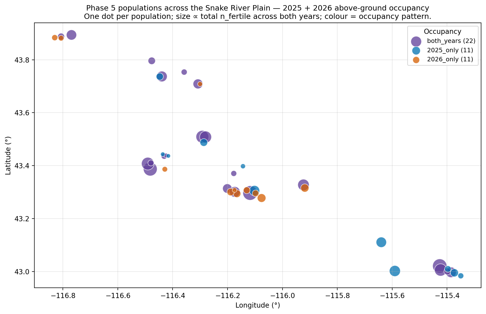

**Figure 2.** Phase 5 populations across the Snake River Plain — 2025 + 2026 above-ground occupancy. One dot per population centroid, size ∝ total `n_fertile` across both years, coloured by occupancy pattern: purple = present in both years (22 of 44 populations), blue = 2025 only (11), orange = 2026 only (11). 44 populations total built from 514 slickspots (10 m cross-year matching) plus historical locationID centroids; 500 m connectivity graph on the pooled point set. 7.4 % of slickspots were re-visited at the 10 m scale across both years — the raw signal of the annual's year-to-year above-ground flickering. Source: `step29a_population_maps.py`.

The two downstream sections pick up from here: § **Bottleneck
Lineages** below groups the 44 populations into the five BLs
that structure every per-population figure, and § **Across-year
population dynamic** classifies each population's 2025 → 2026
trajectory and names the first candidate test pairs.

### populationID ↔ locationCode(s) lookup

The inline table below is the authoritative populationID ↔
locationCode(s) + BL + occupancy + trend-class map for the 44
Phase 5 populations. Every per-population figure that uses
short `P{N}` row labels resolves here; the same information is
also in the TSV
[`step30g_populations_classified.tsv`](tables/Phase5/step30g_populations_classified.tsv)
(which carries additional columns — N_fertile per year,
predicted diversity, predicted pollen compatibility, cross-year
flags). Rows ordered by BL (BL1 → BL5) then populationID.

| populationID | BL | locationCode(s) + locationID(s) | occupancy | trend class |
|:-:|:-:|---|:-:|:-:|
| P1  | BL1 | EO30-1_13                          | both years | stable |
| P2  | BL1 | EO30-2_42                          | 2026 only  | 2026_only |
| P3  | BL1 | EO67_39                            | both years | **stable (SMALL)** |
| P4  | BL1 | EO72-2_40                          | 2025 only  | 2025_only |
| P5  | BL1 | EO27-3_10                          | both years | crash |
| P6  | BL1 | EO27_9                             | 2026 only  | 2026_only |
| P7  | BL1 | EO27_44                            | 2026 only  | 2026_only |
| P8  | BL1 | EO27_9                             | both years | stable |
| P9  | BL1 | EO27_9                             | 2026 only  | 2026_only |
| P10 | BL1 | EO27-5_43                          | 2026 only  | 2026_only |
| P11 | BL1 | EO27-1_37                          | 2025 only  | 2025_only |
| P12 | BL1 | EO27-1_45                          | 2026 only  | 2026_only |
| P13 | BL1 | EO27-1_11, EO27RT_12               | both years | **stable (BIG)** |
| P14 | BL1 | EO27-1_46                          | 2026 only  | 2026_only |
| P15 | BL2 | EO8_29, EO8_47                     | both years | growth |
| P16 | BL2 | EO8_27, EO8_28                     | both years | **stable (BIG)** |
| P17 | BL2 | EO26-2_35                          | 2025 only  | 2025_only |
| P18 | BL2 | EO26-1_30                          | 2025 only  | 2025_only |
| P19 | BL2 | EO26-4_36                          | 2025 only  | 2025_only |
| P20 | BL2 | EO26-3_31, EO26-3_32               | both years | stable |
| P21 | BL2 | EO26-3_32, EO26-3_33, EO26-3_34    | both years | **stable (SMALL)** |
| P22 | BL2 | EO61_38                            | 2025 only  | 2025_only |
| P23 | BL2 | EO29_8                             | 2025 only  | 2025_only |
| P24 | BL3 | EO48_7                             | 2025 only  | 2025_only |
| P25 | BL3 | EO32_6                             | both years | growth |
| P26 | BL3 | EO32_6                             | both years | stable |
| P27 | BL3 | EO24-7_25                          | 2025 only  | 2025_only |
| P28 | BL3 | EO24-1_22                          | 2025 only  | 2025_only |
| P29 | BL3 | EO24_24                            | both years | growth |
| P30 | BL3 | EO24-2_23                          | both years | ambiguous |
| P31 | BL3 | EO18-7_17                          | 2026 only  | 2026_only |
| P32 | BL3 | EO18-7_15, EO18-7_16, EO18-7_17, EO18-7_19, EO18-8_18 | both years | **stable (BIG) ★** |
| P33 | BL3 | EO25-A_20                          | both years | growth |
| P34 | BL3 | EO25-B_21                          | both years | **stable (SMALL) ★** |
| P35 | BL4 | EO52_3                             | both years | crash |
| P36 | BL4 | EO38_1                             | both years | ambiguous |
| P37 | BL4 | EO38_1                             | 2026 only  | 2026_only |
| P38 | BL4 | EO118_4                            | both years | stable |
| P39 | BL4 | EO76_2                             | both years | **crash (standout)** |
| P40 | BL4 | EO76_2                             | 2025 only  | 2025_only |
| P41 | BL5 | EO70_26                            | both years | stable |
| P42 | BL5 | EO69_41                            | 2026 only  | 2026_only |
| P43 | BL5 | EO68-3_5                           | both years | crash |
| P44 | BL5 | EO68-3_5                           | 2026 only  | 2026_only |

★ = recommended Next-test pair (BL3 within-BL stable
small-vs-big, D1 in the Executive summary and § Recommended field
pilot). SMALL / BIG tags in **bold** mark the three within-BL
stable pairs.

---

## Bottleneck Lineages (BL) — clustering and population naming (Step 30h)

**Why cluster populations into Bottleneck Lineages.** Phase 4
established a five-group Bottleneck Lineage (BL) partition at the
*EO* level (external `LEPA_EO_spatial_clustering` repo). Phase 5
reproduces that work at the *population* level, now with the two
years of pooled data instead of a single-year EO snapshot — a
check that the BL grouping still holds once populations replace
EOs, and a chance to let the data pick the BL cardinality rather
than inheriting *k* = 5 by convention.

**Approach.** Ward's D2 hierarchical clustering on the pairwise
haversine distances between the 44 population centroids (centroid
= size-weighted mean of event coordinates across 2025 + 2026).
Silhouette coefficient computed on the distance matrix for
*k* = 2 … 10, with *k*optimal = argmax silhouette.

**Result — the data pick *k* = 5.** The silhouette curve peaks at
*k* = 5 (silhouette = 0.732), confirming the Phase 4 BL
cardinality on independent data two years later. *k* = 2 … 4
split only the two spatial extremes; *k* ≥ 6 subdivides within
BLs without raising the silhouette.

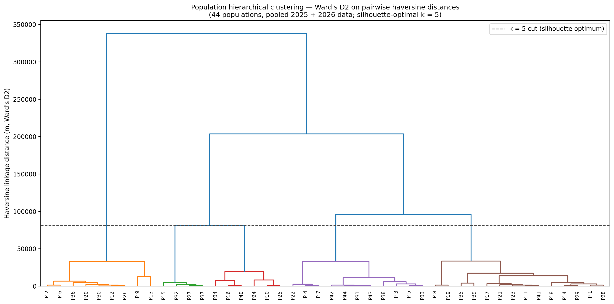

**Figure 3.** Ward's D2 dendrogram of the 44 Phase 5 populations
on pairwise haversine distances (y-axis = linkage distance in
metres). The dashed horizontal cut at *k* = 5 defines the five
Bottleneck Lineages used throughout Phase 5. Leaf labels are the
*post-numbering* populationIDs (populationID = position within
the BL on this dendrogram, numbered sequentially from BL1 to BL5)
so that adjacent IDs within a BL are also adjacent on the
clustering tree. Source: `step30h_population_clustering.py`.

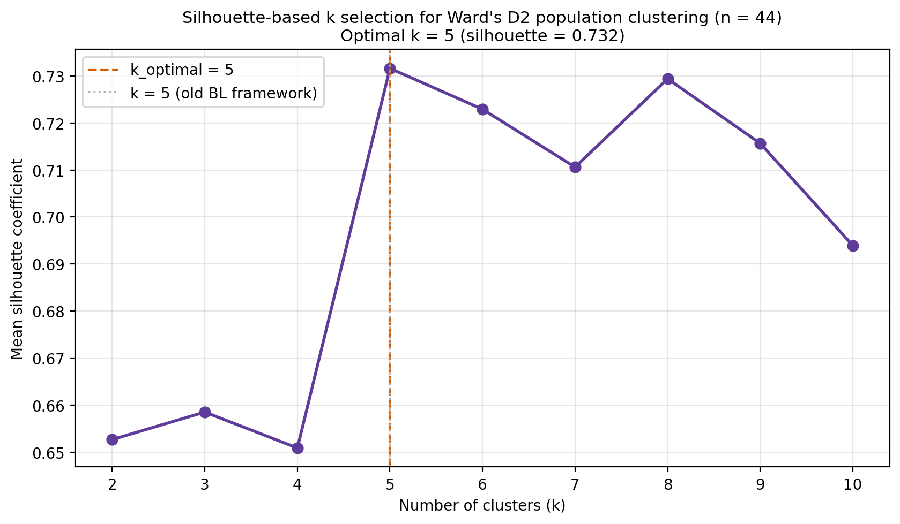

**Figure 4.** Silhouette curve for the Ward's D2 clustering,
*k* = 2 … 10. *k*optimal = 5 (orange dashed line,
silhouette = 0.732); the *k* = 5 reference from the old
Phase 4 EO-level BL framework (grey dotted line) coincides with
the optimum — the Snake River Plain population structure
partitions into the same five groups that the EO-level analysis
found two years earlier. Source: `step30h_population_clustering.py`.

**BL definition rule — area DESC → connectivity DESC.** The five
Ward clusters are relabeled **BL1 … BL5** by (i) convex-hull area
of the member populations (DESC) and (ii) fraction of within-BL
pairs ≤ 5 km (DESC) — the same ordering convention used in the
external LEPA_EO_spatial_clustering repo so the Phase 5 BLs
remain comparable with the earlier EO-level labels. **Area is the
primary Ne proxy** (feedback locked 2026-05-21).

| BL | Populations | Convex hull | Within-BL ≤ 5 km | Total `n_fertile` |
|----|:-:|:-:|:-:|:-:|
| **BL1** | 14 | 174.5 km² | 31 % | 4168 |
| **BL2** |  9 | 120.3 km² | 50 % | 4165 |
| **BL3** | 11 |  75.3 km² | 27 % | 4366 |
| **BL4** |  6 |  48.5 km² | 13 % |  959 |
| **BL5** |  4 |   1.6 km² | 100 % | 490 |

BL1 is the largest-area, moderately-dispersed grouping; BL5 is
the smallest, most-compact grouping (every within-BL pair sits
within 5 km) and carries the drift-collapsed EO24 tail.

**Within-BL numbering: dendrogram leaf order.** Within each BL,
populations are renumbered **sequentially by their dendrogram
leaf position** (left → right on Figure 3). The populationIDs
BL1 holds (P1 … P14) are therefore mutually adjacent on the tree,
BL2 holds P15 … P23, and so on. This replaces the pre-BL
"populationID assigned in creation order" numbering and means
that adjacent populationIDs within a BL are also spatial-
clustering neighbours — making selection of comparable within-BL
pairs for the Objective 3 test design (§ C.5–C.6) direct from
the row ordering of every per-population figure.

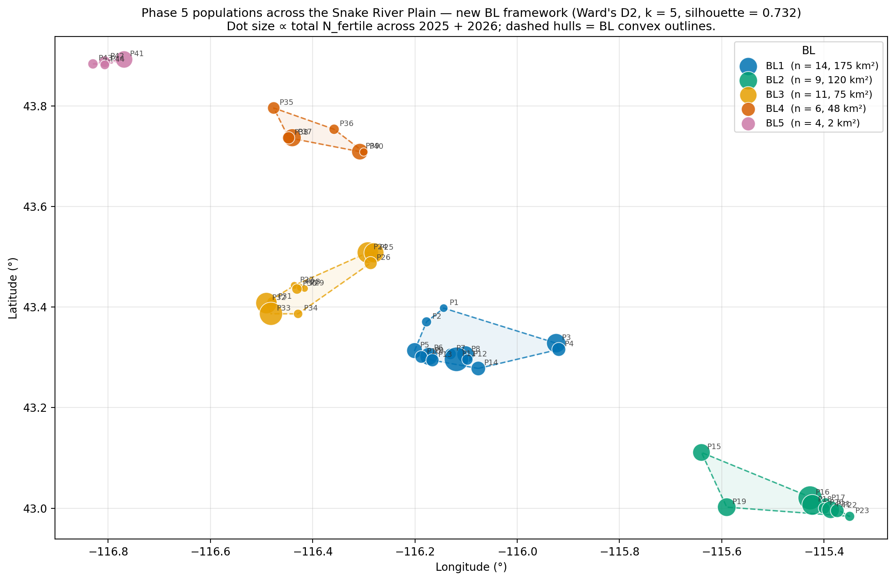

**Figure 5.** The 44 Phase 5 populations across the Snake River
Plain, coloured by Bottleneck Lineage. Dot size ∝ total
`n_fertile` across 2025 + 2026; convex hulls drawn per BL
in matching colour. BL1 (14 populations, purple, N-E group,
largest area), BL2 (9 populations, blue, S group), BL3 (11
populations, red, central-W group), BL4 (6 populations, orange,
NW group), BL5 (4 populations, green, far-W, drift-collapsed
EO24 tail). Source: `step30h_bl_overview_map.py`.

---

## Across-year population dynamic (Step 30g)

**Why classify populations by trend.** Once populations are
defined (§ Populations) and BL-grouped (§ above), the next
question is *how each population is faring across 2025 and 2026*.
That trajectory is what tells us which populations are strong
sampling candidates for the Objective 3 test design: large and
stable populations supply the "high-diversity" arm; crashing
populations supply the "drift-collapsed" arm; growing populations
diagnose which patches respond to good years.

**Trend classes.** Each population is tagged by its 2025 → 2026
`N_fertile` trajectory and diversity + pollen-compatibility
95 % CI overlap, under the equal-visitation-effort assumption
(both years received the same site-visitation protocol; the extra
2026 occurrence records were collected for seed banking and are
not used in this classification). The six classes:

| Class | Definition | n |
|---|---|:-:|
| **crash**     | both-year; `N_fert_2026 ≤ 25 % of N_fert_2025`; Δdiversity < 0 | 4 |
| **stable**    | both-year; 95 % CIs overlap on both metrics; `N_fert_total ≥ 20` | 12 |
| **growth**    | both-year; `N_fert_2026 ≥ 4 × N_fert_2025` | 4 |
| **ambiguous** | both-year; none of the above                                    | 2 |
| **2025_only** | present in 2025, absent above-ground in 2026                    | 11 |
| **2026_only** | absent above-ground in 2025, present in 2026                    | 11 |

**0 of 22 both-year populations show a pollen-compatibility CI
mismatch** between years — the structural redundancy of
§ C.0.b (Class I dominance + empirical zygosity) dominates. All
cross-year signal therefore lives on the **SRK-diversity axis**.

**Standout crash candidate.** `populationID 39 = locationCode EO76`
(one of the three § C.0.a clean-overlap EOs) collapsed from
**445 → 16 plants**. If the 2026 genotyping confirms the same
severely-collapsed allele pool observed at EO76 in 2025 (9 / 32
Fgs), that is **direct second-year evidence for H2** — the
diversity gap is persistent, not a one-year sampling fluke.

**Preliminary LARGE + SMALL candidate pair for the test design.**

- **LARGE = populationID 13** (EO27-1 + EO27RT merged), N_fert
  548 → 1239, predicted pollen compatibility 0.78 / 0.78,
  diversity saturated at 32 / 32.
- **SMALL = populationID 3** (EO67), N_fert 10 → 12, predicted
  pollen compatibility 0.76 / 0.75, diversity 11 / 12 (stable
  at a tiny scale).

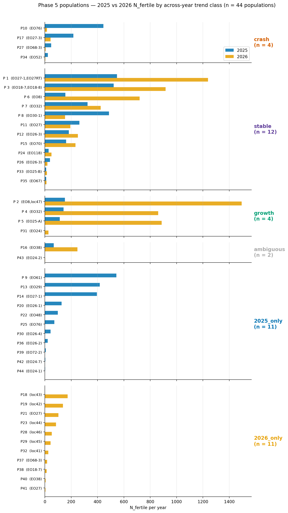

**Figure 6.** The 44 Phase 5 populations grouped by across-year
trend class, each class as a vertical panel. Within each class,
rows are sorted by **BL (BL1 → BL5)** then **populationID**; the
BL grouping is shown as a left-margin **facet strip** (thin
coloured stripe + vertical BL label in BL colour) so BL blocks
read as sub-facets inside each class panel. Row labels are plain
short `P{N}` identifiers; the full `populationID → locationCode`
map is in
[`step30g_populations_classified.tsv`](tables/Phase5/step30g_populations_classified.tsv).
Blue bars = `N_fertile_2025`, orange bars = `N_fertile_2026`.
Thin horizontal separators mark BL boundaries within each class.
**Headline patterns:** the four crash populations spread across
BL1 / BL4 / BL5; the twelve stable populations are BL1-dominant
(4 populations); the four growth populations are BL3-dominant
(3 populations); the eleven 2026-only populations are
BL1-dominant (7 populations, mostly EO27 variants that emerged
in 2026 after a dry 2025). Source: `step30g_classified_summary.py`.

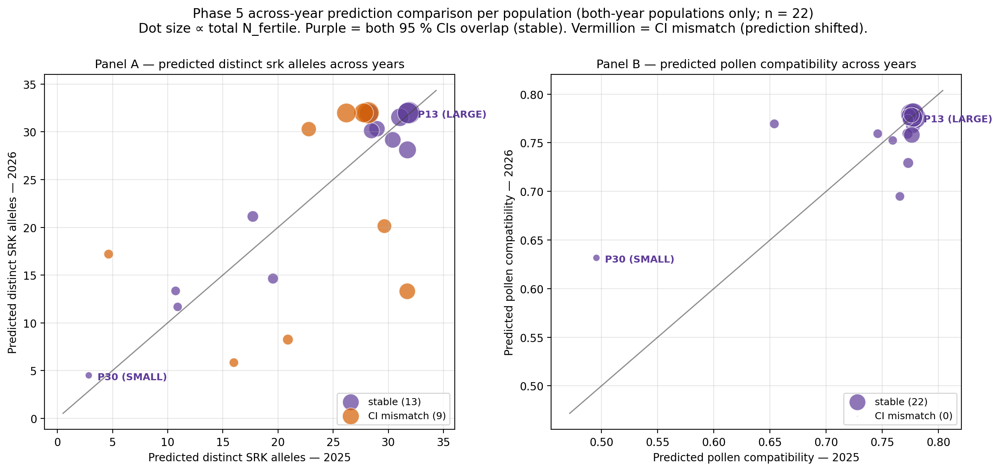

**Figure 7.** Across-year prediction scatter per population
(both-year populations only, n = 22). **Panel A** — predicted
SRK diversity, 2025 (x) vs 2026 (y); **Panel B** — predicted
pollen compatibility, 2025 (x) vs 2026 (y). Dot size ∝ total
`n_fertile`; purple = both 95 % CIs overlap (stable); vermillion
= CI mismatch (prediction shifted). Equality diagonal shown.
Panel B's complete absence of CI mismatches (0 / 22) reaffirms
§ C.0.b: pollen compatibility is robust year-to-year. Panel A's
diversity CI mismatches concentrate the H2 signal (per-deme drift
beyond the species-wide prior) — see § C.0.c. Source:
`step30g_plot.py`.

---

## Delineating the deme — pollen-flight radius (Step 29b)

### The deme as a working hypothesis

Everything the pipeline predicts rests on how a **deme** is
delineated: **SRK allele diversity is a per-deme count** (how many
Fgs physically live in it), and **pollen compatibility is a
per-deme rate** (what fraction of pollen × stigma combinations
succeed inside it). Both aggregate to the location by set union and
size-weighted mean respectively (Figures 9, 10). **Mate limitation
at a location — the thing we actually want to test — is therefore
inherited directly from the deme-level predictions. Get the deme
wrong and the whole causal chain is wrong, so delineating demes
is paramount.**

The theoretical scaffolding is Wright's genetic-neighbourhood
concept (Wright 1943, 1946; Levin & Kerster 1974; Vekemans & Hardy
2004), which identifies the pollen-flight scale as the biologically
meaningful partitioning scale. We do **not** estimate Wright's
neighbourhood parameter *N*b itself — that would require
parent-offspring dispersal distances or a fine-scale *F*ST ~ distance
curve, neither of which exists for LEPA. Instead we delineate
**operational demes** using a hard-threshold connectivity rule
(50 m, bridged by events), calibrated by the sensitivity sweep
below. Our partition is a **geographic / topological upper bound**
on realised gene flow — flow across 50 m could be lower, but not
higher.

**The deme definition is a testable working hypothesis.** The
Part C seed-genotyping design compares the per-location pollen-
compatibility prediction against observed per-mother compatibility.
A systematic location-level mismatch is not a framework failure —
it is information about **how good the 50 m deme definition
actually is**, and a future phase with parentage data or fine-scale
kinship markers could then refine the deme (narrower σ², extended
radius, behavioural weights) to close the gap. The deme is both
the hypothesis the pipeline *uses* to generate predictions and the
hypothesis the Part C data will *test*.

### Picking the pollen-flight radius

**Question.** With the deme defined operationally as "events whose
plants are connected within one pollinator flight", what *radius*
should the flight be? The answer must come from pollinator biology,
not from the sampling budget, so we sweep candidates and look for
the biologically defensible plateau.

**Approach.** Sweep candidate radii from 10 m to 200 m. At each
radius, build a within-location graph in which two events are
connected if any pair of their plants sits within that radius, and
record (i) the fraction of adults in a multi-event pollen-flow
component (connectivity), (ii) the fragmentation-aware sampling
cost (§ Sampling design), and (iii) the predicted random-mating
pollen compatibility under the sporophytic Class I/II model.

**Result.** Connectivity plateaus at ≥ 75 m; sampling cost
stabilises at 75–100 m; predicted pollen compatibility is radius-
independent under the empirical zygosity (§ 30.2). **50 m is the
sweet spot** — inside the halictid / small-bee foraging literature
range, captures 43 % of the sampling-cost reduction, and keeps
meaningful fragmentation variation across Bottleneck Lineages.
Every downstream metric in this doc — SRK diversity prediction
(Figure 9), pollen compatibility prediction (Figure 11) — is
computed at this 50 m choice.

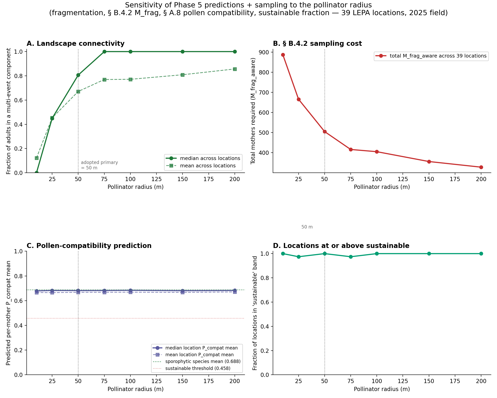

**Figure 1.** Pollinator-radius sensitivity sweep, **2025 and 2026 overlaid**. Four panels showing how connectivity, fragmentation-aware sampling cost, predicted pollen compatibility, and the sustainable-band fraction of locations change across radii from 10 to 200 m. 2025 draw = open circle + dashed line (39 locationIDs); 2026 draw = filled circle + solid line (32 locationIDs — fewer sites emerged above-ground in 2026). Both years agree on the key qualitative shape: connectivity (Panel A) rises steeply from 10 m, plateaus at ≥ 75 m in 2025 (~ 150 m in 2026 — the 2026 above-ground footprint is more spread out); sampling cost (Panel B) drops steeply then flattens around 75–100 m; pollen compatibility (Panel C) is **radius-independent** at ≈ 0.77 under empirical zygosity in both years; the sustainable-band fraction (Panel D) sits at ≥ 97 % at every radius in both years. **50 m** is the primary radius adopted across the pipeline — within the halictid / small-bee foraging literature range, captures ~ 40 % of the sampling-cost reduction available on the radius curve, and preserves meaningful fragmentation variation across BLs. Source: `step29a_pollinator_radius_sensitivity.py`.

---

## Deme structure per population — what the 50 m partition yields (Step 29c)

### How the deme is built

**Question.** Within a location, how many demes does a plant
belong to, and how big is each one? A **50 m connected component**
is the Phase 5 **deme**: the set of adult plants whose events
are reachable from each other at the primary pollinator radius.
Plants in the same deme share pollen; plants in different
demes at the same location do not. The deme is the
**drift unit** on which every Phase A prediction is built.

**Approach.** For each location, build an event-level graph in which
two events are connected if any pair of their plants sits within
≤ 50 m. Connected components of that graph are the location's
demes. For each deme *c*, `component_N_fertile_c` is
the sum of `n_fertile_e` across its events — the adult count that
drives the per-component drift simulations in § 30.1 and § 30.2.
Reference: `step29c_fragmentation_aware_sampling.py` writes the
event → deme lookup (`step29c_event_to_component_50m.tsv`);
`step29d_mating_pool_structure.py` builds the display here.

**Result (dataset-wide — how many demes do the 39 LEPA locations hold?).**
The connectivity rule yields **101 operational demes across 39
isolated locations** at 50 m. The per-location breakdown:

| Demes at a location | Locations | Interpretation |
|:---:|:---:|:---|
| 1 | **13** | single connected deme; location-wide census = breeding unit |
| 2 | 10 | two sub-demes separated by a > 50 m internal gap |
| 3 | 6 | three sub-demes |
| 4 | 3 | four sub-demes |
| 5 | 4 | five sub-demes |
| 6 | 3 | six sub-demes — the most fragmented locations |

- **~⅓ of locations (13 / 39) operate as a single location-wide
  deme**, and **~⅔ (26 / 39) require within-location subdivision**
  into 2–6 operational demes to represent gene flow correctly.
- Deme sizes span **1 adult (SI floor) → 420 adults**; median
  **23 adults**.
- **31 of 101 demes (31 %) sit below the 8-plant species-pool
  threshold** (4 alleles per tetraploid plant × 8 plants = 32
  copies — the minimum needed to physically carry one copy of every
  SRK allele in the species pool). These demes are drift-limited
  for the 32-allele species pool regardless of location mean.
- **6 of 101 demes (6 %) sit at the N = 1 single-plant SI floor** —
  a single plant has nobody to mate with at the 50 m radius.
- Pattern across BLs: BL5 tail (EO24 group) carries the small-deme
  burden; BL4 has large, mostly fragmentation-robust locations; BL1
  shows the widest *within-location* spread (EO8, EO26-3 split into
  many small sub-demes).

**Why this matters.** Every Phase A prediction below is built on
this structure: the per-component SRK diversity prediction (Figure 9)
simulates each deme independently and unions the Fg sets at
the location level; the per-component pollen compatibility prediction
(Figure 11) runs the sporophytic simulation per deme and reports a
size-weighted mean per location; the fragmentation-aware sampling
allocation (§ Sampling design) assigns mothers per deme, with the
≥ 1-mother-per-event floor layered on top. The per-deme view is
the fastest way to anticipate which populations will stand out in
Figures 9 and 11.

**Per-population per-year deme-size view.** The dataset-wide
census above is a single-year snapshot. For a given population,
the number of demes **and their individual sizes** can shift
year-to-year because the above-ground set of occupied slickspots
flickers (annual plant, seed-bank-mediated emergence). Figure 8
drills down from the single-number per-population deme count
into the full per-year deme-size distribution — essential for
spotting populations whose predicted diversity shifts between
years not because the species-wide prior changed but because the
deme partition itself did.

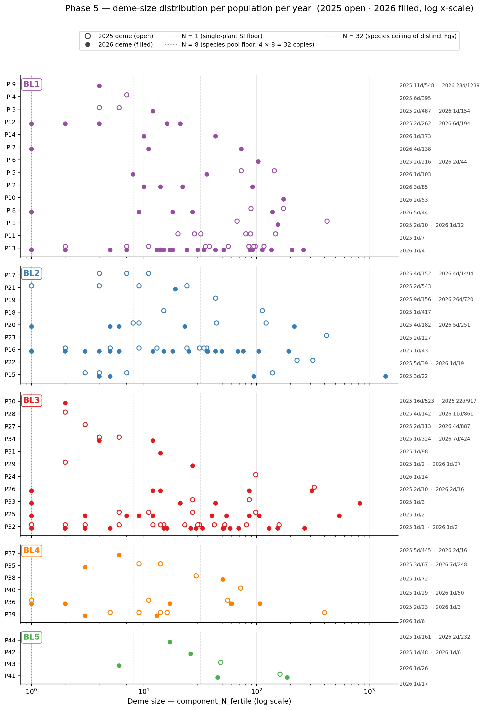

**Figure 8.** Per-population per-year deme-size distribution. One
row per population, panels stacked by BL (BL1 → BL5). Each row
holds up to two parallel strips of dots: **open circles = 2025
demes, filled circles = 2026 demes** (same open/filled convention
as Figures 9 and 11); one dot per deme at x = `component_N_fertile`
(log-scale deme size). Three vertical reference lines: red at
**N = 1** (single-plant SI floor — a lone plant has nobody to
mate with at 50 m), grey at **N = 8** (species-pool floor —
4 alleles per tetraploid × 8 plants = 32 copies, the physical
minimum to carry the full 32-Fg species pool), dashed at **N = 32**
(species ceiling of distinct Fgs). Left margin: short `P{N}`
identifier; right margin: per-year `{K demes}d / {N adults}`.
A row with dots in only one strip is a single-year population
(2025_only or 2026_only); rows where the 2025 and 2026 strips
sit at different x positions reveal populations whose deme
partition shifted year-to-year even where the population persists
across years. Source: `step29a_demes_per_population_year_plot.py`.
Data: [`step29a_demes_per_population_year.tsv`](tables/Phase5/step29a_demes_per_population_year.tsv).

## Step 30 Phase A — Per-population predictions

### 30.1 Predicted SRK diversity per population — unbiased truth vs sampling

**Two questions, kept strictly separate.** SRK diversity at a
location has two very different meanings and the pipeline predicts
both. This section uses the **existing LEPA dataset** — actual
mothers × actual seeds/mother in the DB. The prospective design
question ("how many mothers × how many seeds do we NEED for a new
location?") is answered in Steps 28 – 29.

1. **What the population actually holds at this location** (unbiased truth) —
   how many SRK alleles are physically present. Driven **per mating
   pool** by `component_N_fertile`, then unioned to the
   location level. This is the drift output of the causal chain and
   the raw material on which the pollen-compatibility prediction
   (§ 30.2) operates.
2. **What our sampling will recover** (sampling-inferred) — expected
   detection given `A_delivered = 4·M_mothers + 2·total_seeds` at each
   location. **Every seed's 2 paternal alleles are direct samples of
   the local pollen donor pool** — the seed genotyping is a
   pollen-pool characterisation experiment.

**Approach — how the simulation works, step by step.**

Think of the species prior P1 as a bag with 32 kinds of coloured
balls — one colour per Fg. The bag is **not evenly filled**: FG001
occupies 41 % of it, the next five Fgs together another ~25 %, and
the 20+ rare Fgs each fill under 2 %. Those shares are the
*species-wide empirical frequencies* measured from the Canu-amplicon
263-individual inventory. Each LEPA location only gets a limited
handful of draws from that bag, so small locations are almost
guaranteed to miss the rare colours by chance — that is **genetic
drift**. The prediction turns this intuition into numbers in five
steps, run for every 50 m component inside every location:

1. **Build the component's local pool (drift step).** For a
   component with `component_N_fertile_c` fertile plants, draw
   `4 × component_N_fertile_c` balls from P1 (because every plant is
   tetraploid and carries 4 SRK alleles). The unique colours drawn
   are the Fgs **present at that component**; the proportions in the
   draw are the component's local Fg frequency vector `f_local_c`.
   Small `N_c` → few draws → missing some rarer Fgs.

2. **Sum components to the location (union step).** The location
   holds a Fg if *any* of its components holds it, so the location's
   pool size on this replicate = |union of per-component present
   sets|. That is why diversity is unioned (set operation), not
   averaged (continuous-rate operation).

3. **Simulate the sampling (what we will actually see).** Distribute
   the location's `M_mothers` and `total_seeds` across components
   proportional to component size (largest-remainder: the component
   with the most plants gets the most sampling effort). Per
   component this gives `M_c` mothers and `seeds_c` seeds, so
   `A_delivered_c = 4·M_c + 2·seeds_c` allele draws (4 maternal
   alleles per mother + 2 paternal alleles per seed). Draw
   `A_delivered_c` balls from the component's own `f_local_c` and
   record which colours were hit — these are the Fgs **detected at
   that component**.

4. **Union detected across components, divide by union present.**
   Location detected = |union of per-component detected sets|.
   Location coverage = detected / pool size, on this replicate.

5. **Repeat 1 000 times, report mean and 95 % credible interval.**
   Each replicate uses an independent random draw from P1 at step 1
   and an independent sampling draw at step 3; the 2.5 % and 97.5 %
   percentiles across replicates give the credible interval seen as
   error bars in Figure 9.

Why the per-component view matters: a drift-collapsed small
component (say 2 plants, holding 4 Fgs) left with 0 mothers under
step 3 contributes its Fgs to the location's "present" count at
step 2 but nothing to the "detected" count at step 4 — that is the
sampling blind spot that pulls EO26-3 and EO27RT down to 97 %
coverage below.

**Result.**

| Location | BL | N_fert_eff (50 m) | n components | M_mothers | total_seeds | Population holds | Sampling detects | Coverage |
|---|---|---|---|---|---|---|---|---|
| EO24-2 (1 plant, BL5 tail) | BL5 | 1 | 1 | 1 | 1 | ~3 | ~2.6 | **87 %** |
| EO24 (BL5 tail) | BL5 | 2 | 1 | 1 | 5 | ~4.5 | ~4.1 | **91 %** |
| EO26-3 (fragmented BL1) | BL1 | 5 | 2 | 4 | ~70 | ~7.6 | ~7.4 | **97 %** |
| EO27RT (fragmented BL4) | BL4 | 177 | 6 | 22 | ~1700 | ~29 | ~28.1 | **97 %** |
| EO67 (small BL4 pilot) | BL4 | 10 | 2 | 4 | 71 | ~11 | ~10.7 | 99 % |
| EO27-1 (large BL4 pilot) | BL4 | 116 | 2 | 33 | 2465 | ~27 | ~27 | ~100 % |
| EO76 (largest BL3) | BL3 | 517 | 6 | 62 | 11723 | ~32 | ~32 | ~100 % |

**Every location clears the 90 % target; 6/39 now sit below 99 %
coverage** (vs 2 under the previous single-pool model). The newly
visible gap is the **sampling blind spot** in fragmented locations:
when drift-collapsed small components (1–5 plants) receive 0 mothers
under proportional allocation but still carry Fgs the larger
components do not — EO26-3 and EO27RT are the clearest examples.

The existing LEPA dataset therefore characterises Nature's truth at
every location. Total seed counts in the DB span 1 (EO24-2) →
11 723 (EO76), so most locations are well provisioned.

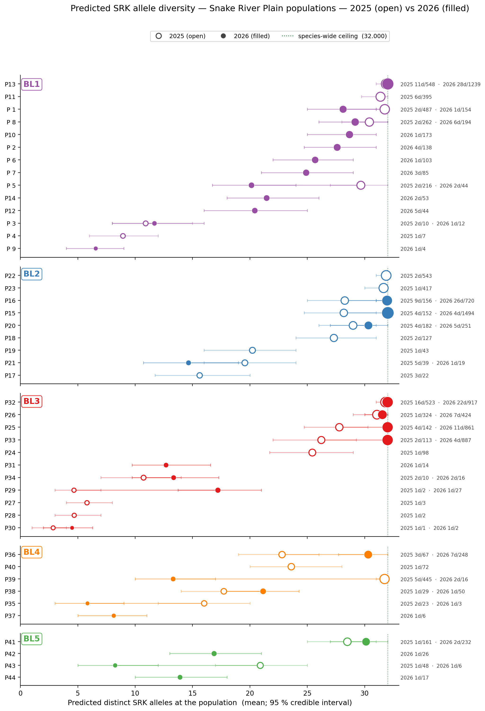

**Figure 9.** Predicted SRK allele diversity per population, 2025 and 2026 overlaid. One row per population; the 2025 draw is shown as an open circle, the 2026 draw as a filled circle in the same BL colour, with a thin connector line joining the two when both years are present. 95 % credible intervals shown as horizontal error bars; dot size ∝ `N_fertile` for that year. Single-year populations show only the applicable year's marker and no connector. Dotted vertical line = species-wide ceiling (32 Fgs). Panels stacked by BL (BL1 → BL5, area DESC → connectivity DESC); within each BL populations ordered by the mean of their available-year predicted means. Left margin: short `P{N}` identifiers; right margin: per-year `{K demes}d / {N adults}`. The full `populationID → locationCode` map is in [`step30g_populations_classified.tsv`](tables/Phase5/step30g_populations_classified.tsv). The across-year comparison within a population is the within-pipeline H2 test of § C.0.c — populations whose predicted diversity shifts markedly between years carry the strongest signal of per-deme drift beyond the species-wide prior. Source: `step30h_predictions_by_BL_year.py`.

### 30.2 Predicted pollen compatibility per population

**Question.** Under the sporophytic Class I / II + empirical-zygosity
model, what fraction of pollen would a mother at each location be
compatible with under random mating?

**The underlying biology — sporophytic Class I / II dominance.**
LEPA SRK alleles fall into two dominance classes. **Class I is
dominant**: a plant carrying any Class I allele expresses only its
Class I alleles on both pollen and stigma, silencing its Class II
alleles. A plant carrying only Class II alleles co-expresses all
of them. **A cross is rejected if the two parents share any
expressed allele**; between-class crosses (Class I plant × Class II
plant) are always compatible by construction. This single rule
drives the whole § 30.2 prediction — and crucially, it is what
makes the § C.0.b hypothesis decomposition work: without Class I
dominance, within-class drift concentration (EO70's FG024) and
zygosity composition (EO76's homozygous buffer) would be
indistinguishable from a plain allele-frequency effect. Figure 9
walks through the rule in three panels before we get into the
simulation steps.

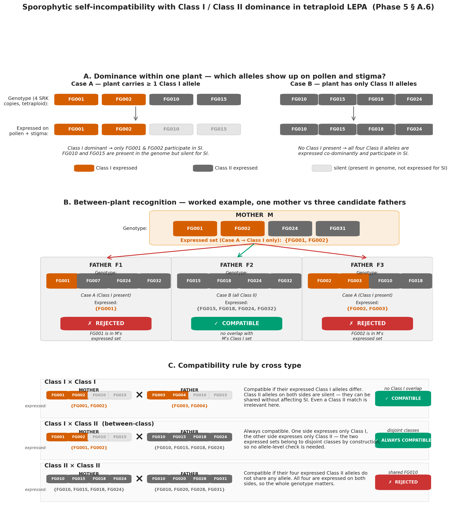

**Figure 10.** Sporophytic SI with Class I / Class II dominance in tetraploid LEPA. **Panel A — dominance within one plant.** Case A: a plant with ≥ 1 Class I allele expresses only its Class I alleles; its Class II alleles are silent (shown faded). Case B: a plant carrying only Class II alleles expresses all four Class II alleles co-dominantly. **Panel B — between-plant recognition, worked example.** Mother M carries {FG001, FG002, FG024, FG031}; her Case-A expressed set is {FG001, FG002}. Three candidate fathers: F1 shares FG001 with M → rejected; F2 is all-Class-II so between-class → always compatible; F3 shares FG002 with M → rejected. **Panel C — compatibility rule by cross type.** Class I × Class I: compatible if their expressed Class I alleles differ (shared Class II is irrelevant because Class II is silent on both sides). Class I × Class II: always compatible by construction (disjoint expressed classes). Class II × Class II: all four alleles expressed on both sides, compatible only if none are shared.

**Approach — how the simulation works, step by step.**

Same per-component logic as § 30.1, but the recognition rule changes
from "did we observe this Fg at least once?" to "if this mother's
expressed Fgs are {a, b}, what fraction of pollen in her component
would she accept?" Five steps per replicate:

1. **Build the component's local pool (same as § 30.1 step 1).**
   Draw `4 × component_N_fertile_c` alleles from P1 → local Fg
   frequencies `f_local_c`. This is the drift-collapsed pollen pool
   the component's mothers see.

2. **Sample mother genotypes under the empirical LEPA zygosity.**
   Each mother gets 4 SRK alleles drawn from `f_local_c`, but
   combined into tetraploid genotypes that match the observed LEPA
   mix: 66 % of mothers end up with 1 distinct Fg (homozygotes),
   32 % with 2 distinct, 2 % with 3 distinct (from
   `srk_zygosity_empirical.tsv` — see Part C § C.0 for how this was
   measured from the 367 Canu-amplicon adults).

3. **Compute per-mother pollen compatibility under sporophytic Class
   I / II SI.** A pollen parent expresses only Class I alleles if it
   carries any, else all its Class II alleles co-dominantly. A cross
   is rejected if parents share any expressed allele. For a mother
   expressing Fg set *M*:
   - Mother has ≥ 1 Class I allele: `P_compat = (1 − p(M))⁴` where
     p(M) is the local frequency sum of her expressed Fgs.
   - Mother is pure Class II: `P_compat = 1 − (1 − p_I)⁴ +
     (1 − p_I − p(M))⁴`.

   Average across the mothers sampled at this component → component
   P_compat on this replicate.

4. **Aggregate components to the location (weighted mean, not
   union).** P_compat is a continuous rate, so a location's number
   is the component sizes weighted mean:
   P_compat_location = Σ_c (P_compat_c · component_N_fertile_c) /
   Σ_c component_N_fertile_c. Big components dominate; small
   components still count — that is where drift pulls the location
   mean down.

5. **Repeat 400 times, report mean and 95 % credible interval.**

Why no sampling term enters P_compat: § 30.2 asks "what fraction of
pollen is compatible with a random mother at this component?" — a
biological property of the pollen pool, not a function of how many
seeds we sequence. Seed counts enter § 30.1 (sampling detection) and
Phase B (the regression against observed seed set), not here.

Both tables are emitted:
[`step30_A_prediction_location_pcompat.tsv`](tables/Phase5/step30_A_prediction_location_pcompat.tsv)
(headline per location) +
[`step30_A_prediction_component_pcompat.tsv`](tables/Phase5/step30_A_prediction_component_pcompat.tsv)
(one row per component, so struggling sub-components inside a
sustainable-mean location remain visible).

**Result.**

- **Species-mean P_compat = 0.78** (sustainable band by construction).
- **Traffic-light bands** (1/3 and 2/3 of species mean): failed
  < 0.23, struggling 0.26–0.52, sustainable ≥ 0.52.
- **BL5 tail (EO24 group)** is the primary conservation concern —
  predicted P_compat 0.42–0.51 with wide credible intervals
  entering the struggling band.
- All other BLs sit in the sustainable band at the mean; the tightest
  credible intervals belong to the largest locations (EO76, EO61).

**Connection to Figure 9.** Uses the same drift mechanism as the
diversity figure, except drift is now modelled **per component**
(one pool per 50 m connected component sized by
`4 × component_N_fertile`) rather than through a single
"largest-component" proxy. Figure 9 shows that the existing LEPA
seed data recovers the true local Fg pool at every location — that
validation transfers directly to Figure 11, meaning the location-
mean P_compat from the per-component simulation is a faithful
estimator of the population-mean P_compat.

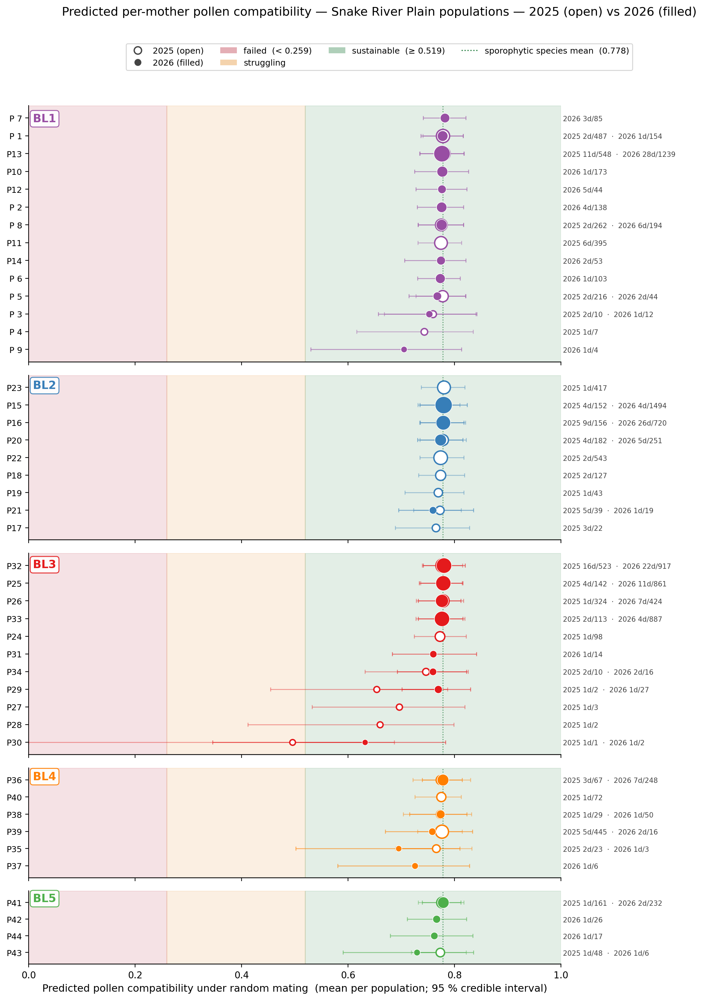

**Figure 11.** Predicted per-population pollen compatibility under sporophytic Class I / II SI + empirical LEPA zygosity, 2025 and 2026 overlaid. Same layout as Figure 8: open circle = 2025, filled circle = 2026, same BL colour, thin connector line for both-year populations. 95 % CI horizontal error bars; dot size ∝ `N_fertile` for that year. Traffic-light bands: red = failed (< 0.259), amber = struggling (0.259 – 0.519), green = sustainable (≥ 0.519). Dotted green line = sporophytic species mean 0.778. Panels stacked by BL (BL1 → BL5); within each BL rows ordered by the mean of available-year means. Left margin: short `P{N}` identifiers; right margin: per-year `{K demes}d / {N adults}`. The full `populationID → locationCode` map is in [`step30g_populations_classified.tsv`](tables/Phase5/step30g_populations_classified.tsv). Nearly all populations with ≥ 8 adults sit on or just below the species mean — the structural redundancy of Class I dominance + empirical zygosity (§ C.0.b) swamps between-population variation; BL3's EO24 tail (P27 – P30, 1 – 3 plants each) is the only group with meaningful credible-interval spread below the mean. All 22 both-year populations have overlapping 2025 and 2026 CIs on pollen compatibility (0 / 22 mismatches), so the across-year differences are concentrated in the single-year populations. Source: `step30h_predictions_by_BL_year.py`.

---

## Sampling design — the answer to "how many mothers × how many seeds?"

Now that fragmentation, drift and mate limitation are on the table,
the sampling design falls out of the causal chain. Every choice below
is derived from a quantity that has already been established, not
proposed independently.

### How many seeds per mother?

**Question.** How many seeds must we genotype from each mother to
characterise her local pollen environment well enough to test the
mate-limitation prediction in § C.1?

**Approach — tetraploid per-mother allele-detection floor.** Each seed
contributes 2 paternal SRK alleles under tetraploid sporophytic
inheritance. Treating pollen pickup as sampling with replacement from
the local pollen pool, the probability of missing any one of K local
paternal Fgs after 2·n seed alleles is `(1 − 1/K)^(2n)`. Setting
`(1 − 1/K)^(2n) = 0.10` gives the seeds needed for a 90 % chance to
see every Fg. **This saturates at n = 15 seeds/mother** — the point
where the return per additional seed is negligible.

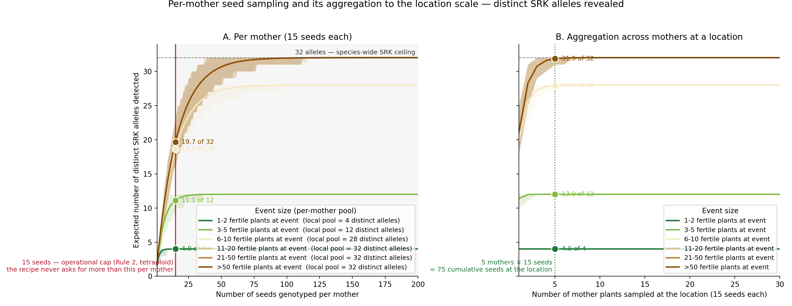

**Figure 12.** Step 28 SRK allele detection under tetraploid LEPA (4 SRK copies per plant; 2 paternal alleles per seed), on the absolute-allele scale with the local pool capped at the species-wide ceiling of 32 Fgs. Shaded bands = 95 % simulation CI. **Panel A — per mother.** x = seeds genotyped, one curve per event-size bin (each seed contributes 2 paternal allele draws); the **vertical red line at 15 seeds** marks the per-mother operational cap under tetraploid. One mother's 15 seeds cannot saturate a 32-allele pool at large event sizes — this is the allele-detection limit for a single sampler, not undersampling. **Panel B — aggregation across mothers at a location.** x = number of mothers sampled (15 seeds each = 34 allele draws per mother: 4 maternal + 2 × 15 = 30 paternal). At the 5-mother benchmark (green dotted line, 75 cumulative seeds), **every event size reaches its local ceiling** — 4 of 4, 12 of 12, 27.9 of 28, 31.9 of 32, 31.9 of 32, 31.9 of 32. Panel B is continuous in M so any real location can read its own coverage off the correct curve. **This is the proof that seed-genotyping at 15 seeds/mother × 5+ mothers/location recovers the local SRK pool well enough to test the Phase A predictions.** Source: `step28_seed_sampling_per_mother.py`. Data: [`step28_coverage_curves_by_Nfertile.tsv`](tables/Phase5/step28_coverage_curves_by_Nfertile.tsv), [`step28_aggregation_curves_by_Nfertile.tsv`](tables/Phase5/step28_aggregation_curves_by_Nfertile.tsv).

**Field → lab correction — 60 % germination rate.** Part C
genotypes **seedlings**, not seeds (user-confirmed design,
2026-10-03). LEPA seeds germinate at **≈ 60 %** under greenhouse
conditions, so to end up with the target of 15 genotyped seedlings
per mother the field protocol must germinate `ceil(15 ÷ 0.60) = 25`
seeds per mother. The totals become:

- **Collect / germinate:** 505 mothers × 25 seeds = **12 625 seeds**.
- **Expected after germination:** ~15 seedlings/mother × 505 = **~7 575 seedlings**.
- **Genotype:** up to 15 seedlings per mother → **7 575 seedling genotypes**.

The 90 % allele-detection guarantee still holds — 15 is a floor on
*seedling* genotypes delivered to the lab, not on seeds extracted in
the field. The field-team recipe in
[`step29c_partC_germplasmID_selection.tsv`](tables/Phase5/step29c_partC_germplasmID_selection.tsv)
now carries both `n_seeds_to_germinate` and `n_seedlings_to_genotype`.

**Does 15 seedlings give enough Part C testing power?**
The 90 % allele-detection target justifies 15 as the floor. Two
additional simulations confirm it also passes the regression
thresholds:

- **Per-mother P_compat precision** — observed P_compat has binomial
  SE `√(p·(1−p) / n_seeds)`. Drops from ~0.28 at 3 seeds to
  ~0.12 at 15 (visible plateau); marginal gains beyond.
- **§ C.1 mate-limitation regression power** — full-pipeline
  simulation of 505 mothers × 39 locations. At n_seeds = 15:
  **99.6 % power** for a medium effect (β₁ = 100 seeds per unit
  P_compat), **69 % for a small effect (β₁ = 50, below the 80 %
  target)**. Errors-in-variables attenuation of β̂₁ is ~0.42 — real
  but doesn't prevent detection at realistic effect sizes.

15 seeds is comfortably enough for medium-to-large mate-limitation
signals. The marginal power at small effect sizes comes from the same
25-mother / 6-location shortage the mother-count section flags —
the 2026 top-up addresses both.

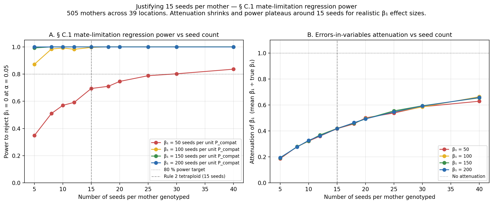

**Figure 13.** Statistical justification for the 15-seedlings-per-mother operational floor — two complementary simulations. **Left panel — per-mother P_compat precision.** Observed P_compat has binomial SE `√(p · (1 − p) / n_seeds)`; four curves plot SE vs seeds genotyped for four true P_compat values (0.3 / 0.5 / 0.7 / 0.9). The precision gain per additional seed is steep at low seed counts (SE drops from ~0.28 at 3 seeds to ~0.12 at 15 seeds) and **visibly plateaus around 15** — marginal gains beyond are negligible for the regression. **Right panel — § C.1 mate-limitation regression power** from a full-pipeline simulation of 505 mothers × 39 locations with per-mother P_compat drawn from the Phase 5 prediction. Four curves for four β₁ effect sizes (50 / 100 / 200 / 400 seeds per unit P_compat). At `n_seeds = 15`: **99.6 % power for medium effect (β₁ = 100)**; 69 % for the small effect (β₁ = 50, below the 80 % target). Errors-in-variables attenuation of β̂₁ is ~ 0.42 — real but doesn't prevent detection at realistic effect sizes. **Together with Figure 12, these two simulations are the proof that the Part C seed-genotyping protocol (15 seedlings per mother, with the field-side correction to 25 seeds at 60 % germination) has enough statistical power to test the Phase A per-population predictions.** Source: `step28_seed_sampling_per_mother.py`. Companion precision-only figure: [`step28d_pcompat_precision.png`](figures/Phase5/step28d_pcompat_precision.png).

### How many mothers per location?

**Question.** How many mothers must we sample at each location to
observe every SRK allele physically present in the location's mating
pool?

**Approach.** Under tetraploid sampling each adult contributes
`PLOIDY × component_N_fertile = 4·component_N_fertile` allele copies
to its deme. Target: 90 % chance of observing every allele in
a given deme at the total delivered allele draws
`A_delivered = M × (4 + 2 × 15) = 34·M`. Plus a private-allele floor:
**at least one mother per event** (an isolated slickspot's private
allele cannot be recovered from any other event).

**Refinement — fragmentation-aware allocation.** If a location is
fragmented into several disconnected 50 m demes, we decompose
the location into its components and allocate mothers per component,
plus the ≥ 1-per-event floor. The result is `M_frag` per event.

**Result.**

- **Design target: 505 mothers across 39 locations, 234 events.**
- **Already collected in the LEPA DB: 765 mothers** — 1.5× the target.
- **33 / 39 locations are fully covered** by the current DB.
- **6 / 39 locations are short of the target** — 25 mothers total.
  The six short locations (EO27-1, EO27RT, EO26-2, EO8, EO67, EO8)
  are the field-team top-up target for the 2026 season.

`M_frag` per event is the authoritative field-team recipe (see
[`step29c_sampling_frag_aware_per_event.tsv`](tables/Phase5/step29c_sampling_frag_aware_per_event.tsv)).

### The locked recipe

With mother count and seed count fixed, the design is frozen for the
next field season:

| Quantity | Value |
|---|---|
| Primary pollinator radius | **50 m** |
| Drift unit | **50 m deme** = 50 m connected component of events; `component_N_fertile` adults per deme |
| Mother allocation per location | Fragmentation-aware `M_frag` (per 50 m deme + ≥ 1 per event) |
| Per-mother seedling-genotype floor | **15 seedlings/mother** (90 % allele-detection target) |
| Field-side germination assumption | **60 %** |
| Seeds to germinate per mother | **25** (= ceil(15 ÷ 0.60)) |
| **Total mothers across 39 locations** | **505** |
| **Total seeds to germinate** | **505 × 25 = 12 625** |
| **Total seedlings to genotype** | **~505 × 15 = ~7 575** |
| Allele-detection target | 90 % probability of seeing every allele in each 50 m deme |

**Three authoritative files:**

- **Field-team recipe** (for a new field season):
  [`step29c_sampling_frag_aware_per_event.tsv`](tables/Phase5/step29c_sampling_frag_aware_per_event.tsv) —
  one row per event, `M_frag` = number of mothers to sample there.
- **Lab recipe for Part C** (draws specific mothers from the DB):
  [`step29c_partC_germplasmID_selection.tsv`](tables/Phase5/step29c_partC_germplasmID_selection.tsv) —
  one row per selected `germplasmID` already in the LEPA DB, sorted
  `EOID → locationID → component → germplasmID`. Columns include
  `n_seeds_to_germinate` = min(25, seeds_available),
  `n_seedlings_expected` = round(n_seeds_to_germinate × 0.60),
  `n_seedlings_to_genotype` = min(15, n_seedlings_expected).
  Selection is **per 50 m deme**: mothers within a pool share
  pollen so coverage travels freely within a pool; only the ≥ 1-
  mother-per-event maternal-genotype floor is a strict per-event
  rule. Delivers **431 mothers from the current DB → ~10 713 seeds
  to germinate → ~6 428 seedlings to genotype**, with **76 mothers
  short across 35 demes** flagged for a 2026 field top-up.
- **Event → component lookup**:
  [`step29c_event_to_component_50m.tsv`](tables/Phase5/step29c_event_to_component_50m.tsv) —
  one row per event mapping (locationID, eventID) → 50 m component,
  the single canonical source for "which events share a pollen pool?".

---

## Step 30 Part C § C.0 — Empirical validation of the P_compat model

The primary Part C validation runs at **Phase 5 location scale**
on the three clean-overlap populations **P3 (= EO67), P41 (= EO70), P39 (= EO76)** (§ C.0.a and § C.0.b below). The
other three EOs with Phase 4 SRK genotypes — **EO18, EO25, EO27** —
are split under the 500 m rule and cannot yet be remapped to Phase 5
locationCodes. Their observed-vs-predicted pollen compatibility is
reported here at EO scale as a background diagnostic, no figure.

**Current numbers for the three split EOs** (from `step30c_srk_validation_at_eo_level.py`,
observed fathers from local f vs predicted from species-wide P1,
same observed mothers for both):

| EO | adults | Observed pollen compatibility (95 % CI) | Predicted (95 % CI) |
|---|---:|---|---|
| EO27 | 61 | 0.77 (0.73–0.80) | 0.80 (0.77–0.84) |
| EO25 | 51 | 0.77 (0.74–0.80) | 0.80 (0.77–0.84) |
| EO18 | 39 | 0.69 (0.64–0.74) | 0.75 (0.71–0.79) |

EO27 and EO25 pass at EO scale; EO18 shows a mild drift signal
with overlapping CIs. The three clean-overlap populations P3 (= EO67), P41 (= EO70), P39 (= EO76
EO76) are reported at Phase 5 location scale in § C.0.a — see the
embedded figure below.

**Caveat.** P1 was built from these same individuals, so species-mean
alignment is guaranteed; what this tests is **robustness to per-EO
drift**, not absolute calibration.

### C.0.a — Part C anchor at Phase 5 location scale (clean-overlap EOs)

**Question.** Three of the six § C.0 EOs are **1:1 with a Phase 5
locationCode** — no 500 m within-EO split — so their adult SRK
genotypes can be used **directly** as a Part C validation anchor at
the Phase 5 location scale, no event-level remap required. Does the
Phase 5 **per-location** prediction reproduce what we see at the
location scale?

**The clean overlap set.** P3 (= EO67, 37 adults), P41 (= EO70, 74), P39 (= EO76, 76) =
**187 adults**. The other three § C.0 EOs (EO18, EO25, EO27) are
split under the 500 m rule and need an `Individual → germplasmID →
eventID → locationCode` join before their 151 adults can be used
here; that is scheduled as future work.

**Approach.** For each clean-overlap location, run `step30d_partC_clean_overlap.py`:
1. Observed per-mother P_compat under sporophytic Class I / II +
   empirical zygosity, with fathers drawn from **observed local Fg
   frequencies** (not P1).
2. Observed distinct Fgs = size of the Fg set recovered from the
   adult genotypes.
3. **No-drift upper bound on distinct Fgs** at the adult sample size:
   `E[distinct Fgs | 4·n_adults draws from P1]`. If this upper bound
   is near the species ceiling (which it is for all three locations:
   19.2 at n=37, 24.0 at n=74, 24.0 at n=76), any large gap down to
   the observed count isolates **drift**, not sampling.
4. Compare observed to the Phase 5 per-location prediction
   (`step30_A_prediction_location_pcompat.tsv` for P_compat,
   `step30_A_prediction_location_diversity.tsv` for the component-
   unioned pool size).

**Result.**

| Location | Adults | Observed P_compat (95 % CI) | Phase 5 pred P_compat (95 % CI) | Observed Fgs | No-drift upper bound | Phase 5 pred Fgs (95 % CI) |
|---|---:|---|---|---:|---:|---|
| **EO67** | 37 | 0.697 (0.660–0.737) | 0.724 (0.632–0.803) | **7** of 32 | 19.2 | 10.8 (7.0–15.0) |
| **EO70** | 74 | **0.532** (0.510–0.559) | **0.776** (0.740–0.806) | **6** of 32 | 23.8 | 28.3 (25.0–31.0) |
| **EO76** | 76 | 0.722 (0.694–0.753) | 0.775 (0.749–0.797) | **9** of 32 | 24.0 | 31.8 (31.0–32.0) |

- **EO67** — observed and Phase 5 predicted CIs overlap on P_compat;
  observed Fg count sits inside the Phase 5 CI → **model passes** at
  this small BL4 location.
- **EO70** — observed P_compat 0.24 units BELOW Phase 5 prediction
  (CIs do not overlap); observed Fg diversity 6/32 vs predicted
  28/32 vs no-drift upper bound 24. **Massive drift collapse at a
  large location** — a genuine biological signal, confirming the
  § C.0 EO-scale finding at the Phase 5 location scale.
- **EO76** — observed P_compat marginally below prediction; observed
  Fg diversity 9/32 vs predicted 32/32 vs no-drift upper bound 24.
  **Severe diversity collapse at the single largest LEPA site** —
  the P_compat model still holds up because Class II (6 Fgs,
  including FG001 at 41 %) dominates and makes most mothers
  compatible even with limited diversity.

**Outputs.**
- [`step30_B_partC_clean_overlap_per_location.tsv`](tables/Phase5/step30_B_partC_clean_overlap_per_location.tsv) — one row per clean location: observed vs predicted P_compat and SRK diversity.
- [`step30_B_partC_clean_overlap_fg_frequencies.tsv`](tables/Phase5/step30_B_partC_clean_overlap_fg_frequencies.tsv) — long form, one row per (location, Fg) with observed f and P1 f.
- [`step30_B_partC_clean_overlap.png`](figures/Phase5/step30_B_partC_clean_overlap.png) — three-panel figure (P_compat scatter, Fg count comparison, Fg frequency spectrum).

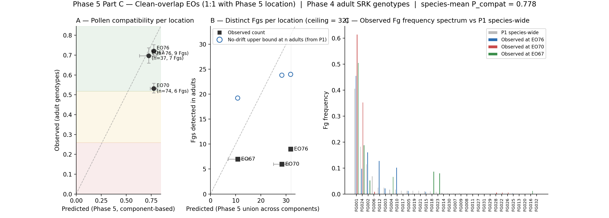

**Figure 14.** Phase 5 Part C anchor at the three clean-overlap populations — **P3 (= EO67_39)**, **P41 (= EO70_26)**, **P39 (= EO76_2)** — each 1:1 with a Phase 5 locationCode in 2025. (The figure's own axis labels still show legacy EO codes; a full re-run with population labels is a follow-up task.) Panel order follows the causal chain: diversity → pollen compatibility → per-Fg drift fingerprint. **Panel A — SRK diversity.** Phase 5 predicted (x) vs observed in adults (y), one square per location with 95 % CI horizontal error bars. 1:1 diagonal + ceiling at 32 Fgs. EO67 sits on the diagonal (model passes); EO70 (6/32) and EO76 (9/32) sit far below (large drift gap). **Panel B — pollen compatibility.** Phase 5 predicted vs observed, with the traffic-light background (red = failed, amber = struggling, green = sustainable) and 1:1 diagonal. EO67 and EO76 close to the diagonal; EO70 is the clear outlier (observed 0.53 vs predicted 0.78). **Panel C — per-Fg drift residual** `f_observed − f_P1` per location (one row each, Fgs sorted left-to-right by species-wide P1 frequency, most-common → rarest). **Green bars = Fg enriched vs P1** (drift favoured it); **red bars = Fg depleted vs P1**; **× markers = Fg absent at the location** (lost entirely). The residual pops out the drift fingerprint that the raw-frequency plot blurred — EO70 shows classic FG001 drift (+21 %) + FG024 (+18 %) with 26/32 Fgs absent; EO76 shows milder enrichment of FG012 / FG010; EO67's small-population signature elevates the normally-rare FG018 and FG023 instead of the common Fgs — a founder-effect signature rather than classical drift. Source: `step30d_partC_clean_overlap.py`.

### C.0.b Diversity collapse → pollen compatibility: hypothesis decomposition

**Why this analysis exists.** Panel A of § C.0.a (SRK diversity
predicted vs observed) exposed a disconnect that pollen
compatibility alone would have hidden: EO70 and EO76 both lose
~23 of their predicted alleles, but observed pollen compatibility
drops by 0.24 at EO70 and barely 0.03 at EO76. EO67, with just 7
alleles against a predicted 10.8, lands at 0.70 — in the
sustainable band. **Without the diversity trigger from § C.0.a we
would not have known there was a mechanism question to ask.**

**Three competing hypotheses can produce different pollen-
compatibility responses to the same diversity loss.**

1. **Within-class allele spread.** Class I and Class II total
   masses can be identical, but all of Class I's mass may be
   locked in a single allele (drift monoculture), killing
   within-class compatibility (a Class I × Class I cross is
   rejected whenever parents share an allele).
2. **Class I / Class II mass balance.** Raising / lowering the
   Class I share changes how much "between-class rescue" is
   available to Class II mothers (between-class crosses are
   always compatible under the sporophytic model).
3. **Zygosity composition.** The fraction of mothers that carry
   1 / 2 / 3 distinct SRK identities. Multi-identity mothers
   express a bigger set and face more compatible fathers for
   Class II; the effect is more complex for Class I.

#### How the decomposition is built

The same simulation that produced Figure 11 (pollen compatibility
per location) is run **five
times per location**, keeping the observed mother genotypes fixed
and swapping ONE part of the father-drawing distribution at a time
against the species-wide reference. For each scenario, 800
candidate fathers are drawn, sporophytic Class I / II compatibility
is evaluated per mother, averaged over her trials, and then over
all her location's mothers. Bootstrap over 400 resamples of
mothers gives a 95 % CI.

The **only** thing that differs between the five bars for a given
location is the father-drawing distribution:

| Scenario (bar colour)                              | Father allele frequencies            | Father zygosity composition |
|---                                                 |---                                   |---                          |
| **Observed** (black)                               | Observed local                       | Observed local              |
| **Swap within-class spread** (blue)                | **P1 shape within each class, scaled to the observed Class I and Class II totals** | Observed local |
| **Swap Class I / II balance** (red)                | **Within-class shape kept observed, class totals rescaled to the species-wide values** | Observed local |
| **Swap zygosity** (yellow)                         | Observed local                       | **Species-wide 66 / 32 / 2 % of 1-/2-/3-distinct** |
| **Phase 5 prediction** (green)                     | Species-wide P1                      | Species-wide                |

For each single-swap bar, the **driver fraction** = (counterfactual
mean − observed mean) / (species-wide prediction mean − observed
mean). A value near **+100 %** says that one factor alone closes
the entire observed → species-wide gap. A value near **0 %** says
the factor was not involved. A **negative value** means swapping
away from the observed state moves pollen compatibility *away*
from the species-wide prediction — the observed state on that axis
is **buffering** the location.

#### How to read the figure

- **Observed black bar below green**: the location has lost
  pollen compatibility relative to the species-wide prediction.
- **A single-swap bar jumps up toward green**: that factor
  explains most of the gap.
- **A single-swap bar stays next to black**: that factor is not
  involved.
- **A single-swap bar drops below black**: that factor is
  buffering the location — observed state on that axis is more
  favourable than species-wide.

#### Walk-through — the three clean-overlap locations

| Location | Alleles obs / pred | Pollen compatibility obs → species-wide pred | Within-class spread | Class I / II balance | Zygosity composition |
|---|---|---|---:|---:|---:|
| **EO67** | 7 / 10.8 (-3.8) | 0.70 → 0.76 | **+100 %** | −7 % | −13 % |
| **EO70** | 6 / 28.3 (-22.3) | 0.54 → 0.70 | **+88 %** | −3 % | −6 % |
| **EO76** | 9 / 31.8 (-22.8) | 0.75 → 0.77 | **+206 %** | +1 % | **−115 %** |

- **EO70 — classical drift collapse.** FG024 absorbs 35 % of the
  pool, FG001 another 62 %; four other alleles sit under 1 %.
  A FG024-homozygous Class I mother sees `(1 − 0.35)⁴ ≈ 0.17`
  compatibility, vs ≈ 0.43 at EO67 where Class I is split four
  ways. The blue bar jumps up to 0.68 (closing most of the gap);
  red and yellow stay next to black. **Within-class concentration
  explains the deficit; class balance and zygosity are not
  involved.**
- **EO67 — looks bad on paper, pollen compatibility survives.**
  Only 7 of 32 alleles present, but those 7 split as **4 Class I
  alleles (FG024 / FG018 / FG023 / FG016, well spread) and 3
  Class II alleles**. Each Class I mother expresses a smaller
  share of Class I mass than at EO70, so Class I × Class I
  compatibility stays reasonable. Observed zygosity (32 %
  multi-identity) is slightly higher than species-wide — the
  yellow bar sits just below black, meaning observed zygosity is
  mildly buffering. **Mate limitation at EO67 is not as bad as
  the headline 7/32 count suggests.**
- **EO76 — predicted near-perfect, observed severely collapsed,
  pollen compatibility still fine.** 9/32 alleles — a collapse
  comparable to EO70 — but pollen compatibility drops only 0.03.
  Decomposition exposes the mechanism: **zygosity is actively
  buffering EO76** (yellow sits at 0.72, below the black 0.75,
  a −115 % move relative to the gap). The location is 76 %
  homozygous (vs species-wide 66 %), and because its dominant
  Class II allele (FG001 at 46 %) is less dominant than EO70's
  FG001 (62 %), those homozygous Class II mothers express a
  small, non-dominant set and face many compatible fathers. Blue
  overshoots the species-wide prediction (within-class diversity
  at EO76 is actually better-spread than drift-only P1 would
  deliver).

#### Methodological take-home

A location's SRK diversity gap tells us drift has happened; the
pollen-compatibility response is **not** a monotonic function of
how many alleles were lost. It depends on **which** alleles were
lost, **how dominant** the remaining alleles are, and **how multi-
identity** the mothers are. Capturing this requires an accurate
sporophytic Class I / II model plus empirical zygosity (§ A.7–A.8)
— a simpler diploid gametophytic approximation would collapse all
three channels into a single "effective diversity" number and
mis-predict EO76 outright. The hypothesis decomposition therefore
doubles as validation of the model's mechanistic structure: it
successfully resolves cases where the three channels pull in
different directions.

#### Biological take-home — the deme can buffer intense drift

The three single-swap counterfactuals (within-class spread, Class I /
Class II balance, tetraploid zygosity) are not independent model
knobs — they are three **buffering mechanisms** stacked on top of
each other that let a deme keep breeding even after severe allele
loss:

1. **Class I dominance (26 of 32 Fgs).** Every between-class cross
   is compatible by construction, and Class I dominates Class II
   within a plant. A mother carrying any Class I allele has her
   compatibility set primarily by that allele, so losing *rare*
   Class I alleles barely moves the mean (the common Class I
   alleles still carry the pool).
2. **Frequency-dependent selection is forgiving when drift
   collapses onto *common* alleles.** The classical SI catastrophe
   (Lawrence 2000; Castric & Vekemans 2004) is a deme that collapses
   onto so few alleles that most mothers share them all → crash.
   But at EO70 the 6 surviving Fgs are the species's *common* ones
   (FG001 at 41 %, FG024 at 35 % locally) — the opposite of the
   worst case. Different mothers still carry different combinations,
   so the pollen pool still finds compatible targets.
3. **Tetraploid zygosity actively buffers at homozygous-rich sites.**
   At EO76, 76 % of mothers are homozygous: a homozygous mother
   expresses a single Fg at her stigma, which pollen fathers can
   more easily avoid matching than a heterozygous mother's larger
   expressed set. The yellow bar at EO76 in Figure 15 **drops below
   the observed black bar** — the quantitative signature of this
   mechanism.

**What this reverses in the standard conservation-genetics
intuition.** The usual story — *lose SRK alleles → mating failure*
— treats allele count as the bottom line. In a **tetraploid +
sporophytic Class I / II system with the specific class imbalance
LEPA has**, the mating-level consequence of allele loss is
**actively buffered** until the pool either (i) collapses onto a
single class or (ii) homozygosity becomes so extreme that the
expressed-set channel constrains compatibility. The 32 → 6 drift
collapse at EO70 is severe by any count, and yet the pollen pool
still works at 70 % compatibility (close to the species mean 0.78).
**The system has structural redundancy that diversity-counting
alone cannot see.** The next-sampling-campaign data at the B1 pilot
pair will tell us whether any location is near either tipping point.

**Workflow placement.** This analysis is a follow-through on § C.0.a's
diversity trigger, not a stand-alone pollen-compatibility test.
When a location's observed allele diversity sits noticeably below
the Phase 5 prediction, run `step30e_pcompat_hypothesis_decomposition.py`
to see which of the three channels is driving the downstream
pollen-compatibility response.

**Outputs.**

- [`step30_B_partC_hypothesis_decomposition.tsv`](tables/Phase5/step30_B_partC_hypothesis_decomposition.tsv)
  — one row per clean-overlap location with the diversity trigger
  (observed vs Phase 5 predicted distinct allele counts), observed +
  three single-swap counterfactual pollen compatibility estimates
  with bootstrap 95 % CIs, observed Class I mass, observed zygosity
  distribution, and the three "driver fraction" columns.
- [`step30_B_partC_hypothesis_decomposition.png`](figures/Phase5/step30_B_partC_hypothesis_decomposition.png)
  — grouped bar chart per location (see caption below).

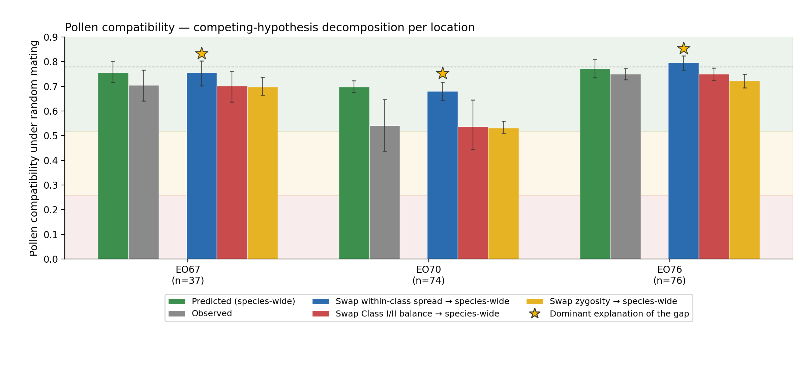

**Figure 15.** Competing-hypothesis decomposition of per-location pollen compatibility. Triggered by the SRK diversity discrepancies in § C.0.a. For each clean-overlap population — P3 (= EO67), P41 (= EO70), P39 (= EO76) — the figure shows five pollen-compatibility values from the same simulation (sporophytic Class I / II + empirical zygosity, 800 candidate fathers per mother, observed mother genotypes held fixed), each differing in which part of the father-drawing distribution is swapped to the species-wide reference. **Black — Observed:** fathers drawn from observed local allele frequencies and observed local zygosity. **Blue — Swap within-class spread:** keep observed Class I and Class II total masses, but reshape the within-class spread to match the P1 pattern (isolates the "drift monoculture" channel). **Red — Swap Class I / II balance:** keep within-class shape observed, rescale the two class totals to the species-wide values (isolates between-class rescue). **Yellow — Swap zygosity:** keep observed allele frequencies, swap father zygosity to species-wide 66/32/2 % (isolates the per-mother expressed-set channel). **Green — Phase 5 prediction:** everything swapped to species-wide. Error bars = bootstrap 95 % CI (400 mother resamples). Traffic-light bands shaded in the background; dashed grey line = species-wide pollen compatibility 0.78. **Reading rules:** a blue/red/yellow bar jumping toward green means that factor caused the gap; staying next to black means it was not involved; dropping below black means it is **buffering** the location (observed state on that axis is better than species-wide). **EO70** — blue dominates (within-class drift monoculture, FG024 at 35 % of pool); red and yellow neutral. **EO67** — small deficit, blue explains it; zygosity slightly buffering. **EO76** — small deficit despite collapsing from 32 to 9 alleles; yellow drops below black, meaning zygosity (76 % homozygous mothers) is actively buffering the location, and blue overshoots green because the specific within-class spread at EO76 is better than drift-only P1 would deliver. Source: `step30e_pcompat_hypothesis_decomposition.py`.

**Note — why P1 is empirical, not uniform.** A uniform-frequency P1
(Dirichlet(α = 1) over 32 Fgs, equivalent to the P0 "uninformative"
prior kept as a reference baseline) would represent a **neutral null
with no drift history**. That is not LEPA: decades of habitat loss
have already pushed the species through drift, so empirical P1 — the
observed Fg frequencies in the Canu-amplicon 263-individual inventory
— is the realistic *starting point* against which per-location
further drift is measured. Panel C makes this concrete: EO70's local
pool has moved *past* P1 toward FG001 dominance, so even the already-
skewed empirical prior underestimates how collapsed the local pool
is. A uniform P1 would start from a flat distribution and declare
every observed location "drifted", which is both less informative
(the species-wide signal is real) and less actionable (the baseline
would not reflect how LEPA actually enters the modelling frame).

### C.0.c Hypothesis test — can the diversity gap be closed by tightening the deme radius?

**Why this test exists.** Figure 14 shows the diversity prediction
over-estimates the observed SRK allele count by ~20 alleles at every
clean-overlap location (predicted 11 / 28 / 32 vs observed 7 / 6 / 9).
§ C.0.b above decomposes *why pollen compatibility nevertheless
tracks observation*; here we ask whether the diversity gap at EO70
and EO76 could be an artefact of the operational deme being too
wide at 50 m. Two competing scenarios:

- **H1 — the 50 m operational deme is too wide.** Realised gene
  flow is tighter; a smaller radius should partition each location
  into more small demes with (within the current model) independent
  drift histories drawn from the species-wide prior P1. If H1 is
  right, the gap should shrink as radius tightens.
- **H2 — per-deme drift history exceeds the species-wide prior
  P1.** Each deme has drifted *past* what P1 captures, so no
  spatial repartition at any radius closes the gap under the
  current model. The gap should stay flat across the sweep.

**Scope — what the test can and cannot do.** The sweep rebuilds
the deme partition at radii 10, 25, 50, 75, 100, 150 m and re-runs
the per-deme diversity simulation (2000 replicates per combination).
Each sub-deme draws alleles from P1 — i.e. the test varies the
*spatial partition* while holding the *drift model* fixed. **It
can only reject H1 within the P1 drift assumption; it does not
simulate H2 directly** (that would require per-deme empirical
frequency vectors we do not have yet — the next seed-genotyping
campaign is designed to measure them).

**EO67 is omitted from the figure.** It has only 2 events in the
2025 record, placed > 150 m apart, so the deme partition is
invariant across every tested radius (2 demes everywhere). The
sweep is non-informative there, and EO67's observed count is
inside the 95 % CI of the Phase 5 prediction already — no gap to
explain. The figure restricts to **EO70** and **EO76**, which do
show meaningful fragmentation across the sweep (EO70: 1 → 3 demes;
EO76: 5 → 17 demes as radius tightens).

**Result — H1 is rejected within the P1 drift assumption at EO70
and EO76** ([Figure 16](#fig-16)).

| Location | Observed | Predicted at r = 10 m | at 50 m | at 150 m | Deme count 10 m / 50 m / 150 m |
|---|:---:|:---:|:---:|:---:|:---:|
| **EO70** | 6 | 28.3 [25, 31] | 28.3 [25, 31] | 28.4 [25, 31] | 3 / 1 / 1 |
| **EO76** | 9 | 31.8 [31, 32] | 31.8 [31, 32] | 31.8 [31, 32] | 17 / 6 / 5 |

The prediction **does not move** across the sweep: even fragmenting
EO76 into 17 small demes at 10 m, or EO70 into 3 demes at 10 m,
leaves the union-of-per-deme pools at essentially the same 28–32
Fgs. The ~22-allele gap at EO70 and ~23-allele gap at EO76 do not
close. Full table at
[`step30f_srk_diversity_radius_sweep.tsv`](tables/Phase5/step30f_srk_diversity_radius_sweep.tsv).

**Why the sweep is flat — the mechanics.** The location-level
prediction is the **union** of per-deme Fg sets, not a sum. When
a radius change re-partitions a location into more or fewer
sub-demes, the **total number of allele copies sampled stays
fixed at 4 × N_fertile_total** — the sweep only redistributes
those draws across sub-demes. Each sub-deme on its own may miss
rare Fgs under P1 (where FG001 ≈ 41 %, five more Fgs ≈ 25 %
combined, 20+ rare Fgs each < 2 %), but a rare Fg at frequency
*p* now has multiple sub-demes to appear in, and the union captures
it with probability `1 − (1 − p)^(4 × N_total)` — governed by the
location **total**, not the partition. Concretely at EO70's 10 m
extreme the 161 plants split into sub-demes of 78 / 65 / 18 that
each recover ~26 / 25 / 19 Fgs independently, but **their union
still delivers 28**, same as the single 161-plant deme at 50 m.
Spatial sub-partitioning washes out at the location level once the
total pool saturates P1 (above ~50–100 adults in LEPA). The
partition would only matter at a location whose total `N_fertile`
sits below that saturation ceiling and whose sub-deme sizes drop
into the low single digits — neither applies at EO70 or EO76.
**Under P1 drift, varying the deme partition therefore cannot
close the diversity gap at any radius** — only a drift model that
differs per deme can (which is what the seed-genotyping campaign
will measure).

**Interpretation — what we can and cannot say.**

1. **The 50 m operational deme is defensible as a first-pass
   partition.** No tighter radius would reconcile prediction with
   observation under the current model.
2. **The gap cannot be a pure spatial-partitioning artefact.** The
   only way it closes is if drift histories *inside* each deme
   have diverged from P1, i.e. per-deme empirical priors — that
   is the H2 scenario, which requires seed-genotyping to test.
   **Biologically: the sweep rules out a geometric explanation
   and leaves the within-deme biological one — prolonged drift,
   founder effects, or local bottlenecks that have stripped
   alleles beyond what the species-wide prior encodes. The deme
   is still the right unit of inference; what the data say is
   that the drift history inside each deme is more severe than a
   single species-wide frequency vector captures, which is the
   central prediction of the fragmentation → drift → mate-
   limitation causal chain this framework was built to test.**
3. **The direction of error is favourable.** Over-predicting at a
   radius that is already a geographic upper bound says the real
   demes are **at most** 50 m and could be tighter. A future
   refinement can only add demes (and therefore mothers per
   location), giving us finer-scale information for free. The
   opposite — under-predicting ⇒ deme too narrow ⇒ false-positive
   fragmentation — would waste sampling on sub-demes that do not
   exist.

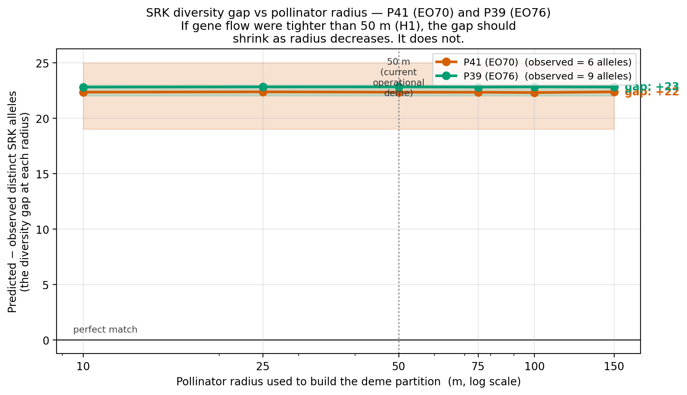

**Figure 16.** SRK diversity gap (y = predicted − observed distinct SRK alleles) vs pollinator radius at **P41 (= EO70)** and **P39 (= EO76)**. x = radius used to rebuild the deme partition (10 → 150 m, log scale). Lines + 95 % CI bands = per-location per-radius simulation (2000 replicates per combination). Right-side labels show the gap at the largest radius; parenthetical observed counts come from the Phase 4 adult SRK genotypes (a single measurement, not a sweep output — shown as labels, not horizontal lines). Zero line = perfect match. Vertical dotted line at 50 m marks the current operational deme. H1 (deme too wide) would predict the gap to shrink toward zero as radius tightens; it stays flat at +22 and +23 across all radii, including the 10 m extreme that fragments EO70 into 3 demes and EO76 into 17 — rejecting H1 within the P1 drift assumption. P3 (= EO67) is omitted (deme partition invariant across the sweep, test non-informative). Source: `step30f_srk_diversity_hypothesis_test.py`.

### C.0.d Behavioural check — observed seed yield vs size expectation per population (Step 30i)

**Why this test exists.** § C.0.a – C.0.c compare predicted vs
observed SRK quantities (allele counts, pollen compatibility,
drift fingerprints) — all require **adult SRK genotypes**.
Phase 4 only has genotypes at three clean-overlap populations (P3 = EO67, P41 = EO70, P39 = EO76). This
section adds a **behavioural check that uses no SRK data** and
therefore runs on all 44 Phase 5 populations: **does each
population's observed seed yield match what its plants'
sizes predict?** If a population's plants systematically
produce fewer seeds than the species-wide size → yield allometry
expects, mate limitation is surfacing *behaviourally* — a direct
signature of the Phase A P_compat prediction without needing a
single SRK call. Equally important, if a **small** population's
plants produce **as many seeds as their size predicts**, then
the § C.0.b buffering stack (Class I dominance + class imbalance
+ tetraploid homozygosity) held even there — a positive result
for the predicted-sustainable call.

**Approach — across-species build, then within-population test.**
The test splits into two stages:

1. **Across-species build**: Stage 1 picks the best size
   predictor out-of-sample via 10-fold CV RMSE on log10
   seed yield across four candidate allometries — `height`,
   `crown`, `area = π/4 · crown · height`, and `crown + height`
   (free exponents). Stage 2 refits the CV-winner on **all plants
   pooled across populations and years**: this is the
   species-wide expectation curve. Every plant then has an
   expected log10(yield) and a residual = observed −
   expected. **Figure 17a** shows this build: observed vs
   expected for every plant, log-log, coloured by BL, with the
   1:1 species curve and the ×½ / ×2 reference lines.
2. **Within-population test**: Stage 3 tests per (populationID,
   year) whether the mean residual is systematically < 0 using
   a one-sample t-test (n ≥ 3) with a Benjamini-Hochberg FDR
   across the ~ 80 strata. **No min-n threshold** — small
   populations are **included and highlighted** (user focus
   2026-10-07): small-N rows carry wide CIs, but still show up
   in the plot. **Figure 17b** is the per-population forest
   plot of fold-of-expectation (= 10mean residual).

Each plant is its own control via the species-wide allometry, so
a population that shows a systematic residual is NOT just a size
artefact — it is behaving differently from same-size plants
elsewhere in the species.

**Caveat on 2026 germplasm coverage.** A fraction of the 2026
mother-plant occurrences do not yet have associated germplasm
records attached in the DB (clean-up in progress 2026-10-07).
2026 shortfall calls may therefore be inflated at populations
that are still missing collections; re-run step30i once the
2026 germplasm cleaning is complete.

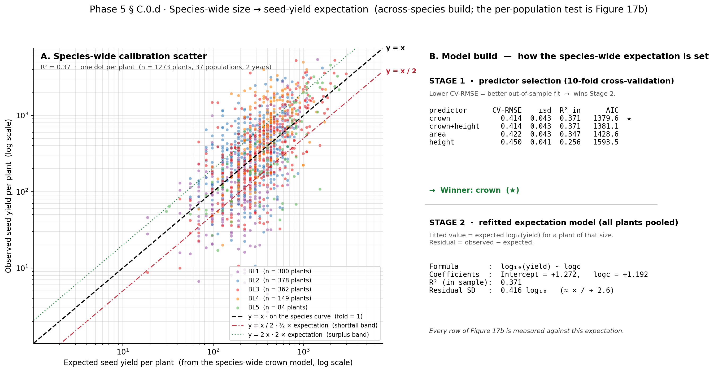

**Figure 17a — the across-species build.** Species-wide
calibration scatter underlying the per-population test. **Panel
A (left):** every plant that has crown + height + seed yield
plotted as expected (species-wide allometry, log scale) vs
observed (log scale), coloured by its population's BL. Dashed
line = the species curve (fold = 1); dotted lines = ×½ and ×2
reference bands. **Panel B (right):** the model build itself —
the Stage 1 10-fold CV predictor-selection table (which
allometry wins out-of-sample) + the Stage 2 refitted
expectation-model summary (coefficients, R², residual SD). This
is what every row of Figure 17b is measured against. Source:
`step30i_size_seed_population_test.py`.
Data: [`step30i_size_seed_cv_rmse.tsv`](tables/Phase5/step30i_size_seed_cv_rmse.tsv).

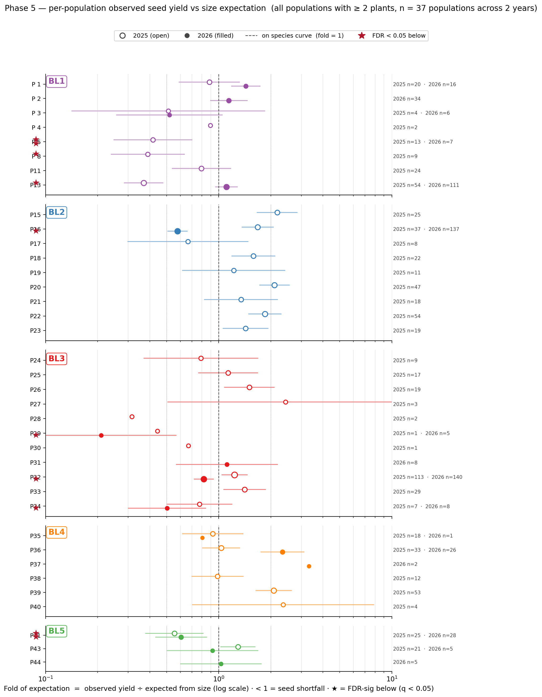

**Figure 17b — the within-population test.** Observed seed yield
per plant divided by the expected yield from Figure 17a's
species-wide allometry, aggregated per (populationID, year). One
row per population; **open circle = 2025 draw, filled circle =
2026 draw** in the same BL colour, slightly offset vertically;
dot size ∝ √*n* plants. Horizontal bars = 95 % CI; the dashed
vertical line at fold = 1 is the species curve. The light grey
×½ and ×2 reference bands are the operational "biologically
meaningful shortfall / surplus" markers. A **red halo around a
specific dot** = that (populationID, **year**) is FDR-sig below
expectation (q < 0.05 and mean residual < 0) — i.e. its plants
produced fewer seeds than their sizes predict, a behavioural
signature of mate limitation. The flag is per-year, not
per-population: a population halo'd in only 2025 means the
2025 draw underperformed and 2026 did not (or vice versa); a
population halo'd in both years means the shortfall was
sustained across years. Panels stacked by BL; left margin =
`P{N}`; right margin = per-year `n` plants. Source:
`step30i_size_seed_population_test.py`. Data:
[`step30i_size_seed_population_strata.tsv`](tables/Phase5/step30i_size_seed_population_strata.tsv).

**Headline findings** (first run, 2026-10-07 — 10 strata flagged
below expectation at FDR < 0.05).

- **BL1 EO27 cluster is the clearest signal.** Four of the EO27-*
  populations under-produce: **P5 EO27-3** both years (fold 0.42
  / 0.02), **P8 EO27** 2025 (0.39), **P13 EO27-1 + EO27RT** 2025
  (0.37, BIG D3 Next-test candidate). Consistent with the
  dedicated EO27-is-size-restricted field note that originally
  motivated this analysis in the parent LEPA_fieldwork_protocol
  study.
- **EO70 (P41 BL5) reproduces the Phase 4 P_compat gap**
  behaviourally: fold 0.55 (2025) / 0.61 (2026). The Phase 4
  adult SRK data at EO70 (§ C.0.a) called observed P_compat
  0.53 vs predicted 0.78 — i.e. a predicted sustainable
  population that was behaving as struggling. The seed-shortfall
  signal here reaches the same conclusion **without needing any
  SRK genotype**.
- **The Next-test D1 pair direction confirms the prediction.**
  SMALL side **P34 EO25-B_21** fold = 0.50 (2026, 8 mothers);
  BIG side **P32 EO18-7 + EO18-8** fold = 0.82 (2026, 140
  mothers). The SMALL side has a **2× bigger seed shortfall**
  than the BIG side, in the direction the Phase A P_compat
  prediction says it should be.
- **Buffering candidates.** Several small populations show seed
  yield **at or above** the size expectation despite tiny N —
  e.g. P40 EO76_2 2025 n = 4 fold = 2.35; P27 EO24-7_25 2025
  n = 3 fold = 2.43; P43 EO68-3_5 2025 n = 21 fold = 1.29. These
  are the populations where the § C.0.b buffering stack worked
  even without a deep allele pool. The seed-set data separates
  the "small → mate limitation surfaces" cases from the "small
  → buffered sustainable" cases cleanly.

---

## Phase B — Closing the causal chain with seed data

**Test 1 — Mate-limitation regression (§ C.1 of the long doc).**
Once seed genotypes are back, per-location observed P_compat is
computed from real mother-father pairings. The regression
`per-mother seed set ~ β₁ · P_compat + β₂ · mating_neighbourhood + …`
decomposes the fragmentation effect into two pathways:

- **β₁ (P_compat effect)** measures the strength of the **complete
  drift → mate-limitation branch** — the reproductive consequence of
  the fragmentation-driven Fg loss and skew that Phase A predicted.
- **β₂ (mating-neighbourhood effect)** measures whether fragmentation
  has **direct effects on seed set that are NOT mediated through Fg
  composition** (e.g. fewer neighbouring adults means fewer pollinator
  visits, independent of which alleles they carry).

Together the two coefficients tell us how much of fragmentation's
reproductive cost flows through drift, and how much bypasses it. A
large β₁ + small β₂ = the drift chain fully explains the fragmentation
effect; a large β₂ + small β₁ = fragmentation reduces seed set through
pollinator-behaviour pathways we haven't modelled; both large = both
channels contribute. All three interpretations can be pre-registered
before seed data arrive.

---

## Recommended field pilot — BL3 within-BL stable pair (P34 + P32)

Before running Phase B across all 44 populations, we recommend a
**two-population pilot within Bottleneck Lineage 3 (BL3)** — one
**SMALL stable** population (**P34 = EO25-B_21**, 26 adults
across both years, 7 + 8 = **15 mothers in DB**) paired with one
**BIG stable** population (**P32 = EO18-7 + EO18-8**, 1440 adults
across five locationIDs, 115 + 161 = **276 mothers in DB**).
Both pass the stability test (both-year occupancy, overlapping
95 % 2025 vs 2026 CIs on diversity and pollen compatibility,
`N_fert_total ≥ 20`). Updated 2026-10-07 from the earlier
BL5-fragmentation-contrast design; see § Across-year population
dynamic for the stable-population inventory and the Executive
summary **Next test** block for the full D1/D2/D3 option table.

**Why BL3.** Across the three BLs that hold ≥ 2 stable populations
(BL1, BL2, BL3), **BL3 holds the single largest well-stocked
population** (P32, 1440 adults with 276 mothers in the LEPA DB
after the 2026 top-up) **and** a stable SMALL population at the
other end of the size spectrum (P34, 26 adults). The pair-level
mother budget of **291 mothers across 2025 + 2026** is the
largest available within-BL stable contrast in Phase 5 and
roughly **1.5 × the next-best option** (D3 at 190 mothers,
BL1 P3 + P13). Holding BL identity constant means observed
deviations are a within-BL small-vs-big signal, not a between-BL
drift-history confound.

**What this specific pair tests.**

- **P32 EO18-7 + EO18-8 — large stable regime** (1440 adults
  spread across 5 locationIDs and several demes). Phase 5
  predicts a sustainable population at the species mean; this
  side is the cleanest test of the model's "ample pool →
  compatible mating" prediction.
- **P34 EO25-B_21 — small stable regime** (26 adults). Small
  enough that drift should erode the pool measurably per deme,
  yet stable enough to carry a mother budget. If Phase 5's
  per-deme simulation predicts a materially lower pollen
  compatibility at P34 than P32, and the observed seed-set data
  track that gap, the within-BL small-vs-big signal is confirmed.

**Mother-plant feasibility (LEPA DB, Wild germplasm, 2025 + 2026).**

| Side | populationID | Location(s) | 2025 mothers | 2026 mothers | **Total** |
|---|---|---|---:|---:|---:|
| SMALL | P34 | EO25-B (locationID 21) | 7 | 8 | **15** |
| BIG | P32 | EO18-7 + EO18-8 (locationIDs 15, 16, 17, 18, 19) | 115 | 161 | **276** |
| **Pair** |  |  | **122** | **169** | **291** |

**Pilot cost (upper bound).** If all 291 mothers were genotyped
at 15 seedlings each: 291 × 25 seeds = **~7 275 seeds to
germinate** → ~4 365 seedlings to genotype (at 60 % germination).
A more targeted subset — say 15 SMALL mothers × 15 seedlings and
30 – 60 BIG mothers × 15 seedlings — brings the cost well below
2 000 seedlings. Exact per-mother allocation per deme is in
[`step29c_partC_germplasmID_selection.tsv`](tables/Phase5/step29c_partC_germplasmID_selection.tsv)
(germplasmIDs to pull, per-deme allocation, 60 % germination
correction baked in).

**Pair evaluations and stable-population inventory**:
[`step30g_populations_classified.tsv`](tables/Phase5/step30g_populations_classified.tsv)
is the authoritative source of the trend classification plus the
`populationID → locationCode` map; the three within-BL stable
pair options (D1 / D2 / D3) are summarised in the Executive
summary.

---

## Deliverables and where to look

| What | File | Notes |
|---|---|---|
| P1 prior over 32 Fgs | [`tables/Phase5/step30_A_prediction_prior_frequencies.tsv`](tables/Phase5/step30_A_prediction_prior_frequencies.tsv) | Species-wide Fg frequencies + Dirichlet α |
| Predicted per-location diversity | [`tables/Phase5/step30_A_prediction_location_diversity.tsv`](tables/Phase5/step30_A_prediction_location_diversity.tsv) | Species-wide + local coverage, 95 % CI |
| Predicted per-50 m-component diversity | [`tables/Phase5/step30_A_prediction_component_diversity.tsv`](tables/Phase5/step30_A_prediction_component_diversity.tsv) | Pool size, allocated mothers/seeds, coverage per component |
| Predicted per-location P_compat | [`tables/Phase5/step30_A_prediction_location_pcompat.tsv`](tables/Phase5/step30_A_prediction_location_pcompat.tsv) | Sporophytic + empirical zygosity |
| Predicted per-50 m-component P_compat | [`tables/Phase5/step30_A_prediction_component_pcompat.tsv`](tables/Phase5/step30_A_prediction_component_pcompat.tsv) | Exposes struggling sub-components inside a sustainable-mean location |
| Fragmentation indices | [`tables/Phase5/step30_A_fragmentation_per_event.tsv`](tables/Phase5/step30_A_fragmentation_per_event.tsv), [`_per_location.tsv`](tables/Phase5/step30_A_fragmentation_per_location.tsv) | Pure spatial, no allele frequencies |
| Event → 50 m component lookup | [`tables/Phase5/step29c_event_to_component_50m.tsv`](tables/Phase5/step29c_event_to_component_50m.tsv) | Canonical "which events share a pollen pool?" |
| Field-team recipe (new field season) | [`tables/Phase5/step29c_sampling_frag_aware_per_event.tsv`](tables/Phase5/step29c_sampling_frag_aware_per_event.tsv) | `M_frag` per event, authoritative |
| **Lab recipe for Part C — germplasmIDs to sample** | [`tables/Phase5/step29c_partC_germplasmID_selection.tsv`](tables/Phase5/step29c_partC_germplasmID_selection.tsv) | **One row per selected germplasmID already in the LEPA DB; per-50 m-component allocation + `n_seeds_to_genotype`. Drives Part C.** |
| Background EO-scale diagnostic for split EOs (§ C.0) | [`tables/Phase5/step30_C_pcompat_validation_at_eo.tsv`](tables/Phase5/step30_C_pcompat_validation_at_eo.tsv) | EO18, EO25, EO27 (the three EOs whose Phase 5 location-scale remap is still pending); no figure |
| **Part C anchor at Phase 5 location scale (§ C.0.a)** | [`tables/Phase5/step30_B_partC_clean_overlap_per_location.tsv`](tables/Phase5/step30_B_partC_clean_overlap_per_location.tsv) + [`_fg_frequencies.tsv`](tables/Phase5/step30_B_partC_clean_overlap_fg_frequencies.tsv) | **Clean-overlap populations P3 (= EO67), P41 (= EO70), P39 (= EO76) — 187 adults ready to feed Part C now; observed vs Phase 5 pred P_compat + SRK diversity + no-drift upper bound** |
| **Hypothesis decomposition (§ C.0.b)** | [`tables/Phase5/step30_B_partC_hypothesis_decomposition.tsv`](tables/Phase5/step30_B_partC_hypothesis_decomposition.tsv) | **Decomposes the pollen-compatibility deviation at each clean-overlap location into within-class spread / Class I-II balance / zygosity contributions; triggered by the SRK diversity gap** |

**Key figures** (ordered by appearance in this doc).

- **Figure 1** — [`step30_A_radius_sensitivity.png`](figures/Phase5/step30_A_radius_sensitivity.png) — why 50 m is the right primary pollinator radius.
- **Figure 2** — [`step29a_populations_overview.png`](figures/Phase5/step29a_populations_overview.png) — the 44 Phase 5 populations across the Snake River Plain, colour-coded by 2025 + 2026 occupancy.
- **Figure 3** — [`step30h_dendrogram.png`](figures/Phase5/step30h_dendrogram.png) — Ward's D2 dendrogram at the population level; the *k* = 5 cut defines the five Bottleneck Lineages.
- **Figure 4** — [`step30h_silhouette_curve.png`](figures/Phase5/step30h_silhouette_curve.png) — silhouette-based *k* selection; *k*optimal = 5 confirms the Phase 4 EO-level BL cardinality on independent data.
- **Figure 5** — [`step30h_overview_by_BL.png`](figures/Phase5/step30h_overview_by_BL.png) — Snake River Plain overview with populations and convex hulls coloured by BL1 … BL5.
- **Figure 6** — [`step30g_populations_classified.png`](figures/Phase5/step30g_populations_classified.png) — the 44 populations grouped by across-year trend class (crash / stable / growth / ambiguous / 2025_only / 2026_only), sorted by BL within each class.
- **Figure 7** — [`step30g_across_year_scatter.png`](figures/Phase5/step30g_across_year_scatter.png) — predicted SRK diversity and pollen compatibility, 2025 vs 2026, per both-year population.
- **Figure 8** — [`step29a_demes_per_population_year.png`](figures/Phase5/step29a_demes_per_population_year.png) — per-population per-year deme-size distribution (log-scale deme size with N = 1 / 8 / 32 reference lines, 2025 open vs 2026 filled).
- **Figure 9** — [`step30h_pred_diversity.png`](figures/Phase5/step30h_pred_diversity.png) — predicted SRK allele diversity per population, 2025 (open) vs 2026 (filled) overlaid, grouped by new BL.
- **Figure 10** — [`step30_A_si_model_schematic.png`](figures/Phase5/step30_A_si_model_schematic.png) — sporophytic Class I / Class II dominance in tetraploid LEPA: dominance within one plant, between-plant recognition, and the compatibility rule by cross type.
- **Figure 11** — [`step30h_pred_pcompat.png`](figures/Phase5/step30h_pred_pcompat.png) — predicted pollen compatibility per population, 2025 (open) vs 2026 (filled) overlaid, traffic-light bands, grouped by new BL.
- **Figure 12** — [`step28_coverage_curves.png`](figures/Phase5/step28_coverage_curves.png) — § B.3 Step 28 SRK allele detection curves under tetraploid LEPA; per-mother + aggregation-across-mothers panels. The proof that 15 seeds per mother × 5+ mothers per location recovers the local SRK pool well enough to test Phase A predictions.
- **Figure 13** — [`step28d_matelim_power.png`](figures/Phase5/step28d_matelim_power.png) — § B.3.1 two-panel justification for the 15-seedlings-per-mother floor: per-mother P_compat precision (left) + § C.1 mate-limitation regression power (right).
- **Figure 14** — [`step30_B_partC_clean_overlap.png`](figures/Phase5/step30_B_partC_clean_overlap.png) — § C.0.a Part C anchor at P3 (EO67) / P41 (EO70) / P39 (EO76) (SRK diversity + pollen compatibility + per-allele drift residual).
- **Figure 15** — [`step30_B_partC_hypothesis_decomposition.png`](figures/Phase5/step30_B_partC_hypothesis_decomposition.png) — § C.0.b competing-hypothesis decomposition.
- **Figure 16** — [`step30f_srk_diversity_radius_sweep.png`](figures/Phase5/step30f_srk_diversity_radius_sweep.png) — § C.0.c SRK-diversity radius sweep (deme-size vs residual-drift test).
- **Figure 17a** — [`step30i_species_calibration.png`](figures/Phase5/step30i_species_calibration.png) — § C.0.d across-species build: calibration scatter (observed vs expected per plant, coloured by BL) + predictor-selection CV table + expectation-model summary.
- **Figure 17b** — [`step30i_size_seed_population.png`](figures/Phase5/step30i_size_seed_population.png) — § C.0.d within-population test: observed seed yield per population vs size expectation, 2025 (open) vs 2026 (filled), all 44 populations with ≥ 2 plants; red halo around a specific dot = FDR-sig below expectation for that (population, year).
- Candidate-population zoom panels — [`step29a_candidate_populations_zoom.png`](figures/Phase5/step29a_candidate_populations_zoom.png) + [`step29a_crash_populations_zoom.png`](figures/Phase5/step29a_crash_populations_zoom.png) (supporting plots for the LARGE + SMALL + crash candidates).

---

## For technical detail

Formulas, code, output schemas, and design decisions are documented
in the long companion doc [`Phase5_SRK_sampling_and_prediction.md`](Phase5_SRK_sampling_and_prediction.md):

- § A.3 — species-wide prior + two-generation model.
- § A.5 — fragmentation of pollen flow, event vs location scales.
- § A.7 — sporophytic Class I / Class II SI biology.
- § A.8 — finite-population P_compat formulas (Case A / Case B).
- § B.4.2 — fragmentation-aware sampling derivation.
- § C.0 — EO-level empirical validation (the § C.0 above is the
  compact version of this section).
- § C.1 — the mate-limitation regression (Phase B).

---

## References

The population-genetics scaffolding for the operational-deme
framework and the fragmentation → drift → mate-limitation causal
chain. BibTeX entries live in [`Phase5_references.bib`](Phase5_references.bib).

- **Aguilar, R., Quesada, M., Ashworth, L., Herrerías-Diego, Y. & Lobo, J. (2008).** Genetic consequences of habitat fragmentation in plant populations: susceptible signals in plant traits and methodological approaches. *Molecular Ecology* 17, 5177–5188.
- **Castric, V. & Vekemans, X. (2004).** Plant self-incompatibility in natural populations: a critical assessment of recent theoretical and empirical advances. *Molecular Ecology* 13, 2873–2889.
- **Freckleton, R.P. & Watkinson, A.R. (2002).** Large-scale spatial dynamics of plants: metapopulations, regional ensembles and patchy populations. *Journal of Ecology* 90, 419–434.
- **Hanski, I. (1998).** Metapopulation dynamics. *Nature* 396, 41–49.
- **Hardy, O.J. & Vekemans, X. (1999).** Isolation by distance in a continuous population: reconciliation between spatial autocorrelation analysis and population genetics models. *Heredity* 83, 145–154.
- **Levins, R. (1969).** Some demographic and genetic consequences of environmental heterogeneity for biological control. *Bulletin of the Entomological Society of America* 15, 237–240.
- **Honnay, O. & Jacquemyn, H. (2007).** Susceptibility of common and rare plant species to the genetic consequences of habitat fragmentation. *Conservation Biology* 21, 823–831.
- **Lawrence, M.J. (2000).** Population genetics of the homomorphic self-incompatibility polymorphisms in flowering plants. *Annals of Botany* 85 (Suppl. A), 221–226.
- **Levin, D.A. & Kerster, H.W. (1974).** Gene flow in seed plants. *Evolutionary Biology* 7, 139–220.
- **Schierup, M.H., Vekemans, X. & Christiansen, F.B. (1998).** Allelic genealogies in sporophytic self-incompatibility systems in plants. *Genetics* 150, 1187–1198.
- **Vekemans, X. & Hardy, O.J. (2004).** New insights from fine-scale spatial genetic structure analyses in plant populations. *Molecular Ecology* 13, 921–935.
- **Wright, S. (1943).** Isolation by distance. *Genetics* 28, 114–138.
- **Wright, S. (1946).** Isolation by distance under diverse systems of mating. *Genetics* 31, 39–59.
