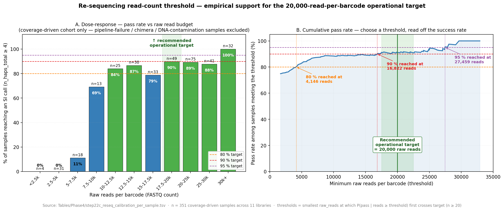

# SRK Bioinformatics Pipeline

A 5-phase pipeline that turns Oxford Nanopore amplicon reads of the **S-receptor kinase (SRK)** locus in self-incompatible (often polyploid) plants into per-individual S-allele genotypes, population-genetic diagnostics, per-individual self-incompatibility status (SI / pSI / SC), forward-time inheritance projections, and an experimentally executable cross plan. Built for conservation breeding of threatened plant species — the worked example is *Lepidium papilliferum* ("slickspot peppergrass") in [`LEPA_SRK_report.md`](LEPA_SRK_report.md).

<figure>

<figcaption><em>SRK pipeline overview — 5-phase roadmap from Nanopore amplicons through functional S-alleles to conservation diagnostics, cross plan, and forward-time simulation. Produced by <code>SRK_pipeline_overview_figure.R</code>. Click the image to open it at full resolution.</em></figcaption>
</figure>

Read the figure left-to-right: each phase shows what it does (bullets), the steps it covers, and the canonical output it produces. Phases 2 → 3 → 4 → 5 each consume the previous phase's outputs.

### Two design choices worth flagging up front

**Chimeric sequences are filtered at two independent stages.** Nanopore amplicon assembly routinely produces chimeric haplotypes — false haplotypes spliced together from reads of two different SRK alleles. Because the splice junction usually introduces a premature stop codon, chimeras look molecularly indistinguishable from real broken SRK copies. Left in the data, they inflate the per-individual broken-copy count and produce false partial-SI / self-compatible calls — the whole self-incompatibility story would then track assembly noise rather than biology. The pipeline catches them at two stages because they leave a different fingerprint at each:

- **Before translation, on the assembled contigs themselves.** A chimera carries a splice-junction depth signature even when its sequence reads as plausible — local read coverage crashes where two different haplotypes were stitched together.
- **After translation, on the broken protein candidates.** A real broken copy of a known S-allele still resembles that allele almost everywhere except for the premature stop, while a chimeric assembly is a mosaic of two allele backgrounds and therefore sits far from every known allele in amino-acid space.

The two stages catch different chimeras. Only individuals whose surviving haplotypes pass both filters are eligible for an SI / partial-SI / self-compatible call, which is what makes the per-individual SI status defensible.

**One file tells the lab which samples to re-run.** Every reason a sample might need lab follow-up — failed amplicon length, paralog amplification, contaminated DNA, low Nanopore coverage, or an unresolved SI call after the chimera filter — is funnelled into a single merged sheet at [`tables/Phase2/step12c_samples_redo.csv`](tables/Phase2/step12c_samples_redo.csv). Each row carries one of three lab actions:

- **Re-PCR** — the DNA stock is fine; the PCR amplicon failed. Re-amplify.
- **Re-DNA-extraction** — the DNA stock itself is contaminated. Re-isolate from tissue.
- **Re-sequence (SI status uncertain)** — the existing DNA and library are fine, but Nanopore coverage was too thin to leave enough clean haplotypes for an SI call after the chimera filter. Re-run on the sequencer at higher coverage.

This is the only file the team consults to know what to redo and why.

### Sequencing requirements — empirical calibration for SI-callable samples

A practical question the lab needs answered before sending material to the sequencer: *how much depth do we need to get a defensible SI call?* The pipeline produces a per-sample calibration that joins each barcode's raw Nanopore read budget to its eventual SI / partial-SI / self-compatible outcome, and reports the read budget at which success becomes reliable.

<figure>

<figcaption><em>Re-sequencing read-count threshold — empirical support for the operational target. Left panel: bin-level pass rate vs raw read budget. Right panel: cumulative pass rate — choose a threshold on the x-axis and read off the expected success rate. Restricted to coverage-driven samples (pipeline-failure, chimera-difficulty, and DNA-contamination cohorts excluded). Produced by <code>reseq_threshold_figure.py</code>.</em></figcaption>
</figure>

**Operational target: ~ 20 000 raw Nanopore reads per barcode** — at that depth, the empirical success rate for coverage-driven samples plateaus around 90 %. ~ 30 000 raw reads pushes success to ~ 100 %. The same calibration also separates *coverage-limited* failures (more reads will help) from *template-limited* and *pipeline-limited* failures (more reads will not help and the right intervention is different), so the lab knows which samples are worth re-sequencing and which are not.

This calibration is run via two scripts at the project root, kept transparent in the repository so any future sequencing batch can be folded into the curve:

- [`reseq_calibration.py`](reseq_calibration.py) — per-sample diagnostic table joining raw FASTQ statistics, Canu / chimera-filter / contig-length intermediates, and the final SI status outcome. Assigns each sample a `failure_mode` + `recommended_action` so the lab redo list is actionable per-sample.
- [`reseq_threshold_figure.py`](reseq_threshold_figure.py) — renders the figure above directly from the calibration table.

Outputs land in [`tables/Phase4/step22c_reseq_calibration_per_sample.tsv`](tables/Phase4/step22c_reseq_calibration_per_sample.tsv) and the matching figure files under `figures/Phase4/`. The accompanying interpretation write-up is at [`tables/Phase4/step22c_reseq_calibration_interpretation.md`](tables/Phase4/step22c_reseq_calibration_interpretation.md).

> **Where to go next**
> - **Run the pipeline:** jump to [Quick Start](#quick-start).
> - **Step-by-step protocol** (scripts, inputs, outputs, key parameters, justification of every design decision): [`Bioinformatics_pipeline.md`](Bioinformatics_pipeline.md).
> - **Worked results on the LEPA case study:** [`LEPA_SRK_report.md`](LEPA_SRK_report.md).
> - **Knitted bioinformatics-facing site source:** [`index.Rmd`](index.Rmd) → [`index.html`](index.html) (or [the GitHub Pages build](https://svenbuerki.github.io/SRK_bioinformatics/)).

---

## Phases at a glance

Each phase below links to its detailed section in [`Bioinformatics_pipeline.md`](Bioinformatics_pipeline.md). The Quick Start block further down runs every step in execution order.

| Phase | Steps | What it does | Canonical output |
|-------|-------|--------------|------------------|
| **1. [Amplicon assembly + phasing](Bioinformatics_pipeline.md#phase-1-srk-amplicon-sequence-assembly)** | 1–8 | Multi-replicate Canu assembly, RACON polishing, polyploid-aware variant calling, read-backed phasing, multiple sequence alignment, exon-projection, gap backfilling, frame-correct translation. **First-stage chimera filter** removes assembled contigs that carry a chimeric coverage signature before any biology is read out of them. | Per-individual phased SRK haplotypes |
| **2. [Allele definition + genotyping](Bioinformatics_pipeline.md#phase-2-functional-proteins-s-alleles-and-genotyping)** | 9–12c | Abundance-filter functional proteins, distance-based S-allele clustering, per-individual allele copy-count genotyping, tetraploid zygosity (AAAA / AAAB / AABB / AABC / ABCD). The end-of-phase **data-quality gate** merges every upstream failure mode with the Phase 4 SI-status outcome into the single lab follow-up sheet. | Functional proteins, allele bins, individual genotypes, [`tables/Phase2/step12c_samples_redo.csv`](tables/Phase2/step12c_samples_redo.csv) |
| **3. [Population genetics + conservation diagnostics](Bioinformatics_pipeline.md#phase-3-data-analyses)** | 13–21 | Bottleneck-Lineage integration via [`LEPA_EO_spatial_clustering`](https://github.com/svenbuerki/LEPA_EO_spatial_clustering); allele accumulation + Michaelis-Menten / Chao1 / iNEXT richness estimation; mating-pool viability + Depletion Index ranking with bootstrap CIs; UpSet + Euler set diagrams; Genotypic Fitness Score; TP2 tipping-point + reproductive-effort support. | Lineage stratification, mating + fitness metrics |
| **4. [Per-individual SI status + forward simulation](Bioinformatics_pipeline.md#phase-4-per-individual-si-status-null-aware-genotypes-and-forward-simulation)** | 22–25 | **Second-stage chimera filter** distinguishes real broken SRK copies from protein-level chimeric artefacts that escaped Phase 1, then classifies each individual as self-incompatible / partial-SI / self-compatible. Triggers a null-aware rebuild of the Phase-3 metrics (14b / 17b / 19b / 20b) so downstream diagnostics see the broken copies, runs a forward-time inheritance simulator, and ranks donors for allele injection. Individuals with too few clean haplotypes feed back into the Phase 2 lab sheet as *Re-sequence (SI status uncertain)*. | SI status per individual, null-aware metrics, donor ranking |
| **5. [Hypothesis testing + cross design](Bioinformatics_pipeline.md#phase-5-testing-s-allele-hypotheses-and-cross-design)** | 26–27 | Cross-Brassicaceae HV-region variability landscape (LEPA + *Brassica* + *Arabidopsis* SRK), UPGMA Class I / Class II detection, synonymy network, phased cross plan testing five nested hypotheses (H0 SI validation; H1a within-Class; H1b between-Class; H2 synonymy bins; H3 hidden bins) restricted to Phase-4-verified SI parents, and a downstream cross-result analyser. | Hypothesis-tested cross plan, functional allele groups |

**Important phase-ordering note:** Phase 4 must precede Phase 5. Cross design (Phase 5) is only meaningful once we know each individual's SI status (Phase 4) — a broken-SI individual cannot serve as a reliable cross-compatibility parent.

---

## Quick Start

### 1. Clone and install

```bash
git clone https://github.com/svenbuerki/SRK_bioinformatics.git
cd SRK_bioinformatics
chmod +x Scripts/*.sh Scripts/*.py
```

Required software (CANU 2.0+, RACON 1.4+, minimap2 2.17+, samtools 1.10+, FreeBayes 1.3+, WhatsHap 1.0+, bcftools 1.10+, MAFFT 7.0+, seqkit 0.12+) + Python (`biopython`, `pandas`, `numpy`) + R (`dplyr`, `ggplot2`, `readr`, `tidyr`, `forcats`, `scales`, `bookdown`; optional `iNEXT`, `ggrepel`, `eulerr`). See [Software Requirements](#software-requirements) below for version pins.

### 2. Prepare your data

```
project/
├── Library001/
│   ├── barcode01/*.fastq.gz
│   ├── barcode02/*.fastq.gz
│   └── …
└── reference_sequences.fasta
```

### 3. Phase 1 — assembly and phasing (Steps 1–8)

```bash
# Run every per-sample Step 1–8 with one wrapper (auto-skips completed barcodes,
# pipes prompts, continues past per-library failures, embeds chimera filter,
# Canu cache resume, configurable START_AT_STEP / STOP_AT_STEP).
Scripts/run_within_library_suite.sh

# Optional: Step 8 — DNA→AA translation (only if downstream AA work is needed).
```

### 4. Phase 2 — allele definition + genotyping (Steps 9–12c)

```bash
python  define_functional_proteins.py                      # Step 9
python  find_allele_plateau.py                             # Step 10a-pre — Kneedle calibration; prints recommended N_ALLELES
python  define_SRK_alleles_from_distance.py                # Step 10a — manually set N_ALLELES first
python  SRK_AA_mutation_heatmap.py                         # Step 10b
python  genotype_SRK_from_alleles.py                       # Step 11
python  compute_zygosity.py                                # Step 12
python  evaluate_data_quality.py                           # Step 12c — end-of-Phase-2 QC gate (split across 12c.i / 12c.ii / 12c.iii; see protocol doc for ordering caveat)
```

### 5. Phase 3 — population genetics (Steps 13–21)

```bash
python3  SRK_BL_integration.py                             # Step 13 — produces the join key consumed by every later script
Rscript  SRK_sampling_map.R                                # Step 13b
Rscript  SRK_population_genetic_summary.R                  # Step 14
Rscript  SRK_allele_accumulation_analysis.R                # Step 15 — MUST run before Steps 16 + 17
Rscript  SRK_chisq_species_population.R                    # Step 16
python   SRK_TP1_compatibility_metrics.py                  # Step 17 (metrics)
Rscript  SRK_P_compat_traffic_light.R                      # Step 17 (traffic light)
Rscript  SRK_depletion_ranking.R                           # Step 17 (P_compat × DI ranking)
python   SRK_allele_sharing_EOs.py                         # Step 18 (UpSet + heatmaps)
Rscript  SRK_allele_eulerr_BLs.R                           # Step 18 (Euler companion)
Rscript  SRK_individual_GFS.R                              # Steps 19 + 20
Rscript  SRK_GFS_reproductive_effort.R                     # Step 21
```

### 6. Phase 4 — per-individual SI status, null-aware genotypes, forward simulation (Steps 22–25)

```bash
/Users/sven/anaconda3/bin/python  SRK_null_allele_assignment.py        # Step 22a — AA-distance broken-allele identity
python3  SRK_individual_SI_status.py                                   # Step 22b — SI / pSI / SC / Insufficient_data per individual
Rscript  SRK_SI_status_figures.R                                       # Step 22b — species, BL, EO stacked bars

python3  SRK_genotype_null_alleles.py                                  # Step 23 — null-aware genotype rebuild
Rscript  SRK_population_genetic_summary_with_nulls.R                   # Step 14b — null-aware pop gen
/Users/sven/anaconda3/bin/python  SRK_TP1_compatibility_metrics_with_nulls.py   # Step 17b — null-aware TP1
Rscript  SRK_individual_GFS_with_nulls.R                               # Steps 19b + 20b — null-aware GFS / TP2
Rscript  SRK_P_compat_traffic_light_with_nulls.R                       # null-aware traffic light
Rscript  SRK_depletion_ranking_with_nulls.R                            # null-aware DI × P_compat ranking

/Users/sven/anaconda3/bin/python  SRK_inheritance_simulator.py --n_generations 100 --n_replicates 30   # Step 24
Rscript  SRK_inheritance_figures.R

/Users/sven/anaconda3/bin/python  SRK_injection_donor_ranking.py       # Step 25 — donor recovery ladder
Rscript  SRK_donor_ranking_figure.R
```

### 7. Phase 5 — hypothesis testing + cross design (Steps 26–27)

```bash
python3  srk_fetch_reference_alleles.py             # ONCE per project — Brassica + Arabidopsis SRK references
python3  pad_representatives.py                     # Run every time Step 10a changes
mafft --add all_reference_SRKs_dedup.fasta SRK_protein_allele_representatives_padded.fasta \
      > SRK_combined_alignment.fasta
python3  srk_brassica_hv_mapping.py                 # Re-map Ma 2016 SCR9 contacts to new LEPA coordinates
python3  srk_variability_landscape.py               # Step 26a
python3  srk_allele_hypotheses.py                   # Step 26b — cross design restricted to Phase-4 SI parents
python3  srk_wgroup_collapse_test.py                # Step 26c (optional diagnostic)
python3  srk_perBL_entropy_test.py                  # Step 26d (optional diagnostic)
python3  srk_cross_plan.py                          # Step 26e — phased H0/H1a/H1b/H2/H3 cross plan
# Step 27 — once cross results are in: set CROSS_TSV in srk_allele_hypotheses.py and re-run.
python   srk_allele_hypotheses.py
```

For each script's inputs, outputs, parameters, and the rationale for every design choice (e.g. why the BLAST coverage threshold is 0.90, why `WITHIN_CLASS_THRESHOLD = 0.04`, why pSI_low is promoted to SI), see **[`Bioinformatics_pipeline.md`](Bioinformatics_pipeline.md)**.

---

## Output Organisation

Every canonical pipeline script (Steps 9 → 27) writes to a **Phase- and step-prefixed path**:

```
FASTA/                                       ← external reference FASTAs (Brassica + Arabidopsis SRK)
tables/sampling_metadata.csv                 ← canonical sample registry
tables/Phase{2,3,4,5}/stepXX_*.{tsv,csv,fasta}
figures/Phase{2,3,4,5}/stepXX_*.{pdf,png}
```

Every plot ships as both `.pdf` (vector) and `.png` (raster), except inherently multi-page PDFs (Steps 15, 16, 19) where the page-level PNGs are companions. For the full per-step directory tree, see the [Output organisation](Bioinformatics_pipeline.md#output-organisation-refactored-2026-06-14) section of the protocol doc.

---

## Curated tables (`tables/`)

The `tables/` folder is the single source of truth for the most-shared CSV/TSV deliverables — downloadable directly by modeling, lab, and conservation collaborators without re-running the pipeline.

**Sample registry & population key**

- [`tables/sampling_metadata.csv`](tables/sampling_metadata.csv) — canonical sample registry linking each `SampleID` to its `Pop`, `EO_w_sub`, `Library`, `barcode`, `FlowCell_ID`, `Ingroup` flag, and `OccurrenceID`.
- [`tables/EO_group_BL_summary.csv`](tables/EO_group_BL_summary.csv) — EO → geographic group → Bottleneck Lineage (BL1–BL5) → drift index cross-reference; generated by [`LEPA_EO_spatial_clustering`](https://github.com/svenbuerki/LEPA_EO_spatial_clustering); consumed by Step 13.

**Genotyping deliverables (for modeling collaborators)**

- [`tables/Phase2/step11_individual_allele_genotypes.tsv`](tables/Phase2/step11_individual_allele_genotypes.tsv) — wide allele × individual count matrix.
- [`tables/Phase2/step12_individual_zygosity.tsv`](tables/Phase2/step12_individual_zygosity.tsv) — per-individual genotype summary (`Zygosity`, `Genotype`, `Allele_composition`).
- [`tables/Phase5/step26b_synonymy_groups.csv`](tables/Phase5/step26b_synonymy_groups.csv) — allele → synonymy group mapping for collapsing putatively identical alleles.

**Recommended join chain** (`individual → allele counts → population → Bottleneck Lineage`):

```
tables/Phase2/step11_individual_allele_genotypes.tsv   (Individual)
       │ join on SampleID = Individual
       ▼
tables/sampling_metadata.csv                           (Pop, EO_w_sub)
       │ join on EO
       ▼
tables/EO_group_BL_summary.csv                         (EO → BL, Drift_index)
```

**Quality and lab follow-up**

- [`tables/Phase2/step12c_data_quality_categories.tsv`](tables/Phase2/step12c_data_quality_categories.tsv) — master per-sample categorisation (all metadata samples).
- [`tables/Phase2/step12c_samples_redo.csv`](tables/Phase2/step12c_samples_redo.csv) — single merged lab follow-up sheet (`Re-PCR` / `Re-DNA-extraction`), sorted by `Lab_action → EO → Sample_ID`.
- [`tables/Phase2/step12c_SI_escape_candidates.csv`](tables/Phase2/step12c_SI_escape_candidates.csv) — SI-escape candidates flagged for controlled-selfing tests.

**Phase 4 SI-status and Phase 5 cross plan**

- [`tables/Phase4/step22b_individual_SI_status.tsv`](tables/Phase4/step22b_individual_SI_status.tsv) — per-individual SI / pSI / SC / Insufficient_data classification.
- [`tables/Phase5/step26e_cross_plan_summary.tsv`](tables/Phase5/step26e_cross_plan_summary.tsv) + the five `step26e_cross_plan_H*` tables — phased experimental cross plan.

---

## Related repositories and shared configuration

This pipeline integrates with a sibling project that provides the spatial framework:

| Repository | Role |
|------------|------|
| **[`svenbuerki/LEPA_EO_spatial_clustering`](https://github.com/svenbuerki/LEPA_EO_spatial_clustering)** | Quantifies habitat fragmentation across the species range and identifies five **independent Bottleneck Lineages (BL1–BL5)** by Ward's D2 hierarchical clustering of geographic-group centroids. Produces `EO_group_BL_summary.csv`, the cross-reference consumed by Step 13 of this pipeline. |
| **`svenbuerki/SRK_bioinformatics`** *(this repo)* | Reconstructs S-allele genotypes from Nanopore amplicons and stratifies all Phase 3 / 4 analyses by the BL framework defined above. |

Both repositories share a locked **RColorBrewer Set1 BL colour palette** (BL1 purple, BL2 blue, BL3 red, BL4 orange, BL5 green) so figures are visually consistent across both projects.

**Shared ordering and palette config.** All BL / EO ordering and colour decisions live in two mirrored modules — [`srk_bl_constants.R`](srk_bl_constants.R) and [`srk_bl_constants.py`](srk_bl_constants.py) — sourced/imported by every pipeline script that orders or colours BLs. Both derive their orderings at load time from CSVs mirrored from the sibling project, so the entire pipeline reorders automatically when sampling grows — only the CSVs in `tables/` need updating.

Two BL orderings are exposed:

- **`BL_ORDER`** — high-to-low by total habitat area, with within-BL connectivity as the secondary tie-break (currently **BL4, BL5, BL3, BL1, BL2**). Area is the primary *Ne* proxy (carrying capacity → drift floor); connectivity is the secondary stratification for BLs of similar size. Used for bars, faceted panels, horizontal-bar y-axes, and tables — where BL appears as an axis category and the order itself tells a story.
- **`BL_ORDER_NUMERIC`** — alphanumeric BL1→BL5. Used for scatter-plot legends (TP1, TP2, accumulation-curve legends) where the axes are not BL and a readable legend matters more than the inferential order.

EOs are ordered within their parent BL by ascending mean `Drift_index` (lower DI = more connected = first) via `get_eo_order_within_bl()`. The same formula is implemented identically in R and Python so the two languages produce identical orderings.

---

## Software requirements

**External tools.** CANU (v2.0+), RACON (v1.4+), minimap2 (v2.17+), samtools (v1.10+), FreeBayes (v1.3+), WhatsHap (v1.0+), bcftools (v1.10+), MAFFT (v7.0+), seqkit (v0.12+), BLAST+ (v2.10+, used by Step 4b reference-similarity filter).

**Python.**

```bash
pip install biopython pandas numpy
```

**R.**

```r
install.packages(c("dplyr", "ggplot2", "readr", "tidyr", "forcats", "scales", "bookdown"))
install.packages("iNEXT")     # optional — required for iNEXT richness estimation in Step 15
install.packages("ggrepel")   # optional — required for labelled scatter plot in Step 18
install.packages("eulerr")    # optional — required for the 5-set Euler diagram companion in Step 18
```

---

## Input data requirements

- **Nanopore amplicon sequencing data** (FASTQ format).
- **Canonical reference sequences** (FASTA format).
- **Gene-structure annotations** (AUGUSTUS CSV format).
- **Organised directory structure** by library and barcode (see *Quick Start §2*).
- **Sampling metadata** in `tables/sampling_metadata.csv` with at minimum `SampleID`, `Pop`, `EO_w_sub`, `Library`, `barcode`, `FlowCell_ID`, `Ingroup`, `OccurrenceID`. Full schema in [Bioinformatics_pipeline.md → Metadata File Requirements](Bioinformatics_pipeline.md#metadata-file-requirements-sampling_metadatacsv).

---

## Case study: *Lepidium papilliferum*

A full worked example is in [`LEPA_SRK_report.md`](LEPA_SRK_report.md). Headlines from the **335 successful ingroup samples** across 17 populations / 16 Element Occurrences spanning all five Bottleneck Lineages (with focus EOs EO18, EO25, EO27, EO67, EO70, EO76):

- **49 observed S-allele bins** species-wide; consensus predicted total of **60** (Michaelis-Menten = 59, Chao1 = 61) — the species retains ~82 % of its expected SI repertoire, unevenly distributed across BLs.
- BL erosion is highly uneven: **BL4 retains ~68 %** of its expected richness while **BL1 / BL2 have lost ≥ 86 %**, consistent with their lower within-BL connectivity.
- Allele frequencies are significantly skewed from NFDS expectations at every level (Species, EO, BL; χ² *p* < 10⁻⁷).
- **28 of 49 alleles (53 %) are BL-private**; only **Allele_043 + Allele_046** (Synonymy group 1) are pan-BL — these are the alleles driving AAAA fixation across the species.
- A majority of individuals carry an **AAAA** genotype (single allele, four copies, GFS = 0), flagging reduced SI function; a further substantial fraction carry an **AAAB** genotype (GFS = 0.500) — dosage-imbalanced individuals that appear heterozygous but produce fewer diverse gametes than AABB individuals (GFS = 0.667).
- All five BLs and 5/6 focus EOs are flagged **CRITICAL** for Tipping Point 2 (TP2); EO67 (BL4) is the only AT RISK EO.
- The Step 12c Data Quality Evaluation identifies **5 of 7 SI-escape candidates concentrated in EO76 (BL3)**, framing EO76 as a candidate SI → SC transitional population under the Igić–Lande–Kohn framework.
- The hypothesis-testing **Step 26e cross plan** issues phased crosses across five nested hypotheses (H0 / H1a / H1b / H2 / H3), with every cross traceable to its sequence-based category (HV distance + Class) and its genotype-based feasibility from Step 12.

---

## Applications

- Population genetic analysis of self-incompatibility systems
- Conservation genetics assessment in threatened species
- Demographic inference from S-locus diversity patterns
- Self-compatibility evolution studies
- Polyploid genetics research

---

## Authors

**Sven Buerki, Ph.D.** (he/him)\
Associate Professor — Dr. Christopher Davidson Endowed Chair in Botany\
Department of Biological Sciences, Boise State University, Boise, Idaho, USA\
📧 [svenbuerki@boisestate.edu](mailto:svenbuerki@boisestate.edu)

**Jim Beck, Ph.D.**\
Manager / HPC Engineer IV — Research Computing\
Boise State University, Boise, Idaho, USA\
📧 [jimbeck@boisestate.edu](mailto:jimbeck@boisestate.edu)

## Citation

TBD.

## License

This project is licensed under the MIT License — see [LICENSE](LICENSE).

## Support

- Open an [issue](https://github.com/svenbuerki/SRK_bioinformatics/issues).
- Contact: [svenbuerki@boisestate.edu](mailto:svenbuerki@boisestate.edu).

## Acknowledgments

TBD.
